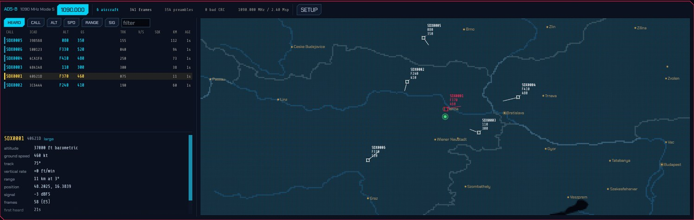

# SDRoxide User Manual

SDRoxide is a PowerSDR/Thetis-style software-defined-radio transceiver. It gives
you a panadapter and waterfall, dual VFOs, a full set of receive and transmit
controls, FT8/FT4/FT2 digital modes with an integrated logbook, a wideband CW
skimmer, and the ability to drive either a SoapySDR device or a CAT-controlled
radio (such as a Xiegu, Icom, Yaesu, Kenwood, Elecraft, ELAD, or a QRP Labs QMX)
with audio over a USB sound card. The
same interface runs as a native desktop application, streams to a web browser,
or connects to a remote sdroxide server.

---

## Table of contents

1. [Feature overview](#1-feature-overview)
2. [Basic operation](#2-basic-operation)
3. [Digital modes (FT8, FT4, FT2, PSK31, RTTY, Olivia, THOR, FSQ, Hellschreiber, SSTV, RIFP, weather fax, JS8, RF Paint, WSPR, packet, APRS, ADS-B)](#3-digital-modes)
4. [Skimmers (CW, PSK, RTTY)](#4-skimmers)
5. [ISM band decoder (315 / 345 / 433 / 868 / 915 MHz devices)](#5-ism-band-decoder)
6. [Settings](#6-settings)
7. [Solar system 3D view](#7-solar-system-3d-view)
8. [Remote operation](#8-remote-operation)
9. [Web operation](#9-web-operation)
10. [Spotting, awards, and QSL upload](#10-spotting-awards-and-qsl-upload)
11. [Winlink radio email](#11-winlink-radio-email)
12. [Command-line reference](#12-command-line-reference)
13. [Configuration files](#13-configuration-files)
14. [Troubleshooting](#14-troubleshooting)
15. [Radio-specific notes](#15-radio-specific-notes)
16. [Appendix: keyboard shortcuts, modes, bands](#16-appendix)

---

## 1. Feature overview


- **Panadapter and waterfall** with click/drag tuning, scroll-to-zoom, a
  draggable filter passband, a colour-coded band-plan strip, and eight
  selectable waterfall colour schemes (including an Icom-style palette).
- **Dual VFO (A/B)** with split operation, VFO swap/copy, and an independently
  tunable sub-receiver with its own mode and filter.
- **All the common modes:** LSB, USB, CW, AM, SAM, NFM, WFM, DRM, DIGU, DIGL, DSB, a
  spectrum-only mode (SPEC), the automatic digital modes **FT8**, **FT4** and
  **FT2**, the
  keyboard modes **PSK31**, **RTTY**, **Olivia**, **THOR** and **FSQ**, the image
  modes **SSTV**, **weather fax** and **RIFP** (draft-dulaunoy-rifp-00, a packetised image
  protocol on its own FSK modem), the transmit-only **RF Paint**
  (spectrum-painting) mode, AX.25 **packet** on HF and VHF, and **APRS** — with
  a live map of every station heard, drawn with its own symbol, and messages you
  can send and answer. **ADS-B** decodes the aircraft overhead on 1090 MHz onto
  a radar display — see [§3.13](#313-ads-b-aircraft-on-1090-mhz).
- **Receive controls:** AGC (Off/Slow/Med/Fast), volume, mute, squelch, an
  impulse noise blanker, an adaptive auto-notch (constant-tone canceller),
  noise reduction (four engines, three strengths each), front-end decimation
  (trade span for resolution, processing gain and CPU on any IQ radio), RIT,
  and a
  draggable filter passband. On NFM, the CTCSS tone or DCS stream under the
  signal is decoded and shown, and can be made a condition of the squelch. On
  WFM, broadcast stereo and **RDS/RBDS** are decoded automatically — the station
  name, programme type, radio text, what is playing, and the station's clock.
- **Transmit** (on TX-capable rigs): PTT, TUNE, drive and tune-drive levels,
  mic gain, XIT, and a transmit meter (the rig's ALC over power output, or over
  SWR where the rig has no power meter). A ham-band-only
  transmit lockout is on by default — on digital modes it vets the emission,
  dial plus offset, not just the dial — as is an **SWR guard** that stops the over
  and latches transmit out when the rig reports a bad match — with a looser
  limit and a five-second grace while you are tuning an ATU. While transmitting,
  the panadapter shows a
  **monitor of your own signal**: wideband IQ rigs display it at its on-air
  frequency in the full span; CAT rigs and digital modes show a narrow
  transmit-sideband scope (an approximation built from the outgoing audio).
- **CW decode and keyboard sending** — a Morse decoder that finds the speed,
  the threshold and the spacing for itself rather than being told them, with a
  waterfall cursor that picks the signal to copy (and the frequency to answer
  on), and a type-ahead keyboard that sends as you type. The same decoder drives
  the wideband CW skimmer.
- **Repeater operation** — a transmit shift (manual, or taken from the band
  plan as you tune), a CTCSS tone or DCS code sent under the voice, and the
  1750 Hz burst that opens a carrier-access repeater — from a button, or at the
  start of every over. A memory stores the whole set-up with the channel.
- **Voice keyer** — ten recorded messages, transmitted from a button, a numpad
  key, a MIDI pad or a Hamlib `send_voice_mem` command; works in the voice modes
  and in RADE digital voice.
- **QSO recorder** — one button records both sides of the contact to an MP3:
  what you hear as the receiver delivered it, before the volume control, and
  what you send as it goes to the transmitter. Split into an ear each where a
  second receiver or a stereo broadcast is using both channels, centred where
  nothing is.
- **FT8 / FT4 / FT2** with a live decode list, automatic QSO sequencing, a world map,
  a transcript, and automatic logging.
- **Integrated logbook** for digital and manual QSOs, with contest and QSL
  fields, a worked-before check, ADIF import/export and text export.
- **Live spotting** — a DX cluster (telnet) plus POTA, SOTA, PSK Reporter and
  FreeDV Reporter feeds shown as clickable markers on the panadapter and world
  map; click to tune and pre-fill a log entry.
- **FreeDV Reporter** — report your station to
  [qso.freedv.org](https://qso.freedv.org/) and see who else is on FreeDV,
  including callsign exchange in the RADE End-of-Over frame.
- **Callsign lookup and QSL upload** — QRZ/HamQTH name/QTH/grid auto-fill, and
  one-click (or automatic) upload to eQSL, QRZ Logbook, HamQTH and Club Log,
  with LoTW ADIF export and confirmation download. Each service's credentials
  can be tested against it from the settings, without logging anything.
- **Award tracking** — live DXCC / WAS / WAZ / grid tallies, worked vs confirmed.
- **Winlink radio email** — a native client for the amateur store-and-forward
  email network: B2F/FBB forwarding, LZHUF compression and the secure login,
  with a mailbox, compose and reply, and attachments
  ([§11](#11-winlink-radio-email)).
- **Wideband skimmers** — a CW skimmer plus PSK31 and RTTY skimmers that decode
  many signals at once and label them on the waterfall.
- **ISM band decoder** — reads the unattended 868 MHz traffic around you and
  lists each device with its readings in real units. See
  [ISM band decoder](#5-ism-band-decoder).
- **Many radio backends:** SoapySDR devices, OpenHPSDR (Hermes/Metis) Ethernet
  SDRs, a TCI server (ExpertSDR3/Thetis), a SmartSDR radio (FlexRadio
  FLEX-6000/8000), RTL-SDR, RX-888, Airspy HF+ and SDRplay RSP receivers over
  USB, an Airspy R2 or Mini over USB, a HydraSDR RFOne over USB, a HackRF
  transceiver over USB, an RTL-SDR
  published over the network by
  `rtl_tcp`, a PlutoSDR, or a CAT-controlled radio with audio over a USB sound
  card (demodulated audio or stereo IQ).
- **Several radios at once** — each in its own tab with its own tuning, mode,
  panadapter and audio, sharing your memories, logbook and a station-wide
  transmit interlock. Multi-receiver hardware serves one tab per receiver from
  a single connection: a TCI rig's RX2, an HPSDR Protocol 2 board's DDCs, a
  2R2T PlutoSDR's second chain.
- **One radio as another's panadapter** — give a CAT transceiver a real
  wideband display by lending it an SDR's receiver, on the shared antenna or
  from the rig's I.F. output (with a per-mode offset for a rig whose I.F. moves
  with the mode). The dial, mode and transmitter stay with the transceiver, and
  you listen to whichever of the two you choose.
- **Memory channels** and per-band memory of your last frequency/mode/filter.
- **Solar system 3D view** — the Sun, the Earth and the Moon, the
  other seven planets and eighteen of their moons with their orbits, live NASA
  SDO solar imagery, sunspot regions and CME trajectory cones,
  an arrival estimate when one is headed our way, the live auroral oval standing
  over the globe with a Kp forecast for tonight, live amateur-satellite orbits
  with click-through pass predictions, your FT8 contacts arcing between stations,
  a propagation panel with MUF, Kp/A, F10.7 and the current GOES X-ray level,
  and a bar chart of how open each band is right now.
- **Spoken announcements:** the radio reads itself out — frequency, mode, band,
  split, AGC, the transmit levels, band-edge warnings, the SWR while you tune up,
  and FT8/JS8 messages addressed to you — so it can be operated without seeing
  it. The voice ships with the program and runs on your own machine. The window
  is also exposed to NVDA, Orca and VoiceOver. See
  [6.3](#63-ui-display-preferences-and-voice-announcements).
- **Remote and web operation:** run headless as a server and control it from a
  browser or from a second sdroxide instance over the network, behind a username
  and password. A station reached that way opens as a radio tab beside your own
  ones — enter its address on **Settings → Remote** and press CONNECT.

---

## 2. Basic operation

### 2.1 Launching

Start the native application with no arguments to use your configured radio:

```
sdroxide
```

To try the interface with no hardware, use the built-in signal generator:

```
sdroxide --siggen
```

See the [command-line reference](#12-command-line-reference) for all options.

### 2.2 The main window

The window has two parts: a **top control bar** of captioned modules that reflow
onto more rows as the window narrows, and the **panadapter** (spectrum plus
waterfall) filling the rest of the window. In FT8/FT4/FT2 the lower part of the
window is shared with the digital operating panel.


The control-bar modules, left to right, are: Frequency, S-meter, Band/Mode,
VFO, RIT/XIT, Receiver + Filter/Noise, Transmit (TX-capable rigs only), Display,
FFT, and System.

### 2.3 Tuning

**The frequency readout** is a ten-digit display. Hover over any digit and:

- **Scroll the mouse wheel** to tune that decade up or down.
- **Click the upper half** of a digit to increment it, the **lower half** to
  decrement it.

The smaller grey number below the readout is the *inactive* VFO's frequency.

**On the panadapter:**

- **Scroll the wheel** to zoom in and out around the cursor.
- Press **F** to reset the view to the full receiver span.
- **Left-click** tunes the active VFO to the clicked frequency. **Shift+click**
  places the *second* receiver: the sub-receiver when SUB is on, VFO B otherwise.
  Unlike a plain click, it means the same thing everywhere — over a spot box it
  takes the spot's frequency, and in FT8/FT4/FT2 it still tunes rather than moving
  the transmit offset.
- **Left-drag** grabs the spectrum and slides it (the tuning moves with the
  content). Drag past the end of the span the receiver is capturing — which,
  zoomed all the way out, is from the first pixel — and the receiver itself
  follows: the window slides across the band under your hand instead of stopping
  at its own edge, so on a wideband receiver such as the RX-888, where retuning
  costs nothing, you can drag from one end of HF to the other. The picture stops
  where the front end runs out of range. A rig whose I/Q output is its own dial
  (a transceiver on a sound card, an Icom sending its 12 kHz IF) has one
  synthesiser for both, so there the drag moves the window by moving the dial,
  as it always has.
  Let go while the pointer is still moving and the dial keeps turning,
  coasting to a stop like a weighted VFO knob — the faster the flick, the further
  it runs. A slow, careful drag lands exactly where you release it, and pressing
  anywhere on the panadapter catches a coasting dial and stops it dead (that
  press does not tune). The sub-receiver's tuning drag has the same flywheel.
- **Right-drag** pans the view only, without changing tuning — and only inside
  the captured span, since moving the window means moving the receiver.
- **Shift+drag** measures bandwidth: a horizontal ruler with dotted vertical
  markers appears between where you pressed and the current pointer, showing the
  **start and end frequencies** at the markers and the **frequency span** (e.g. a
  signal's width) below. It works on both the spectrum and the waterfall. When you
  release the button the measurement lingers and fades out over about five
  seconds, so you can read it after letting go. The same ruler works on the
  full-band strip (see **WIDE** in
  [§2.8](#28-the-display-and-fft-controls)), where it measures in megahertz.


**Keyboard tuning** (ignored while typing in a text field):

- **Left / Right arrow:** ±100 Hz (with **Shift**, ±10 Hz).
- **Up / Down arrow:** ±1 kHz.
- **Page Up / Page Down:** ±10 kHz.

Each of these lands on a multiple of its own step, so a dial left on an odd
frequency by a drag is put back on a round one by the next key press. Wheel
tuning does the same, and one notch of the wheel is one step of it.


**Band-plan strip.** A colour-coded strip along the bottom of the waterfall (its
top when the waterfall is flipped — see [§2.8](#28-the-display-and-fft-controls))
labels the allocations. Zoomed out it shows coarse bands (ham, broadcast, CB,
AM); zoomed into a ham band it splits into the CW / digital / SSB / beacon
sub-segments, or an all-modes block where the plan gives one. When you zoom in
close (a span of ~100 kHz or less), the digital sub-band is broken out into the
individual popular modes — **FT8, FT4, FT2, JS8, WSPR, QRSS, PSK, RTTY, SSTV,
RIFP, FREEDV** — each in its own colour.

Everything on the strip follows the **IARU region** on the General tab
([6.1](#61-general-station-audio-and-remote-access)) — the ham blocks, their
sub-segments, and the shortwave broadcast blocks that overlap an amateur band in
one region and not another (3.900–4.000 and 7.200–7.300 are broadcasting in
Regions 1 and 3 and amateur in Region 2).

**Memory marks.** Every stored memory whose frequency falls on the visible span
is labelled just inside the band-plan strip, reading `Mem: folder / name` — or
`Mem: name` for one that is not filed in a folder — on a thin green line drawn
at the frequency itself. Channels close together stagger into stacked rows
rather than overprinting; a name too long for its label is cut short with an
ellipsis, and anything that would need a fifth row is left out. The marks are an
annotation, not a control: [§2.12](#212-memory-channels) is where a channel is
stored and recalled.

### 2.4 Bands and modes

Click the **Band / Mode** button (which reads, for example, `20M · USB`) to open a
popup with three rows:

- **BAND:** `160M 80M 60M 40M 30M 20M 17M 15M 12M 10M 6M 4M 2M 1.25M 70CM 33CM
  23CM 13CM 9CM 6CM GEN`. Each
  band remembers your last frequency, mode, and filter. A band your region's
  band plan does not have gets no button at all — `4M` (70 MHz) is an amateur
  allocation in IARU Region 1 only, so it is absent in Regions 2 and 3, and
  `1.25M` (220 MHz) and `33CM` (902 MHz) are Region 2's alone, so they are absent
  in the other two. `6CM` reads `5CM` outside Region 1, which is what the band
  plans there call it. Once
  band conditions have
  been fetched the button are tinted by the published forecast — green Good,
  yellow Fair, pink Poor — and hovering one gives it in words. Bands the
  forecast does not cover are left uncoloured; see
  [§2.15](#215-band-conditions). In a digital mode, the bands where that mode
  has a standard calling frequency carry a cyan underline; see
  [§3.1](#31-general-considerations).
- **MODE:** `LSB USB CW AM SAM NFM WFM DRM DIGU DIGL DSB SPEC`.
- **DIGITAL:** `FT8 FT4 PSK RTTY OLIVIA THOR FSQ HELL SSTV SSTV-FM RIFP RFPAINT RADE` (see
  [Digital modes](#3-digital-modes)).


See the [appendix](#16-appendix) for what each mode is.

### 2.5 VFOs, split, and the sub-receiver

The **VFO** module has:

- **A / B** select buttons in the Frequency module (the active VFO is highlighted).
- Above them, the **⏻ power button**: the same ON/OFF switch the radio's tab on
  the strip carries (see [§2.17](#217-running-more-than-one-radio)), lit while
  the radio is on. It is on the main window so that a *single*-radio session —
  which has no tab strip — can still put its radio down and pick it back up.
  On the compact layouts, where the frequency box has no room to stack it, it is
  the first thing in the **VFO** menu instead, labelled in words.
- **Swap VFOs** — exchange A and B.
- **Copy A to B** — copy the active VFO to the other.
- **SPLIT** — transmit on one VFO and receive on the other.
- **SUB** — enable a second receiver, routed to the right ear.

Both VFOs and which of the two was selected are remembered per radio in
`session.json`, so a station left listening on B — or set up for split, with the
other VFO on the DX's transmit frequency — comes back the same way at the next
start rather than with B collapsed onto A. `--freq` still overrides the dial for
a run, and it moves whichever VFO was active.

The sub-receiver tunes **independently of A/B**: swapping VFOs or turning the
dial leaves it where you parked it. Switching it on reveals a **SUB module** in
the top bar with everything it has of its own:

- **Frequency** — type it in MHz, or drag the field to tune in 10 Hz steps.
- **←DIAL** / **DIAL←** — send the sub to the main dial, or bring the main dial
  to whatever the sub has found.
- **Mode** and **Filter** — the sub demodulates independently of the main
  receiver, so you can listen to CW on one and SSB on the other. (Audio modes
  only: the digital modes decode on the main receiver.)
- **Vol** / **MUTE** — the sub's own level in the right ear.

On the panadapter the sub is drawn in **violet**, with the same passband wash,
draggable filter edges and tuning line the main receiver has, labelled `SUB`.
**Drag inside its passband** (or on its tuning line) to tune it — that drag moves
the sub instead of panning the view, so each receiver is tuned by dragging its
own filter area. Released mid-motion it coasts on like the main dial, stopping at
the edge of the receiver's span. **Shift+click** anywhere sends the sub straight
there.

Both receivers are tuned by DDCs on the same IQ stream, so the sub can reach
anything inside the receiver's span and nothing outside it. A band change that
moves the hardware out from under the sub re-parks it on the inactive VFO.

### 2.6 RIT and XIT

The **RIT / XIT** module offsets receive (RIT) and, on TX-capable rigs, transmit
(XIT) without moving the dial. Toggle **RIT** (or **XIT**) on, then set the
offset in the adjacent field (±9999 Hz in 5 Hz steps).

When either is enabled, the offset is drawn on the panadapter: RIT shows a dashed
grey **dial reference** line (the receive marker and passband already sit at
dial + RIT) with a blue labelled bracket back to the dial, and XIT shows a green
**TX marker** line with a green labelled bracket from the transmit base to
dial + XIT — so you can see at a glance how far RX and TX are shifted.


On an SDR, all three offsets — RIT, XIT and split — are software: the receiver
and transmitter are tuned inside the IQ stream and the hardware never moves. A
**CAT radio** has no such stream, only its dial, so sdroxide puts them on the
dial instead: it sits on your receive frequency (VFO + RIT) while you listen and
moves to the transmit frequency (the other VFO when split is on, plus XIT) for
the length of each over, then comes straight back. The radio's frequency display
follows, which is also how you can see it working. sdroxide switches the radio's
*own* RIT, XIT and split off when it connects, so an offset left over on the rig
can't quietly add itself to the one you set here.

The same box carries the **DUPLEX** and **TONE** buttons — the fourth thing that
moves the transmit frequency, and what has to ride under it. See
[2.18 Repeater operation](#218-repeater-operation-duplex-and-tone).

### 2.7 Receiver controls

The receiver and its filter/noise controls share one box of two rows. Which
row a button lands on is not fixed: the top row carries the level controls the
*radio* offers — the volume, a front-end gain rail where there is a gain to
set, decimation where there is a span to throw away, the AGC where the mode has
one — and on a rig with few of those, the buttons from the row below move up to
fill it rather than leave half the box empty and the box itself twice as wide as
the strip can afford. So the same button can sit on the top row on a CAT rig and
on the bottom row on an SDR with a gain slider, and it moves when you change
mode. What is in the box never changes; only where the two rows are cut does.

- **AGC** — a drop-down: `Off`, `Slow`, `Med`, `Fast`. Not shown in NFM, WFM
  or DRM, where there is no AGC at all: an FM detector's output level is set by
  the transmitter's deviation, not by signal strength, and a DRM decoder hands
  you the audio at the level the broadcaster mixed it to, so in both there is
  nothing to level and an AGC would only pump on the noise between overs.
- **Man** — the fixed audio gain the receiver runs on while the AGC is `Off`,
  shown only then. Unlevelled audio is whatever the band delivered, and a weak
  SSB signal can sit tens of dB below anything the volume control can reach, so
  "AGC off" means *this gain* rather than no gain at all. Switching the AGC off
  seeds it from the level the AGC was holding at that moment, so nothing jumps;
  from there it is yours to set, and it stays put however the signal moves.
- **Vol** — audio volume.
- **DEC** — **front-end decimation**: keep the middle `1/N` of the span the radio
  streams and throw the rest away, before any of it reaches the receiver. Click
  to cycle `off / 2 / 4 / 8 …`; the button reads what is running (`DEC /8`), and
  hovering it tells you the span you are left with.

  It shows on any radio that delivers IQ and has bandwidth to spare, and applies
  to all of them equally — a dongle at 2.4 Msps, a HackRF at 2 Msps, an RSP, a
  Pluto. A radio already streaming a narrow span (an HPSDR at 48 kHz, say)
  offers no button, because there would be nothing left to decimate to. The
  floor is 48 kHz: that is one receiver channel, and below it the waterfall
  stops being a band display.

  What you gain:
  - **Resolution**, everywhere at once. The same FFT spread over an eighth of
    the bandwidth is eight times finer, across the whole span rather than only
    the part you have zoomed into. (Zooming gets its own resolution without
    this — see the **FFT** control in
    [§2.8](#28-the-display-and-fft-controls) — so this is no longer the only
    way to a detailed picture, but it is still the way to a detailed picture of
    everything you can see.)
  - **A quieter noise floor.** Every halving throws away half the noise power
    with half the bandwidth: 3 dB per step, 9 dB at `/8`. The signal you are
    listening to is unchanged, so this is real processing gain, and weak signals
    stand further out of the grass.
  - **CPU.** Everything downstream — the FFT, both receivers' downconverters,
    the skimmers, the IQ a TCI client is being fed — runs at the reduced rate.
    On a small machine this is the difference between a 2.4 Msps dongle being
    comfortable and not.

  What you give up is the band either side of the kept span. The dial still
  tunes anywhere: as you tune past the edge the radio simply moves its LO and
  the narrower window follows you. Nothing is reconfigured in the hardware —
  the radio keeps streaming exactly as it was — so the setting takes effect on
  the next block of samples, with no gap in the audio and no risk of a device
  refusing it. The sub receiver still has to live inside the span, so if it was
  parked outside the new one it is moved back in.
- **MUTE** — mute the receiver (keyboard shortcut **M**).
- **REC** / **MONO** — record what you hear and what you send
  to an MP3 file, and choose whether it is written in two channels or one. See
  [2.20](#220-recording-the-audio).
- **SQL** — squelch; below the open threshold it reads
  `off`.

  On a radio that hands sdroxide audio it has **already squelched** — a CAT rig
  on a sound card, an Icom sending AF over the network — this rail sets the
  *radio's own* squelch over the control link instead, and reads as a
  percentage of the radio's scale (`open` at the bottom). That is the gate the
  audio actually passes through: a threshold applied on this side could only
  close further on what the radio already let by, and could never open up a
  weak station the radio had muted. The level is read from the rig when the
  control link opens, so the rail starts where you left the knob rather than
  imposing a remembered figure on it, and a keyboard or MIDI binding on the
  squelch action follows the same rail. Every other front end — anything
  sending sdroxide I/Q — keeps the dBFS threshold, which is the honest one
  there: the whole passband arrives and sdroxide does the gating.
- **NB** — impulse noise blanker on the raw signal (keyboard shortcut **N**).
- **ANC** — automatic notch: an adaptive filter that cancels **constant tone
  elements** — heterodynes, carriers, and tuner-uppers — while leaving voice and
  noise. Toggle it on when a steady whistle is spoiling a voice signal. (Like NR,
  it affects only what you hear, not the digital decoders; leave it off for CW
  and data modes, whose signals *are* tones.)
- **NR** — noise reduction on the audio, with four selectable engines. The button
  always reads just `NR` and lights when noise reduction is in circuit — that is
  all it tells you, and it never changes width under the buttons beside it. Click
  it for a picker with an **Engine** row and a **Strength** row, which is where
  you both read back what is running and change it, so any setting is two clicks
  away; hovering the button names it too. A keyboard or MIDI binding cycles the
  *strength* within whichever engine is selected — Off → Low → Med → High → Off —
  and never changes the engine underneath you.
  - **RNN** — a neural **RNNoise** denoiser. Trained on speech, it recognises the
    *voice* and mutes everything else, so it clears non-stationary junk that
    spectral NR can't — babble, wind, keyboard/shack noise, fluttering hiss —
    with little of the underwater warble. Cheap, and the safe default. The three
    strengths are a wet/dry depth: High is the full effect, Low a lighter touch.
  - **DFNR** — **DeepFilterNet3**, the strongest of the four. It adds a learned
    complex filter over the low bins on top of a band gain, so it recovers speech
    the others have already given up on. It also costs the most CPU by a wide
    margin, and the model is loaded the first time you select it — expect a
    short break in the audio at that moment. The strengths are the most
    attenuation it may apply: 6, 12 and 24 dB.
  - **SPEC** — a Rust port of **libspecbleach**'s adaptive denoiser. Spectral,
    but with a psychoacoustic model deciding where suppression would be audible,
    and a *whitened* noise floor: rather than carving the residue into birdies it
    flattens what is left into even hiss. Good on steady static where the neural
    engines sound processed.
  - **NR** — the built-in **spectral** noise reduction, whose engine button keeps
    the bare name the button has always worn: it suppresses the stationary noise
    floor while letting the changing, speech-like parts through. Fast and
    predictable on steady static and hiss.

  All four make voice quieter to listen to and easier to copy with less fatigue.
  Higher strengths remove more noise but can add faint artefacts on weak signals,
  so pick the lowest that cleans the audio; on a noisy voice signal, start with
  **DFNR Med**, and drop to **RNN Med** if the machine is struggling. (NR affects
  only what you hear; the FT8/FT4/FT2/PSK/RTTY decoders still receive the untouched
  signal, and a steady unmodulated carrier — a heterodyne — is treated as noise
  and suppressed. Any NR engine also forces WFM to mono — see **ST** below.)
- **ST** (WFM only) — broadcast **stereo**. It lights when the station's 19 kHz
  stereo pilot is locked, and needs nothing from you: mono and stereo stations
  are handled automatically, at the same volume, so there is no jump when one
  hands over to the other. Click it to force mono.

  On a weak station sdroxide blends back toward mono by itself. That is not a
  compromise — the difference channel is recovered from a 38 kHz subcarrier,
  high on FM's noise slope, so it carries roughly 20 dB more hiss than the
  mono sum. Clean mono beats noisy stereo, and the blend is gradual enough that
  you will not hear it switch. Forcing mono is still worth doing on a marginal
  signal you want to listen to for a long time.
- **RDS** (WFM only) — the **data the station carries beside its audio**: what it
  is called, what it is playing, and what else it wants you to know. The button
  lights when data is actually arriving, so it answers "does this transmitter
  carry RDS?" without your opening anything. Click it for the window.

  The station name appears in about a second, the radio text in a few more, and
  the rest as it comes. Decoding runs the whole time you are on WFM, whether or
  not the window is open, so it is already filled in when you do open it.

  What the window shows:

  - **The name** — the eight characters the station calls itself. Some
    broadcasters abuse this field by scrolling a message through it a word at a
    time; sdroxide only shows a name it has seen twice running, which stops a
    fragment of somebody's advertisement being displayed as the station's name,
    but on those stations the name will still change as you watch. That is the
    station doing it, not the receiver.
  - **Identity** — the programme identification code, a number that is the
    station's real name as far as the standard is concerned. In North America it
    spells out the call letters, and those are shown beside it.
  - **Programme** — one of 32 categories. Which 32 depends on the standard: the
    same five bits mean *Education* in Europe and *Rock* in the United States.
    See the selector below.
  - **Radio text** — 64 characters the station can put anything in, and usually
    the artist and title. Where the station tags them properly (RadioText+),
    they are lifted out and shown on their own line under the name.
  - **Traffic** — whether this station carries traffic announcements at all, and
    whether one is on the air right now.
  - **Station clock**, and **also on** — the other frequencies carrying the same
    programme, which is what a car radio follows when you drive out of range.

  **RDS or RBDS** — the selector at the top. They are the same signal; the
  difference is which table of programme types to read it against, and whether to
  spell the identity code out as call letters. **Auto** decides from the country
  code the station sends, which most stations outside North America do. Where one
  does not, auto still guesses the *table* from the identity code — that guess
  can be wrong, so set the selector by hand when the programme type reads like
  nonsense — but it will not **name** the station from it. The call-letter range
  overlaps identity codes that are perfectly ordinary elsewhere: a Finnish or
  Danish station's identity decodes to a plausible American call sign, and four
  invented letters sitting where the station's name goes look like fact in a way
  a wrong category does not. Select **RBDS** by hand to name a North American
  station that sends no country code.

  Nothing is re-decoded when you change it: the raw codes are already here, so
  everything on screen re-labels itself at once.

  **DIAGNOSTICS**, the second tab, is for when the first one is empty or
  flickering. It shows whether the decoder is in sync, how many groups have
  arrived, what fraction of blocks failed their check, and a running log of the
  groups themselves. The block error rate is the number to watch: it counts
  repaired blocks as errors on purpose, so it starts climbing before anything
  visibly breaks, and a station sitting at a few per cent is one that will drop
  out when a lorry goes past. A station sending no group 2A sends no radio text —
  the group list will tell you that, where the blank field cannot.

  **FRONT END OVERLOADING** — the station is too *strong*, the converter is clipping, and the
  distortion lands right across the multiplex including on the 57 kHz subcarrier
  the data rides. Nothing you can hear will tell you, and that is the point of
  the warning: the whole distance between clean RDS and none is about a decibel,
  and across all of it the audio stays clean and the stereo light stays on. Turn
  the RF gain down or switch in an attenuator. The S-meter shows `OVL` for the
  same reason ([2.9](#29-the-s-meter)).

  One thing is deliberately not shown: **traffic message channel** data is
  decoded by nobody here. The messages are numeric references into a licensed
  location database, and without it "event 108 at location 12345" is all there is
  to say.
- **DRM** (DRM only) — how the **Digital Radio Mondiale** decoder is getting on.
  The button lights only when audio is actually being decoded, not merely when a
  carrier is present, so it answers "is this station coming through?" at a
  glance. Click it for the window, which is where to look when the answer is no:
  it shows how far up the chain the decode got. Full detail is in
  [2.19](#219-drm-digital-radio-mondiale).
- **Tone** (NFM only) — the **CTCSS tone or DCS code** under the signal. Analog
  FM systems carry a sub-audible tone below the voice so a receiver can ignore
  traffic that is not theirs, and the button shows what is arriving: `88.5` for a
  CTCSS tone, or `DCS` for a digital coded squelch stream. On an idle or
  toneless channel it just reads `TONE`.

  It takes about a second of signal to appear. That is not slowness for its own
  sake: the closest pair in the standard table is 67.0 and 69.3 Hz, and telling
  2.3 Hz apart takes about a second however it is measured. Expect the tone
  roughly a second after a repeater keys up, and expect it to stay for about
  half a second after it drops.

  Clicking the button opens the **tone squelch** picker: choose a tone and the
  audio only opens when *that* tone is present, which is how you sit on a busy
  shared channel and hear one system. **USE 88.5** arms whatever is being
  received right now, which is usually what you want; **OFF** goes back to plain
  carrier squelch. While a tone squelch is armed the button turns yellow, and it
  lights when the required tone actually arrives. Note that the ordinary **SQL**
  slider still applies — tone squelch is an extra condition on the same gate,
  not a replacement.

  DCS is reported as `DCS` without its three-digit code. The code travels in a
  cyclic error-correcting codeword, so every one of the 23 possible word
  boundaries decodes to a valid code and picking the wrong one yields a
  different, equally plausible answer; without a transmitter to check against,
  a code shown here would be a coin toss between two of them. That the signal
  *is* DCS, on the other hand, follows from the data repeating exactly every 23
  bits, which needs no such assumption. Arming tone squelch on **ANY DCS** opens
  on any DCS-coded signal.

  The sub-audible tones no longer reach the speaker: NFM audio is high-passed at
  around 250 Hz, as it is in any FM receiver, so what used to arrive as a low
  rumble under the voice is now decoded instead of heard.

  Two things turn stereo off on purpose: switching on the **sub receiver**,
  which claims the right ear for itself, and switching on **NR** or **ANC**,
  which delay the audio in a way the stereo matrix cannot survive. Neither buys
  anything on a broadcast signal.

**The receive filter** is set by dragging the passband edges directly on the
panadapter: two vertical grip lines mark the filter's low and high edges (they
brighten to orange when you can grab them). Drag an edge to widen or narrow the
passband. The grips work on both the spectrum and the waterfall.

The volume, AGC mode and manual gain, the squelch, the noise reduction and the
decimation are remembered in `session.json` and restored the next time you
start, along with the front end's own gain stages
([§6.2.1](#621-soapysdr-devices)). They are
settings you arrive at by ear against your own antenna and noise floor, so
sdroxide brings the receiver back up where you left it rather than on defaults.

### 2.8 The display and FFT controls

**Display module:**

- **☀ 3D** — open the [solar system 3D view](#7-solar-system-3d-view): a second
  window in the native app, a second browser tab in the web client.
- **SPEC** — opens the **panadapter popup**, which holds everything the
  panadapter is drawn by, in two boxes: one for the **spectrum** line across
  the top, one for the **waterfall** under it. The button is lit while both
  layers are shown.

  In the **Spectrum** box:

  - **SHOW SPECTRUM** — draw the spectrum line, or leave the height to the
    waterfall.
  - **PEAK HOLD** — trace the highest level each column has reached over the
    live line, decaying back down.
  - **reaction** — how quickly the line follows the band: **Slow**, **Medium**
    or **Fast**. Slower averages more frames into each other, which steadies
    the line and holds a weak carrier still long enough to read. The waterfall
    is not touched by it — those rows get every frame either way.
  - **detail** — how many columns the panadapter *and its waterfall* are drawn
    with; the width in force is named beside the chips. See
    [Panadapter detail](#panadapter-detail) below.

  In the **Waterfall** box:

  - **SHOW WATERFALL** — draw the scrolling waterfall, or leave the height to
    the spectrum line.
  - **scroll** — how fast it scrolls. See
    [Waterfall scroll speed](#waterfall-scroll-speed) below.

  The two SHOW switches are independent, so all four displays are available —
  spectrum only, waterfall only, both, or neither.

  - With one of them off the other takes the full height, with the frequency
    scale still along its edge; dragging that scale brings the hidden layer
    back at the split you drag to. Skimmer and spot boxes move onto the
    spectrum while the waterfall is off.
  - With **both** off there is no panadapter at all. In a mode with an
    operating panel under it — the digital modes, and CW — the panel takes the
    whole height; in the other modes the area is simply left empty. The SPEC
    button is the way back.

  Detail and the two speeds are this screen's own preference rather than the
  radio's: a remote client picks its own, and neither the station nor another
  client is touched. They are remembered between sessions.
- **WIDE** — show or hide the **full-band strip**: a shallow second waterfall
  above the panadapter covering everything the receiver can see at once, with a
  blue outline around the slice the panadapter is receiving and an amber line on
  the tuned frequency. A scale along its top labels round frequencies across the
  band and both of its **limits** — the lowest and highest frequency the strip
  covers, named in MHz at the two ends, so it is always clear what the strip is
  showing. Click anywhere on it to tune there. Hovering it shows a
  crosshair and the frequency under the cursor, and **shift+drag** measures a
  span across it, both exactly as on the main waterfall. The button appears
  only on receivers that produce a full-band view — a direct-sampling front end
  such as the RX-888; on an RTL-SDR, HPSDR or TCI radio the panadapter span is
  all the hardware delivers — and the setting is remembered between sessions.
  The strip is not shown in the digital modes, whose layout gives the height to
  the operating panel instead.
- **FIT** — keep the waterfall floor and ceiling set for the best contrast.
  Lit, the levels are refitted by themselves: when you change band, once a pan
  or zoom has settled, and whenever what the band is doing has drifted far
  enough that the waterfall has gone flat or blown out. An automatic refit is
  eased in over about five seconds, aimed at a rolling average of the levels, so
  a station coming up for a moment doesn't move the contrast — and no more than
  one refit is started every five seconds. Switching FIT **on** fits at once,
  which is also how to ask for a one-off fit: click it off and on again.
  Switching it off leaves the levels wherever you set them (the floor and
  ceiling in the FFT popup are yours to keep only while FIT is off).
- **SKIM** — opens the skimmer popup (per-skimmer on/off and squelch); lit while
  any skimmer runs. See [Skimmers](#4-skimmers).
- **SCAN** — opens the scanner window; lit while a scan is running, green while
  it has stopped on a signal. See [Scanning](#213-scanning).

**FFT module:**

- **floor** / **ceil** — the waterfall's dB range.
- **FFT** size — `2048`, `4096`, `8192`, `16384`, `32768`, `65536` or `131072`.
  This is the FFT over the *whole* of what the radio streams, and the panadapter
  grows it with the zoom until it runs out.

  A word on what the larger sizes buy. The transform is pooled down to the
  panadapter's own columns — 2048 of them by default, more on a screen that can
  show more ([Panadapter detail](#panadapter-detail), on the SPEC popup) — so up to that
  width a bigger FFT is more columns, and past it, it is *sharper* ones: each
  column becomes the strongest of more bins, so a weak carrier stands further
  out of the noise instead of being averaged into it. That is why the largest
  sizes are worth having on a wide front end and do nothing at all on a narrow
  one, where the size is capped by the rate regardless (a transform may not
  cover more than a tenth of a second of signal, which on an Icom's 24 kHz I.F.
  is 2048 whatever is lit). Past that, zooming in gets a window of its own:
  the visible span is mixed down and decimated to its own width before it is
  analysed, so the detail you see follows the window you are looking at rather
  than how wide the front end happens to be. It matters most on a receiver that
  streams a lot — an RX-888 asked for 8.1 MHz has 247 Hz to a bin even at
  `32768`, which used to draw a 60 kHz window out of 240 numbers and step
  visibly. Nothing to switch on, and nothing is given up: the rest of the band
  is still there when you zoom back out.

  Two side effects worth knowing. Narrower bins hold less noise, so the noise
  floor drops as you zoom in — FIT keeps up with it, and with FIT off you may
  want to re-set the floor. And a fine window takes longer to fill (resolving a
  hertz needs a second of signal, on any receiver ever built), so a very deep
  zoom scrolls more slowly than a wide one.
- **FLIP** — scroll the waterfall *upwards* (keyboard shortcut **V**). The
  newest line is drawn at the bottom and history flows up off the top, the way
  several other SDR programs draw it. The minute gridlines, the skimmer / FT8
  boxes, the cluster-spot boxes and the band-plan strip all follow the flip, so
  the fresh decodes stay next to the fresh signals and nothing covers the newest
  lines. The setting is remembered between sessions.

The **waterfall colour scheme** and the **spectrum background gradient** are set
on the **UI** tab of the Settings window (see
[§6.3](#63-ui-display-preferences-and-voice-announcements)). The colour scheme is one of
`Classic`, `Viridis`, `Gray`, `Icom`, `Neon`, `Synthwave`, `Matrix`, or `Tron`;
the gradient fills the spectrum area from a top colour down to a bottom colour
(default dark red → black) and can be turned off. The same tab also themes the
UI itself — colour theme, button shape and window shape — independently of the
waterfall's palette; the screenshots in this manual show the **Default** theme.

You can also resize the split between the spectrum line and the waterfall by
dragging the frequency-scale strip between them, and hide either or both of
them altogether from the **SPEC** popup in the Display module.


#### Panadapter detail

How many columns the panadapter and its waterfall are drawn with, on the
**detail** row of the SPEC popup. **AUTO** is the default and is what nearly
everyone should leave it on: it reads this machine's graphics — the largest
texture it will hold, whether it is drawing on a real GPU or in software, which
renderer is in use, whether the radio is across a network — together with how
wide the panadapter actually is *in pixels*, and picks the most the machine can
carry. The number it settled on is shown beside the chips.

The steps are **2048**, **4096** and **8192** columns. 2048 is what every
sdroxide before this one drew, and about what a 1080p panadapter can show; 4096
is one column per pixel of a 4K panel, which is the point of the setting; 8192
is two per pixel, which keeps a carrier sharp while the view is panned off the
pixel grid. A step this machine cannot hold is shown greyed, with the reason on
hover — a Raspberry Pi, an older graphics chip, a browser without WebGPU and a
machine drawing without a GPU at all are all held to 2048, because a wider
waterfall there costs the frame rate and buys a picture the renderer cannot draw
anyway.

AUTO stops at 4096 even on a very large screen; 8192 is there to be chosen.
AUTO also stays at 2048 when the radio is on the other end of a network,
because every column is a byte in every frame — 4096 columns at 60 fps is
about a quarter of a megabyte a second — and there is no way to measure the
link from this end. On a LAN, set it by hand.

Detail costs memory on the graphics card: 8 MB per radio tab at 2048, 16 at
4096, 32 at 8192. Changing it restarts the waterfall's history from black,
once.

#### Waterfall scroll speed

How fast the waterfall scrolls, in lines a second, on the **scroll** row of the
SPEC popup: **Slow** (5), **Medium** (28), **Fast** (56), **Faster** (112) or
**Fastest** (224). Faster trades screen time for vertical resolution, which is
what you want when a CW or FT8 trace is smearing into the line above it; Slow
keeps several minutes of band on screen at once.

The two fastest settings are past the rate any screen redraws at, and that is
deliberate: the radio clocks the waterfall's lines itself rather than one per
redraw, so 224 a second is 224 *different* lines rather than 56 of them drawn
four times. Each line is also the **strongest** thing its slice of time
contained rather than a snapshot at the end of it, so a CW dot or the edge of
a burst that is shorter than the gap between two lines still gets drawn
instead of falling between them.

What limits it is the receiver, not the screen. A line can never show more
than one transform of the FFT, and a front end produces `sample rate ÷ half
the FFT size` of those a second — an RX-888 at 8 MHz through a 32768-point
window makes about 500, so it can feed any of these settings, while a 24 kHz
I.F. through the same window makes under one and repeats lines at every
setting. Two costs worth knowing: the waterfall keeps a fixed number of
lines, so history shortens as the rate rises (73 seconds at Medium, 9 at
Fastest), and to a *remote* client every line is a byte per column on the
link.


### 2.9 The S-meter

The **S-meter** reads S0 (−127 dBm) through S9 (−73 dBm) and beyond, turning red
past S9. It shows the S-unit (for example `S9+20`) and the level in dBm.

Where the dBm normally sits you may instead see **`OVL`** in red. That is the
converter clipping: the signal reaching it is bigger than it can represent, and
everything downstream is reading a distorted version of it. The dBm is taken
away rather than shown beside the warning because it is no longer a
measurement — a clipped carrier reads *lower* than it really is, so the number
would be arguing with the warning next to it. Turn the RF gain down, or switch
in an attenuator, until it goes.

It is worth taking seriously even when nothing sounds wrong, because on FM
almost nothing will: the audio stays clean well past the point where the data
riding above it has already gone. See the RDS diagnostics tab
([2.7](#27-receiver-controls)) for the same warning where its effects show
first.

Clicking the meter cycles three faces:

- **Needle** (the default) — an analog moving-coil instrument. The needle has a
  little inertia, so it swings into a reading and settles the way a real
  movement does.
- **Bar** — a horizontal gradient bar with a graduated scale beneath it and a
  peak-hold marker that falls back after a moment.
- **Trace** — the last fifteen seconds plotted as a scrolling graph, which is
  the one to watch for fading and QSB.

The face you pick is remembered. It belongs to the screen rather than to one
radio — it is written to `smeter_style` in the `[ui]` table of `config.toml` the
moment you click, so it survives a restart however the last session ended, and
every radio comes back up wearing it.

On transmit all three switch to a transmit meter, stacked in two rows. The top
row is **ALC**. On a rig that reports its own ALC over CAT — Icom CI-V rigs do —
that is the rig's figure, which is the one that answers "am I overdriving it";
on anything else it is sdroxide's own drive level, which is how hard the audio
being sent is driving the modulator. The two are different measurements, and on
a CAT rig driving an external radio only the rig's says anything about whether
the audio is too hot for it.

The lower row is whichever meter the rig actually gives us. Where the rig
reports a **power-output** meter it goes there, as a percentage of the rig's own
full scale rather than in watts — Icom calibrate that meter's face in percent,
with no calibrated wattage behind it, and the relation to watts moves with band,
mode, supply voltage and drive, so a wattage would look measured without being
so. It answers what the drive slider cannot: the slider is what the rig was
*asked* for, and this is what it is *delivering*. The two part company whenever
the rig folds back — heat, a high SWR, or an ATU still hunting. The ramp carries
no red, because a rig at full output is doing what it was asked; what you are
watching for is the needle falling while drive stays put.

Where there is no power meter but there is an **SWR** bridge, the lower row is
SWR instead, on a logarithmic scale with 1:1 at the left stop, 3:1 at mid-scale
and everything past 3:1 in red. Either way the SWR keeps its place as a number
in the header button. Rigs with neither show the drive row alone, grown to fill
the space.

Where the reading comes from depends on the interface. An SDR delivers IQ and
the receiver measures the signal in its own passband, calibrated to dBm by
`cal_offset_db` in `config.toml`.

> `cal_offset_db` starts at **0**, which means an SDR's meter starts out reading
> dBFS — how loud the signal is against the converter's full scale — with a dBm
> label on it. On a receiver with plenty of gain ahead of an 8-bit converter, an
> RTL-SDR among them, its own noise sits high enough on that scale to read S9
> with nothing plugged into the antenna socket. Nothing is wrong with the
> receiver; the scale has not been told where zero is. Set `cal_offset_db` to
> the difference between what the meter shows and a level you know — a signal
> generator, or a band-noise reading you trust — and it will read in dBm from
> then on. It is one number for the station, so where two radios differ, set it
> for the one you judge signals on. Changing the front end's gain moves the
> reading with it, exactly as an attenuator ahead of a real receiver would.

A **CAT rig on a sound card** sends audio it
has already demodulated and levelled, so there is nothing left on this side to
measure: Icom rigs are asked for their own S-meter over CI-V instead, which is
the reading on the radio's front panel, and rigs whose CAT dialect has no meter
read fall back to the level of the audio itself — that one follows the signal
but is not calibrated in dBm, being whatever the rig's AGC left.

### 2.10 Transmit

On a TX-capable rig the **Transmit** module appears:

- **PTT** — key the transmitter.
- **TUNE** — send a carrier at the tune-drive level for tuning an ATU.
- **Drive** — transmit drive (0–100%).
- **Tune** — the (lower) drive level used by TUNE.
- **Mic** — microphone gain.
- **TX audio** — how loud a digital mode is handed to a radio that modulates it
  itself, in dB below full scale. It stands **in the Mic rail's place**, and
  only in the modes where the microphone is not what goes on the air: select
  FT8, RTTY, PSK or CW-as-MCW on a CAT rig and the rail changes from `Mic` to a
  dB reading; go back to SSB and Mic returns. The two can never both apply — in
  a digital mode the microphone is drained and discarded, so a Mic slider there
  would move nothing — and the strip has room for one rail, so it shows the one
  that works. (FreeDV RADE is the exception on both counts: the microphone *is*
  the payload there, so RADE keeps Mic and reaches this level from the TX menu.)

  **This level is kept per mode.** FT8, RTTY, PSK and MCW do not load a
  transmitter the same way, and the figure you are setting is where your
  waveform sits against the radio's ALC — so each mode remembers its own, saved
  as you set it. A mode you have never touched starts from the level for the
  carrier it goes out on, which is also what a mode added in a later release
  inherits, so nothing ever comes up at full scale behind your back.

  The adjustment on sideband is: **bring it down until the rig's ALC is barely
  moving, then set the power at the radio.** ALC riding on a constant-envelope
  digital mode is what splatters. On FM — VHF packet, APRS, RIFP — the same
  control is the **deviation** instead: an FM transmitter turns audio level into
  frequency swing and has no ALC to catch it, so full scale into a data input
  set for voice over-deviates, which sounds completely normal to anyone
  listening and decodes for nobody. Turn it down until other stations report
  you, or set the level at the radio.

  The same control is in each mode's setup window, where there is one, and the
  radio's own input level is the other half of it either way.

  On a radio sdroxide modulates itself — a Pluto, an HPSDR board, an SDR — none
  of this applies and the rail does not appear: there the modulator and Drive
  own the level.

**Transmit EQ** (Settings → Radio, above the per-interface section, since it
applies the same way whichever radio interface is selected) is a 3-band
parametric equalizer on the microphone audio, ahead of the modulator: **Low
shelf** (cuts/boosts rumble and handling noise), **Mid peak** (presence, a
narrow bump or dip somewhere in the voice band), and **High shelf**
(brightness/de-ess). Each band has its own frequency and gain (dB), and the
mid band also has a **Q** (how narrow the bump is) while the two shelves have
a **Slope** instead (how sharply they roll off). Off by default, and flat
(0 dB every band) the first time you turn it on, so enabling it changes
nothing until you actually move a slider. Voice modes only (SSB/AM/FM);
digital modes and CW carry synthesized or keyed audio that never reaches it.
Applies immediately, like the IARU region setting: there is no Apply step —
including while you are transmitting, so you can set it by ear against the
transmit monitor.

It sits after **Mic** gain and before whatever modulates the audio, on every
interface: a radio sdroxide modulates itself, and a rig that modulates its own
audio (a CAT rig over its sound card, TCI, Icom LAN, SmartSDR) alike. Boosting
a band therefore raises the level going into the transmitter, and there is
nothing behind it but a limiter at full scale — on a transmitter, clipping is
splatter on your neighbours' frequencies. **After boosting anything, watch the
ALC/TX meter and take the same amount back off Mic gain.** Cutting is free; a
cut band and a little more mic gain gets the same tone with none of the risk.

> **Transmit safety:** by default sdroxide refuses to transmit outside the
> amateur bands (`tx_ham_only`), and stops the transmission if the radio reports
> a high SWR (`swr_guard`, below). Transmit hardware gains start at minimum and
> the tune drive defaults low. Raise drive deliberately. The band lockout can
> only be lifted from the command line, one run at a time, with `--oob-tx`
> ([12](#12-command-line-reference)).

**The SWR guard** stops the over when the antenna system is not what it should
be — a feeder that has come off, a coax switch left on the wrong port, a
dipole leg that has parted in the wind. It is armed by default at **2.5:1** and
is set in Settings → General ([6.1](#61-general-station-audio-and-remote-access)).

- It needs a rig that **measures SWR and reports it over CAT or TCI**. On an IQ
  radio there is no such reading, and the guard is inert rather than approximate.
- It does **not** wait for high power. A rig with SWR foldback answers a bad
  match by dropping to a few watts, so a power threshold would gate out exactly
  the emergency; the first fifth of a second of each over is ignored instead, on
  the clock, to ride out the key-up transient.
- When it fires the transmitter stops and **transmit stays locked out** until
  you press **Acknowledge** on the warning bar. That is deliberate: a latch you
  can clear by pressing PTT again is not a latch. Turning the guard off also
  clears a standing trip.
- The banner names the SWR that fired it, so you know whether you are looking
  for a bad connector or a completely disconnected antenna.

**TUNE is treated differently, because feeding a mismatch is the whole point of
it.** An antenna tuner has nothing to work on until the rig keys into the very
mismatch the tuner exists to remove, and a sweep that begins at 10:1 is what
tuning looks like. So a tune gets **double the limit** — 5:1 with the default
2.5:1 setting, shown next to the figure in Settings so you never see a number
you cannot find — and **about five seconds** before the guard applies at all,
instead of a fifth of one. What survives is the case worth keeping: a feeder
that is simply not connected still reads at the top of the scale once the tuner
has had its five seconds, and still stops the carrier.

> A **manual** tuner can easily take longer than five seconds to find a match.
> That is the one case the guard gets wrong, and the answer is to turn it off
> for the session rather than to raise the limit — you are deliberately sitting
> at a high SWR for as long as it takes, which is the situation the guard exists
> to end.

On a rig with its own power control — a TCI rig, or a **CAT rig** on any of the
three dialects — Drive and Tune command the rig's output power directly rather
than scaling anything on this side, and the slider adopts the rig's own setting
when sdroxide connects: a level set in ExpertSDR3, or on the radio's front
panel, carries over instead of being overwritten. The level that applies is
asserted before every over, including a CW message handed to the rig's own
keyer — which is the one place where the rig's power is the *only* transmit
control there is, the sound card having no part in CW at all. After a TUNE the
operating level is put back, so the radio is not left at the tune level for the
next call.

The level is asserted **behind the mode**, not only when you move the slider,
because a rig keeps its output power *per mode*: a radio set to 100 W in USB and
25 W in USB-DATA transmits at whichever of the two the mode command last left it
in, and one put into AM is held to a quarter of its rated power on top of that.
So a mode command and a power command go out in that order at every key-down,
and the level lands in the register the over will actually transmit on. This
matters most on a **quadrature rig**, where sdroxide demodulates the I/Q itself
and the radio only learns which mode to transmit in when the transmitter comes
up: there *every* over changes the rig's mode, and so the register its power
comes out of.

> On a CAT rig the power is a fraction of what the radio can do. Icom carries it
> that way natively; Yaesu and Kenwood take a number of watts and have no way to
> say how many they have, so their sliders are read against 100 W — right for
> nearly every rig those dialects cover, and low (never high) for the few that
> go above it, such as an FTDX101MP or a TS-480HX. Elecraft takes watts too but
> *can* be asked: the option-module query at connect says whether there is a
> KPA3 or a KXPA100 on the end of the cable, which is the difference between a
> slider that spans 110 W and one that spans a KX2's 12.

**Drive and the hardware's TX gain are not the same control.** On an IQ radio —
a Pluto, an HPSDR board, an SDRplay or a SoapySDR device — Drive is *digital*:
it scales the modulated baseband on its way to the converter, with a hard
limiter at digital full scale so it cannot overflow. The radio's own output
level is a separate slider on the Radio tab (**TX gain**, or whatever that
device calls it), and the two multiply. Set TX gain once for the antenna and
the amplifier you are feeding, and use Drive as the level you actually work
with; the sensible starting point is Drive near the top and TX gain low, not
the other way around, because backing off in the digital domain throws away
converter resolution and Drive is the one with the limiter behind it.

**What Mic gain does depends on the mode.** In SSB it sets how hard the
microphone drives the modulator, so Drive and Mic between them decide both
level and how much the limiter is working. In FM it sets **deviation** —
sdroxide's FM modulator is constant-envelope, so Drive changes the power and
does nothing to the audio, while Mic gain alone decides how wide the signal is.
50% is unity gain, which puts a full-scale recording at the ±5 kHz peak
deviation NFM wants; higher over-deviates and distorts however low Drive is. In
FreeDV RADE it sets how hard the microphone is fed to the vocoder, the same 50%
being unity. In every other digital mode it does nothing at all — the burst is
synthesized and the microphone is discarded — which is why the rail becomes
**TX audio** there.

### 2.11 Voice keyer

The **▶** button in the Transmit module opens the **voice keyer**: ten recorded
messages you can put on the air with one press — a CQ call, your callsign, a
contest exchange, a 73.

Each row is one slot:

- Type a **name** for the slot (optional; it is just a label).
- **REC** records from your microphone. Press it again to stop and store the
  message; recordings stop by themselves after two minutes.
- **PLAY** plays the message back through your speakers so you can check it.
  Nothing is transmitted, and it replaces the receive audio while it runs.
- **TX** keys the transmitter, sends the message and unkeys at the end.
  **STOP** ends it early — so does pressing PTT, TUNE, or Abort transmit.
- **✕** erases the recording.

Recordings are stored as plain 48 kHz mono WAV files in
`~/.config/sdroxide/voice` (see [12. Configuration files](#13-configuration-files)),
one per slot, so you can also record a message in an audio editor, name it
`slot3.wav`, and drop it in.

**Triggering a message.** Out of the box the digits **1**–**9** and **0** play
slots 1–10 and **−** stops one; on a full keyboard those are the numpad keys
(the platform reports numpad and top-row digits identically, so either works).
Like every other binding these can be changed — or moved onto a MIDI pad or
footswitch — on the **Controls** tab; see
[6.4](#64-controls-keyboard-mouse-and-midi). A key over an **empty** slot does
nothing at all, which is why the digits can ship bound when PTT deliberately
does not.

External programs can trigger the keyer too: with the built-in Hamlib server
running ([6.9](#69-servers-letting-other-programs-drive-the-radio)),
`\send_voice_mem <1–10>` plays a slot and `\stop_voice_mem` stops it.

> **NOTE:** The keyer is available in every voice mode and in
> **RADE** digital voice, where the message is fed to the codec exactly as a
> live over would be. The other digital modes generate their own transmit
> audio, so the button is hidden there (and the window closes if you switch
> into one). Recording is refused while you are transmitting — it is the same
> microphone.

### 2.12 Memory channels

Open **MEM** (System module) for the memory channels window. Type a name and
press **Store** to save the current frequency and mode. Each saved row has a
**RCL** (recall) button, an **EDT** (edit) button and a **DEL** (delete)
button.

**EDT** turns the row into an editor: the name, the frequency in MHz and the
mode, with **SAVE** to keep the change (Enter does it too, from the name field)
and **✖** to abandon it (so does Escape). It is the same channel afterwards —
same place in the list, same folder — so correcting a typo, or a frequency that
has moved, costs one edit instead of a delete and a fresh store from that
frequency. The filter follows the mode: change the mode and the channel takes
the new mode's default passband, leave the mode alone and a filter you chose
yourself is kept.

The editor also carries a **RPT** button, which folds out the repeater set-up
stored with the channel: the shift and its offset, the CTCSS tone or DCS code
to transmit, and whether every over opens on the 1750 Hz burst. A channel that
already has one comes up with the section open. Storing a memory captures
whatever the DUPLEX and TONE controls are set to at the time — including plainly
simplex with no tone, which is what lets the next recall take a shift back
*off* rather than leaving the last repeater's on a simplex channel. The list
shows what is stored beside the mode, so two memories on one dial read as the
different channels they are. See
[2.18 Repeater operation](#218-repeater-operation-duplex-and-tone).

The **Sort** row above the list says what order it is drawn in — **Stored** (as
stored, the historic order), **Name** (ignoring case), **Freq**, or **Band**
(each band's channels together, general coverage last, by frequency inside
each) — and the **▲** button reads that order backwards. It is a preference of
*this* screen, remembered in `config.toml` under `[ui]`: the store keeps its
channels in the order they were stored, a memory scan works through them in
that order whatever the list shows, and somebody at another screen on the same
station sorts the same memories their own way.

Memories can be filed into folders. Type a name into the second field and
press **New folder**, then drag a memory row onto the folder to file it under
that folder — and drop it on the area below the folders to take it out again.
Every folder header has a **REN** button (rename in place — Enter or clicking
away keeps the new name, Escape abandons it) and a **DEL** button, which
deletes only the folder: the memories filed under it move back to the top
level. Folders collapse and expand with the arrow at the left of their header,
and a memory scan works through every memory regardless of the folder it
sits in.

Every memory on the visible span is also marked along the bottom of the
waterfall, as `Mem: folder / name` — see
[2.3 Tuning](#23-tuning).


---

### 2.13 Scanning

Open **SCAN** (System module) to work through channels and stop where somebody
is transmitting. Two kinds:

- **MEM** — the stored memory channels, each in its own mode and filter. Mark
  any of them **SKIP** to pass it over; a channel that is always busy with
  something you do not want to hear is what that is for.
- **RANGE** — a slice of a band on a channel grid. Give it a **From** and a
  **to** in MHz, a **Step** (5 / 6.25 / 8.33 / 10 / 12.5 / 25 kHz) and a mode.

**A range scan is fast**, and not in the way a handheld scanner is. A scanner
has one receiver and has to visit each channel in turn, which is why sweeping
2 m takes minutes. Here the FFT that already draws the panadapter sees over a
megahertz at once, so the radio moves one span at a time and reads every channel
in that span together — the whole of 2 m in well under a second. A CAT rig
feeding demodulated audio has no such span, so it falls back to visiting
channels one at a time, and behaves like the handheld.

**Stops at** is how loud a channel has to be. Either give a level directly, or
press **SQL** to use the receiver's own squelch, which makes the scan stop
exactly where the audio would have opened — one control instead of two. Note
that with the squelch slider at `off` the scan will stop on the first channel it
looks at, since every channel then counts as busy.

**Listens for** is how long it stays on a candidate before judging it. Below
about a tenth of a second the level meter has not settled and weak signals get
missed; the default 150 ms is a reasonable balance.

**Resumes** decides what ends a stop:

- **CARRIER** — carry on once the signal drops, plus a grace period. The grace
  is what keeps you on a conversation through the gaps between overs; two
  seconds is a good starting point.
- **TIMED** — carry on after a fixed time whether or not the signal is still
  there. Useful on a channel somebody is sitting on.
- **MANUAL** — stay until you press **NEXT**.

While a scan is running, **NEXT** moves on now and **SKIP** moves on and adds
the channel to the skip list. Touching the dial, changing band, recalling a
memory or transmitting all stop the scan where it is — as on any scanner, and so
that the radio is not fighting you for the VFO.

**SKIP works in a range scan too**, and it is remembered. There is no stored
channel to mark, so the frequency itself goes on a skip list shown under the
range — a row of buttons, one per channel, with **CLEAR** to empty it. The list
is saved with the rest of the settings, so a data channel, a pager or a birdie
dismissed once stays dismissed for the rest of the evening and for every later
run over the same range, instead of costing a stop every pass. Click a button to
put its channel back into the scan.

The list belongs to **the range it was taken in**: change the From, the to or
the Step and it is emptied, because a channel dismissed on 2 m says nothing
about 70 cm — and a scanner quietly refusing to stop somewhere you do not
remember dismissing is worse than one that stops too often.

The **SCAN** button in the System module lights while a scan is running, in cyan
while it is sweeping and green while it is stopped on something, so you can
close the window and still see what it is doing. Settings are remembered in
`scanner.json`.

---

### 2.14 CW: decoding and keyboard sending

Choose **CW** from the Band/Mode popup and the panadapter gains a **cursor** and
a panel underneath it. CW is not a digital mode — the tone stays audible, the
waterfall stays on the whole band, and nothing about the way you tune changes —
but a decoder reads what you are listening to, and a keyboard sends.


**The cursor is the frequency.** The cyan line on the waterfall marks the tone
being copied. It is also the tone you transmit on, because in CW those are the
same frequency: you answer a station where you heard it. Everything follows the
cursor together — the passband moves with it, so what is decoded is always what
is audible.

- **Click a signal on the waterfall** to bring it to the cursor. This tunes the
  dial so the signal lands at your pitch, which is what you want and what a bare
  click-to-tune does not do: the dial in CW sits a sidetone-pitch *below* what
  you hear, so tuning a signal onto the dial itself is the one place it is
  guaranteed to be inaudible.
- **−/+** in the panel header move the cursor 10 Hz at a time. This is your
  sidetone pitch, a personal preference; you will set it once.
- Clicking a **CW skimmer box** ([4](#4-skimmers)) does the same thing, so a
  station spotted across the band is one click from being copied.
- **The MHz figure after the pitch is the frequency you are working** — the
  dial plus that pitch — and it is what to log and what to give on the air. The
  big readout at the top of the window is the dial, which sits a sidetone-pitch
  *below* the signal, so with a 700 Hz pitch it reads 700 Hz low. The logbook's
  **+ NEW ENTRY** ([3.2.6](#326-logging-and-the-logbook)) fills itself in from
  the same figure, not from the dial.
- **On a transceiver that keys its own transmitter, that same figure is what
  the radio's VFO reads.** It has to be: the rig makes the carrier itself, on
  its VFO, so leaving the VFO on sdroxide's zero-beat would answer every station
  a sidetone low. sdroxide puts the VFO on the contact and tunes the pitch out
  on its own side, so the two readouts differ by exactly your pitch and both are
  right. Radios that shift their own I.F. in CW instead — a K3 on
  `CONFIG:CW WGHT: VFO OFS`, a QMX sending I/Q — have already done that
  themselves and are left alone.

**What the header tells you.** A CW decoder cannot fail quietly the way a
framed digital mode does — fed noise, a naive one produces confident nonsense —
so the panel says how sure it is:

- The **lamp** is lit while the decoder is actually copying: its timing fit is
  good and holding steady from one look at the signal to the next. Unlit, it
  says "listening" and prints nothing at all, which is the correct output for an
  empty frequency.
- **WPM** is the speed read off the signal, not a setting. It is worth watching:
  a decoder locked at the right speed is a decoder you can trust.
- **dB** is the signal-to-noise in 500 Hz — the same bandwidth a signal report
  is quoted in, so it is directly comparable with what another operator would
  tell you.
- A **±Hz** figure appears when the signal is more than a few hertz off your
  cursor. The decoder tracks it (and keeps copying), but the passband does not
  follow, so nudge the cursor if it grows.
- **CLEAR RX** empties the copy window without disturbing anything else — the
  decoder carries on, and an over already going out is untouched.

**Sending.** Type in the lower box. Characters go out **as you type** rather
than a line at a time, and the ones already on the air turn **green** — so when
you pause you can watch the sending catch up.

- Typing keys the transmitter by itself; you do not have to press **TX** first.
- **TX** holds the key down between characters so nothing you type waits. It
  releases itself after five seconds with nothing left to send, so a transmitter
  is never left holding the frequency.
- **CALL CQ** loads and sends a CQ built from your callsign; **CLEAR** stops and
  drops whatever has not gone out.

**SEND ON RETURN** changes that bargain: nothing leaves the box until you press
**Return**, and then the whole line goes out in one piece. Type at your own
pace, correct what you like, and commit it when it reads right. The line break
is keyed as a word space; Shift+Return breaks a line without sending it; and
**TX** commits the box the same way if you would rather press it than reach for
Return. Transmit then releases **as soon as the line has gone out**, rather than
after the five-second hang above — that hang is there to bridge the gaps between
typed characters, and there are none to bridge when the line was composed before
it was sent. The setting is shared with the keyboard modes
([3.3](#33-psk31-and-rtty)).

It is off by default, because sending as you type is how a CW operator sends:
the first letter of a callsign is on the air while the rest is still being
typed. Turn it on if you are keying a **transceiver's own keyer** — the usual
case for a CAT radio in CW ([6.2.2](#622-cat-radios-serial-control--usb-audio)).
There, every hand-off to the rig is a transmit-receive cycle of its own, so a
line committed whole switches the relay once where typing it live switches it
once per word. Set the rig's **break-in delay** long enough to bridge the
characters as well, or it will drop out between them however the text arrives.

**Speed and spacing** are set from the buttons at the right of the header:

- **WPM** — your keying speed.
- **FW** — Farnsworth: send the characters at full speed and stretch only the
  gaps between them, so they are heard at the right rhythm but arrive slowly
  enough to write down. Choose the overall speed to stretch to, or Off.
- **LOCK** — decode at your own speed instead of reading the speed off the
  signal. Worth turning on for a signal too weak for the speed search to settle
  when you already know how fast the other station sends.

> **Transmitting** on an IQ radio (SoapySDR, HPSDR, TCI, SmartSDR) is the
> keyer building its own sideband signal. On a CAT radio the keyer transmits by
> the route the **CW keying** setting picks: text handed to the rig's own keyer
> with the rig in CW, or the keyed tone as audio (MCW) with the rig held on a
> sideband ([§6.2.2](#622-cat-radios-serial-control--usb-audio)).

### 2.15 Band conditions


The [propagation heat map](#78-the-propagation-heat-map) answers "what has got
through". The **BANDS** window (the `BANDS` button in the System box) puts that
next to a second, different answer: the **calculated band conditions** published
by N0NBH at [hamqsl.com](https://www.hamqsl.com/), which are a forecast from the
solar indices rather than a measurement of anything.

| Column | What it is |
| --- | --- |
| `CONDX` | The published verdict — Good, Fair or Poor — for this band, for whichever half of the day it is at your QTH |
| `PATHS` | Decayed count of receptions in this band's field: *how much* got through |
| `REACH` | Share of the world with evidence on it: *how widely* it got through |
| `BEST` | Best decode margin anywhere in the band, dB above the mode's own floor |

`PATHS` and `REACH` are both there because either alone misleads: a contest
pile-up is a great many paths through one small piece of sky, and a band quietly
open everywhere is the reverse.

The same verdicts colour the band buttons in the **band/mode menu**, so choosing a
band shows its forecast where you are already looking. Green is Good, yellow
Fair, pink Poor. Hovering gives the verdict in words along with its source.

**Three things this deliberately does not do.**

- **Bands with no published verdict stay blank.** The feed covers four groups —
  80/40 m, 30/20 m, 17/15 m and 12/10 m — and nothing else. 160 m, 60 m and
  every band above 10 m have no `CONDX` and no button colour, and never will:
  filling them in from a neighbouring group would be inventing data. 60 m sits
  *inside* the published frequency range and is still not covered, and what opens
  the microwave bands — rain scatter, aircraft, the troposphere — is not
  something a solar-flux verdict knows anything about.
- **A band with no paths is not called closed.** An empty row means nothing was
  decoded, which may mean the band was shut or only that nobody was on it. Those
  two look identical from here.
- **The forecast is global, not yours.** It is computed from the solar indices
  for the whole planet and says nothing about your antenna, your noise floor or
  any particular path. Where it and the measured columns disagree, the
  measurement is right.

Day or night is worked out from the Sun's elevation at your own locator, so the
correct half of the published table is read wherever you are.

**Where the numbers come from.** [hamqsl.com](https://www.hamqsl.com/), fetched
in the background once an hour for as long as the program is running. This is
the one exception to the rule that sdroxide's space-weather requests happen only
while the [3D view](#7-solar-system-3d-view) is open: the band menu is always
there, so these have to be too. It stays one request an hour — the two share a
cache, so with the 3D view open the second one comes back "not modified" —
and hourly is the interval the publisher asks for.

The document is cached on disk, so the last verdicts are on screen immediately
at startup and survive being offline. Everywhere they appear they are labelled
with their age.

### 2.16 Satellite operation (SAT)


The **SAT** button in the System box opens the satellite window: pick a bird,
lock on, and every voice and digital mode works through it with Doppler
corrected continuously. The button glows green while a lock is running, because
the correction keeps being applied whether or not the window is open.

**The picker** lists every satellite the station tracks — the amateur group
subscription, anything you pasted into the TLE tab
([6.10](#610-tle-satellites-and-their-frequencies)), and the curated set — with
a search box and, once your grid locator is set, live elevation and the next
pass for each. Pick one and its published links appear: transponders,
repeaters, beacons, each with its passbands and mode, inverting transponders
marked `inv`. **TUNE** just sets the dial and mode to the link, nothing more.
**LOCK ON** is the mode itself.

**What a lock does.** The engine — not the screen — propagates the orbit with
SGP4 a few times a second and:

- **Corrects receive Doppler in the DSP.** The dial and the waterfall stay on
  the published frequency; the receiver quietly follows the moving signal. A
  NOAA APT pass, which sweeps several kilohertz, holds still on the waterfall
  while the correction readout sweeps instead — through zero exactly at
  closest approach.
- **Derives your uplink from the transponder.** Tune anywhere in the downlink
  passband and the transmit frequency follows the published mapping —
  reversed across an inverting transponder, with the sideband flipped for
  SSB, fixed for an FM bird. Split and VFO B are ignored while locked; XIT
  still works as a manual trim on the mapped uplink.
- **Pre-corrects transmit Doppler**, and keeps correcting *during* the over —
  the shift rides the transmitted IQ, so a long SSB over or an FT8 burst
  stays on frequency at the satellite from key-down to key-up.
- **Steers the antenna**, if a rotator is configured
  ([2.16.1](#2161-rotator-control)): tracks above your horizon, swings onto
  the rise azimuth in the last minute before AOS, parks after LOS.

The window shows it all live: azimuth and elevation with a compass point,
range and range rate, both corrections in hertz, the nominal downlink and the
computed uplink, and the pass in progress or the next one. Locks survive stale
elements gracefully — corrections are suspended (never frozen) and resume by
themselves when a TLE refresh brings a fresher set.

The [3D view](#76-satellites) joins in: the locked bird is highlighted with a
line drawn from your QTH to it — the sightline your antenna points along —
and with **AUTO** the camera flies to frame you and the satellite together and
holds the shot through the pass. The pass window there gets a **LOCK ON**
button of its own, so a satellite found by searching the globe is one click
from being operated.

**QO-100 and anything else behind a converter.** The dial is the *published*
frequency throughout, so a station hearing the 10 GHz downlink through an LNB
sets that LNB as its **Converter** offset and locks on exactly as it would on a
low-orbit bird — the transponder mapping then derives the 2.4 GHz uplink from
wherever the dial sits. What it also needs is the **Transmit** row beside that
offset ([6.2](#62-radio-choosing-and-configuring-the-rig)) set to what is in the transmit line, or
transmit stays switched off: for the usual QO-100 station that is *its own
offset*, of nought.

Locking needs your **grid locator** (Settings ▸ General) and current element
sets (Settings ▸ TLE). On a CAT rig the lock still tracks, predicts and
steers the rotator, but Doppler stays uncorrected — riding a serial dial a few
times a second is not something most rigs enjoy; an IQ front end does it for
free in the DDC. And if satellite software is steering the dial through the
built-in rigctld server at the same time, the window warns you: two Doppler
corrections is one too many.

#### 2.16.1 Rotator control


sdroxide points motorized antennas as a **Hamlib rotctld client** — configure
it in Settings ▸ Servers. Run a daemon next to the hardware, for example:

```bash
rotctld -m 603 -r /dev/ttyUSB0    # a Yaesu GS-232B interface
rotctld -m 202 -r /dev/ttyUSB0    # an EasyComm II controller (SatNOGS-style)
rotctld -m 1                      # Hamlib's dummy rotator, for trying it out
```

One protocol reaches everything Hamlib drives — GS-232, EasyComm, SPID,
AlfaSpid and the rest — without sdroxide needing a serial driver per
controller. The settings are the daemon's address, a minimum elevation below
which the rotator parks (set it to your local roofline), an azimuth offset for
a rotator whose north is off, the smallest movement worth commanding (motors
last longer not chasing tenths of a degree), and an optional park position.
The status line shows where the hardware actually reports itself pointing.

### 2.17 Running more than one radio

SDR Oxide can run several radios at once — an HF transceiver and a VHF dongle,
a network rig at the station and an RTL-SDR on the desk, or two receivers
inside the same box. Each radio is complete and independent: its own interface,
its own tuning, mode and band, its own panadapter and waterfall, its own
receive audio, its own sub-receiver, digital modes and scanner. They appear as
**tabs**, and with a single radio configured — the way every installation
starts — the tab strip stays out of the way entirely and the window looks
exactly as it always has.

**Adding a radio.** Open **Settings → Radio**. Across the top of the tab is a
row of buttons, one per radio, ending in **+**. Press **+** and a new radio is
created and focused, with the dialog already open on its (empty) Radio tab. A
new radio deliberately starts with **no interface** — silent, rather than
grabbing the first device it finds, which is usually the device another radio
is already using. Pick its interface, configure it, press **Apply /
reconnect**, and it is on the air. From then on the same strip appears across
the top of the main window as well.

While a station somewhere else is also open in a tab
([8.2](#82-connect-a-native-remote-client)), the same **+** asks *where* first:
**On this computer**, or **On** that station. The two are as different as
plugging a dongle in here and plugging one in at the remote site — one radio
appears in this machine's roster, the other in that station's, where its engine
runs and where its settings are saved. A radio added on a station comes back as
a tab of its own within a second or so, with the Radio page already open on it,
exactly as a local one does. The **+** on the main window's tab strip always
means this computer; the choice lives in Settings → Radio, which is where the
two rosters are side by side.

The **+** only acts on the press when the radio is going on the computer you
are sitting at. Where it would go on a station instead — which is always the
case in the browser client ([8](#8-remote-operation)), since a browser has
no hardware of its own — it names the station and asks first. Creating a radio
is not something to do to somebody else's machine by accident: it opens a
configuration there and starts an engine, and everyone else connected to that
station gets a tab for it.

**Adding somebody else's station.** A radio in a tab does not have to be
attached to this machine. **Settings → Remote** takes the address of an sdroxide
server and gives it a tab of its own, exactly like a local radio
([8.2](#82-connect-a-native-remote-client)) — the engine stays where the antenna
is, and what crosses the network is the spectrum, the audio and the commands.
Such a tab is closed from the roster like any other, which hangs up and changes
nothing on the server.

**Closing a radio that lives on a station.** Hanging up and closing a radio are
different things, so the **×** on a connection's button asks which you meant:

- **Close this tab** — hang up. The radio stays exactly where it is, and comes
  back the next time you connect to that station. This is what **×** on one of
  *this* computer's radios does straight away, without a menu.
- **Close it on** *station* — take the radio out of that station's roster. The
  same menu says what that means and you have to press again, because it
  reaches across the network.

Closing a radio on a station does what closing a local radio does here: the
roster entry goes, its configuration stays on that machine, its engine stops and
its device is released, and every client on that station — not just this one —
sees the radio leave. A station's *first* radio is never offered: it runs the
station-wide services and answers at the plain `/ws` that every client arrives
at. A station that does not allow this at all — one whose sdroxide was not
started as a server, or an older one — offers only "Close this tab".

> Radios you did not mean to create live on the **station**, not on the screen
> that made them, so closing their tabs is not enough — they are announced again
> on the next connection. **Close it on** *station* is what removes them. If you
> want to know when they appeared, the server logs each one:
> `journalctl -u sdroxide | grep "radio added to the roster"`.

**The tab strip.** Each radio gets a tab of its own, and the open one is joined
to the page below it. Click anywhere on a tab — not just its name — to switch
to that radio; the small buttons a tab carries keep their own clicks.
Everything else keeps running behind the radio you are looking at — audio keeps
playing, digital modes keep decoding, skimmers keep skimming, the scanner keeps
scanning. Besides its name, each tab carries:

- **● TX** — this radio is transmitting. Visible from every tab on purpose:
  it is the one thing worth knowing about a radio you are not looking at.
- **⚠** — this radio has a problem (typically: its device is unreachable and
  it is retrying in the background).
- **🔊 / 🔇** — mute this radio's speaker audio. Muting is *only* the speaker:
  decoding, skimming, recording and everything else continue, so a muted
  background radio still fills its FT8 list and still spots.
- **⊞** — open this radio in a split view of its own, or close the one it
  has (see below).
- **ON / OFF** — switch the radio itself on or off (see below).

Closing a radio is deliberately *not* on the strip — that lives in
**Settings → Radio**, behind a dialog rather than one stray click away.

**Switching a radio off.** A station does not always have every radio it is set
up for plugged in. Each tab carries a switch that says which state its radio is
in — **ON** or **OFF** — and pressing it changes that state. Switched off, the
radio's interface is closed: no device claimed, no CAT port held, no network rig
dialled, and no reconnecting in the background. Everything it is configured as
stays exactly where it is. The tab stays too, with its name greyed, and its
whole Settings → Radio page is still there to be read and edited. Press the
switch again and the radio opens where it left off.

It is *sdroxide's* switch rather than the radio's, and the difference matters
on a station with more than one rig on it. What it lets go of is this end of
the connection — the USB device, the serial CAT port, the LAN session — so
sdroxide is demonstrably no longer holding that radio: the dongle can be
unplugged, the port is free for another program, and the rig's network session
is hung up. A transceiver with a power switch of its own is not touched by it
and stays on, receiving into its own speaker; sdroxide has no way to press that
switch and, having pressed it, no way to press it back. What is guaranteed is
the transmit side: a radio that is off has no transmitter as far as sdroxide is
concerned, so nothing — not PTT, not TUNE, not a digital-mode sequence, not a
program on its built-in server — can key it until it is switched back on. That
is on top of the station-wide interlock below, which applies to every radio
that *is* switched on.

The same switch is in the roster at the top of **Settings → Radio**, which is
where the choice is easiest to see across all the radios at once — and on the
main window itself, as the **⏻ power button** above the A/B selector in the
Frequency module (at the top of the **VFO** menu on a tablet- or phone-width
layout), which switches whichever radio the pane it sits on is showing. All
three are one switch: press any of them and the others follow. It is
remembered: a radio switched off is still switched off after a restart, and
sdroxide never touches its device at start-up. That is what makes it the right
place to leave the rig that is boxed for the summer, or the dongle somebody has
borrowed — rather than deleting the radio and setting it up again later.

A radio that is switched off has no mute button (there is nothing coming out of
it) and shows no **⚠**: it is not reaching for a device and failing, it has been
told not to reach. Its spectrum and waterfall hold the last picture they drew
and stop scrolling — the waterfall's vertical axis is time, and rows repeated
while nothing is being received would be time that never happened. The first radio is not treated specially here — the station's
own radio can be switched off like any other, and its shared services keep
running. One tab has no switch: a receiver lent out as another radio's
panadapter, whose front end is the borrower's to hold. With a single radio the
strip stays out of the way entirely and the Settings roster offers no switch —
the Frequency module's power button is then the one place the radio is switched
off and back on.

**A radio at a station.** The switch works the same way over a connection,
from a native remote client and from the browser client alike: pressing it asks
the station to switch that radio, and what comes back is the station's answer —
so the button shows where the switch really stands, not what this screen asked
for a moment ago. Everyone connected sees it move, including whoever is sitting
at the station. This is how a headless station's radio is put down at all: with
no screen of its own, the browser is the only place its switch exists. A station
running an older sdroxide than this screen offers no switch, and none is drawn
rather than one that would be quietly ignored.

**Split view.** The **⊞** toggle gives a radio a pane of its own: toggle it
on a second radio and the main area splits into two equal columns, side by
side; a third radio makes three. Every pane carries its own copy of the
radio strip, so any pane can be switched to any radio that is not already on
screen — a radio is never shown twice, and its name is greyed out in the
other panes' strips while it is up. Keyboard shortcuts and MIDI go to one
pane at a time: the one whose open tab carries the accent outline, and clicking
anywhere in a pane moves them there. Close the split views (or their radios)
and the last pane left takes the whole window back.

**Naming.** A tab names itself after its radio's interface — *PlutoSDR*,
*TCI*, *HPSDR* — so a strip full of different hardware needs no housekeeping
to be readable. To name one yourself, use the **Name** box under the button row
in Settings → Radio; clear the box and the tab goes back to naming itself.

**The first radio is the station.** The first tab is where the shared,
station-level things live: the spot feeds (DX cluster, POTA, SOTA, PSK
Reporter, FreeDV Reporter), WSPRnet, TLE refresh and the antenna rotator all
run on it, because a station has one of each of those no matter how many
radios it has. Its configuration also lives where a single-radio installation
keeps it, so adding and removing other radios never touches it. It is the one
tab that cannot be closed.

**One transmitter on the air at a time.** The radios share a station-wide
transmit interlock. Keying any radio — PTT, TUNE, a digital-mode sequence,
the voice keyer, or a program connected to one radio's built-in server —
claims it; while it is held, a key-up on any other radio is refused with a
notice naming the radio that is on the air, and nothing on the refused radio
changes state. The interlock releases on unkey.

**What is shared and what is per-radio.** Memory channels, memory folders,
band stacks, the digital-mode operator settings (callsign, grid, templates),
the logbook, spots and awards belong to the operator, and are shared: save a
memory on one radio and it appears on the others. The dial, mode, filter,
session restore, scanner setup and the built-in servers (TCI, rigctld,
WSJT-X) belong to each radio. Each radio's servers have their own
configuration precisely so two radios can serve two copies of WSJT-X on two
ports — which also means an additional radio's TCI server starts *disabled*,
because the default port would collide with the first radio's; enable it and
pick a free port in [§6.8.2](#682-built-in-tci-server).

**Background tabs.** A hidden radio's waterfall freezes — the pixels are only
drawn for the tab you are watching — and resumes with a clean gap when you
switch back; the spectrum data underneath it never stops. Keyboard shortcuts
and MIDI controls go to the focused tab only.

**Closing a radio.** The **×** beside the radio's name in **Settings →
Radio** shuts the radio down and removes it from the strip. Its configuration
directory is kept
on disk — a closed tab is not a request to destroy the configuration behind
it — but a radio added later starts fresh rather than inheriting it.

**Several receivers from one box.** Some hardware carries more than one
receiver on a single connection, and each of those receivers can be a radio
tab of its own. Configure two radios with the same address and they *share*
the connection rather than fighting over it — closing either tab leaves the
other streaming, and the transmitter belongs to the first receiver's radio:

- **TCI** — a rig with two receivers (a SunSDR2DX) serves one radio on RX1
  and another on RX2, independently tunable, from one WebSocket. See
  [§6.2.4](#624-tci-network-expertsdr3-and-thetis).
- **HPSDR Protocol 2** — the board's DDCs are independently tunable
  receivers; run one radio per DDC on different bands from one Ethernet
  connection. (Protocol 1 boards have a single receiver.) See
  [§6.2.3](#623-hpsdr-network-radios).
- **PlutoSDR** — a 2R2T-capable board (a Pluto+, or a rev. C unlocked to two
  channels) serves a second radio from its second receive chain. The AD9361's
  chains **share one local oscillator**, so this is a second *antenna* on the
  same spectrum — retune either radio and both move. See
  [§6.2.7](#627-plutosdr-adalm-pluto).

**One radio can receive for another.** A transceiver with no wideband output —
a CAT rig on a sound card — can borrow another radio's receiver and use it as
its panadapter, on the same antenna or fed from the rig's I.F. socket. The two
then behave as one radio: the spectrum, the waterfall and the sub receiver come
from the receiver, the dial, the mode and the transmitter stay with the
transceiver, and you can listen to whichever of the two you prefer. A radio that
has been lent out this way leaves the tab strip — its front end belongs to the
radio that borrowed it — and stays in the roster in Settings → Radio, marked
🔗, which is where it is configured and where the pairing is undone. See
[§6.2.15](#6215-panadapter-borrowing-another-radios-receiver).

**A server serves every radio in the roster**, each on an address of its own —
`--server` brings up the same radios the GUI would ([8.1](#81-start-the-server)).
A native client that dials such a station gets **all of its radios as tabs**,
the same as if they were plugged into this machine
([8.2](#82-connect-a-native-remote-client)) — one connection per radio,
made for you. That is the same mechanism that lets one screen hold this
machine's radios and somebody else's at the same time. A browser tab holds one
radio at a time and picks it with `?radio=<id>` ([9.1](#91-serve-the-web-client)).

### 2.18 Repeater operation (DUPLEX and TONE)

A repeater listens on one frequency and answers on another, so working one
means transmitting where you are *not* listening — and usually proving who you
are on the way in, with a sub-audible tone under the voice or a whistle at the
start of the over. Both live in the **DUPLEX** and **TONE** buttons in the
VFO/RIT module, beside split, RIT and XIT: the other three things that decide
where this station transmits relative to where it listens.

Everything here is per radio and is remembered across a restart, and a memory
channel stores the whole set-up with the frequency ([2.12](#212-memory-channels)).

#### The shift — DUPLEX

Press **DUPLEX** for the shift controls.

- **SIMPLEX / − / +** — which side of the dial to transmit on. The offset
  magnitude is kept when you go back to simplex, so switching a repeater off
  and on again does not cost the figure you set for it.
- **Offset** — how far, in kHz. Whole kilohertz for anything published; the
  field takes a shift to the hertz for a machine that needs one.
- **AUTO** — take the shift from the band plan as you tune. It only speaks
  inside a repeater *output* sub-band: everywhere else it leaves the radio
  simplex, so the calling channels stay simplex. Touching the direction or the
  offset by hand switches AUTO off, because otherwise the next turn of the dial
  would put it straight back.

Underneath, the popup shows the receive and transmit frequencies as they now
stand. The **DUPLEX** button lights amber whenever the two differ, and the
panadapter draws the transmit frequency the way it draws XIT — a marker line
and a labelled bracket when it is on screen, and just the label when it is
not, which on 70 cm (a 7.6 MHz shift in Region 1) it never is.

> **NOTE:** The built-in shifts are transcribed from published band plans and
> have not been checked against a repeater. They cover the sub-bands whose
> shift is settled across a whole region — 10 m, 6 m and 4 m in Region 1, 2 m
> and 70 cm in all three, 1.25 m and 33 cm in Region 2, 23 cm — and say nothing
> anywhere else, deliberately: a missing entry leaves you simplex, which is
> obvious the moment nobody comes back, while a wrong one transmits confidently
> onto somebody else's channel. Set the region under
> **Settings → General** ([6.1](#61-general-station-audio-and-remote-access)),
> and set the shift by hand wherever your local plan differs.

**On a CAT-controlled rig, sdroxide owns the shift.** These controls work by
moving the radio's dial for the length of the over — the same way RIT, XIT and
split do on a rig whose VFO is its whole frequency control — so the radio's own
duplex setting has to be off, or the two would be added together and the over
would go out a shift away from where you asked for it. sdroxide therefore puts
an Icom back to simplex whenever the dial moves to another band.

That matters on a radio that remembers a duplex setting per band, which an
IC-9700 does: switching to 70 cm or 23 cm recalls whatever that band was last
left on, normally DUP−, and before this the SIMPLEX button on screen could not
take it off again. Set the shift here rather than on the radio; the radio's own
DUP button will be overridden the next time you change band.

#### The tone — TONE

Press **TONE** for what goes out under the voice, the 1750 Hz burst, and the
receive tone squelch — the three things a repeater directory's one line about
tones actually asks for.

- **OFF / CTCSS / DCS**, then the tone or the code. CTCSS is the 50-entry
  standard table; DCS is the 104 standard codes in either polarity
  (**NORMAL** / **INVERT**).
- **1750 Hz burst** — **EVERY OVER** opens each transmission with it, and
  **SEND** sends one now. Pressed while you are transmitting it plays over the
  microphone; pressed on receive it keys the transmitter, sends the burst and
  lets go again, which is what the burst button on a European mobile does. The
  length is next to it (100–2000 ms; 500 is a good default). It is also an
  action — **1750 Hz tone burst** — so it can go on a key, a mouse button, a
  MIDI pad or a footswitch ([6.4](#64-controls-keyboard-mouse-and-midi)).
- **Receive tone squelch** — the same control as the tone button in the receiver
  module ([2.7](#27-receiver-controls)), with a **MATCH TX** shortcut that arms
  on receive whatever this station transmits.

The sub-audible tone is sent on **NFM** only — it is a slice of an FM channel's
deviation budget and means nothing on a sideband — and the transmitted voice is
high-passed and trimmed while it is on, so an over with a tone under it occupies
the same channel width as one without. The settings can be arranged in any mode;
they simply take effect when you are in FM.

> **NOTE:** On a radio that modulates its own audio — a CAT rig fed through its
> microphone or data input, or a TCI rig — a sub-audible tone has to survive
> that input's own high-pass filter, and most microphone inputs are built to
> keep exactly this sort of thing out. sdroxide sends it regardless, because
> where the input passes it (a data or line input, or a rig fed at baseband) it
> works. If the repeater will not open, use the rig's own CTCSS encoder, set at
> the radio. The 1750 Hz burst is in-band and passes either way.

> **NOTE:** DCS is a data stream rather than a tone, and the bit order it is
> encoded with here is transcribed from the standard rather than measured
> against a repeater — the same ambiguity that stops the *decoder* naming which
> of the 104 codes a signal carries ([2.7](#27-receiver-controls)). If a machine
> will not open on DCS, try the other polarity, and then CTCSS, which has no
> such ambiguity.

### 2.19 DRM (Digital Radio Mondiale)

**DRM** is digital shortwave broadcasting: a few hundred OFDM carriers filling
9 or 10 kHz, carrying AAC-coded audio together with the station's name, a
scrolling text message and the broadcaster's clock. Where a shortwave AM signal
fades into mush, DRM either arrives as clean audio or does not arrive at all.

It is a **broadcast** mode, so it works like WFM rather than like the digital
modes in section 3: there is nothing to transmit, no QSO to sequence and no
transcript. Select `DRM` on the **MODE** button and listen.

**Tuning.** Put the dial on the **channel centre**, not on one edge and not on a
sideband. DRM's carriers sit symmetrically around the frequency the broadcaster
publishes, so the published figure is the number to dial. The passband shading
shows the default 10 kHz channel; the filter presets offer the six widths the
standard allows (4.5, 5, 9, 10, 18 and 20 kHz), which affect what the display
shades and what the S-meter reads — the decoder reads the real width out of the
transmission itself and does not need to be told.

**It is not instant.** DRM spreads each frame over 400 ms or two full seconds
before transmitting it, and the receiver has to collect all of that before it
can decode any of it. Expect a few seconds between landing on a signal and
hearing anything, and a second or two of standing delay after that. Nothing here
reacts the way an AM signal does, and that is the transmission rather than the
radio.

**The DRM window** (the **DRM** button, [2.7](#27-receiver-controls)) is what to
read while tuning one in. Across the top is a row of indicators for the stages
of the decode, in the order they lock:

| Stage | What it means |
| --- | --- |
| **IO** | Samples are reaching the decoder. |
| **TIME** | Symbol timing has been recovered. |
| **FRAME** | Transmission frames have been found. |
| **FAC** | The Fast Access Channel decoded — the transmission has said what it is. |
| **SDC** | The Service Description Channel decoded — it has said what its services are. |
| **AUDIO** | Audio frames are decoding. |

They fill in left to right, and **where they stop is the diagnosis**. Nothing lit
at all means no signal on this frequency. `TIME` and `FRAME` lit with `FAC` dark
usually means the signal is there but too weak or too distorted to read — DRM
needs a genuinely clean channel, and about 15 dB SNR for a reliable 10 kHz
decode. Everything lit except `AUDIO` means the multiplex is being read but its
audio is not decoding, which usually means a signal too intermittent to carry
audio through even though the control channels are getting through. If instead
the DRM window says the codec is **not decodable**, that is a different problem
with a fix — see **Codecs** below.

Below the indicators, once the signal is locked:

- **SNR** and **MER** — how good the channel is. MER is the honest one for a
  digital signal: it measures how tightly the received constellation sits on
  its ideal points.
- **MODE** — the robustness mode (A to D) and the channel width. A is for a
  ground-wave path and carries the most data; D is for a badly scattered
  sky-wave one and carries the least. Most international broadcasts are B.
- **INTERLEAVE** — 400 ms or 2 s, the trade the broadcaster made between riding
  out deep fades and being quick to acquire.
- **PROTECTION** — the error-protection levels of the multiplex's two parts.
- **OFFSET** — residual sample-clock error against the transmitter. A large,
  steady figure means your receiver's reference is off rather than anything
  being wrong with the broadcast.
- **DOPPLER / DELAY** — how fast the path is moving and how far apart its echoes
  arrive, when the channel estimator has enough to say. High Doppler on a
  long-haul path is what robustness modes C and D exist for.

Then the service itself: the station's name, its country and language codes, the
codec, the bit rate — typically 8 to 25 kbit/s, which is why DRM sounds like
speech radio rather than like FM — and whether it is mono or stereo. Underneath
is the **text message** the audio stream carries, which broadcasters use for the
programme name, a website or a contact address, and the broadcaster's own clock
where the multiplex carries one.

**More than one service.** A few multiplexes carry two programmes, or a
programme alongside a data service. When they do, a row of numbered buttons
appears; click one to decode that service instead. Most broadcasts carry one and
the row does not appear.

**QUALITY** plots SNR and MER over the last minute. Two traces on one scale,
because the *gap between them* is the reading: SNR is what the receiver measures
of the channel, MER what the demodulator actually achieved on it. On a clean
path they track each other. MER falling away from SNR means something the noise
figure does not describe — multipath, a drifting transmitter, an overloaded
front end — is costing the decoder margin, and that is a different problem from
a weak signal. The trace restarts rather than joining across a dropout, so a
gap in it is a real loss of sync and not a slow patch.

**CONSTELLATION** is the picture of *how well* the signal is being decoded, as
opposed to whether it is. It plots the equalised symbols of one of the three
logical channels — **FAC**, **SDC** or **MSC**, chosen with the buttons — against
faint rings marking where an ideal symbol would land. The MSC is the one to
watch: it carries the programme, and it uses the densest constellation, so it
runs out of margin first.

Read it by shape:

- **Tight clusters on the rings** — margin in hand. Points are drawn green when
  they sit comfortably inside their own decision region, amber as they approach
  the boundary, and red past it, where a symbol would have been read as its
  neighbour had the error correction not caught it. A signal that decodes
  cleanly is mostly green with a scattering of amber.
- **Clouds grown until neighbours touch** — the decoder is at its limit. This is
  what a rising error rate looks like *before* the audio starts breaking up, so
  it is the earliest warning you get that a station is about to go.
- **A ring, or a cloud rotated off the rings** — not a weak signal but an
  equaliser that has not resolved the channel's phase. Check the tuning: a
  carrier well off the channel centre does this.
- **A tight cloud in the middle only** — nothing decoded yet.

The number of clusters is the constellation's order, which the transmission
chooses: 4-QAM is four, 16-QAM sixteen, 64-QAM the sixty-four you will usually
see on the MSC. The FAC is always 4-QAM, because it has to be readable before
anything has said what the rest of the multiplex uses.

The MSC carries a couple of thousand cells per frame; the plot shows 512 of
them, taken evenly across the whole frame rather than from the front, so fading
spread across the frame shows up rather than being cropped out. The decoder is
only asked for them while the window is open — on a remote link that is a few
hundred numbers several times a second, worth carrying while you are watching
and pure waste when you are not.

**Audio.** The decoder's output goes to the speaker in place of the demodulated
signal, and the AGC is bypassed — what you hear is the level the broadcaster
mixed, not a level the receiver invented. If a station is stereo, it is played
in stereo.

**Codecs.** **AAC** is built in and needs nothing. **xHE-AAC**, which most of
the surviving DRM30 broadcasters have moved to, is decoded through
**libfdk-aac** if that library is on the system — it cannot be built in,
because its licence and this program's are incompatible, so it is looked up when
the radio starts and used if it is there. Install it and restart:

| | |
| --- | --- |
| Debian / Ubuntu | `sudo apt install libfdk-aac2` |
| Arch | `sudo pacman -S libfdk-aac` |
| macOS | `brew install fdk-aac` |
| Windows | put `libfdk-aac-2.dll` beside `sdroxide.exe` |

**Opus** is not part of the DRM standard — it is an extension a few
experimental transmissions use — and decodes if **libopus** is installed, the
same way.

When a station's codec cannot be decoded, the DRM window says so in place of
guesswork: the codec is named, followed by *not decodable*, and the panel tells
you which library is missing. The **DRM** chip in the top bar stays dark in that
state, because nothing is being heard.

**What is not here.** Transmit: DRM is a broadcast system and there is no
amateur DRM to send. Journaline, MOT slideshows and the electronic programme
guide are carried by the standard but not shown. The CELP and HVXC speech
codecs of the original standard were withdrawn from it and nothing transmits
them.

### 2.20 Recording the audio

**REC**, in the receiver box beside MUTE, records the session to an MP3
file: press it to start, press it again to stop. While it runs, hovering it
names the file being written. It has no keyboard shortcut by default, but
**Record on/off** is in the bindable action list, so it can be put on a key, a
mouse button or a MIDI pad ([6.4](#64-controls-keyboard-mouse-and-midi)).

**What goes into it.** On receive, the audio at the end of the receive chain —
past the AGC, the noise blanker, the auto-notch and noise reduction — but taken
*before* the volume control and MUTE. Turning the AF down, muting the receiver,
or a spoken announcement ducking the speakers changes what you hear and nothing
about the file, and the sub receiver's own volume and mute are equally invisible
to it. What you were listening to is what gets archived, at the level the
receiver delivered it. The squelch is the one control that does reach the
recording: what a closed squelch silences is recorded as silence. Where a mode
replaces what you hear rather than filtering it — decoded FreeDV/RADE speech, or
a voice-keyer message you are monitoring — the recording follows the speaker.

On transmit, it takes the audio sdroxide sends: the microphone after mic gain
and the transmit EQ, with any CTCSS tone or 1750 Hz burst that goes under it; a
digital mode's burst; the CW keyer's sidetone; and, for a tune-up, a 1 kHz tone
at the tune level standing in for the unmodulated carrier — without which the
file would go quiet for the tune and drift out of step with real time, a little
further with every one. Receive is held out of the recording for the length of
the over, so a full-duplex radio hearing its own signal cannot land on top of
your voice. One kind of over leaves no trace: CW handed to the radio's own keyer
travels as text over the CAT link
([6.2](#62-radio-choosing-and-configuring-the-rig)), and text has no audio to
record.

**The two channels.** The recording is stereo unless you ask otherwise, and
what is in the two channels depends on whether anything is running that needs
them apart:

- **A second receiver** (SUB), or a stereo broadcast (WFM or DRM), is using the
  right channel. The recording is then genuinely split — the main receiver in
  the left channel, the sub or the stereo difference in the right — and your own
  transmitted audio goes to the right channel alone, so the two ends of the QSO
  can be separated afterwards.
- **Nothing is using it** — the ordinary case, and always the case on a CAT radio with
  its audio on a sound card, which has one receiver and no sub. There is then
  nothing to keep apart, so both what you receive and what you send are written
  to both channels and the file plays centred instead of out of one ear.

**MONO**, the button that follows REC, writes a single channel instead, with receive and
transmit taking turns on it: a smaller file, and the honest format for a
recording that is going to be played back in mono anyway.

Either way the layout is settled when the recording starts — which is why MONO
is greyed out while REC is lit. A file already being written keeps the channel
count it began with, so switching the sub receiver on, or a broadcast's stereo
pilot coming and going, cannot change it halfway through.

**Where it goes.** Recordings land in `<Music>/sdroxide/` (or
`~/.config/sdroxide/recordings` on a platform with no music folder), named for
when they started and what the radio was doing:

```
sdroxide_2026-08-23_14-32-05Z_14.074000MHz_USB.mp3
```

— the UTC date and time, then the dial frequency and mode at the moment you
pressed REC. Tuning or changing mode later does not rename the file. All radios
share the one folder, so the second and later radios of a multi-radio session
put their number in the name (`sdroxide_radio1_…`); recording is per radio, and
each tab has its own REC writing its own file.

The file is 48 kHz MP3 at 192 kbps, encoded on a thread of its own so that
neither the encoder nor the disk can interrupt the audio. If the disk does stall
for longer than the few seconds of slack in front of it, the recording takes a
clean gap rather than a stutter stitched out of whatever fitted.

Started from a remote or browser client, a recording is written on the machine
the radio is on — the server's music folder, not yours
([8](#8-remote-operation)). REC needs an audio output to tap: with none
configured it says so rather than recording silence. It stops by itself if the
audio output device is changed under it, and one still running when you quit is
closed properly, so there is never a half-written file to repair.

This is not `--record-iq` ([12](#12-command-line-reference)), which writes the
raw IQ of the whole span — tens of megabytes a second — so that a band can be
replayed offline. This records what came out of the receiver, at a size you can
send to someone.

---

---

## 3. Digital modes

sdroxide has several families of digital mode. What they all share — how a mode
is entered, the calling-frequency buttons, and the bands with more than one
agreed frequency — is in 3.1. **FT8**, **FT4** and **FT2** are automatic, timeslot-based
modes with QSO sequencing, a world map, and automatic logging; they and the
logbook they write into — which also serves every other mode and your manual
QSOs — are 3.2. **PSK31**, **RTTY**, **Olivia**, **THOR** and **FSQ** are live
keyboard modes: you tune onto a signal, read the decoded text, and type a reply
that transmits as you go (3.3–3.4). **Hellschreiber** is a facsimile mode with
no decoder at all — it paints letters onto a scrolling strip and you read them
by eye (3.5). **SSTV** is an image mode: received pictures build up in a gallery
and you transmit composed images (3.6). **RIFP** carries pictures as numbered,
checksummed packets over its own FSK modem rather than as an analogue scan, and
is the one mode here that is not single sideband (3.7). **Weather fax** receives
the charts the meteorological services broadcast on short wave, and transmits
nothing (3.8). **JS8** uses FT8's waveform but carries a conversation instead of
a contest exchange (3.9). **RF Paint** is a transmit-only mode that draws text
and pictures directly onto the far station's waterfall (3.10). **WSPR** is not a
QSO mode at all — it is a beacon that measures propagation, and what it produces
is a list of paths rather than contacts (3.11).

### 3.1 General considerations

Every digital mode is entered the same way: open the Band/Mode popup and choose
the mode from the **DIGITAL** row. The panadapter locks to the digital sub-band
(the audio range just above the dial), and the mode's operating panel appears in
the lower part of the window; a draggable divider sets how much height the
panel gets.

While in a digital mode the **BAND** row of the Band/Mode popup doubles as a
frequency picker. Bands where the mode has a standard calling frequency carry
a **cyan underline**: clicking one jumps the dial straight to that frequency,
staying in the mode, and the button highlights when the dial is already on it.
Every band is available in every mode — clicking a band without an underline
jumps to that band's default frequency, also staying in the mode, and you tune
from there. Where a mode's convention differs by region — PSK31 and RTTY on
40 m, SSTV on 80 m and 40 m — the button uses the one for the **IARU region**
set on the General tab ([6.1](#61-general-station-audio-and-remote-access)).

Two more things hold across the modes. Your **callsign and grid** are one
identity for the whole program: the General settings tab and the FT8/FT4/FT2 setup
window ([3.2.1](#321-one-time-setup-your-callsign-and-grid)) edit the same
values, and they fill the keyboard modes' CQ macros, the FT8/FT4/FT2 exchange, and
everything the station reports or uploads. And every digital transmission goes
through the normal transmit path, so the ham-band lockout and the usual
transmit safety apply in every mode.

#### Setting your transmit level

On a radio that modulates the audio you hand it — a CAT rig on its sound card, a
FLEX, an Icom on its network port — **Drive is not the audio control.** It
reaches the radio's power register, and a data signal that is overdriving the
transmitter will go on overdriving it wherever Drive sits. The control you want
is **TX audio**, in the transmit module in place of the Mic rail
([2.10](#210-transmit)), and the adjustment is: bring it down until the rig's
ALC is barely moving, then set the power at the radio.

**Each mode remembers its own level**, saved as you set it, because FT8, RTTY,
PSK and MCW do not load a transmitter the same way. A mode you have never set
starts from the level for the carrier it goes out on — sideband for most modes,
FM for VHF packet, APRS and RIFP, where the same control is the deviation
instead. All of it lives in `digi.json`
([13](#13-configuration-files)).

#### Bands with more than one agreed frequency

Most modes have one agreed frequency per band, and the band buttons above are all
you need. Some have several — and where they do, a **⇵** button appears in that
mode's operating panel listing them:

| Mode | Where it happens |
| --- | --- |
| FT8 | The DXpedition (Fox/Hound) window on every HF band, 6 m's second frequency at 50.323, 23 cm's 1296.500 for where 1296.174 is unusable, and 13 cm's two narrow-band segments (2320.174 and 2304.174) |
| RTTY | The DX calling spots (3.590, 14.083) |
| SSTV | The move-up-when-busy secondaries — a picture takes two minutes, so one frequency per band is occupied most of the time |

The button's face is the frequency you are on when the dial is already sitting on
one of them, and reads **⇵ FREQ** when it is not. Clicking a frequency moves the
**dial**; where you sit inside the audio passband is a separate control and is
left alone.

The frequencies that differ by region — PSK31 and RTTY on 40 m, SSTV on 80 m and
40 m — are not offered as a choice, because the **IARU region** setting
([6.1](#61-general-station-audio-and-remote-access)) already says which one
applies to you. Set that and the list is your region's.

An entry shown in **amber** is one your region's band plan does not put narrow
data on. That is not a mistake in the list: the WSJT-X DXpedition frequencies and
the FSQCall set are global conventions built around the Region 2 band plan, and a
few of them land in Region 1's CW or phone segments (1.845, 3.567 and 24.911 for
FT8 — of which only 3.567 and 24.911 are still amber in Region 2, where the top
of each band is an all-modes segment). The DX will be there and so will everyone
chasing it — but check your own band plan before you key, because sdroxide will
not stop you.

### 3.2 FT8, FT4 and FT2

**FT8**, **FT4** and **FT2** are the automatic modes: timeslot-based, with QSO
sequencing, a world map, a transcript, and automatic logging. Choose one from
the DIGITAL row ([3.1](#31-general-considerations)) and the operating panel
appears in the lower part of the window.

The three are the same protocol at three speeds — same message format, same
error-correcting code, same panel, same logbook. Only the clock and the
bandwidth differ:

| | FT8 | FT4 | FT2 |
|---|---|---|---|
| Slot | 15 s | 7.5 s | 3.75 s |
| Transmission | 12.6 s | 5.0 s | 2.5 s |
| Tones | 8 | 4 | 4 |
| Bandwidth | 50 Hz | 83 Hz | 167 Hz |
| Decodes down to | about −21 dB | about −17 dB | about −14 dB |

**FT2** is the newest and the fastest — a complete contact takes about six
seconds, and sixteen slots go by every minute. It buys that speed with
sensitivity and with spectrum: each signal is twice as wide as an FT4 one and
needs roughly 3 dB more of it, so it is a strong-signal mode for open bands and
contests rather than a replacement for FT8. It also asks more of your clock:
with 24 ms symbols, timing that would pass unnoticed on FT8 will cost you
decodes ([3.2.3](#323-working-stations)).


#### 3.2.1 One-time setup: your callsign and grid

Click **SETUP** in the QSO area to open the **FT8 / FT4 / FT2 Setup** window:

- **My callsign** — your call (entered in upper case).
- **My grid** — your Maidenhead grid locator (for example `FN42`).
- **TX period** — whether you call CQ in the **Even** or **Odd** time slots.
  It sets the period you *call* in. Answering somebody instead takes the slot
  opposite the one they were last heard transmitting in, whichever that is; the
  readout beside your transmit offset says which period is actually in use.
- **Auto-sequence** — advance the QSO automatically (recommended on).
- **TX watchdog / Give up after** — how long unattended transmitting may
  continue with no progress, and how many unanswered calls to one station are
  worth making. Both 0 to disable.
- **DXpedition** — which side of an FT8 or FT2 pile-up you are on: **Normal**,
  **Hound**, or **Fox** (see [DXpedition mode](#324-dxpedition-mode-hound-and-fox)).
  **Fox signals** sets how many stations a Fox works at once. FT4 has no
  DXpedition layout, so the setting is ignored there.
- **Message templates** — the CQ / Grid / Report / R+Report / RR73 / 73 lines,
  using the placeholders `{MYCALL}`, `{MYGRID}`, `{DX}`, and `{REPORT}`. The
  defaults follow standard FT8 practice; you rarely need to change them.


These settings are saved to `digi.json` (see [configuration files](#13-configuration-files)).

#### 3.2.2 The operating panel

Across the top is the **slot bar** — how far through the current turn the clock
is. Dim cyan while receiving, pink while you are transmitting, with a mark where
your burst stops and the turnaround begins. It fills once per slot: 15 s on FT8,
7.5 s on FT4, 3.75 s on FT2. When it reaches the end the decoder speaks and the
next transmission may start, which is why it is worth a glance on a quiet band —
an empty decode list under a bar that is still filling is a slot that has not
finished yet. WSPR and JS8 have the same bar.

The panel has two halves:

- **DECODES** (left) — a live list of decoded stations. Each row shows the SNR
  (colour-coded by strength), the audio frequency, the callsign, the country's
  flag, its continent, the grid, the distance, and the full message, with a
  **REPLY** button on the right. Where the pane is wide enough the country is
  named in full beside its flag; where it is not, hovering the row says it, and
  a narrow pane moves it to the dim tail of the message line. The country comes
  from the callsign rather than the grid, so it is there even for the decodes
  that carry no locator, and the flags are built into the program — nothing is
  fetched from the internet to draw them. CQ calls are highlighted. Decoded
  stations are also marked as boxes on the waterfall.
  The **Sort** buttons order the stations within each turn: **SNR** (strongest
  first), **Dist** (farthest first) or **Country** (A to Z by DXCC entity, which
  puts every station from the same country together). Pressing the active button
  again reverses it — the arrow on the button says which way it is running — and
  **None** returns to the order the decoder found them in. Turns stay in their
  own blocks whichever sort is chosen; only the rows inside a turn move.
  **Single list** dissolves the turn blocks: every decode goes into one list,
  newest turn first, and the Sort buttons then order the whole list at once — the
  band's strongest signals or farthest DX in one sweep, whichever turn carried
  them. The odd/even headers go with the blocks, so each row carries its slot
  time instead, coloured by the slot's parity (cyan for even, gold for odd) —
  worth a glance before replying, since a sorted list puts decodes from several
  turns ago next to fresh ones.
  A **CQ DX** call only counts as a CQ for you when you actually are DX for the
  caller — a different DXCC entity, or (when the prefix can't be resolved)
  3000 km or more away. Otherwise the row stays plain and the **CQ only** filter
  skips it, so the list isn't full of DX calls you shouldn't answer. You can
  still **REPLY** to such a station if you want to.
  A badge after the callsign says what the station would be worth against your
  log: **DXCC** (an entity you have never worked), **BAND** (worked before, but
  not on this band), **GRID** (a new grid square), **NEW** (a callsign you have
  never worked) or **DUPE** (already in the log for this band — the row fades
  back). The **New only** filter keeps just the rows that would put something new
  in the log.
  Neither filter ever hides a message addressed to your own station: a station
  calling you is not calling CQ, and may well be a dupe, but it is the one row
  in the list you owe an answer to.
  **Changing band empties the list**, along with the callsign boxes on the
  waterfall, the dots on the world map and any stations you had marked to work.
  A decode records the audio tone it arrived on and nothing about the dial, so
  once you have moved there is no way to tell a row heard here from one heard on
  the band you left — and those rows are not just text: clicking one sets your
  transmit frequency from it and marking one queues a call at that offset. The
  test is the band, not how far you tuned, so moving between the FT8 and FT4
  slots, or into a DXpedition window, keeps the list. A QSY made on the radio's
  own dial counts exactly as one made here. WSPR is the exception — it surveys
  several bands on purpose and its spots each carry the frequency they were
  heard on, so its list keeps building across a hop.
  **CLEAR RX** empties the list by hand, for when the band has gone quiet and
  what is on screen is a list of stations that *were* there. Nothing on the air
  stops, and the next slot starts filling it again.
- **QSO** (right) — a **⇵** frequency button when the band has more than one
  agreed frequency for the mode ([3.1](#31-general-considerations)), a world map
  (your location, the station you are working, and
  a transmit indicator — see [the world map](#the-world-map) below), a station card showing the current step
  (`Idle`, `Wait CQ`, `Calling CQ`, `Tx Grid`, `Tx Report`, `Tx R+Report`,
  `Tx RR73`, `Tx 73`, `Confirming`, `Done`), and a transcript of the exchange
  (outgoing lines in gold, incoming in green, plus the queued next message).

Beyond the everyday exchange, the decode list understands the other FT8 message
layouts: **compound and non-standard callsigns** (`DL/W1AW`, `W1AW/P`), **hashed
callsigns** (shown as `<W1AW>` once that station has been heard, and as `<...>`
until then), **free text** (13 characters, listed as `TEXT` since it names no
sender), **contest exchanges** (ARRL RTTY Roundup, Field Day) and **DXpedition**
messages. Transmitting works the same way round: a message that the standard
layout can't carry is sent in the layout that can, and the transcript records
what actually went on the air — addressing a compound call sends your own
callsign hashed (`DL/W1AW <AB1CD> RR73`), which drops the signal report, and
free text is cut to 13 characters.

#### The world map

The map in the QSO pane — and the one on the WSPR and APRS panels, which is the
same map — is drawn as a dot matrix over the same coastline data the 3D globe
is textured with, so a grid square lands on the same shoreline in both views.
On the ground it draws:

- **coastlines**, from a 1/23° land map — about five kilometres. The shore is
  placed *inside* a cell rather than snapped to the grid, so it stays a clean
  curve rather than a staircase however far you zoom in;
- **international borders**, which is usually the fastest way to read where a
  station is — a prefix and a country outline answer the same question;
- **rivers**, drawn brighter the bigger Natural Earth ranks each one, so the
  Amazon and the Danube read as rivers while a creek in Siberia stays a
  hairline — and only the big ones survive a whole-world view;
- **cities**, biggest first, as many as the map has room for, with their names
  where a name fits. Zooming in shrinks the view faster than it runs out of
  cities, so smaller places arrive on their own as you go in.

The borders and rivers are drawn from the **geometry** they were surveyed as,
not from a picture of it, so they are one dot wide at every zoom — a frontier
stays a hairline in the right place whether the map is showing a hemisphere or
a valley, instead of swelling into a band as you go in.

Drag (or one finger) to pan, wheel or pinch to zoom about the pointer, and
double-click to hand the view back to the auto-fit.

#### 3.2.3 Working stations

- **Answer a call:** click **REPLY** on a decode. sdroxide adopts that station,
  takes the time slot opposite theirs, and runs the exchange automatically. The
  slot is chosen from when that station was actually last heard transmitting —
  not from the period the clock happens to be in when you press the button — so
  answering a row from several turns ago still lands clear of them, and a
  station that keeps an unusual sequence is answered in their gap rather than on
  top of them. If they have been calling *you*, the reply opens where their
  exchange actually stands rather than at the top: somebody repeating
  `<you> <them> -19` gets your R+report back, not your grid, and the report they
  sent is already in the log entry. So a station who calls again after you
  pressed **STOP QSO** — or who called while you were busy with someone else —
  is answered with one press.
- **Losing a pile-up:** if the station you called comes back to someone else
  instead, sdroxide stops calling and holds at `Wait CQ` rather than doubling
  into their QSO. The transcript shows a pink line — *"W9XYZ is working K1ABC"* —
  so it's clear they aren't talking to you, and calling resumes automatically
  when they call CQ again (or come back to you). The hold gives up after five
  minutes. A 73 / RR73 you already owe still goes out, so a finished contact is
  never dropped unlogged.
- **Call CQ:** click **CALL CQ**. When several stations come back in the same
  slot, sdroxide picks which to work first rather than taking whichever decoded
  first: a station already worked this session goes last, among signals of
  similar strength a new DXCC entity wins, and otherwise the strongest does —
  it is the one most likely to complete. The others are listed in the transcript
  ("also calling: …") so you can work them next. An answer that isn't a grid is
  still an answer: a station that comes back with a signal report (many do, and
  one that already knows your grid always will) puts you on the answering side
  of the exchange — R+report next — instead of leaving you calling CQ over the
  top of them. A late 73 from the contact you just finished is not a caller and
  is not adopted as one.
- **Set your transmit tone:** click a decode row (or click a station box on the
  waterfall) to set your transmit audio frequency to that station's frequency.
  The audio frequency is clamped to 200–3500 Hz.
- **Pick the message yourself:** the row under the transcript holds the five
  exchange messages — **GRID**, **RPT**, **R+RPT**, **RR73**, **73**. Clicking
  one jumps the exchange to that message and the sequencer carries on from
  there, the way WSJT-X's Tx1–Tx6 buttons do. The current step is highlighted,
  and the buttons are inactive until you are working someone.
- **Send free text:** type into the field beside those buttons and press
  **SEND** (or Enter). It goes out verbatim in the next transmit slot and then
  the exchange picks up exactly where it left off — a queued line never
  completes or logs a contact in place of your 73. FT8 carries 13 characters of
  free text, so that is what the field accepts.
- **Stop:** **STOP QSO** ends the current QSO gracefully; **STOP TX** aborts the
  current transmission immediately and un-keys.
- **The list says where the band is open.** Each decode carries its continent
  in its own colour, resolved from the callsign — so which way the band is
  running is legible down the column without reading a single callsign. Hover a
  row for the rest: DXCC entity, CQ and ITU zone, grid, distance and beam
  heading from your own grid, whether the station is new or already in your log
  and on which band, who a directed CQ is aimed at, and the raw signal report,
  frequency and DT.
- **Auto TX FRQ picks where you transmit.** On by default (the button above the
  decode list, or the setup window). Answering on the frequency of the station
  you are calling looks right and isn't: they transmit in the period opposite
  yours, so their frequency says nothing about who is transmitting there when
  *you* key — and whoever is will not hear you. Instead sdroxide picks the
  quietest spot in your own transmit period, from the stations it has decoded
  there, and moves no further than it has to. While it is on, clicking a decode
  or a station label on the waterfall no longer drags your transmit frequency
  onto that station; the click just selects. It has no effect in DXpedition
  mode, where both roles have their frequencies decided for them.

  **Turning it off does not hold the frequency.** It chooses the other mover:
  with Auto off, answering a station jumps your transmit tone onto theirs. To
  pin the tone, use Hold TX below.
- **Hold TX frequency pins the transmit tone.** Off by default (the setup
  window). With it on nothing moves the tone by itself: not answering a station,
  not the call queue walking on, not calling CQ, not a click on a decode or on
  the waterfall. It overrides Auto TX FRQ, and unlike WSJT-X's Hold Tx Freq
  there is deliberately no modifier-key escape.

  It is for where **your licence is narrower than the band plan**. UK 60 m is
  the case: on a 5357 kHz dial the allocation ends at 5358.0, so the tone has to
  stay under 1000 Hz, and either automatic mover will walk out of the band
  between one over and the next.

  Two things still move it. A Hound follows the Fox that answered it — that
  frequency is the DXpedition's to give. And changing band brings back the
  offset you last set on the *new* band, because holding through a band change
  is what carries a licence-edge figure onto a band that does not want it.
- **Set the transmit offset by hand.** FT8 and FT4 have a transmit-offset
  readout above the decode list: a box to type an exact figure into, between a
  **−** / **+** pair that steps to the next round 10 Hz either side of it. The
  offset is remembered **per band**, not per station and
  not per mode, because the constraint that makes one worth remembering belongs
  to the band — and it is saved to `digi.json` as you set it. Only your own
  moves are recorded; an automatic hop is the engine's choice for one over, not
  a preference. A band with nothing stored starts at the usual 1500 Hz.
- **Queue a run of stations.** The **+** button on each decode marks that
  station to be worked; mark as many as you like in one pass over a busy slot.
  They appear in a `QUEUE` strip above the transcript, next one in green, and
  the sequencer starts each in turn as soon as it is free — after a contact
  completes, after it gives up on a station that never answers, or in place of
  a CQ nobody is answering. Click a queued call to drop it, or **CLEAR** to
  empty the queue. The transmit watchdog still stops the run: it exists to stop
  an unattended station transmitting, and the queue does not override it.
- **Directed CQs are read as directed.** `CQ DX`, `CQ EU`, `CQ JA`, `CQ POTA`,
  `CQ TEST` — sdroxide works out whether the call names you. One that does gets
  a thicker accent bar than a plain CQ; one aimed at somebody else is neither
  coloured as a CQ nor listed under **CQ only**. Continents (`EU`, `NA`, `AS`…)
  are matched against your own entity's continent, country prefixes (`JA`,
  `DL`…) against your entity, and activity calls (`POTA`, `SOTA`, `TEST`,
  `QRP`, `FD`, `WW`, `RU`…) are open to everyone. Anything it can't judge is
  shown rather than hidden. You can send one too: put it in the CQ template on
  the setup window, e.g. `CQ EU {MYCALL} {MYGRID}`.
- **The decoder knows who you are waiting for.** Once you are working someone,
  both callsigns in their next message are already known — 58 of its 77 bits.
  sdroxide hands them to the decoder as *a-priori* bits, which recovers replies
  a few dB weaker than a blind decode manages. It runs only where an ordinary
  decode has already failed and the result still has to pass its checksum, so it
  can add decodes but never invent one. Nothing to switch on.
- **Watch your clock.** The station card shows `DT` — how far your slot timing
  sits from the stations you are hearing, taken from the decodes themselves. It
  stays grey while you are inside half a second, turns amber past that and pink
  past 1.5 s. All three modes need both ends to agree where a slot begins, and a
  clock far enough out that nobody can decode you looks exactly like a dead band
  from your side, so this is the first thing to check when nobody answers. FT2
  is the strict one: its whole search window is about half a second wide, so
  half a second of clock error that FT8 would shrug off loses you the band
  entirely.
  Positive means you transmit early. The figure covers the whole receive path,
  so a slow audio or network chain counts the same as a wrong clock.
- **Unattended transmitting stops itself.** Two limits, both on the FT8 setup
  window: the **TX watchdog** (6 minutes by default) stops the sequencer when
  nothing has come back and you haven't touched anything, and **Give up after**
  (10 calls) abandons a station that never answers. `WATCHDOG` appears on the
  station card when the first one fires; calling CQ or picking a message clears
  it and starts the clock again. Repeating a CQ doesn't count as an unanswered
  call — that is what the watchdog is for. Set either to 0 to disable it.

Transmission happens automatically in your chosen time slot (15 s on FT8, 7.5 s
on FT4, 3.75 s on FT2) and goes through the normal transmit path, so the
ham-band lockout and transmit safety still apply.

#### 3.2.4 DXpedition mode (Hound and Fox)

FT8's answer to a rare-entity pile-up. One station — the **Fox** — transmits up
to five signals at once in the low part of the passband and works a queue of
callers; everyone calling it — the **Hounds** — calls from above 1000 Hz. That
split is what keeps the pile-up off the one station everybody wants. Set your
role in the FT8 setup window. It applies to FT8 only.

While either role is selected the panadapter shades the two halves of the
passband, `FOX` below 1000 Hz and `HOUNDS` above it, with the half you transmit
in tinted more strongly.

**As a Hound**, click **REPLY** on the DXpedition's decode and call from
wherever in the calling zone you have set your transmit frequency — sdroxide
refuses to move it down into the Fox's half, and does not follow the Fox down
when you answer it. Three things then differ from ordinary operation:

- You keep calling while the Fox works other stations, instead of standing down
  the way you would for a station that took someone else's call.
- When the Fox comes back to you, your transmit frequency moves *onto the Fox*
  automatically for the rest of the contact — that is what the Fox is listening
  for at that point.
- The Fox's `RR73` completes and logs the contact and you send nothing further.
  It usually arrives inside a message addressed to the next Hound
  (`YOURCALL RR73; W9XYZ <DX1FOX> +03`), which sdroxide reads for you.

**As a Fox**, **CALL CQ** starts the pile-up and **STOP QSO** stands it down.
Callers appear in a `PILE-UP` strip above the transcript — green for the
stations being worked, grey for those waiting — and are taken strongest and
rarest first, with anyone already in your log going last. Each transmission
carries as many signals as **Fox signals** allows, spaced 60 Hz apart and
sharing the transmitter's power, so more signals means each one is weaker.
Contacts are logged as their `RR73` goes out; where a caller is waiting, that
`RR73` shares its signal with the report opening the next contact.

#### 3.2.5 Reporting what you hear

Enable **Upload my FT8/FT4/FT2 decodes** on the Network settings tab to report every
station you decode to [pskreporter.info](https://pskreporter.info), where your
station then shows up as a receiver and your reports feed everyone else's
propagation maps. Reports are batched and uploaded every five minutes (the
interval the collector asks for), keeping the strongest report per station per
band. The callsign and grid come from the General tab — both are required, since
a report with no location can't be placed on the map. The optional **Antenna**
line is shown on your station's page. The **Collector** host and port are there
for testing: port 14739 is the project's test collector, which accepts reports
without publishing them.

#### 3.2.6 Logging and the logbook

Completed FT8/FT4/FT2 QSOs are logged automatically. Open the full logbook with the
**LOG** button (System module).


The logbook lists QSOs grouped by day (newest first) and covers both digital and
manual entries. You can:

- **+ NEW ENTRY** — add a manual QSO, seeded with the frequency you are actually
  working rather than the dial: in CW that is the dial plus your sidetone pitch,
  in RTTY and the other keyboard modes the dial plus the tone offset, and in
  phone the dial itself. Besides the basics (Call, Grid, Freq MHz,
  Mode, RST sent/received, Date/Time UTC with a **NOW** button, comment) the form
  carries **Name, QTH, State, Country**, transmit **Pwr**, and **Contest** fields
  (contest id and sent/received serial numbers). If you've already worked that
  call on the band, a **⚠ WORKED BEFORE** badge appears. Press **LOOKUP** to
  fill name/QTH/grid from your callsign-lookup provider (see
  [§10.2](#102-callsign-lookup)).
- **EDIT** / **DEL** — edit or delete an entry. Editing preserves fields the form
  doesn't show (resolved DXCC/zones, QSL status).
- **IMPORT** — load QSOs from an ADIF (`.adi`) file. Imported records are
  de-duplicated against the log (same call + band within two minutes are skipped).
  Field lengths are read as the byte counts ADIF specifies, but exporters that
  count characters instead (QRZ's logbook among them) are handled too, so
  accented names and QTHs survive the import intact.

  A file need not be Unicode. Plenty of Windows loggers write their national
  code page instead, and a Cyrillic or accented name in one used to stop the
  whole file — every callsign in it — from importing. Such a file is now read
  anyway: a byte-order mark or valid UTF-8 is taken at its word, and anything
  else is read as Windows-1251 or Windows-1252 depending on which the text looks
  like. That last step is a guess, and the network log line at the end of the
  import names the code page it went with, so a name that comes out as nonsense
  tells you which one to say when you report it. Everything the log is really
  keyed on — callsign, date, band, mode, frequency — is plain ASCII in all of
  them and imports correctly either way. Exports are always UTF-8.
- **ADIF** — export the whole log to `sdroxide-log.adi` (also the file you sign
  with TQSL for LoTW).
- **TXT** — export the whole log to `sdroxide-log.txt`.

A small status column on each row shows QSL state: a green **✓** once a QSO is
confirmed (LoTW, eQSL or card), a dim **↑** once it has been uploaded but not yet
confirmed. Hover it for the per-service detail.

Records also hold the fields used by lookup, upload and awards — DXCC entity,
CQ/ITU zones, IOTA and POTA/SOTA references, and per-service QSL status. See
[§9. Spotting, awards, and QSL upload](#10-spotting-awards-and-qsl-upload) for the
one-click upload buttons and award tracking.

The log is stored in `qso_log.json`.

### 3.3 PSK31 and RTTY

Choose **PSK** or **RTTY** from the DIGITAL row of the Band/Mode popup. As with
FT8/FT4/FT2 the panadapter switches to a zoomed sub-band waterfall, but the lower
panel is a live **messaging area** instead of a QSO sequencer.


**Receiving:**

- Decoded text streams into the receive window as signals are copied.
- Tune exactly onto a signal with the **−/+** buttons (±10 Hz) — or click its
  skimmer label (see [Skimmers](#4-skimmers)). In RTTY, two amber
  lines on the waterfall mark the expected mark/space tones to tune between.
- **In PSK the cursor moves to the signal; in RTTY the signal moves to the
  cursor.** Click the waterfall in PSK (or Olivia, THOR, FSQ, Hell) and the tone
  offset follows your pointer, which is how you work several stations inside one
  passband. RTTY does not work that way: its tones are standardised at 2125 and
  2295 Hz, that is where everyone else's receiver expects them and where a
  transmit filter passes them cleanly, so a click **tunes the dial** until the
  signal lands on the pair instead of dragging the pair onto the signal — just
  as CW does ([2.14](#214-cw-decoding-and-keyboard-sending)). The **−/+**
  buttons still move the tones if you want them somewhere else.
- **The MHz figure beside the offset is the frequency you are working**, and the
  one to log and to give on the air. The big readout at the top of the window is
  the *dial*, which in RTTY sits a whole tone pair — about 2.2 kHz — below the
  signal.
- The **SQL** slider in the panel header is a decode squelch: raise it until the
  window stops filling with garbage when no signal is present, lower it (to the
  left) to copy weaker signals. It applies to every keyboard mode
  (PSK/RTTY/Olivia/THOR/FSQ).
- **CLEAR RX** in the panel header empties the receive window. Nothing that is
  on the air stops and the decoder keeps copying — it only tears off the page,
  which is what you want before answering a CQ on a frequency you have been
  monitoring for an hour. Every mode that copies text has this button, and it is
  never the same one as the **CLEAR** below the transmit box (that one stops
  what you are *sending*).

**Transmitting (type-ahead):**

- Type your reply in the transmit box and press **TX** to key up. Text is sent as
  you type; characters that have already gone out turn **green**, so you can
  watch the transmission catch up when you pause.
- **CALL CQ** loads a CQ macro and starts sending it; **CLEAR** empties the
  buffer and stops; pressing **TX** again unkeys.
- **SEND ON RETURN** changes that to a line at a time: nothing leaves the box
  until you press **Return**, and then the whole line goes out and the over
  starts on its own. Type at your own pace, read it back, correct it, and commit
  it when it says what you meant — nothing half-typed is ever on the air.
  Shift+Return breaks a line without sending it, and **TX** commits the box the
  same way Return does. **The over ends with the line**: transmit releases once
  the text has gone out, instead of holding the carrier up with idle reversals
  while you compose the next one. Pressing **TX** over an empty box still holds
  the channel, if that is what you want. The setting is shared with Olivia,
  THOR, Hellschreiber and CW ([2.14](#214-cw-decoding-and-keyboard-sending)),
  where it earns its keep for a second reason.

**Settings (PSK/RTTY setup dialog):**

- **PSK** is BPSK31 — differential BPSK with the standard varicode alphabet.
- **RTTY** defaults to 45.45 baud, 170 Hz shift, Baudot (ITA2), on the standard
  2125/2295 Hz tone pair. **Shift** (170 / 425 / 850 Hz) and **Baud**
  (45 / 50 / 75) are selectable; a wider shift keeps the same centre and spreads
  about it.
- Your callsign and grid (shared with the FT8/FT4/FT2 setup) fill the CQ macro.

**Skimmers:** the PSK and RTTY skimmers (see [Skimmers](#4-skimmers)) label
signals across each band's PSK/RTTY calling sub-bands. Clicking a label from any
mode switches to PSK or RTTY, tunes onto the signal, and opens this panel — onto
the standard tone pair in RTTY, so the offset you land on is the one you will
transmit. A label already in that mode leaves your own offset alone.

### 3.4 Olivia, THOR and FSQ

Three more keyboard modes are on the DIGITAL row. **Olivia** and **THOR** reuse
the same messaging panel as PSK/RTTY — including **SEND ON RETURN**
([3.3](#33-psk31-and-rtty)), which is worth a look in these modes in particular:
at 32/1000 Olivia a typed correction takes long enough to send that it is better
not to have sent the mistake. Each mode's submode is chosen on its setup page
(**⚙ SETUP**):

- **Olivia** — a slow, extremely robust MFSK mode with Walsh/Hadamard block
  coding. Choose the **tone count** (2, 4, 8, 16, 32, 64) and **bandwidth**
  (125–2000 Hz). The symbol rate is bandwidth ÷ tones; **32/1000** and **16/500**
  are the common combinations. Both stations must use the same tones/bandwidth.
- **THOR** — a DominoEX-family 18-tone mode using incremental frequency keying
  (IFK+) with convolutional forward error correction. Choose a submode
  (**THOR4 … THOR32**); THOR16 is the usual default. The tone bank edges are drawn
  on the waterfall.

**FSQ** (Fast Simple QSO) has its own panel for the directed **FSQCALL** layer.
It is a 33-tone incremental-FSK mode; choose the **speed** (FSQ-2/3/4.5/6) and an
**FSQ call** on the setup page (defaults to your callsign):

- **Heard list** (left) — every station whose transmission is decoded is listed,
  most-recent first. Click a callsign to make it the directed target.
- **Compose** (right) — the **To:** line shows the current target (or ALLCALL).
  Type a message and press **SEND** (or Enter); sdroxide prefixes your call and
  transmits one burst (`YOURCALL:TARGET message`). **? heard** asks the selected
  station to send its heard list; incoming `?` queries addressed to you are
  answered automatically. **CALL CQ** sends a broadcast CQ.
- **Contacts** — the **CONTACTS** button opens an address book (persisted in
  `contacts.json`). Add callsigns, give them names, click **TO** to target one, or
  **DEL** to remove.
- **CLEAR RX** in the panel header empties the decoded stream and the directed
  messages drawn over it. The heard list stays — it is a separate pane, and it is
  what an incoming `?` query is answered from.
- **Images** — **Send image…** picks a picture, which is scaled to grayscale and
  transmitted as an analog tone scan; received pictures appear in the image
  gallery below. Nothing here is written to disk, so clearing it is local and
  immediate: right-click a picture to remove it, or **CLEAR** to forget the lot.

These three modems are native-Rust and self-contained. On-air interoperability
with fldigi is being validated; the first release targets clean-to-moderate
signals.

### 3.5 Hellschreiber

Choose **HELL** from the DIGITAL row for **Hellschreiber** — the oldest digital
mode still in regular amateur use, and the only one you read with your eyes
instead of a decoder.

Hell does not send characters. It sends *pictures* of characters: the
transmitter scans a 7-column by 14-row dot matrix per letter, top to bottom then
left to right, switching the carrier on and off as it goes. The receiver simply
free-runs at the same dot rate and paints whatever it hears onto a scrolling
strip. There is no synchronisation, no framing and no error correction — which is
exactly why Hell stays readable in conditions that break real decoders. A burst of
noise smudges a few dots instead of corrupting a whole character, and your eye
does the rest.


**Reading the strip.** Received text scrolls in from the right. Because nothing
synchronises the vertical position, a character can straddle the top and bottom
of the strip — so, like fldigi, sdroxide draws **every column twice, stacked**.
Whatever the alignment happens to be, one complete legible copy of the text is
always on screen. That is what the **2ROW** button controls; turn it off for a
single-height strip and drag the raster up or down to line the text up yourself.

**Panel controls.** The header carries the audio-tone readout with **−**/**+**
nudges, the variant buttons, and the decode squelch. Below that:

- **Contrast** — hardens or softens the dots. It redraws the entire scrollback,
  not just what arrives next, so you can rescue text that has already gone by.
- **Width** — `1×` to `4×` screen pixels per received column. Square dots would
  fit only about eighteen characters across the panel; the default `2×` shows
  around sixty.
- **2ROW** — the doubled display described above (on by default).
- **REV** — reverse video: light dots on dark paper instead of the classic look.
- **CLEAR RX** — wipe the strip.

**Transmitting** works like the other keyboard modes: type in the box and press
**TX**. Characters already sent turn green. **CALL CQ** loads a CQ using your
callsign, and **CLEAR** empties the buffer and stops. While TX is held with
nothing to send, Hell transmits blank paper rather than dropping the carrier,
which is how it holds a channel between overs — so press **TX** again to release.
Your own transmission is painted onto the same strip as it goes out, which is the
only confirmation Hell offers that your timing and font are right.

**SEND ON RETURN** ([3.3](#33-psk31-and-rtty)) applies here too, and Hell is the
mode where the difference is plainest: a correction typed live is already on the
paper — the receiving operator watched you make it — while one made before you
press **Return** never existed. The strip then ends with the line: transmit
releases once the text has been painted, rather than holding the channel with
blank paper for as long as you take to type the next one. Pressing **TX** over
an empty box still holds it, so the between-overs habit is there when you want
it — it is simply no longer what composing a line does. The break itself has no
glyph, so it goes out as one blank cell, which is the gap you would have typed
between lines anyway.

**Variants.** Seven, matching fldigi's set:

| Variant | Speed | Bandwidth | Keying |
| --- | --- | --- | --- |
| **FELD** | 2.5 char/s | 295 Hz | on/off keyed |
| **SLOW** | 0.3 char/s | 35 Hz | on/off keyed |
| **X5** | 12.5 char/s | 1470 Hz | on/off keyed |
| **X9** | 22.5 char/s | 2645 Hz | on/off keyed |
| **FSK245** | 2.5 char/s | 490 Hz | frequency-shifted |
| **FSK105** | 2.5 char/s | 220 Hz | frequency-shifted |
| **HELL80** | 5 char/s | 1200 Hz | frequency-shifted |

**FELD** (classic Feld Hell) is what essentially all on-air activity uses; the
others are worth knowing about but you will rarely meet them. **SLOW** trades
speed for a 35 Hz bandwidth that survives conditions nothing else will. **X5** and
**X9** are fast but wide — X9 occupies nearly the whole SSB passband, so the tune
control clamps it near the middle where it fits. The **FSK** variants keep the
carrier up and shift it instead of keying it, which suits a linear amplifier
better and gives a noticeably cleaner raster.

Hell transmits on **USB**. The band buttons are preset from the
[hellschreiber.com](https://www.hellschreiber.com/hellschreiber-frequencies.htm)
narrow-band digimode band plan (18 March 2019), using its *common calling and
operating* frequencies:

| Band | Preset | Band | Preset |
| --- | --- | --- | --- |
| 160 m | 1.840 | 17 m | 18.104 |
| 80 m | 3.574 | 15 m | 21.063 |
| 60 m | 5.3515 | 12 m | 24.924 |
| 40 m | 7.040 | 10 m | 28.063 |
| 30 m | 10.144 | 6 m | 50.286 |
| 20 m | 14.073 | | |

**These are IARU Region 1 values** where that band plan splits by region, and —
unlike the band plans and the other modes' calling frequencies — they do *not*
follow the **IARU region** setting: Hell has no per-region table published to
follow. Region 2 and 3 differ on 160 m and 80 m in particular. Bands quoted as a
range use its low edge, so tune *up* from the preset to find activity. 6 m is not
in that band plan and comes from the
[Feld Hell Club](https://sites.google.com/site/feldhellclub/Home/frequencies).

On 15 m and 10 m the presets are 21.063 and 28.063 rather than the 21.074 /
28.074 the band plan names as calling frequencies, because those two sit squarely
in the FT8 sub-band — and fall outside the operating ranges the same table lists
beside them.

Hell is a "fuzzy mode" (J2B), so it may be sent in either the CW or the phone
segments; band plans are recommendations, and listening before you key matters
more here than the numbers do. Check them against a current plan for your region.

---

### 3.6 SSTV

Choose **SSTV** from the DIGITAL row to send and receive pictures. The panel has
a received-image gallery on the left and a transmit compositor on the right, with
a row of mode buttons across the top: **Auto**, **Scottie 1**, **Scottie 2**,
**Scottie DX**, **Martin 1**, **Martin 2**, **Robot 72**, and **Robot 36**.


**Auto** (the default) auto-detects the mode on receive — from the VIS header, or,
if you tune in mid-picture, from the sync cadence — and transmits in **Martin 1**
until a mode has been detected. Selecting a specific mode instead pins both the
receive decoder and the transmit compositor to that mode.

Band buttons tune to that band's common SSTV calling frequency, staying in SSTV.
14.230 MHz on 20 m, 21.340 on 15 m and 28.680 on 10 m are the same the world
over; 80 m and 40 m split by region and follow the **IARU region** setting
([6.1](#61-general-station-audio-and-remote-access)) — 3.730 and 7.165 in
Region 1, 3.845 and 7.171 in Regions 2 and 3. Above HF, 144.500 on 2 m and
432.500 on 70 cm, the narrow-band SSTV activity centre.

**Which sideband:** SSTV is a phone emission and follows phone practice rather
than the other digital modes' fixed USB — **LSB on 160, 80 and 40 m, USB on
20 m and up**. sdroxide switches for you: the passband flips to the other side
of the dial as you tune across the boundary, and a CAT-controlled rig is
commanded into the matching sideband. Nothing to set, and nothing to undo when
you go back up — a picture sent on the wrong sideband arrives at everyone else
inverted.

**On VHF and UHF, use SSTV-FM instead.** Above 30 MHz a picture is normally sent
on an FM carrier rather than a sideband, so the DIGITAL row has a second entry —
**SSTV-FM** — beside SSTV. Everything about the picture is the same: the same
seven transmission modes, the same decoder, the same gallery and the same
compositor. What differs is the radio underneath. SSTV puts a CAT-controlled rig
in USB (or LSB); SSTV-FM puts it in FM, and the dial is the centre of a channel
rather than the foot of a passband.

Its band buttons are the FM image channels: **50.510** on 6 m, **144.500** on
2 m and **433.400** on 70 cm — the IARU Region 1 plan's own, the last of which
it names as *SSTV (FM/AFSK)*. Region 2's plan appoints no image channel at all
(the ARRL 2 m plan calls 145.50–145.80 "miscellaneous and experimental modes"),
so a Region 2 station is offered 145.500 marked as common practice rather than
as something a plan says. Region 3 names none, and none is offered.

Pick by what the other station is doing, not by the band alone: 2 m SSTV on
sideband is a thing people do, and both modes are available everywhere. If a
picture is audible but decodes as noise, the usual cause is being in the wrong
one of the two.

**Receiving:**

- Incoming pictures decode scanline-by-scanline and appear in the **LIVE** view
  as they arrive, then land in the **RECEIVED** gallery (newest first).
- The **Signal** meter shows the receive audio level so you can confirm audio is
  reaching the decoder and set your input gain.
- In **Auto**, the mode is identified from the VIS header (or the sync cadence if
  you tuned in mid-picture) and pre-selected for your next transmission — no need
  to pick it.
- Received images are saved as PNG under `~/.config/sdroxide/sstv_rx/` and reload
  into the gallery next time.
- **Deleting.** Most of what a night on 20 m leaves behind is noise. **Right-click**
  a thumbnail and choose *Delete this picture*, or open one and use **Delete…** in
  the enlarged window — which asks a second time, because the file goes for good
  and there is no undo. The picture is removed from the store on the machine the
  radio is plugged into, so it is gone from every screen attached to it, and a
  browser client can clear the collection down without going near that machine.
  Deleting the picture you are looking at leaves the window on the next-older one,
  so a run of blank frames can be thrown away in a sequence of clicks.

**Transmitting:**

- The **TRANSMIT** side has five image slots that work like **tabs**. **Click** a
  slot to make it the active tab (highlighted with a cyan border and its number);
  the message box below then edits *that slot's* message. Use the **Load image…**
  button (or **double-click** a slot) to pick an image file, which is
  automatically cropped and scaled to the current mode's dimensions and stored
  under `~/.config/sdroxide/sstv_tx/`.
- Type a **message** for the active slot. Each slot keeps its own message —
  switching slots swaps the text — and the messages are saved to
  `~/.config/sdroxide/sstv_messages.json`, so they persist across restarts. The
  lines are drawn over the image in bold with a black outline for readability;
  the **first line is rendered at double size** as a title. A **live preview**
  shows exactly what will be transmitted, banner and all.
- **Banner…** opens the editor for the strip across the top of every picture
  this station sends. Out of the box it is the one sdroxide has always drawn: a
  red→black strip with your **callsign** at the top left and `SDRoxide` + the
  version at the top right. All of it is yours to change:
  - **Top left** and **Top right** are free text, with three placeholders
    substituted when the picture is composed — `{call}` (your callsign, put into
    capitals), `{grid}` (your locator) and `{version}` (the sdroxide version).
    Anything else in braces is printed as you typed it, so a mistyped
    placeholder shows up in the preview instead of quietly printing nothing.
    Leave a field empty to print nothing at that end.
  - **Colours** — the strip at its top edge (it fades to black at the bottom),
    and the colour both texts are printed in.
  - **Height** — how tall the strip is, in pixels of the transmitted picture
    (8–64, default 16). The text is sized from it, so this is the control that
    matters: an SSTV frame is only 320 pixels across and lands on the other
    operator's screen as a small window, and a 16-pixel banner is hard to read
    there.
  - Untick **Draw the banner** to send the picture and its message with nothing
    over the top, and **Reset** puts the whole thing back to the callsign and
    the version.

  The banner belongs to the *station*, not to the slot and not to the screen: it
  is drawn into the picture that goes on the air, so it is saved with the rest of
  your digital-mode settings and every screen attached to the radio — the
  console and the browser tab — composes the same slot identically. (Your
  callsign itself is set on the **General** settings tab, or in the FT8 setup
  dialog.)
- Press **TX** to transmit the composed image; **ABORT TX** stops a transmission
  in progress.
- **TX slant** trims the transmit clock (in ppm) to remove slant seen on a
  receiver whose sound-card clock differs slightly from yours — nudge it until a
  test picture decodes straight on the far end; **0** resets it. It applies to
  the next transmission and is persisted. (Received pictures are auto-deslanted
  by sdroxide, so this is only for the transmit direction.)

> **Note:** SSTV decode/encode runs in the server engine, so the panel works the
> same in the native app and the browser client. RX quality depends on signal
> conditions — clean signals decode well; weak or drifting signals may slant or
> show noise (ongoing refinement).

### 3.7 RIFP (Radio Image Framing Protocol)

Choose **RIFP** from the DIGITAL row to send and receive pictures over
[draft-dulaunoy-rifp-00](https://datatracker.ietf.org/doc/draft-dulaunoy-rifp/) —
a packetised image protocol, and the only mode here that is *not* single
sideband. Its `rifp-cpfsk-4800` radio profile keys the carrier itself:
continuous-phase binary FSK, 4800 baud, ±4 kHz deviation, in a channel about
25 kHz wide. **The dial is the middle of the signal, not its lower edge.**

The panel is the SSTV panel — the same live picture, the same received gallery,
the same five transmit slots with their own overlay messages — with a RIFP
control strip in place of the SSTV mode buttons. Pictures you load are shared
between the two modes.

> ⚠ **Bandwidth.** 25 kHz does not fit in a narrow-band segment. sdroxide will
> transmit RIFP wherever you tune it, and the panel says so in red whenever the
> dial is somewhere the channel does not fit. The segments it treats as wide
> enough are **10 m FM (29.510–29.700)**, the **6 m all-modes part
> (50.5–52.0)**, the **2 m all-modes part (144.500–144.794)** — where the image
> and facsimile modes have always lived — and **70 cm (430–440)**. The band
> buttons in the Band/Mode popup land in each of those while staying in RIFP,
> and the **433.920** button jumps to the calling frequency the draft names.
> Allocations differ by country and your own licence may be narrower than
> 25 kHz even inside those — checking that is yours to do, not the software's.

**The controls:**

- **CPFSK 4800** — the radio profile. One is defined so far.
- **Size** — the transmitted picture size (RIFP fixes none of its own).
  Everything is time: 320×240 at 4 bits takes a couple of minutes.
- **Encode** — how the picture becomes the object RIFP carries: **G4** (CCITT
  Group 4 facsimile, bilevel, usually the smallest for line art), **PNG**,
  **Zlib** or **RLE8** (compressed packed raster), **Raw** (the packed raster
  itself), **JPEG** (lossy), or **Auto**, which tries each and sends the
  smallest — never the lossy one unless you ask for it.
- **Gray** — grayscale depth, 1/2/4/8 bits. RIFP's raster is grayscale by
  definition: its manifest has no way to describe colour. **Dither** diffuses
  the quantisation error, which is worth having below 8 bits.
- **Repeat data** — how many times each data frame is sent. RIFP is
  unidirectional with no repair requests, so repetition is the *only* recovery a
  receiver gets; two is the default. **Chunk** sets the payload octets per frame
  (192 is what the profile recommends).

**Receiving:**

- The **Signal** meter is a modem lock indicator, not an audio level: it rises
  when the receiver is actually reading FSK symbols rather than noise.
- Each transfer appears in the control strip as the sender's ID (or the start of
  the session ID), the chunks received against the total, and a **chunk map** —
  one lit cell per chunk that has arrived, so you can see where the holes are.
  **✕** forgets an incomplete transfer.
- With the **Raw** encoding the picture paints row by row as chunks land. The
  other encodings cannot be decoded until they are whole, so they appear all at
  once.
- A picture is only shown after the reassembled object matches the manifest's
  size, CRC-32 *and* SHA-256. Nothing partial or unverified reaches the gallery.
  Enlarge a received picture to see who sent it, how it was carried, and how
  many chunks arrived first time.
- The counters read **frames** (valid), **bad** (failed their CRC and were not
  recovered) and **pictures** (complete and verified).
- Received pictures are saved as PNG under `~/.config/sdroxide/sstv_rx/`,
  alongside the SSTV ones — and are deleted the same way (3.6): right-click a
  thumbnail, or **Delete…** in the enlarged window.

**Transmitting:** identical to SSTV — pick a slot, load an image, type its
message, press **TX**. The status line shows which frame of how many is going
out and how long is left. Your callsign travels as the protocol's Sender ID
extension.

### 3.8 Weather fax (WEFAX / radiofax)

Choose **WEFAX** from the DIGITAL row to receive the weather charts the
meteorological services broadcast on short wave — surface analyses, wave
heights, ice edges, satellite composites. It is **receive only**: these are
commercial and military transmitters, and an amateur station has nothing to send
back.


**Finding a signal.** The **STATIONS** button lists the schedules — DWD
Pinneberg, Northwood, the US Coast Guard transmitters, Halifax, Tokyo, the two
Australian ones — and picking a frequency tunes the dial. Note that the
frequencies in every published schedule are the **assigned carrier**, and USB
reception needs the dial **1.9 kHz below** it: 7880 kHz is tuned at 7878.1. The
picker does that subtraction for you, which is worth knowing because getting it
wrong is the commonest reason a chart comes out as a blank page.

Schedules change and stations close, so treat the list as where to start looking
rather than as a timetable.

**Tuning.** The `+0 Hz` readout beside the START button is the subcarrier's
offset from where it should be. Tune for roughly zero, green: a fax subcarrier
runs 1500 Hz for black to 2300 Hz for white, and a receiver a few hundred hertz
off clips the picture to solid black or solid white. You will hear the signal as
a warbling two-tone note.

**Starting and stopping.** A transmission opens with a five-second start tone
and closes with a stop tone, and with **AUTO START** and **AUTO STOP** on
sdroxide uses both — leave the mode running and charts appear on their own.
Since a chart takes a quarter of an hour, though, you will usually have tuned to
one already in progress: press **START** to begin recording mid-chart, and
**STOP** to end it and save. Turn **AUTO STOP** off to record straight through a
station sending several charts back to back.

**Geometry.** Nothing in the signal states the line rate, so:

- **LPM** — lines per minute. **120** is what essentially every weather service
  uses; the others are there for the occasional 60 or 240 LPM transmission.
- **IOC** — index of cooperation, which fixes the line length: 576 gives 1809
  pixels per line and is what charts use, 288 gives 904. The start tone
  announces this one (300 Hz for 576, 675 Hz for 288), so with AUTO START on it
  is chosen for you.

**Straightening the picture.** Two controls, and both are normal to need:

- **PHASE** ◀ ▶ shifts the picture sideways in 10- or 100-pixel steps. A chart
  begins with about thirty seconds of phasing signal that tells sdroxide where a
  line starts; if you tuned in after that went by, the chart arrives cut
  vertically and wrapped, and this is what puts it back together.
- **SLANT** trims the sample clock in parts per million. If the chart leans to
  the left, increase it; to the right, decrease it. A sound card a hundred ppm
  off — well within tolerance — walks a fifteen-minute chart most of a line
  sideways, so this is the setting every fax operator ends up with a value for.
  Once you have found yours it is remembered.

**On the globe.** While you are tuned to a station in the list, the 3D solar
view ([7](#7-solar-system-3d-view)) draws the path from your QTH to that
transmitter, exactly as it draws the station you are working in FT8. Weather fax
carries no callsign and no grid square, so this is the only thing that turns an
anonymous chart into "this came 900 km across the North Sea" — and it makes the
propagation obvious when a station you can hear all night in winter vanishes at
noon.

**The picture.** The chart paints line by line as it arrives, in a view you can
scroll and zoom while it is still coming in — a chart takes a quarter of an
hour, and there is no reason to wait for the bottom of it before reading the
top. The **VIEW** controls decide how it is shown:

- **FIT** scales it to the panel width, **WHOLE** shrinks it until all of it is
  in view at once, and **50% / 1:1 / 2×** are fixed magnifications. At 1:1 one
  screen pixel is one fax pixel, which is what you want for reading small print
  on a chart.
- **HEIGHT** stretches the picture vertically, ×0.25 to ×4. A chart that comes
  out squashed or stretched is being decoded at the wrong line rate — this makes
  it readable, and the LPM buttons fix it properly.
- **FOLLOW** keeps the newest lines in sight. Scrolling up turns it off so you
  can read what has already arrived without the view snapping back every half
  second; scrolling back to the bottom turns it on again.

**The gallery.** Completed charts are written as grayscale PNG to
`~/Pictures/sdroxide/wefax/` — with your pictures rather than in a hidden config
directory, because a weather chart usually gets printed, mailed or opened next
to a routing program, and all of that happens in a file manager. Each is named
for when it was received and what it was tuned to:

```
wefax-20260729-141530Z-7878.1kHz-DWD.png
```

that is, UTC date and time, the dial frequency, and the station's callsign when
the dial is on a published schedule. The strip on the right of the panel lists
them newest first, each labelled with its date, time and station; click one to
open it full size, which you will need to — the fronts and isobars are
unreadable at thumbnail scale — and **◀ NEWER** / **OLDER ▶** step through the
rest without closing the window. **PATH** copies the directory.

A station that keys up over a dead band fills the directory with grey pages, so
charts can be thrown away from the panel: **right-click** a card and choose
*Delete this chart*, or use **DELETE** in the open chart's window, which asks a
second time before the file goes. The chart is deleted on the machine the radio
is plugged into and disappears from every screen attached to it. Deleting the
chart you are viewing leaves the window on the next-older one — the same place
**OLDER ▶** would have gone — so a run of blank pages goes in a sequence of
clicks.

Charts saved by earlier versions in `~/.config/sdroxide/wefax_rx/` are still
listed alongside the new ones, so nothing you have already received disappears.
Deleting one takes both copies, so a chart that was in the old directory too
does not reappear on the next listing.

### 3.9 JS8

Choose **JS8** from the DIGITAL row. JS8 uses FT8's waveform — the same eight
tones in the same 79-symbol frame — but carries a conversation instead of a
contest exchange: free text, questions you can ask another station, and a
periodic "I am here" heartbeat. Because it is slotted like FT8 it decodes far
below the noise floor, and because it is a conversation it is slow. A sentence
takes about a minute. That is the trade.

**Speeds.** Four of them, on buttons in the panel header:

| Speed | Slot | Width | Use |
|---|---|---|---|
| NORMAL | 15 s | 50 Hz | The band convention; nearly all traffic |
| FAST | 10 s | 80 Hz | Good conditions, shorter waits |
| TURBO | 6 s | 160 Hz | Local and VHF work |
| SLOW | 30 s | 25 Hz | The weak-signal end |

Both stations must be on the same speed — they are different waveforms, not
different settings, and a NORMAL station cannot hear a TURBO one. Normal is
what you want unless you have agreed otherwise.


**The panel.** Under the header is the **slot bar**, the same one FT8 has
([3.2.2](#322-the-operating-panel)) — how far through the current turn the clock
is, dim cyan receiving and pink transmitting. Here it also shows what the speed
buttons actually do: the bar takes six seconds to cross on TURBO and thirty on
SLOW.

Stations heard are listed on the left in the same rows the FT8
decode list uses — report, frequency, callsign, what they would be worth
(DXCC / BAND / GRID / NEW / DUPE), the country's flag, continent, grid, distance,
and the last thing they said — so a band you have learned to read in FT8 reads
the same way here.
Hovering a row brings up the full station card: entity, zones, bearing, and
whether you have worked them before. A row addressed to you is boxed in gold; a
heartbeat or a CQ, which are invitations, get the red CQ background.

The conversation is on the right, newest at the bottom, with anything addressed
to you marked ★. A message still arriving is shown greyed with a frame count,
because a half-received sentence should not read like a complete one.
**CLEAR RX**, beside the query buttons, empties the conversation. The heard list
is left alone — it is a separate pane, and it is what `HEARING?` is answered
from.

**Replying.** Clicking a message — or a station's **REPLY** button — aims the
composer at that station and drafts the reply the exchange expects. A heartbeat
or a CQ is asking "can anyone hear me?", so it drafts a signal report; `SNR?`,
`GRID?`, `STATUS?` and `HEARING?` draft their answers; `HW CPY?` drafts a
report; `RR` and `QSL` draft `73`; `AGN?` puts back the last thing you sent. It
is only ever a draft — it lands in the text box and you are free to rewrite it,
because most of JS8 is conversation and there is no standard answer to "good
evening from Vienna". Free text drafts nothing and only selects the station.
Clicking a row rather than its REPLY button selects without touching what you
have already typed.

**Sending.** Type in the box and press Enter. Beside the send button is an
estimate — `3f · 45s` — of how many frames the message needs and how long it
will be on the air. Watch that number before you press send; it is the thing
newcomers to JS8 find most surprising. With a station selected, the query buttons
ask it directly: **SNR?** for a signal report, **GRID?**, **HEARING?** for what
it is copying, **STATUS?** for its status message, **HW CPY?** for "how do you
copy me", and **RR** / **73** to acknowledge and sign off. **CQ** calls
generally, **HB** sends a single heartbeat.

Anything addressed to a callsign — typed, drafted or from a button — goes out
as a JS8 *directed* frame, so the station at the other end sees a message meant
for them rather than words that happen to name them. When the message opens
with a command the mode knows, that command travels in the frame too; when it
carries more than the frame can hold (a grid, a status line, a sentence) the
rest follows as free text. The framing is byte-identical to JS8Call's own,
which is what the tests check it against. Relay and message-store commands are
the exception: this station does not act on them, so it does not originate them
either, and they go out as ordinary text.

**On the map.** Heard stations appear on the 3D globe (**3D** in the DISPLAY
row) exactly as FT8 decodes do, and the station the composer is aimed at gets
the contact arc from your QTH. Most JS8 traffic carries no locator — only
heartbeats, CQs and `GRID` replies do — so if callsign lookup is configured
(⚙ SETTINGS → Network → Uploads) the rest are resolved through it, one at a
time, and their grid is shown greyed to mark it as looked up rather than heard.
Because JS8 beacons every ten or fifteen minutes rather than every slot, a
station stays lit far longer here than in FT8.

**Answering automatically.** In ⚙ SETUP, *Auto-reply* answers SNR?, GRID?,
STATUS? and HEARING? queries addressed to you or to @ALLCALL — with the answer,
not just the acknowledgement: a report rides in the frame itself, and a grid or
a status line follows it as text. This is what makes a JS8 station worth leaving
switched on, and it is on by default. It never answers another station's
traffic, and never answers itself.

*Heartbeat reply* answers a heard heartbeat with a signal report, so the station
beaconing learns who copied them and how well. It is **off** by default, and
deliberately hedged about: a busy band carries a heartbeat every slot, and a
station that answered all of them would flood exactly the band heartbeats exist
to keep quiet. So it answers a given station at most once every 15 minutes,
never while a multi-frame message is still arriving, and never while you have
something of your own queued to send — an answer that waited behind a long
message would carry a stale report anyway. A CQ is never answered automatically
at all: it asks for a contact, and starting one is your decision.

**Beaconing.** *Heartbeat* transmits your callsign and grid on an interval so
others know you are receivable — off, 10, 15, 30 or 60 minutes, the choices
JS8Call offers. It is **off** by default: an unattended beacon is something you
should choose, not something a mode switches on for you. **HB AUTO** in the
panel header turns it on and off without opening SETUP, and the countdown beside
it says when the next one goes out — a transmitter that keys itself should say
so where you are already looking.

The first heartbeat is a whole interval away rather than immediate, so choosing
an interval never keys the radio before you can change your mind. Each one is
scheduled with up to a slot of jitter, because stations that share an interval
and started together would otherwise collide on every beacon. Turbo does not
beacon at all, and cannot acknowledge one: it is the local and VHF speed, and an
unattended transmitter there spends a lot of a small band to reach nobody far
away.

**Where beacons go.** Not on your working frequency. Heartbeats and their
acknowledgements move to a free slot in the **500–1000 Hz sub-band**, the same
convention JS8Call follows: it is where stations watching for beacons look, and
it keeps an unattended transmitter off somebody else's QSO. The slot is chosen
at the moment the beacon goes out — a beacon can wait behind a long message for
minutes, and a frequency picked when it was queued would be somebody else's by
then. A slot counts as taken if anything was decoded within one signal width of
it in the last half-minute (longer at Slow, whose transmissions are longer than
that), and if the whole sub-band is busy the beacon takes whichever slot has
been quiet longest.

So a beacon appears on the waterfall somewhere other than your transmit marker.
The panel header says where the last one went — `HB 750 Hz` beside the
countdown — so you can tell your own beacon from a stranger's. If you would
rather keep everything you transmit in one place, ⚙ SETUP → *Beacon frequency*
→ **Working freq** switches it off.

Relayed messages and stored-message requests are decoded and shown, but this
station will not act on them — forwarding traffic on someone else's behalf is a
decision for the operator.

### 3.10 RF Paint (spectrum painting)

Choose **RFPAINT** from the DIGITAL row for **RF Paint** — a transmit-only mode
that draws text and pictures **directly onto a receiver's waterfall**. There is no
decoder and no message format: the picture *is* the signal. Anyone watching their
panadapter on your frequency simply *sees* what you paint, so it is a fun way to
put a callsign, a grid, or a small graphic on the band.


RF Paint transmits on **USB** and fills a 3 kHz audio band (about 300–3300 Hz),
so it sits inside a normal SSB channel. It has no calling frequency — use it on a
clear frequency where you are allowed to transmit, and tell the other station
where to look. The panel has two side-by-side areas:

- **TEXT PAINT** — type a line of text and it is rendered as upright letters that
  scroll up the far station's waterfall. The font size is fixed, so a longer
  message simply makes a wider banner (a longer transmission) rather than smaller
  letters. A live **preview waterfall** shows exactly how the text will look on
  the receiving end. Press **TRANSMIT** to send it.
- **IMAGE PAINT** — **Load image…** picks a picture (PNG or JPEG), which is
  reduced to a grayscale, contrast-stretched bitmap and shown in the image box.
  Its own **preview waterfall** shows how it will paint. Press **TRANSMIT** to
  send it.

**Scan speed** (the slider in the panel header) sets how fast the text or image is
scanned onto the waterfall, from 100% (the base rate — fastest, shortest
transmission) down to about 6%; **25%** (the default) is a good compromise. Slower
is more legible, because the receiver's waterfall gets more scan lines to draw the
picture — but it takes longer to send. A transmission runs from a few seconds to
a couple of minutes depending on the length and the scan-speed setting.

While painting, a **progress bar** and a **TX %** readout track the transmission,
and **Abort** stops it immediately. RF Paint goes through the normal transmit path,
so the ham-band lockout and the usual transmit safety still apply. Because it is
transmit-only, RF Paint receives nothing — you read other stations' paintings on
your own waterfall like any other signal.

---

### 3.11 WSPR (Weak Signal Propagation Reporter)

Choose **WSPR** from the DIGITAL row. This is the one mode here that is not
trying to make a contact. A WSPR transmission is 110.6 seconds of four-tone FSK
six hertz wide, carrying a callsign, a four-character grid and a power level and
nothing else, sent in a two-minute slot. It decodes about ten decibels below
FT8 — well under the noise — and what comes out of it is a measurement of a
path, not a message anybody sent you.

The dial goes to the band's WSPR frequency (14.095 600 MHz on 20 m, and so on);
every transmission in the world sits in the 200 Hz window 1400–1600 Hz above it.
The receiver's passband is narrowed to that window on purpose: with signals this
weak, letting the QRSS beacons just below it work the AGC would cost you
decodes.

The panel has three panes. On a wide screen the receptions run full height down
the left and the **map** takes the top right, with the beacon's status under it;
narrower, the tab row picks one.

#### Receiving

The **SPOTS** pane lists receptions, newest first:

| Column | What it is |
| --- | --- |
| `←` / `→` | `←` a beacon this station decoded; `→` a station that decoded *this* one |
| Callsign, grid | The far end of the path |
| km | Great-circle distance from your locator |
| dB | Signal-to-noise in a 2500 Hz bandwidth, as WSPR reports it |
| power | What the beacon declared it was radiating |

The report colours are WSPR's own scale, not FT8's: green above −10 dB, cyan to
−20, yellow to −26, and pink below that — because −25 dB here is a perfectly
good path rather than a marginal one.

A slot takes seconds of work to decode, so the status pane says **decoding…**
rather than leaving you to wonder whether the band is shut. The **slot bar**
below the status header shows where in the two-minute cycle the beacon is, with
the time left beside it: dim cyan listening, yellow decoding, pink on the air —
where the mark shows where the 110.6-second burst stops. Every slotted mode has
this bar; only WSPR's turn is long enough to want a countdown with it.

#### The map, and the propagation heat on it

The **MAP** pane shows every station heard, fading over ten minutes — a WSPR
beacon is heard every few minutes at best, so the FT8 map's two-minute fade
would leave this one blank almost always.

Above the map is the **PROP** button. It shades the map by where signals are
actually getting through; pressing it reveals the rest of the controls —
`ALL BANDS` or `ONE BAND`, which band, and the absolute path count the brightest
cell stands for. [§7.8](#78-the-propagation-heat-map) explains what the
shading means. The same picture, with more control over it, is on the 3D globe.

Drag the strip under the map to resize it against the status pane.

#### Transmitting

Off until you ask for it: selecting a mode is not consent to put a carrier on
the air.

Everything is in the `STATUS` pane; WSPR has no separate setup dialog.

- **TRANSMIT** is the switch and the setting at once: `OFF` is receive-only, and
  `10% / 20% / 33% / 50%` is the fraction of two-minute slots this station
  beacons in. **20%** is the convention — enough to be heard, sparse enough that
  a hundred beacons can share two hundred hertz. The slots are drawn from your
  callsign, so two stations running sdroxide do not pick the same ones.
- **POWER** is what you actually radiate, in watts. Only the nineteen levels
  WSPR's fifty-bit message can name are offered — 1 mW through 1 kW in 1-2-5
  steps — because the figure goes out on the air and everyone who hears you
  judges the path by it. An optimistic number here makes *their* measurements
  wrong as well as yours.
- **ROAM** picks a different offset inside the 200 Hz window for every
  transmission. On by default: two hundred hertz shared by everyone only works
  if nobody parks in the middle of it.

Your **callsign and grid come from the General tab of Settings** — the same
identity the rest of the program reports under. The panel says which it is
transmitting as, and says so in yellow if either is still blank.

WSPR's message carries a plain callsign and a **4-character** locator and has
room for nothing else. A longer locator is simply shortened — `JN47cb` goes out
as `JN47`, which is what the extra precision means anyway — and the panel shows
which form it is transmitting as. A **compound callsign** (`PJ4/K1ABC`) genuinely
cannot be sent: it needs a message layout this station cannot encode, and the
panel says so rather than transmitting something that is not you. Receiving is
unaffected either way — all three message types decode.

One receive limitation worth knowing: a **Type-3** message spends its callsign
field on a 15-bit hash so it can carry a six-character grid instead of four.
That hash is not invertible, and sdroxide cannot currently compute it either, so
such a station is listed as `<#0a3f7>` rather than by name. Its **grid arrives
in the clear**, so the path is real, the map places it and the propagation heat
map counts it — only the name is missing. Those spots are deliberately *not*
uploaded to WSPRnet: posting a placeholder would put a station that does not
exist into a database everybody reads.

#### Band hopping

**BAND HOP** moves the dial from band to band between slots, so one receiver
samples the whole spectrum instead of one slice of it. A row of band buttons
appears under it when it is on, for choosing which bands the cycle visits.
Turning the VFO yourself pauses it and says so —
a beacon and its operator fighting over the dial is the one thing this must not
do — and applying the setup again resumes it. It never moves under a
transmission, and a band the radio cannot reach is skipped silently.

#### WSPRnet

- **UPLOAD** sends what you decode to <https://wsprnet.org>. On by default: it
  puts nothing on the air, and reporting what you hear is what makes a WSPR
  receiver part of the network rather than a private curiosity. A slot that
  decoded nothing is reported too, which is how the network tells a shut band
  from a receiver that was switched off.
- **WHO HEARD ME** polls wsprnet.org for reports of your own callsign. WSPR has
  no acknowledgement of any kind, so this is the only way a beacon learns
  anything about its own reach. Those reports appear in the list with a `→` and
  place the *reporter* on the map — the far end of the path, which is the end
  worth drawing.

Both are on the **Spots** tab of the Settings dialog as well as the panel, and
both use the callsign and grid from the General tab.

### 3.12 APRS

Choose **APRS** from the DIGITAL row. This is the Automatic Packet Reporting
System: 1200 baud AX.25 on one shared FM channel per region, carrying positions,
weather, telemetry, objects and short messages. It is not a QSO mode — almost
everything on the channel is a broadcast that nobody answers — so the panel is a
map, a station list and a message pane rather than a sequencer.


**The frequency is chosen for you.** APRS is a channel, not a band segment, and
which channel depends on where you are. Selecting the mode tunes to your
region's:

| Region | Channel |
| --- | --- |
| 1 — Europe, Africa, Middle East, Northern Asia | 144.800 MHz (70 cm: 432.500) |
| 2 — the Americas | 144.390 MHz (70 cm: 445.925) |
| 3 — Asia-Pacific | 145.175 MHz (Japan and China: 144.640; South-East Asia: 144.390) |

Set your region under **Settings → General**. If the dial is already on any
region's APRS channel — you tuned Japan's 144.640 by hand — it is left alone,
and so is any move you make once you are in the mode. The **⇵ FREQ** button beside
the frequency lists the other regions' channels.

Unlike the slotted modes, the waterfall is **not** narrowed to the channel. APRS
occupies about 12 kHz of a 2 m band you have every reason to be watching — the
repeater outputs above it, the simplex calling frequency below — so the view
opens on 300 kHz around the channel and zoom and pan stay live from there. It is
re-framed only when you change mode or retune far enough to take the channel off
the screen.

#### The panel

The panel header carries the channel itself: the receive level, how many
stations are on the map, whether the channel is busy, and — on the right — the
beacon interval and the buttons.

**STATIONS** is everything heard, most recent first: a table of icon, callsign,
whatever the station last said, and how long ago. The bar down the left edge of
each row is green for a station heard *direct* — no digipeater repeated it —
which on a channel where almost everything is digipeated is how you tell who is
actually within range; amber marks an object somebody else put on the map, and
grey one that has been cancelled. Type in the **filter** box to narrow the list
by callsign or comment. Clicking anywhere on a row selects that station.

Click a station and its card opens underneath: what it is, what it said, where
it is, how far away and on what bearing, its course, speed and altitude, its
weather if it sends any, how many frames it has sent, and the digipeater path
the last one came through (a `*` marks a digipeater that actually repeated it).
Selecting a station also addresses the message box to it.

**The map** places everything with a known position, on the same coastlines,
borders, rivers and cities as the FT8 panel's ([the world map](#the-world-map)) — which
matters more here than there, because an APRS map is usually zoomed in far
enough for a river and a town name to be what tells you where a station is. It
auto-frames what it can hear; drag to pan, wheel or pinch to zoom, and
double-click to hand it back to the auto-fit. Icons fade as a station goes stale, over the same window the
station list keeps, so a position that has not been refreshed in an hour visibly
*is* an hour old. Anything that has moved leaves a trail behind it. A station
that reported an ambiguous position — the protocol lets a sender blank out the
last digits of its coordinates on purpose — is drawn inside the square it
actually described rather than as a point in the middle of it.

Objects and items (a net control point, a storm, an event, put on the map by
some other station) are drawn in a different colour and named after themselves.
An object its owner has cancelled is greyed rather than removed: an object
vanishing without trace looks like a receiver problem.

**MESSAGES** is the one part of APRS that is a conversation. Pick a station, or
type a callsign in the **to** box, write in the message box and press **SEND**
or Enter. A message carries an identifier, so the far end acknowledges it and
sdroxide retries until it does — five attempts, thirty seconds apart to begin
with and doubling, because the far end is usually a mobile behind a hill rather
than somebody who is slow to answer. The mark beside your message says where it
has got to:

| Mark | Meaning |
| --- | --- |
| `…` | Queued, waiting for the channel to clear. |
| `↑` / `↑3` | On the air, waiting for an acknowledgement (and which attempt). |
| `✓` | Acknowledged by the far end. |
| `✗` | Refused, or no answer after every retry. |

Messages addressed to you are answered with an acknowledgement automatically —
switch that off under Setup if this station has no antenna on transmit.
Bulletins (addressed `BLN…`) are shown and never acknowledged: a hundred
stations acknowledging one bulletin would take the channel down. Other people's
messages stay out of this pane and go in the raw log instead.

**RAW** swaps the pane for every frame on the channel as it arrived, with what
the decoder made of each — `position`, `weather`, `message`, `object`, or the
reason it made nothing of it. That last one is how you find out that something
on your channel is sending a format this build does not read.

#### Setup

**SETUP** in the panel header opens the APRS settings.

- **APRS call** — the callsign this station beacons under, with its SSID:
  `-9` for a car, `-10` for an I-gate, `-5` for a phone, `-7` for a handheld.
  Leave it empty and your station callsign from **Settings → General** is used
  as it stands; the field exists because an APRS station conventionally carries
  an SSID that distinguishes it from the operator, not because you should have
  to type your callsign twice. The dialog shows what will actually go on the
  air underneath it. With *neither* filled in nothing is transmitted at all —
  not a beacon, not a message, not an acknowledgement, because an APRS frame
  with no callsign in it is an unidentified transmission — and the panel says
  so in red rather than leaving you pressing a button that does nothing.
- **Symbol** — what you are, as a row of icons for the ones an amateur station
  usually is, with the two characters editable beside them for the other 170. A
  digit or a letter in the first position is an *overlay*, drawn on top of the
  icon: `S` over a digipeater is a digipeater that also runs an I-gate.
- **Path** — how far you ask to be repeated, and the most consequential setting
  on the whole channel. `WIDE1-1,WIDE2-1` — one local fill-in hop then one wide
  one — reaches almost anywhere. Every extra hop multiplies the transmissions
  the *whole network* makes on one shared frequency, so a long path does not get
  you further out; past three hops it stops other people being heard. sdroxide
  says so in the dialog if you ask for one, and transmits it anyway: local
  practice varies, and a path that is wasteful in a European city is reasonable
  in the outback.
- **Position** — from your Maidenhead locator by default, reported with the
  ambiguity a locator actually has (a six-character one is a couple of
  kilometres across, and saying so is honest). The **Latitude** and
  **Longitude** boxes below it always show what will go out; while the locator
  is in charge they are greyed and read *from the locator*. Untick **From my
  grid** and they become yours to type — decimal degrees, negative for south
  and west, and they start from wherever the locator had you so you are never
  editing from zero.
- **Comment** — free text sent with every beacon, up to 43 characters.
- **Beacon** — minutes between beacons, the same setting as the interval in the
  panel header. **`off`, which is the default, never beacons**: selecting a mode
  must not put a station on the air. Thirty minutes is the convention for a
  fixed station once you turn it on, oftener for a moving one, and the first
  goes out one interval from now rather than immediately. **Compressed** sends
  the compact position format — a third of the air time and more precise —
  which every receiver since the 1990s reads.
- **Messages → Acknowledge** — answer messages addressed to you. An
  acknowledgement is a transmission this station makes without you asking, so a
  receive-only setup should turn it off; the beacon then stops claiming to be
  reachable too.
- **TX delay** — flags sent ahead of every frame so the far end's modem hears
  the carrier and locks its clock before the data starts. It has to outlast
  everything between pressing transmit and actually radiating: sdroxide alone
  spends 165–240 ms of it on a CAT rig, and a radio taking its audio over a
  network buffers more on top of that. Too little and the far end never locks —
  the transmission is on the air and nothing decodes it. Shared with the packet
  mode, since it is a property of the radio rather than of the protocol.
- **TX audio** — APRS's own **deviation**, in dB below full scale, into a radio
  that modulates the audio we hand it: a CAT rig on its sound card, a FLEX, an
  Icom on its network port. A radio sdroxide modulates itself always gets full
  scale, because there the modulator and Drive own the level instead.

  An FM transmitter turns audio level into frequency swing and has no ALC to
  catch it: 1200 baud packet wants about 3 kHz where voice wants 5, so full
  scale into a data input set for voice over-deviates. An over that
  over-deviates sounds completely normal to anyone listening and decodes for
  nobody, so **this is the first thing to try when your frames are clean and
  still nothing acknowledges them.** The radio's own input level is the other
  half of it.

  The level belongs to APRS alone — every mode keeps its own, so a deviation set
  for 1200 baud never lands on your FT8. The same control is on the transmit
  strip, in the Mic rail's place, where you can reach it without opening this
  window; [2.10](#210-transmit) has the full description and the sideband half
  of the story.
- **Keep stations** — how long a station stays on the map after it was last
  heard, and what the map's fade is measured against.

**BEACON** in the header sends one position report now, without waiting for the
timer, and the box beside it is how often to beacon unattended — `off` by
default. Both go through the channel-access rules like everything else: they
wait for the channel to be clear, so a busy channel delays a beacon rather than
doubling on somebody.

#### When nothing is decoding

The bar beside `1200 baud` is the audio actually reaching the modem, and it is
the first thing to look at. Flat means nothing is arriving at all — the radio's
data output is not the one sdroxide is listening to. It lights green while the
modem hears a carrier, and `BUSY` appears beside it for the same reason.

If the bar is moving and the map stays empty, switch the message pane to **RAW**
and watch the counts beside it. Frames arriving and failing their check sequence
(`N bad`) mean the modem *is* reading the channel and the signal is marginal.
Nothing at all, with a healthy level, usually means one of:

- **the squelch is closed.** A transceiver's FM squelch takes a moment to open
  and eats the start of every burst, which is the whole preamble. Open it fully,
  or take the audio from the radio's data socket, which is not squelched.
- **the audio is from the loudspeaker path rather than the data socket**, and
  something in between — a tone control, a de-emphasis network, an audio
  processor — is doing to 2200 Hz what it does not do to 1200 Hz.
- **the rig is not in FM.** APRS is an FM channel; selecting the mode commands
  FM over CAT, but a radio that is not being commanded (no CAT cable, or a
  control port nothing answers on) has to be put in FM by hand.
- **the radio is not in its data mode.** sdroxide asks for FM-D (or whatever
  the rig calls FM with DATA on) over CAT, because plain FM puts the
  microphone path's speech processing and pre-emphasis on the way out — and
  pre-emphasis alone tilts the 1200 and 2200 Hz tones about 6 dB apart, which
  sounds like packet to a listener and is unreadable to a modem. A rig nothing
  is commanding has to be put in it by hand.

If your *transmissions* are the ones nobody can decode, the audio itself can be
ruled in or out without another operator. Record an over (the **REC** button
captures transmit audio as well as receive), extract the right-hand channel, and
run it through an independent decoder:

```text
ffmpeg -i <recording>.mp3 -af "pan=mono|c0=c1" -ar 44100 tx.wav
atest tx.wav          # from Direwolf
```

A frame printed there is a frame that left sdroxide correctly, and anything
still wrong is between the radio's modulation input and the air — the **TX
audio** level above, the radio's own input level, or its data-mode setting.

The log line to look for
is `digital transmit audio is being rate-matched to the radio`. Some radios
receive at one sample rate and transmit at another — an Icom on its 12 kHz IF
output receives a stream decimated to 24 kHz while taking transmit audio at 48 —
and the modems are built for the receive rate, because a digital mode keeps one
clock for both directions. sdroxide rate-matches the transmit audio for you and
says so once per over; before it did, a packet burst went out at exactly twice
its baud rate, which is structurally perfect and readable by nothing.

#### What is decoded

Everything a station is likely to send: uncompressed and compressed positions,
**Mic-E** (the format every commercial APRS radio transmits, which hides half
the position in the AX.25 destination address), objects and items, status
reports, Maidenhead grid reports, telemetry, queries, weather both attached to a
position and standing alone, and messages, acknowledgements, rejections and
bulletins. Weather is converted from the miles per hour, degrees Fahrenheit and
hundredths of an inch the protocol carries.

---

### 3.13 ADS-B (aircraft on 1090 MHz)

Choose **ADS-B** from the mode row — beside DRM, with the demodulators rather
than under DIGITAL, because it is something to point the radio at rather than
something to work. Every civil aircraft in the sky transmits its identity,
altitude, velocity and position on 1090 MHz, twice a second, in clear and with a
checksum. The panel is a target list on the left and a radar picture on the
right.

**The frequency is chosen for you.** There is exactly one ADS-B channel,
worldwide. Selecting the mode tunes to 1090.000 MHz unless the receiver is
already looking at it, and the **1090.000** button in the panel header puts it
back if you wander off.

#### What you need

**An antenna for 1090 MHz, on the right socket.** This matters more than
anything else on this page. A quarter wave at 1090 MHz is 69 mm long, and an HF
wire or a discone is tens of decibels deaf up there. On a receiver with separate
inputs — the RX-888's HF and VHF sockets, for instance — 1090 MHz arrives only
through the VHF one, and an antenna on the other socket produces exactly the
symptom you would expect from a broken decoder: an empty list, or one or two
aircraft that come and go. Sixty-nine millimetres of wire in an SMA plug,
against a window, is usually good for a hundred kilometres.

Turn any input attenuation **off**, and switch the bias tee on if your antenna
or preamplifier wants it. Attenuation that is right on a crowded HF band is
simply loss here.

**A stream of at least 2.4 Msps at 1090 MHz.** Mode S is a megabit a second and
every bit is two half-microsecond chips, so this is about how many samples land
inside a chip:

| Stream | What happens |
| --- | --- |
| below 2 Msps | Refused. There is not one sample per chip; there is nothing to slice. |
| 2.0 – 2.4 Msps | Runs, and says it is degraded. A chip and a sample are the same width, so a burst arriving out of step with the sample clock has chips split equally across two samples that then read the same. Strong aircraft decode; the rest are lost. |
| 2.4 Msps and up | Full performance. Every arrival phase decodes. |

An RTL-SDR at its default 2.4 Msps is the classic receiver for this and sits
exactly on the line. So do an Airspy, a HackRF, an SDRplay, a Pluto and a
LimeSDR. On a receiver whose window width you choose — the RX-888's **panadapter
width** setting, for example — pick 4 MHz or more; SDRoxide keeps whatever it is
given, up to 9 MHz, because more samples per chip is strictly better here and
nothing is gained by throwing them away.

What will never work is a transceiver handing over demodulated audio, or a front
end decimated below 2 Msps. In each case the panel says so in a sentence rather
than showing an empty list you would have to guess at.

#### The aircraft list

One row per aircraft, keyed on its ICAO address — the 24-bit number assigned
when it was registered, unique worldwide and unchanging.

| Column | What it is |
| --- | --- |
| CALL | The flight identification it is broadcasting. Empty for the first few seconds: an aircraft sends its position twice a second and its callsign every five, so the address arrives first. The row shows the address until the callsign does. |
| ICAO | The address, in hex, once there is a callsign to distinguish it from. |
| ALT | Altitude. Flight level above 18 000 feet (`F350`), hundreds of feet below it (`045`), and `GND` on the ground. |
| GS | Ground speed in knots. |
| TRK | Track over ground, degrees true. |
| V/S | Rate of climb or descent, feet per minute. |
| SQK | The squawk — the four-digit code the crew set for air traffic control. Only some frames carry it; see below. |
| KM | Range from your station. Shown once **My grid** is filled in ([§3.1](#31-general-considerations)). |
| AGE | How long since anything at all was heard from it. |

The chips above the list sort it; clicking the one already selected reverses the
order. Clicking a row opens the full card below it — everything the table has no
room for, including geometric altitude, turn rate, signal level and the last
frame as hex — and selects the aircraft on the map. **CENTER** in the card puts
it in the middle of the picture.

A **greyed row** is an aircraft that is still being heard but has not reported a
position for ten seconds. It stays on the list and comes off the map; see below.

#### The radar picture



Standard surveillance-display symbology, and each part of it is telling you
something:

- **A white square** is an aircraft. Everything up there is an aeroplane, so a
  symbol that said which kind would be saying nothing; the square stays the same
  size at every zoom, so a glance across a busy sector reads as one class of
  thing. A dot inside it means the aircraft is on the ground.
- **History dots** behind it are where it has been. Their spacing is its speed
  and their curve is its turn, which is how a controller reads both before
  reading any number on the screen.
- **A leader line** ahead of it is where it will be in a minute. The *length* is
  the speed: two aircraft with equal leaders are going equally fast, at any zoom.
  It bends when the aircraft is turning.
- **The data block** beside it is the callsign, the altitude and the speed — the
  order every radar display in the world puts them in. On a crowded picture only
  the selected and hovered targets keep theirs.

Drag to pan, scroll to zoom, double-click to reframe. Your own position is
marked once **My grid** is set.

**A target with a stale position is not drawn at all.** Past the timeout it
comes off the map — square, dots and block together — while staying on the list,
greyed. It is deliberately not faded instead: a dim square at a half-minute-old
position is still a claim about where an aeroplane is, made in the same ink as
the true ones, and the map is the one place with no room for a hedge.

#### Setup

**SETUP** in the panel header opens the decoder's own settings.

| Setting | Default | What it does |
| --- | --- | --- |
| Drop from map after | 10 s | Without a position report, the target leaves the map and its row greys. |
| Drop from list after | 60 s | With nothing heard at all, the aircraft is forgotten. |
| Trail length | 40 points | How many past positions are kept and drawn. |
| Speed vector | 1 min | How far ahead the leader line reaches. Zero switches leaders off. |
| Track at most | 300 aircraft | A ceiling, so a busy sector cannot grow without bound. The longest-silent go first. |

#### What is decoded, and what is believed

Two kinds of transmission arrive on this channel, and SDRoxide treats them very
differently.

**Extended squitters** (downlink formats 17 and 18) are what an aircraft
broadcasts on its own: identity, category, barometric and geometric altitude,
position, velocity, and its emergency state. They carry a plain 24-bit check
sequence, so a frame either checks out or it does not. These prove themselves.

**Surveillance replies** (formats 0, 4, 5, 16, 20 and 21) are answers to a
ground radar's interrogation, and they carry an altitude or the squawk. Their
check sequence has the aircraft's address *mixed into* it, because the
interrogator already knew who it had asked — which means that to a receiver
listening passively there is nothing in the frame to check it against. Taken
alone, any 56 bits of noise "decode" to some address.

So SDRoxide accepts one only when the address it yields already belongs to an
aircraft heard from a verified squitter, recently. That is what buys you the
squawk column and the faster altitude updates without inventing aeroplanes. It
is also why a squawk appears for some aircraft and not others: it depends on
whether a radar is interrogating them where you can hear the answer.

**No error correction.** Other decoders will flip a bit, or two, looking for a
frame that checks out; it recovers some weak transmissions and it also invents
aircraft, and an invented aircraft on a map looks exactly like a real one.

Two encodings are deliberately not decoded, and an aircraft using either shows no
altitude rather than a wrong one: the 100-foot Gillham encoding, used above
50 175 feet and by a few older transponders, and the metric encoding, which the
standard provides for and nothing transmits.

#### Trying it without an aerial

There is a signal generator in the source tree that synthesises a sky:

```
cargo run --release -p sdroxide-adsb --example adsb_iq -- /tmp/sky.iq
sdroxide --file /tmp/sky.iq --rate 2400000 --freq 1090000000 --mode ADS-B
```

Six aircraft at descending signal levels, flying. It proves the whole chain
works; it does not prove the decoder works on air, because the transmitter and
the receiver were written by the same hand.

For that there is a second test, against real off-air recordings made by
somebody else with somebody else's hardware, checked against what *their*
decoder finds in them. Point it at a checkout of
[rsadsb/dump1090_rs](https://github.com/rsadsb/dump1090_rs):

```
SDROXIDE_ADSB_IQ=/path/to/dump1090_rs/test_iq \
  cargo test -p sdroxide-adsb --test reference_corpus -- --nocapture
```

SDRoxide finds all fourteen messages in those three captures, and nothing the
reference does not also find.

#### If nothing is decoding

Record a few seconds and look at what the receiver actually heard:

```
sdroxide --server --freq 1090000000 --mode ADS-B --record-iq /tmp/air.iq
cargo run --release -p sdroxide-adsb --example adsb_replay -- /tmp/air.iq <rate>
```

The summary line at the end distinguishes the two failures. **Preambles but no
frames** means the correlator is triggering on noise and nothing is checking
out — there is no signal, and the antenna is the place to look. **No preambles
either** means the receiver is not even seeing bursts. A working setup shows
strong aircraft 30 dB or more above the noise floor; if the loudest thing in the
capture is 10 dB above it, no decoder will find anything in it.

---

## 4. Skimmers

The skimmers decode many signals at once across a wide (~192 kHz) window and
label each one on the waterfall. There are three: **CW**, **PSK31**, and
**RTTY**.

**Where they listen.** The window follows the waterfall: it is placed on the part
of the band you are looking at, and only signals actually on screen are tracked
and decoded. On a narrow receiver that is the whole span and there is nothing to
choose, but a wide front end — an RX-888 handing over megahertz at a time —
delivers far more band than a skimmer's window covers, and the window goes where
you are rather than sitting in the middle of the span. Pan across the band and it
follows, once the pan has left the window it was on; zoom out past 192 kHz and it
keeps your dial covered, so the part of a band-wide view that gets skimmed is the
part you are tuned into.


- The **SKIM** button in the Display module opens the skimmer popup: one row per
  skimmer (**CW**, **PSK**, **RTTY**), each with an on/off button and its own
  **squelch** — the minimum SNR (dB) a decoded signal must reach before it earns
  a box. The SKIM button stays lit while any skimmer runs, and a skimmer you switch
  off stops decoding entirely (it costs no CPU) and its boxes disappear. Like the
  band/mode popup, this one fades away by itself after a few seconds; keep the
  pointer on it to hold it open.
- On a SoapySDR (IQ) source all three skimmers are **on by default**, with
  squelch at `0 dB` — everything that decodes is spotted. Raise a squelch to keep
  only the stronger signals of that mode on the waterfall.
- Each decoded signal appears as a box next to its trace on the waterfall,
  showing the callsign (once resolved, for CW) and a rolling tail of decoded
  text. Boxes fade out a few seconds after a signal stops.
- **Click a skimmer box** to tune to that signal and switch to its mode — CW for
  a CW spot (which lands it on the CW panel's cursor, [2.14](#214-cw-decoding-and-keyboard-sending)),
  PSK or RTTY for a digimode spot (which also opens the messaging panel,
  [3.3](#33-psk31-and-rtty)).

**Band-aware gating.** To avoid noise and false decodes, each skimmer only runs
where its mode is used: the CW skimmer in CW sub-bands, and the PSK and RTTY
skimmers in each band's PSK/RTTY calling sub-bands — with the FT8, FT4, FT2, WSPR, and
QRSS watering-holes excluded so their signals aren't mistaken for PSK or RTTY
(the WSPR window and the slow-CW/QRSS beacons just below it sit inside the RTTY
sub-band on several bands, so they're carved out explicitly). The skimmer-decoded
text is a coarse best-effort copy; switch to the mode (click a box) for a clean
decode — the CW skimmer runs the same decoder as the CW panel, but over hundreds
of signals at once and re-reading each one only twice a second, so a signal you
care about is always better copied on the panel.

> **Note:** the skimmers are a wideband feature and work only with true IQ/SDR
> sources (SoapySDR, HPSDR, TCI). They are unavailable when a CAT radio is
> feeding demodulated audio (see [settings](#6-settings)),
> because that mode has only a narrow audio slice rather than a wide IQ span.

---

## 5. ISM band decoder

The licence-exempt ISM bands are full of small unattended transmitters: weather
and soil sensors, water and heat meters, doorbells, thermostats, alarm contacts,
tyre-pressure sensors, gate remotes. Each one wakes up, sends a few
milliseconds, and goes back to sleep for a minute. The **ISM** button in the
System module opens a window that reads them and lists each device it has heard,
with its readings in real units.

There are two sets of decoders behind that window. SDRoxide's own read a handful
of protocols on the European 868 MHz channels, in detail and with every checksum
verified — those are what the rest of this section describes first. The
**rtl_433** decoders ([§5.4](#54-the-rtl_433-decoders)) add several hundred more
across 315, 345, 433, 868 and 915 MHz. Most people will want both switched on.

- **DECODING / OFF** switches the decoder on. It costs four downconverters and a
  burst detector while it runs, so the ISM button stays lit — like SCAN and SAT —
  whenever it is decoding, whether or not the window is open.
- **sql** is how far above the channel's own noise floor a transmission has to
  stand before it is decoded. The default `12 dB` is well below where these
  protocols stop working, so it is not what limits sensitivity: it is what stops
  the detector opening on noise. Lower it if you suspect you are missing a
  distant sensor; raise it on a noisy site.
- The family buttons — **WEATHER**, **METERS**, **HOME**, **LORA** — choose what
  to listen for. Only **WEATHER** is implemented so far; the others are drawn
  greyed out rather than hidden, because those devices are on the air whether or
  not SDRoxide can read them yet.

### 5.1 Where it listens, and where to tune

The ISM channels are at fixed frequencies, so the decoder parks a receiver on
each of them rather than searching the band:

| Channel | What is on it |
|---|---|
| 868.300 MHz | Weather and soil sensors, wireless M-Bus mode S, KNX-RF, EnOcean, Homematic |
| 868.420 MHz | Z-Wave (EU) |
| 868.950 MHz | Wireless M-Bus modes T and C — most modern meters |
| 869.525 MHz | Wireless M-Bus mode N, Homematic long range |

Those four span about 1.4 MHz, and the decoder can only reach the ones inside the
IQ your receiver is actually delivering. The window lists every channel with a
lamp: green for one being listened to, and a reason beside any that is not —
`outside the receiver's window` if you are tuned elsewhere, `not decoded yet` if
nothing in this build reads it.

Press **868 MHz EU** in the band row to get there — it tunes the radio for you,
and on a receiver handing over ~2 MHz the window then reaches the channels that
matter. Those buttons are the only tuning control in this window; there is one
per band, and they serve both sets of decoders at once.

> **Note:** like the skimmers, this is a wideband feature. It needs a true IQ
> source and is unavailable when a CAT radio is feeding demodulated audio.

On an **RX-888**, 868 MHz is reached through its VHF tuner, and its wideband
downconverter delivers 2.025 Msps at the default panadapter width — enough for
the whole channel plan, but only just, which is why the centre frequency
matters there. A wider panadapter width ([15.20](#1520-rx-888--rx-888-mk2))
covers it with room to spare.

### 5.2 Reading the device list

One row per device, not per transmission: these things repeat themselves for
months, and the question is what is around you and what it is reading. Each row
shows how long ago the device was last heard, the frequency measured **from the
signal** (not the channel it was found on, so two sensors 40 kHz apart read as
two frequencies), the protocol, the device's own identity, the signal strength,
how many frames have been accepted from it, and the readings.

- The **×N** count is worth attention. A device heard once is a checksum that
  happened to pass; one heard fifty times is really there.
- **Click a row** to tune the receiver to that device, so you can watch it on the
  waterfall.
- Devices are also labelled directly on the waterfall, in green, at the frequency
  they were heard on. Those labels do not fade: a sensor that has gone quiet for
  a minute is still where it was, and the window's age column is where "how long
  ago" is answered.
- The **bursts / decoded** line under the channel list is the honest measure of
  what is happening. Many bursts and no decodes means the band is busy with
  devices SDRoxide cannot read yet — which around 868 MHz it usually is.

### 5.3 What is decoded so far

**LaCrosse IT+** — the TX29-IT, TX35, TX35DTH-IT and the Conrad and TFA units
that are the same radio in a different case. Temperature, humidity where the
sensor has an element for it, and the battery state. Frames are accepted only
when the length field, the CRC-8, the BCD temperature digits and the temperature
range all agree, so a row in the list is a real reading rather than a lucky
checksum.

**Fine Offset** — the Fine Offset Electronics sensors, which are also sold as
Ecowitt, Froggit, Ambient Weather, SwitchDoc and Misol. Every frame in this
family carries *two* independent checks, a CRC-8 and a byte sum, and both must
pass — which is what makes it safe to decode on a band this busy.

- **WH51 / WN31 soil moisture** (and the SwitchDoc SM23): moisture percentage
  and cell voltage.
- **WH24 / WH65 / WS69 / HP1000 outdoor arrays**: temperature, humidity, wind
  direction and rainfall. Wind *speed* and gust are deliberately left out — the
  published reference capture contradicts itself on those two fields (it quotes a
  gust below the average, which no anemometer reports), and rather than publish a
  number derived from an inconsistency they are omitted until there is a capture
  to settle it.
- **WS80 outdoor array**: temperature, humidity, wind average, gust and
  direction, UV, light and battery voltage — the full set, and this one's
  reference capture is internally consistent.
- **WS90 "Wittboy"**: the same measurements plus the supercapacitor voltage.
- **WS85**: wind average, gust and direction, battery and supercapacitor.
- **WN34 / WN38 soil and water probes** (Froggit DP150 / DP35, Ecowitt WN34S,
  WN34L, WN34D): temperature and cell voltage.
- **WH57 lightning detector** (Froggit DP60, Ambient Weather WH31L): distance to
  the last strike, the running strike count, and what the sensor is reporting —
  a strike, interference, noise, or that it has just powered up.
- **Any other Fine Offset sensor** whose two checks pass is still listed, with its
  model or family code and its serial but no readings — a WH45 air-quality unit
  will appear as "payload not decoded". That is not a guess: a CRC and an
  independent sum both agreeing means it really is one of these sensors, and
  knowing it is there is more use than silence.

> **Rainfall on the WS85 and WS90 is not decoded**, and the row says so rather
> than reading zero. The layouts set aside five bytes for rain and name two of
> them as the total, but the only published capture of each was taken in the dry —
> so nothing there distinguishes a right guess from a wrong one, and on the WS90
> a neighbouring byte would read as a plausible 18.6 mm. A rain total read out of
> the wrong bytes is worse than no rain total. If you have one of these and it
> rains, a recording made with `--record-iq` would settle it.

**Bresser** — the Weather Center 5-in-1, 6-in-1 and 7-in-1 outdoor sensors, the
water-leakage sensor, and the units rebadged from them (Froggit among others).

- **6-in-1 family**: temperature, humidity and battery. Verified on air — the
  readings matched the actual conditions exactly. Byte 6 says which member sent
  the frame, so a **thermo-hygro** unit, a **pool thermometer** and a **soil
  probe** are each named; the soil probe reports moisture on its own sixteen-step
  scale rather than a humidity percentage.
- **7-in-1 / 3-in-1 / 8-in-1**: temperature, humidity, wind average, gust and
  direction, rainfall, light and UV. The frame is whitened and every field is
  BCD; a sensor without an anemometer or a light cell sends `0xf` digits and
  those readings are simply absent rather than reported as zero. The
  **air-quality** members of the same family (CO₂, HCHO/VOC) are named as present
  but not read — those are not weather measurements.
- **5-in-1**: temperature, humidity, wind average, gust and direction. Rainfall is
  left out: it is two BCD bytes whose digit order no published capture states a
  value for, and a rain total with its digits reversed is worse than none.
- **Water-leakage sensor**: wet or dry, the channel, and the battery state. It
  measures nothing, so it has no readings — only a state.
- A Bresser **rain gauge** shares the framing with a payload meaning something
  else; it is listed as present without a reading.

> **The 7-in-1 is the weakest frame in the band that SDRoxide accepts**, and worth
> knowing as such. A 5-in-1 carries about a hundred bits of redundancy and a
> leakage sensor a 16-bit CRC plus five checkable flag bits; a 7-in-1 has a
> 16-bit digest and nothing else, so one random burst in 65 536 passes it before
> any other check. Everything the format offers on top is taken — the sensor-type
> nibble must be a documented one, every BCD field must be wholly decimal or
> wholly `0xf`, and a value outside the range its sensor can produce fails the
> whole frame rather than being dropped on its own — which together gets it to
> around one in 200 000. This is what the **heard count** in the device list is
> for: a device seen once may be a lucky digest, one seen fifty times is really
> there.

These sensors run at **8.2 kbaud** — less than half the Fine Offset rate — behind
the same channel, preamble and sync word. That mattered more than it sounds: see
the note below.

**Z-Wave** — the European 868.42 MHz channel at the 9.6 kbit/s rate, which is
Manchester-coded and so needs a decoder that slices at 19 200 chips a second
rather than at the data rate. Each report names the **home identifier**, the
**source and destination nodes** and the frame type, because Z-Wave encrypts at
the application layer and not the link layer: the mesh has to be able to route a
frame without opening it, so the routing header is in clear even on a secured
network. The command class is named where it is a familiar one. A frame carrying
a secured command class is marked `payload encrypted` — SDRoxide holds no keys.

This one was not transcribed from a write-up: the frame layout was derived from a
capture taken off the air with `ism_forensics`, and confirmed by its own checksum
reproducing.

**Homematic BidCoS** — 868.3 MHz, recognised and **reported as present, not
read**. The recognition is solid: a 32-bit sync word at the right rate and
deviation. The contents are obfuscated by the protocol, and rather than derive a
de-obfuscation from prose and apply it to a single unverifiable capture — which
would produce device addresses that look authoritative and might be nonsense —
the frame is listed with its bytes and no interpretation.

**Unidentified bursts** — the `UNKNOWN` button. Off by default. With it on, every
burst that gates but matches no decoder is listed anyway, **classified** and
described by what could be measured about it:

| Class | Decided by |
|---|---|
| `2-FSK` | two tones, constant envelope |
| `OOK` | the envelope is keyed down to the channel's own noise floor |
| `chirp` | the frequency sweeps instead of settling on tones |
| `carrier` | too little frequency spread to be two tones |

None of that needs a symbol rate to have been recovered, which matters because a
chirp has none to recover. The row also carries the deviation, the rate, and —
where the burst is framed — the two bytes immediately after its preamble. Those
two bytes are the sync word for every protocol in this band, so they identify the
**protocol** even when nothing can read it, and they are used as the device
identity so repeats collapse into one row with a count. A chirp or a carrier has
no preamble to derive one from, so those are listed by rounded frequency instead.

> **On-off keying is measured differently.** The symbol-rate
> estimator used everywhere else counts how often the *frequency* crosses the
> carrier — the right measurement for a constant-envelope signal that moves its
> frequency, and the wrong one for a signal that does the opposite. Over the
> silent half of a keyed burst the discriminator is reading noise. So a burst
> classified `OOK` has its rate taken from the envelope instead, as the shortest
> keying element or as the interval between rising edges, whichever verifies
> itself better — the second being what pulse-width coding needs, which is what
> nearly every cheap remote and sensor on these bands actually uses.

That is how the 868 MHz band around this author's bench turned out to hold a
`2c4c` emitter at 10 kbaud that heartbeats every 60 seconds and a `d391` one —
`0xd391` being the factory default sync word of the TI CC1101, which a great many
cheap 868 MHz devices never change. Neither is decoded. Knowing they are there,
how often they speak and what to search for is most of the way to finding out
what they are.

Wireless M-Bus and LoRa recognition are not implemented yet.

> **Why a sensor can be plainly visible and still not decode.** Each protocol
> declares a symbol rate, and the bit slicer used to search only ±20 % around it.
> A Bresser sensor at 8.2 kbaud therefore stayed invisible on the very channel it
> shares with the 17.24 kbaud Fine Offset family — its sync word sitting in the
> trace with nothing ever slicing at a rate that could see it. The slicer now also
> tries the rate **measured from the burst itself**, which is what a sync word and
> a CRC are for. If you are writing a new protocol module, this is why the
> `sym` column in `ism_replay --survey` matters more than the nominal rate in any
> datasheet.

> **On encrypted meters:** when wireless M-Bus support arrives, most modern
> German and Austrian meters will still only report their manufacturer, serial
> and device type — their readings are AES-encrypted and SDRoxide holds no keys.
> That is a useful meter inventory, but it is not a meter reading.

### 5.4 The rtl_433 decoders

Under **RTL_433 DECODERS** is a second set of decoders, from the rtl_433
project, built into SDRoxide. It adds several hundred device protocols and,
unlike the decoders above, reads **OOK** as well as FSK — which is most of what
is on the air below 868 MHz.

There is no switch: if your build has them, they decode whenever the ISM decoder
is running. All you choose is which band to listen on.

#### Bands

The band buttons pick where to listen. Pressing one selects that band **and
tunes the radio to it**, because the decoder listens inside whatever IQ the
receiver is delivering. Only one band runs at a time: they are hundreds of
megahertz apart and no receiver covers two at once.

| Band | Where it is used | What is on it |
|---|---|---|
| **433.92 MHz** | Europe, and worldwide for remotes | Weather stations, thermometers, soil and pool sensors, doorbells, garage and gate remotes, alarm contacts, PIR sensors, tyre-pressure sensors, energy monitors, remote switches |
| **868 MHz EU** | Europe | The same weather families as the decoders above, plus Fine Offset and Bresser variants they do not cover, and assorted home-automation devices |
| **915 MHz US** | North America, Australia | Acurite, LaCrosse and Oregon Scientific weather stations, tyre-pressure sensors, utility meters (ERT/SCM), Honeywell alarm sensors |
| **315 MHz US** | North America | Tyre-pressure sensors, garage and gate remotes, alarm contacts |
| **345 MHz US** | North America | Honeywell/Ademco, 2GIG and Vivint alarm sensors — door and window contacts, glass-break detectors, motion sensors |

433.92 MHz is the one worth trying first if you have never looked: it is busy
almost everywhere, and none of SDRoxide's own decoders reach it.

#### Bandwidth

**bw** is how wide a window rtl_433 gets around the band centre.

**AUTO** gives each band the width it normally needs: a quarter of a megahertz
on 315, 345 and 433 MHz, where everything is slow OOK crowded around one
frequency, and a full megahertz on 868 and 915 MHz, where the FSK devices are
faster and spread over several channels. That is what rtl_433 itself uses, and
it is the right answer nearly always.

Choose a width by hand for the two cases it is not:

- **Your receiver cannot deliver the band's own width.** A window is usable only
  across the middle three quarters of what the front end hands over, so 868 MHz
  at AUTO needs about 1.4 MHz of IQ. On a receiver giving less, the band row
  reads `too wide for the receiver's window` and nothing decodes — pick **250k**
  or **500k** and it will.
- **The device you want is further off centre than AUTO reaches.** Widening to
  **1024k** or **2048k** covers more of the band at once, at the cost of more
  work per second and a slightly higher noise floor per device.

Narrowing has the opposite catch: **250k** on 868 MHz watches 868.525 to 868.775
MHz and so hears neither of the two busy European sub-bands. The band row and
the frequency beside `rtl_433` say what is actually being watched.

The figure shown there is not always the one you picked. The window is a
whole-number division of the receiver's stream, so a request for 250 kHz out of
1.4 Msps settles on 350, and 1024 kHz out of the RX-888's 2.025 Msps settles on
1012.5. It is never *narrower* than what you asked for.

#### What it adds

Broadly: **weather** (Acurite, Ambient Weather, Bresser, Ecowitt, Fine Offset,
LaCrosse, Oregon Scientific, Nexus, Rubicson, TFA and many rebadges),
**tyre-pressure sensors** from most car makers, **utility and sub-metering**
(ERT/SCM gas, water and electricity meters, Efergy and Owl energy monitors),
**security and access** (door and window contacts, PIR sensors, smoke alarms,
gate and garage remotes, key fobs), **environment** (soil moisture, pool and
fridge thermometers, air quality, lightning detectors) and a long tail of
remotes, doorbells and thermostats.

Devices appear in the same list as everything else, with `rtl_433` in the
protocol column and the device's model name beside it.

#### Where it takes over

Where both sets of decoders can read a device, rtl_433 reads it, because it
knows far more variants — fifteen LaCrosse decoders to SDRoxide's one, nineteen
Fine Offset to seven, eight Bresser to four. The channel list says
`handled by rtl_433` for those, and the panel lists them under **handled by
rtl_433**. This is why a sensor you know as `Bresser` may appear as `rtl_433`
with a model of `Bresser-6in1` — same device, better decoder. Select a band
somewhere else and SDRoxide's own decoders take 868 MHz back.

**Z-Wave and Homematic are never handed over** — rtl_433 has no decoder for
either, so those two stay with SDRoxide's own regardless of what band is
selected.

### 5.5 Adding your own decoders (flex specs)

If you have a device nothing decodes, you can describe it yourself — no code, no
rebuild. A **flex spec** is a few lines of text saying how a device modulates
and frames its data, and SDRoxide turns it into a working decoder.

They live in one file:

| Platform | Location |
| --- | --- |
| Linux | `~/.config/sdroxide/rtl433_flex.conf` |
| macOS | `~/Library/Application Support/org.sdroxide.sdroxide/rtl433_flex.conf` |
| Windows | `%APPDATA%\sdroxide\sdroxide\config\rtl433_flex.conf` |

The file is created for you, with a worked example commented out, the first time
the ISM decoder runs. **SDRoxide never rewrites it**, so what you put there stays
exactly as you wrote it — including your comments and spacing.

#### The syntax

It is rtl_433's own flex syntax, unchanged. That is the point: a spec published
on a forum, in a blog post, or in rtl_433's own
[`conf/` directory](https://github.com/merbanan/rtl_433/tree/master/conf) can be
pasted in as-is. Both shapes work — a `decoder { ... }` block:

```
decoder {
    name=doorbell,
    modulation=OOK_PWM,
    short=400,
    long=800,
    gap=1000,
    reset=7000,
    match={24}0xa9878c,
    get=@0:{24}:id,
    unique
}
```

or the single-line form, which is what rtl_433's `-X` option takes:

```
decoder n=doorbell,m=OOK_PWM,s=400,l=800,g=1000,r=7000,match={24}0xa9878c
```

Put as many as you like in the file, one block each. `#` starts a comment.

The keys you will use most:

| Key | Means |
|---|---|
| `name` / `n` | What the device is called in the list. Required. |
| `modulation` / `m` | How it keys the carrier. Required — `OOK_PWM`, `OOK_PPM`, `OOK_PCM`, `OOK_MC_ZEROBIT`, `FSK_PCM`, `FSK_PWM` and a few more. |
| `short` / `s`, `long` / `l` | The two pulse widths, in microseconds. Required (except for the Manchester modulations, which have one). |
| `gap` / `g` | Longest gap still inside one message, in microseconds. |
| `reset` / `r` | Quiet time that ends a message, in microseconds. Required. |
| `bits`, `rows`, `repeats` | How much data to insist on before believing it. Also `bits>`, `bits<` and so on for a range. |
| `match`, `preamble` | A fixed bit pattern the message must contain or start with, as `{count}hex` — the main defence against decoding noise. |
| `get` | Pull a named field out of the bits: `get=@0:{8}:temperature_C`. Repeat for each field. |
| `unique` | Report one line per message rather than one per repeat. Worth adding. |

`short`, `long`, `gap` and `reset` are timings you measure from the device
itself — the `ism_replay --survey` tool in
[§5.7](#57-checking-it-without-waiting-for-a-sensor) prints them from a recording.

**Name your `get=` fields well.** Call one `temperature_C`, `humidity`,
`pressure_hPa`, `power_W`, `battery_ok`, `wind_avg_km_h` and so on, and it shows
up as a proper reading with units, converted to the same units as every other row
in the list. Any other name still appears, just as plain text.

#### Loading changes

Press **RELOAD DECODERS** in the ISM window after editing the file. The devices
already in the list stay there, and the notice bar says how many decoders loaded
and how many were refused.

Deleting the file and reloading gets you a fresh one with the commented example
back.

#### When a spec is wrong

Every spec is checked before it is used. One that does not pass is listed in the
ISM window with its line number and the reason, and skipped — **the others still
load**, so one typo costs you one decoder rather than all of them.

The check is deliberately stricter than rtl_433's own command line. rtl_433
reports a bad spec by printing a message and stopping the program, which is fine
for a command-line tool and not fine for a receiver you are operating; so
anything SDRoxide cannot confirm is safe gets refused with an explanation
instead. If a spec is rejected that you believe is valid, the message says which
part was not understood.

### 5.6 Nothing is being decoded

Work down this list; each step distinguishes two causes that look identical from
the outside.

1. **Is anything live?** The channel list needs at least one green lamp — the
   rtl_433 row counts. All grey with "outside the receiver's window" means the
   dial is wrong: press the band button for the band you want, which tunes there.
   A band reading `too wide for the receiver's window` is the other one: the
   width under **bw** is more than this receiver can give, so set it back to
   **AUTO** or narrower ([§5.4](#54-the-rtl_433-decoders)). A native channel
   reading `handled by rtl_433` is not a fault; it means the other set of
   decoders has that one ([§5.4](#54-the-rtl_433-decoders)).
2. **Is the gate opening?** The **bursts / decoded** line says. `0 bursts` means
   nothing is reaching the threshold: lower **sql** towards 6 dB. A healthy count
   with `0 decoded` means the band is busy with devices this build cannot read —
   go to step 4.
3. **Are your sensors even on these channels?** This is the common answer and the
   one the panel cannot give you. The 868 MHz band is wide, and a great deal of
   what fills it — the RFID readers at 865.6–867.6 MHz especially — is nowhere
   near the four channels the sensor protocols use. Record and survey:

   ```bash
   sdroxide --record-iq band.iq            # 8 bytes a sample: 16 MB/s at 2 Msps
   cargo run --release -p sdroxide-ism --example ism_replay -- band.iq 868880000 2025000 --survey
   ```

   `--survey` ignores the channel plan and tiles the *whole* window, finishing with
   a histogram of where the bursts actually were. If the traffic is all at
   866.5 MHz, no amount of tuning the sensor channels will help — and now you know.
4. **What are they?** For each undecoded burst the survey prints the measured
   deviation, symbol rate and envelope swing. Candidate frames (`cand`) above zero
   means the right modulation and a frame format this build does not know;
   `cand 0` means a modulation this chain does not handle at all, which is what
   LoRa's chirps look like. Those columns are what a new protocol module gets
   written from.

### 5.7 Checking it without waiting for a sensor

Two tools ship with the decoder. The first writes a synthetic 868 MHz band with
four sensors whose readings are known, as an IQ file the radio can tune:

```bash
cargo run --release -p sdroxide-ism --example ism_iq -- band.iq 10
cargo run --release -- --file band.iq --rate 2025000 --freq 868880000 --mode NFM
```

Switch the ISM window on and the four sensors should appear with the readings the
generator printed.

The second replays a real capture and reports **every** burst it finds, decoded
or not — which is how you find out what your own neighbourhood is transmitting.
Capture one with `--record-iq` (see [5.6](#56-nothing-is-being-decoded)), then:

```bash
cargo run --release -p sdroxide-ism --example ism_replay -- band.iq 868880000 2025000
cargo run --release -p sdroxide-ism --example ism_replay -- band.iq 868880000 2025000 --survey
```

The first listens on the channel plan, as the radio does. The second tiles the
whole window instead and reports traffic anywhere in it.

The `cand` column is the useful one on an undecoded burst. Candidate frames mean
the right modulation and a frame format this build does not know; no candidates
at all means a modulation this chain does not handle, which is what LoRa's chirps
look like.

---

## 6. Settings

Everything that configures sdroxide lives in one window, opened with the
**⚙ SETTINGS** button in the System module (the **⚙ SETUP** button in the SPOTS
window opens the same dialog on its Spots tab). Eleven tabs run across the top:

| Tab | What it holds |
| --- | --- |
| **General** | Which version this is, your callsign, grid and IARU region, the sound devices, and who may connect remotely. [6.1](#61-general-station-audio-and-remote-access) |
| **Radio** | Which rig sdroxide talks to, and how. [6.2](#62-radio-choosing-and-configuring-the-rig) |
| **UI** | Frame rate, waterfall palette, spectrum background, spot label colours, 3D cloud rendering, and the spoken announcements. [6.3](#63-ui-display-preferences-and-voice-announcements) |
| **Controls** | Keyboard, mouse and MIDI bindings. [6.4](#64-controls-keyboard-mouse-and-midi) |
| **Spots** | DX cluster, POTA, SOTA and PSK Reporter feeds, and the broadcast station list. [6.5](#65-spots-spot-feeds) |
| **FreeDV** | FreeDV Reporter (qso.freedv.org). [6.6](#66-freedv-freedv-reporter) |
| **Uploads** | Callsign lookup, QSL upload, confirmation download. [6.7](#67-uploads-callsign-lookup-and-qsl-services) |
| **Winlink** | The radio-email account, and whether it forwards over the internet or on the air. [6.8](#68-winlink-radio-email-account) |
| **Servers** | Hamlib rigctld, the built-in TCI server, and the WSJT-X UDP broadcast. [6.9](#69-servers-letting-other-programs-drive-the-radio) |
| **Remote** | The address of an sdroxide server elsewhere, and the button that connects to it. [8.2](#82-connect-a-native-remote-client) |
| **TLE** | Satellites to track beyond the amateur set, and their frequencies. [6.10](#610-tle-satellites-and-their-frequencies) |

Most settings take effect the moment you change them. The ones that open or
rebind a connection — the radio itself, the spot feeds, FreeDV Reporter, and the
two servers — have their own **APPLY** or **Apply / reconnect** button, noted in
each section below, and so does **Winlink**, whose account is read by the next
forwarding session rather than the moment you type it. Nothing here needs a restart.

Settings are written to the per-user config directory ([§13](#13-configuration-files)):
display preferences to `config.toml`, the radio to `radio.json`, key/mouse/MIDI
bindings to `input.json`, feeds and credentials to `net.json`, the two servers
to `rigctld.json`, `tciserver.json` and `wsjtx.json`, and the satellite
additions to `satellites.json`.

Most of those files describe the *station*, not the screen: the feeds it
connects to, the servers it offers, the satellites it tracks, the radio it has.
They live on the machine the radio engine runs on, and the engine tells every
client what they say — so the **Radio**, **Spots**, **FreeDV**, **Uploads**,
**Winlink**, **Servers** and **TLE** tabs show, and change, the real thing
whether you are at the shack machine, on a native remote client or in a browser tab. (The Radio tab
keeps back the parts that are about a *machine* rather than about the radio:
which interface to open, and the buttons that scan a bus or test an address. See
[8.4](#84-what-to-know).) `input.json` and the `[ui]` half of
`config.toml` are the exception, and belong to the screen in front of you: a
display preference and a knob on your desk have nothing to do with the radio in
the other room — and so does the `[remote_server]` address on the **Remote**
tab, which is where *this* screen goes rather than anything about the station it
arrives at. The rest of `config.toml` — including the `[remote_access]`
sign-in — belongs to the engine's machine, which is why the **Remote access**
section of the General tab is only shown there.

### 6.1 General: station, audio and remote access


At the top is **SDRoxide** and the version number this copy was built from —
the one to quote in a bug report, so there is no need to go looking for the
binary to ask it.

**Station** — your **Callsign** and **Grid square**. This is the identity the
whole program uses: FT8/FT4/FT2 exchanges, the SSTV image header, the logbook, the
DX cluster login, and FreeDV Reporter. The same pair is editable from the FT8 /
SSTV setup dialog; there is only one copy of it.

**IARU region** — which of the three ITU regions your station is in:

| | Where |
| --- | --- |
| **Region 1** | Europe, Africa, the Middle East, northern Asia |
| **Region 2** | The Americas |
| **Region 3** | Southern and eastern Asia, Australasia, the Pacific |

The amateur allocations are not the same in all three, so this one setting
decides every band plan sdroxide draws and enforces:

- **Band edges** — 70 cm is 430–440 MHz in Region 1, 420–450 in Region 2 and
  430–450 in Region 3, so 446 MHz is out of band in Europe and in band in the
  Americas. 40 m runs to 7.200 outside Region 2 and to 7.300 inside it; 80 m
  ends at 3.800, 4.000 or 3.900; 160 m starts at 1.810 in Region 1 and 1.800
  elsewhere; 6 m and 2 m are 2 MHz wider outside Region 1. **9 cm** is
  3400–3475 in Region 1 and 3300–3500 in the other two; **6 cm** starts at 5650
  everywhere and stops at 5850 in Region 1 against 5925 elsewhere. Three bands a
  region can simply not have, so where they are absent they get no band button
  and band stepping passes them by: **4 m** (70.000–70.500) is Region 1's alone,
  and **1.25 m** (220–225) and **33 cm** (902–928) are Region 2's. These
  edges are what the band buttons jump to, what `Band` a frequency reports as,
  and — with `tx_ham_only` set, which is the default — where transmit is
  refused.
- **What a band is called** — the 5650 MHz band is **6 cm** to the IARU
  Region 1 VHF handbook, the RSGB, the WIA and the NRRL, and **5 cm** to plans
  across the other two regions, so the band button, the band-plan strip and the
  voice announcements all say whichever your own region says. The log does not
  follow it: ADIF defines `6cm` for 5.65–5.925 GHz and nothing called `5cm`, so
  that is the band a contact there is filed under wherever you are.
- **Sub-segments** — the CW / data / SSB / beacon blocks on the waterfall's
  band strip ([§ 2.8](#28-the-display-and-fft-controls)). Region 1 splits the top of each
  band into a phone sub-band; Regions 2 and 3 hand it to all modes, and their
  40 m data segment starts 5 kHz lower.
- **Skimmer windows** — where the PSK and RTTY skimmers listen. 40 m PSK is
  around 7.040 in Region 1 and 7.070 in the other two; RTTY, 7.040 against
  7.080.
- **Calling frequencies** — the ⇵ frequency button and the digital band buttons
  offer your region's convention: PSK31 and RTTY on 40 m, and SSTV on 80 m and
  40 m (3.730 / 7.165 in Region 1, 3.845 / 7.171 elsewhere — and 3.845 is
  outside the Region 1 allocation altogether, so it is never offered there).
  FT8's 4 m dial, **70.174**, goes the same way: it is offered in Region 1 and
  in neither of the others, which have no 70 MHz band to put it in. On **13 cm**
  both **2320.174** and **2304.174** are offered everywhere — the narrow-band
  segment of that band is at 2320 under the Region 1 plan and at 2304 in the
  Americas, and stations work both — but the band button lands on the one your
  own region's plan puts narrow-band modes on, and the other is annotated in the
  picker.

The default is **Region 1**, which is the band plan every sdroxide before this
setting had; an existing installation is not moved by upgrading. It is a
property of the *station*, stored as `region` in `config.toml` on the machine
the radio is attached to and announced to every client, so a remote operator
sees the band plan of the radio they are driving rather than of wherever they
happen to be sitting. It takes effect immediately — no APPLY, no restart.

#### The band plan file

The numbers behind all of that live in **`bandplan.json`** in the config
directory ([§13](#13-configuration-files)), and they are yours to change. On
first start sdroxide writes the built-in IARU tables there; from then on that
file is the authority for every band edge, sub-segment and skimmer window in the
program.

The General tab shows the path and a **RELOAD BAND PLAN** button, which re-reads
the file on the machine the radio is attached to and applies it without a
restart — so the loop is: edit, save, click, done.

The file is one row per line, in **megahertz**, and it explains itself in a
`readme` field at the top (JSON has no comments). Each region has four lists:

| List | What it sets |
| --- | --- |
| `bands` | The allocations. `band` is one of `M160` `M80` `M60` `M40` `M30` `M20` `M17` `M15` `M12` `M10` `M6` `M4` `M2` `M125` `M70` `Cm33` `Cm23` `Cm13` `Cm9` `Cm6` — metres up to 2 m, then the band's own name, and `Cm` from 33 cm up because `M6` was already 6 m. Leave a band out and the region does not have it — with one exception, below. |
| `segments` | The CW / data / phone / beacon / all-modes blocks on the waterfall strip. `kind` is `Cw`, `Digi`, `Phone`, `Beacon` or `All`. |
| `psk_windows` | Where the PSK31 skimmer listens. |
| `rtty_windows` | Where the RTTY skimmer listens. |

```json
"region1": {
  "bands": [
    {"band": "M2", "lo_mhz": 144.0, "hi_mhz": 144.4},
    ...
```

That edit is the common one: **narrow a band to your own licence**, and with
`tx_ham_only` set (the default) sdroxide refuses to transmit outside it. The
band buttons, the waterfall strip and the frequency displays all follow.

**On a slotted digital mode the lockout vets what actually radiates**, not the
dial. FT8, FT4, FT2, JS8 and WSPR transmit at the dial *plus* an audio offset,
so the check is dial + offset + the mode's occupied bandwidth, and it is made
against the **sub-segments** rather than the band edges — `bandplan.json` holds
one range per band, and a licence like the UK's 60 m needs eleven. Narrow the
segments there and the lockout narrows with them; nothing about this is
UK-specific. An emission may cross from one sub-segment into a touching one — a
signal reaching out of the digital segment into the phone one is poor manners,
not out of band — but it may not cross a **gap**. Where the table says nothing
about your dial, no opinion is offered, so a band plan with a hole in it never
becomes a lockout for someone legitimately in it. Auto TX FRQ obeys the same
limit when it hunts for a slot, so it stops choosing frequencies the lockout
would then refuse.

**A band sdroxide adds later** — 4 m (`M4`) was the first, and 1.25 m (`M125`),
33 cm (`Cm33`), 23 cm (`Cm23`), 13 cm (`Cm13`), 9 cm (`Cm9`) and 6 cm (`Cm6`)
the latest — is not in a file
written before it existed, and a file that has never heard of a band is not
saying you have not got it. So a band on that short list is filled in from the
built-in tables when your file names it in **no** region at all, exactly as a
fresh file would have it. Give it a row anywhere and your file decides it
everywhere again, in all three regions, like every other band.

If a row says something impossible — edges the wrong way round, a band listed
twice, `GEN` where a real band belongs — that row is dropped, the rest of the
file is used, and the notice bar says which one and why. If the file will not
parse as JSON at all, sdroxide runs on the built-in tables for that session and
tells you so; **your file is left exactly as it is**, unlike the files sdroxide
writes for itself, because a half-finished edit should survive the start that
could not read it. Delete the file to get a fresh copy of the defaults — one is
written on the next reload or start.

> This is the *regional* allocation, which is the widest set of edges the
> region's amateurs share. Your own licence may grant less (and occasionally
> more), and national band plans differ inside a region. Nothing here is a
> substitute for your licence conditions — which is exactly why the file is
> editable.

**SWR guard** — **Stop transmitting on high SWR**, and the ratio it trips at.
Armed by default at **2.5:1**. When the radio reports an SWR at or above the
figure, sdroxide stops the transmission and *keeps transmit locked out* until
you acknowledge it — the point being that a fault which clears itself when you
release PTT teaches you nothing and lets you carry on transmitting into it. See
[§ 2.10 Transmit](#210-transmit) for what it does on the air and how to clear a
trip; in `config.toml` the pair are `swr_guard` and `swr_limit`.

It needs a rig that measures SWR and reports it over CAT or TCI — the Icom CI-V
dialect, the Yaesu/Kenwood/Elecraft/ELAD/QRP Labs dialects, `rigctld`, flrig, and
TCI. On anything
that never sends a figure (any IQ radio: HackRF, Pluto, RTL-SDR, an HPSDR
board) the setting is simply inert, which is why it costs nothing to leave on.

**Your audio (speakers / microphone)** — the devices sdroxide uses for *you*,
separate from any sound card wired to a radio:

- **Output** — where receive audio is played.
- **Input** — your microphone for voice transmit.

Both default to **System default** and can be changed live. In `config.toml`
they are `audio_output` and `audio_input`.

The microphone is opened in the background — at startup and whenever you change
the selection. A capture device the system's sound server cannot deliver can take
half a minute to say so (the classic case is a default input that is a *monitor*
of the very sound card sdroxide has just claimed for a radio), and neither
startup nor the window waits that out: the radio comes up, and the microphone
joins it when its open finishes. If the open fails, transmit carries silence and
the log says which device refused.

**Radio audio (sound card)** — a third section appears below those two, but
*only when the radio interface is CAT / Audio* ([6.2.2](#622-cat-radios-serial-control--usb-audio)):
every other backend carries its audio in-band and needs no sound card, which is
why the screenshot above (taken with a TCI rig) does not show it.

- **From radio (RX)** — the capture device carrying the radio's receive audio.
- **To radio (TX)** — the playback device carrying your transmit audio to the
  radio.
- **Apply / reconnect** — reopens the CAT rig with the chosen cards.

Device names include the manufacturer, model, ALSA card id, and USB id — for
example `C-Media Electronics Inc. USB Audio Device, USB Audio [Device · 0d8c:0012]`
— so two identical adapters can be told apart. Where the operating system itself
hands out the same name twice (Windows and macOS do, and two Icoms are two of
the same USB codec) the second one carries a short tag of its own, as in
`USB Audio CODEC [#a3f1]`. The tag comes from the device rather than from the
order it was found in, so it stays the same across restarts and a radio keeps
the sound card it was given.

> **IQ needs a stereo device.** IQ format requires a two-channel capture
> interface (I and Q). A mono USB audio adapter cannot carry IQ; if you pick one
> for IQ, sdroxide refuses it and shows a warning banner. Use a stereo line-input
> interface for IQ, or choose **Demod audio**.

On a PipeWire system, the desktop audio server can hold a USB radio codec's
capture device open, which intermittently blocks sdroxide from opening it (the
symptom is silent receive and a "waiting for spectrum" panadapter). For a
sound card dedicated to the radio, the reliable fix is to tell WirePlumber to
stop managing that card, leaving it for sdroxide. Create a drop-in such as
`~/.config/wireplumber/wireplumber.conf.d/51-radio.conf` that disables the
card, then restart WirePlumber. See [troubleshooting](#14-troubleshooting).

**Remote access** — the **Username** and **Password** a remote client has to
give before this station will let it operate: the browser page, another sdroxide
started with `--connect`, and the 3D view's tab. See
[§ 7.3 Sign-in](#83-sign-in-who-may-operate-the-station).

- Both boxes empty leaves the server **open** — anyone who can reach the port
  can operate the radio, transmit included. The tab says so in yellow.
- A password with an empty username is a complete setting; clients are then
  asked only for the password. Most single-operator stations want this.
- Typing here writes `config.toml` straight away, and the server re-reads it for
  every sign-in — so a password change holds without restarting the server or
  dropping whoever is already connected. There is no **APPLY**.
- The section only appears when the engine is running in *this* process. These
  credentials are a file on the machine the radio is attached to, so a remote
  client is not shown them: a box there would edit its own machine's file and
  look as though the station's password had changed when it had not. Set them at
  the shack machine, or edit `[remote_access]` in `config.toml` by hand.

Like every other password sdroxide stores — the cluster login, QRZ, eQSL — it is
kept in the clear, so `config.toml` is worth the same file permissions as the
rest of your config directory.

### 6.2 Radio: choosing and configuring the rig

In the native application the very top of the tab carries the **radio
roster** — one button per radio, with the same TX / warning / mute markers as
the main window's tab strip, the **ON**/**OFF** switch that opens or closes each
radio's interface without disturbing anything on this page, an **×** on every
radio but the first, and **+** to add one
([§2.17](#217-running-more-than-one-radio)). Everything below the
roster configures the **highlighted** radio; click another button and the whole
application switches to that radio, this dialog included. The **Name** box
under the buttons renames the highlighted radio's tab — left empty, the tab
names itself after the interface selected below.

**Radio interface**, under the roster, selects how sdroxide talks to your
radio. Everything below the selector changes to match the choice:

- **SoapySDR** — a SoapySDR device (wideband IQ). The default, and listed only
  when SoapySDR support is compiled in. See [6.2.1](#621-soapysdr-devices).
- **HPSDR (network)** — an OpenHPSDR (Hermes/Metis) Ethernet SDR on the LAN. See
  [6.2.3](#623-hpsdr-network-radios).
- **CAT / Audio** — a CAT-controlled radio with audio over a USB sound card. See
  [6.2.2](#622-cat-radios-serial-control--usb-audio).
- **TCI (network)** — a TCI server such as ExpertSDR3 or Thetis. See
  [6.2.4](#624-tci-network-expertsdr3-and-thetis).
- **SmartSDR / FlexRadio (network)** — a FLEX-6000 or FLEX-8000 on the LAN. See
  [6.2.6](#626-smartsdr-flexradio-network-radios).
- **Icom LAN (network)** — an Icom on its own Ethernet or WiFi port: IC-7300MK2,
  IC-705, IC-7610, IC-7760, IC-7851, IC-9700, IC-905, IC-R8600. Control, audio and the radio's
  spectrum scope over one network connection, with no serial cable and no sound
  card. See [6.2.10](#6210-icom-lan-network-radios).
- **RTL-SDR (USB)** — an RTL2832U dongle, driven by sdroxide's own USB driver
  with no SoapySDR involved. See [6.2.5](#625-rtl-sdr-usb-dongles).
- **RTL-SDR over rtl_tcp (network)** — the same dongle plugged into another
  machine — a Raspberry Pi at the antenna, say — and published with `rtl_tcp`.
  See [6.2.11](#6211-rtl-sdr-over-rtl_tcp-network-dongles).
- **SpyServer (network)** — a receiver published with Airspy's `spyserver` or
  one of the servers that speak the same protocol: an Airspy, an Airspy HF+ or
  an RTL-SDR behind it. Wideband I/Q, receive only. See
  [6.2.14](#6214-spyserver-network-receivers).
- **SpyServer VFO+FFT, low bandwidth (network)** — the same servers in the mode
  that fits down a WiFi or cellular link: a narrow I/Q stream that follows the
  dial, plus the server's own FFT of the whole band for the full-band strip.
  See [6.2.14](#6214-spyserver-network-receivers).
- **RX-888 (USB)** — an RX-888 / RX-888 Mk2 direct-sampling receiver, likewise
  driven directly over USB, with its firmware bundled and uploaded for it. On a
  Mk2 the built-in R828D tuner is driven too, so the receiver covers VHF and UHF
  as well as HF and switches between its two antenna ports on its own. Both the
  ADC clock and how much of the digitised band the panadapter shows at once are
  selectable — up to all of it. See [15.20](#1520-rx-888--rx-888-mk2).
- **Airspy HF+ (USB)** — an Airspy HF+ Dual, Discovery or Ranger, driven by
  sdroxide's own USB driver with no SoapySDR and no libairspyhf involved. See
  [6.2.9](#629-airspy-hf-usb).
- **Airspy R2 / Mini (USB)** — an Airspy R2 or Mini, driven by sdroxide's own
  USB driver. A different receiver from the Airspy HF+ above, with its own
  interface. See [6.2.13](#6213-airspy-r2--mini-usb).
- **HydraSDR RFOne (USB)** — a HydraSDR RFOne, driven by sdroxide's own USB
  driver with no SoapySDR and no libhydrasdr involved. A fork of the Airspy R2
  above rather than a relative of it, and its own interface for that reason:
  the two cannot drive each other's hardware. Three RF sockets and seven sample
  rates. See [6.2.18](#6218-hydrasdr-rfone-usb).
- **HackRF One / Pro (USB)** — a HackRF One, HackRF Pro, Jawbreaker or rad1o,
  driven by sdroxide's own USB driver with no SoapySDR and no libhackrf
  involved. The one USB interface here that transmits, and half duplex. See
  [6.2.12](#6212-hackrf-one--pro-usb).
- **SDRplay RSP (USB)** — any RSP, through the vendor's API service. See
  [6.2.8](#628-sdrplay-rsp-usb).
- **PlutoSDR (network)** — an ADALM-Pluto, driven by sdroxide's own IIOD client
  with no SoapySDR and no libiio involved. See
  [6.2.7](#627-plutosdr-adalm-pluto).
- **ELAD FDM-DUO / FDM-S (USB)** — an ELAD FDM-DUO, FDM-DUOr, FDM-S2 or FDM-S1,
  driven by sdroxide's own USB driver. On an FDM-DUO this one interface covers
  the whole radio: the wideband receiver, the CAT control link and the transmit
  sound card. See [6.2.16](#6216-elad-fdm-duo--fdm-s-usb).
- **LimeSDR + LimeRFE (LimeSuite)** — the LimeSDR family through LimeSuite,
  full duplex both ways, and the LimeRFE front end that no other path can reach:
  its band filters, LNA, amplifier and transmit/receive relay follow the dial.
  On a two-chain board the second receiver can carry a second aerial, nulling a
  local noise source or filling in fades.
  See [6.2.17](#6217-limesdr-family--limerfe-limesuite).

There is no auto-detect: you pick the interface, and an interface that cannot be
opened falls back to a silent source rather than guessing at another one.

> After changing the radio interface, serial port, sound format, or
> radio-audio device, press **Apply / reconnect** at the bottom of the Radio
> tab (or under the CAT radio-audio settings on the General tab). sdroxide
> rebuilds the radio live — no restart. If the new interface can't be opened,
> the previous one keeps running and an error is shown; your tuning resets to
> the new radio's default frequency, as it would on a fresh start.

**Apply / reconnect is for *changing* the radio, not for attaching it.** If the
radio you already configured isn't there when sdroxide starts — a network rig
still booting, ExpertSDR3 launched a moment later, a USB cable plugged in
afterwards — sdroxide keeps trying it in the background and attaches by itself,
retrying at first every second and then more slowly. The same happens if the
link drops mid-session: it reconnects when the radio comes back.

**Converter** and **Offset**, under the interface selector, are for an external
frequency converter in the antenna line — an HF upconverter such as the Ham It
Up or SpyVerter, a transverter, or a satellite LNB. Pick a converter from the
list and the offset fills itself in; pick nothing and type one, which the list
then shows as **Manual**. That entry is a label rather than a choice — it says
what the box reads when the offset is not one of the presets, and cannot be
picked; the **Offset** field below is always editable, which is where any other
converter goes in.

The offset is **in hertz**, and it is the same number, with the same sign, that
the converter's own documentation and every other SDR program (SDR++, SDR#,
GQRX) states: how far the converter moves the signal on its way to the receiver.
A Ham It Up is `125000000`. Positive means an upconverter — you type 10.1008 MHz
and sdroxide quietly sends the receiver to 135.1008 MHz. Negative means a
down-converter: a universal Ku-band LNB is `-9750000000`, so a 10.489 GHz
downlink is received at 739 MHz while the dial reads 10.489 GHz. Dragging the
box trims a hertz at a time, which is what a converter whose oscillator is a
little off wants. The offset takes effect when you press **Apply / reconnect**,
not as you type it.

Applying it does not move the receiver. At the moment you set it up you are
listening to the converter's *output* — 739.494 MHz through a 9750 MHz LNB — and
saying what is in front of the radio re-labels that signal as what it really is:
the dial jumps to 10489.494 MHz, the front end stays exactly where it was, and
you carry on hearing what you were hearing. (What it must not do, and used to:
ask the radio for 739.494 minus 9750 MHz, which is not a frequency. The radio
clamped to the bottom of its range, the dial was left outside the converted
receive range, and every tune after that was refused as "outside this radio's
receive range".)

Everything downstream follows the dial, not the hardware: band buttons, the band
plan, memories, the logbook, cluster and PSK Reporter spots, what gets uploaded
after a digital contact, and the tuning range quoted if you ask for a frequency
the radio cannot reach. Nothing needs a second correction anywhere.

**Transmit**, the row under the offset, is where you say what is in the
*transmit* line — because a converter is a receive accessory and sdroxide cannot
see what the other half of your station looks like. Three answers:

- **Off while converting** (the default). Nothing is transmitted while an offset
  is set. Right for a receive-only accessory: a dongle behind a Ham It Up has no
  transmitter, and a transceiver behind one would key up 125 MHz away from the
  frequency on the dial — legal on 30 m, an aeronautical band up there.
- **Through the same converter.** One box converts both ways: a transverter.
  Transmit takes the same offset as receive and follows it when you trim it, so
  a 23 cm transverter with a 144 MHz I.F. works 1152 MHz below the dial in both
  directions.
- **Its own offset**, with a hertz box beside it, when the transmit line is
  different from the receive one. **Nought is the common case**, and it is the
  QO-100 station: the 10 GHz downlink comes through an LNB (`-9750000000` on
  receive) while the 2.4 GHz uplink leaves the radio directly, so transmit is not
  converted at all and the radio keys on the frequency shown. A transmit
  converter that takes an I.F. *up* is a negative number, on the same sign rule
  as the receive offset: the radio works below the dial.

The amateur-band check still applies on top, on the frequency you are actually
transmitting on, and so does the radio's own transmit range — quoted in dial
numbers, with the transmit offset taken off.

**Working QO-100** (or any other split-band satellite) needs one more thing: the
transmit frequency, which is nowhere near the dial. Two ways to get it there —
switch **Split** on and put the uplink on VFO B (2400.050 MHz for a downlink of
10489.550), or lock onto the satellite ([2.16](#216-satellite-operation-sat)) and let
the transponder mapping derive the uplink from wherever you tune the downlink,
which is what you want for anything that moves. Receive is torn down for the
length of an over on a half-duplex front end, so you will not hear your own
downlink while transmitting — unless the radio is a Pluto or LibreSDR on real
Ethernet, where **Full duplex**
([6.2.7](#627-plutosdr-adalm-pluto)) keeps the receiver running through it.

A few things to know:

- **Taking the converter back off is not symmetrical.** The dial is on the sky
  frequency by then, and the bare radio usually cannot reach it — a Pluto tops
  out at 6 GHz. sdroxide moves the dial to the nearest frequency the radio does
  cover and says so in a notice, rather than leaving you with a dial that
  refuses every tune; type where you actually want to be.
- **Frequencies you saved before setting the offset are now wrong.** If you have
  been doing this arithmetic by hand, your memories, band stacks and last-used
  frequency all hold the receiver's numbers (135.1008 MHz). Once the offset is
  set those are read as dial frequencies and everything jumps 125 MHz. Re-enter
  them once and they stay right.
- **RTL-SDR Blog V4 owners:** the V4 has an upconverter of its own that switches
  in below 28.8 MHz. A positive offset is fine — the converter's output lands
  well above that — but a *negative* offset that drops the hardware frequency
  below 28.8 MHz would be shifted a second time by the dongle.
- **This is not the field for a rig with a shifted I.F.** A radio whose own menu
  has moved its receive I.F. off zero — an Elecraft with `RX SHFT` at `8.0` —
  still displays and transmits the real frequency; only the samples on the sound
  card have moved. Putting that 8 kHz here retunes the radio instead, and the
  display comes out 8 kHz *wrong* rather than corrected. Use **I/Q centre
  offset** on the CAT tab
  ([6.2.2](#622-cat-radios-serial-control--usb-audio)) for that.
- **Nor for a second radio watching this one's I.F. output.** That offset
  describes where a *different* receiver is listening, and belongs in the
  **Panadapter** section below
  ([6.2.15](#6215-panadapter-borrowing-another-radios-receiver)).

This has been tested against sdroxide's own simulated front ends, not against a
physical converter. If you have one, reports are welcome.

**RX range** and **TX range**, below the offset, are where you tell sdroxide
which frequencies this radio actually covers. They are **in megahertz**, written
low-high and separated by commas — `144-146, 430-440`, which is
144000000-146000000 Hz and 430000000-440000000 Hz. (The offset above them is the
one field on this tab in hertz.) Edges may be as fine as a hertz: `10.1-10.15`
and `144.0-144.035` are both fine. An entry that doesn't parse is named in red
under the box, and the ranges take effect on **Apply / reconnect** like the
offset.

Leave both empty — the default — and sdroxide uses whatever the device says
about itself. There are two reasons to fill them in:

- **The device says nothing.** Publishing a tuning range is optional in
  SoapySDR, and a good many drivers never implement it; `sdroxide --probe` shows
  `not published by this driver` for those. An unpublished range is treated as
  *unknown*, not as *nothing* — the driver is taken at its word, every band
  button stays live and transmit is allowed — so a transceiver whose driver is
  silent, such as the SXceiver, works without touching these boxes at all. Fill
  them in when you would rather have a limit than none.
- **What it says is the button, not the radio.** A transceiver whose filters, PA
  and antenna port cover one band often reports whatever its synthesiser can
  reach. Stating the real range holds the dial and the transmit gate to the
  hardware you actually have.

Two things a stated TX range is not. It is not a licence: transmitting outside
the amateur bands is refused whatever you write here, unless you have set
`tx_ham_only = false` in `config.toml`. And it does not give a receive-only
device a transmitter — a device with no TX channel stays receive-only.

Ranges describe the radio, on the hardware side of any converter offset, which
is the same side the device's own answer comes from. With a converter set they
are shifted onto the dial along with everything else — the receive range by the
receive offset and the transmit range by whatever the **Transmit** row says, so
each ends up in the numbers you will actually be reading.

#### 6.2.1 SoapySDR devices


With the **SoapySDR** interface the tab shows the controls the device itself
exposes, and nothing it does not:

- **RX gains** — one slider per gain element (dB, with the device's own limits).
  A rig with no software-adjustable gains says so instead, as in the screenshot
  above.
- **TX gains** — transmit gain sliders, if the device has them.
- **Antennas** — an **RX** drop-down when the device has more than one receive
  port, and a **TX** one when it has more than one transmit port. A LimeSDR
  receives on `LNAH`/`LNAL`/`LNAW` and transmits on `BAND1`/`BAND2`; a HackRF
  has a single `TX/RX` port and gets no drop-down at all.
- **Stream** — **Sample rate** and **Baseband filter**, listing the values this
  device says it accepts. Both default to leaving things as they were: the rate
  falls back to the app-wide `sample_rate`, and the filter to whatever the
  driver picks for itself (usually derived from the rate, and usually right).
  Changing either reopens the radio.
- **<driver> settings** — every setting the driver publishes, drawn from what it
  says about itself: a HackRF's `bias_tx`, an RTL-SDR's `direct_samp`, an RSP's
  `rfnotch_ctrl`. sdroxide does not know what any of them mean, which is the
  point — a radio it has never heard of still gets the controls its driver
  author wrote. Switches appear as tick boxes, settings with a fixed set of
  values as drop-downs, and everything else as a text box; hover a name for the
  driver's own description. These take effect on the running radio as soon as
  you touch them, and are remembered for the next start.

> A driver is free to refuse a setting — a key that moved between versions, a
> hardware revision that lacks it, a value it will not take. It says so in a
> notice rather than failing quietly, and the rest are still applied.

Whichever ports and gains you pick are remembered in `session.json` and set
again the next time you start, and re-applied if the radio drops out and the
engine reconnects it — a freshly opened device is on whatever port and gains its
driver defaults to, which need not be the feedline you were listening on or the
levels you had settled on against your own noise floor. A gain stage your
current front end does not have is kept rather than discarded, so switching back
to the radio it belongs to brings it back; one outside this device's range is
clamped to what it can do. To pin the ports at start instead — on a headless
server, where nobody is at the machine to pick — use `--antenna` and
`--tx-antenna`; `--probe` lists the names a device offers.

A **remote client** gets this tab too, filled in from the server's own
`radio.json` rather than from any file beside the screen: the gains, the
antennas and every setting the interface has, applied to the running device and
saved where the radio is ([8.4](#84-what-to-know)). What stays behind is the
choice of interface and the buttons that scan a bus or test an address — those
ask about a machine, and from a remote client it would be the wrong one.

The cyan heading above the gains names the device that is *open right now*, not
the one selected — which is why the screenshot still reads
`TCI 127.0.0.1:50001 (192 kHz IQ)`: the interface has been switched to SoapySDR
but **Apply / reconnect** has not been pressed yet.

Which device to open comes from `config.toml` (`device_args`) — for example
`device_args = "driver=hackrf"`; an empty value uses the first device found. You
can also override it on the command line with `--device`. The sample rate is on
this tab, but `--rate` still wins over it, and an untouched **Stream** section
leaves the app-wide `sample_rate` in charge exactly as before.

**Why your VFO does not sit in the middle of the waterfall.** On a SoapySDR
device with a wide enough span, sdroxide parks the hardware LO a quarter of the
span *above* the dial and tunes down to the signal in software, so your VFO
marker sits a quarter of the way in from the left rather than dead centre. That
is deliberate. Most SoapySDR hardware mixes straight to baseband, which piles
its own LO leakage, converter offset and flicker noise up at the centre of the
span — precisely where the dial would otherwise be. A narrow mode never notices,
because that junk falls outside the demodulator's passband, but an FM
discriminator has no passband to hide behind: on a HackRF One tuned straight
onto a strong FM broadcast station, the offset measures about the same amplitude
as the station itself, and what comes out of the speaker is static. Moving the
LO clear of the dial is worth about 14 dB of recovered signal over simply
subtracting the offset, so sdroxide does both. Narrow streams (under 1 Msps) and
devices whose analogue filter is too narrow to reach the offset keep the LO on
the dial and rely on the offset subtraction alone.

The whole span is still yours — three quarters of it now sits above the dial,
which is where band activity usually is — and the LO moves only when the dial
would otherwise leave the usable span or come too close to the centre. Other
interfaces (RTL-SDR, HPSDR, TCI, CAT) are unaffected: none of them puts the dial
on a dirty LO.

#### 6.2.2 CAT radios (serial control + USB audio)


A CAT radio is controlled over a serial port while its audio arrives over a USB
sound card — chosen on the **General** tab ([6.1](#61-general-station-audio-and-remote-access)),
separately from your computer's own speakers and microphone.

**Sound format** — how the radio's audio is interpreted:

- **Demod audio** — the radio sends already-demodulated (mono) audio. The
  panadapter shows a narrow slice of the audio band mapped to RF, whose width is
  set by **Panadapter BW**. This is the common case for rigs like the Xiegu
  X6100.
- **IQ (stereo)** — the radio sends a stereo IQ signal (I on the left channel, Q
  on the right). This gives a full panadapter but requires a **stereo** capture
  device (see the note in [6.1](#61-general-station-audio-and-remote-access)).

  The radio's dial is the centre of that panadapter, and every way of tuning
  the active VFO moves the radio, with the display recentring on it: a click on
  the spectrum or a spot box, the frequency readout, the keypad, a memory or
  band recall, wheel- and drag-tuning on the panadapter, and anything arriving
  from WSJT-X or another program over the rigctld or TCI server — down to a
  single-hertz step, so the radio's readout and sdroxide's never disagree.
  That agreement is not cosmetic: CW keyed from the panel goes out through the
  radio's own keyer, and a microphone keyed at the radio transmits wherever
  its dial is, so a dial left behind by a click would put those overs on the
  air at a frequency the panel no longer shows. Turning the radio's own VFO
  knob is the same contract from the other end: its synthesiser moves, and
  with it everything the radio is sending us, so the whole display follows.
  Only tuning that has no dial of its own stays inside the span the radio is
  sending: **shift-click** placing the sub receiver, or parking the inactive
  VFO.

  On any other kind of receiver — an SDR, or a transceiver paired with one
  under **Panadapter** — none of this applies: the window is the receiver's
  own, so every kind of tuning moves sdroxide's receiver inside it and the
  hardware is only retuned when the frequency would leave the span.

  **With no control cable**, all of the above is off. A radio that never
  answers on its control port has a dial only its own knob can turn, so
  sdroxide stops trying to command it and tunes inside the I/Q the radio is
  already sending instead — a click, the wheel or a drag moves the receiver
  within that span, exactly as on an SDR, and the window stays where the radio
  put it. Set the band on the radio itself, then type its dial frequency into
  the readout here once to line the panadapter's labels up with it; from then
  on everything inside the span is yours. sdroxide says so on screen when it
  starts, so if you *do* have a cable, that notice is the sign to check the
  port, the baud rate and the **CAT family**. Plug the cable in or switch the
  radio on later and the dial is picked up as soon as the radio answers,
  without restarting.

**Transmit is the same on both.** The sound format describes what the radio
*sends*; what it takes back is always audio into its playback device, which the
radio modulates itself. So the drive level, the mode and the sideband that goes
on the air are the radio's own settings, commanded over CAT, on a quadrature rig
exactly as on a demod-audio one.

The **mode** travels in both directions on either sound format, subject to the
**Mode control** setting below: change it on the radio and sdroxide follows on
the next poll, change it in sdroxide and the radio follows. On a quadrature rig
sdroxide is the one demodulating, so the mode is not what shapes what you hear —
but it is what the radio's own display shows, and it is the sideband the radio
will transmit on, so the two readouts are not allowed to disagree. What sdroxide
does *not* send a quadrature rig is the filter width: on that path the passband
is sdroxide's own, and narrowing the radio's I.F. against it would cut into the
span it is sending. A **demod audio** rig gets both, because there the radio's
filter is the only one in the path.

Neither the dial nor the mode is imposed when the port opens — sdroxide adopts
whatever the radio is already sitting on rather than retuning it out of a saved
session.

**I/Q sample rate** (IQ format only) — how fast the radio's I/Q sound card is
run, and so how wide the panadapter is. A quadrature stream spans its whole
sample rate, centred on the dial, so 48 kHz shows ±24 kHz either side of the
frequency you are tuned to, 96 kHz shows ±48, and 192 kHz shows ±96. Nothing
else changes: the audio, the demodulators and the decoders all work exactly as
before, on a receiver that now has more band to pick from.

The sound card decides what it will do. A card that cannot run at the rate you
pick is opened at the nearest rate it does have, which leaves the panadapter
narrower than you asked for — a startup log line says so when that happens,
because a card quietly refusing looks identical to a setting you mis-clicked.
Most USB codecs sold for radio work do 96 kHz; 192 kHz is common but not
universal, and 384 kHz is rare.

A faster card is also more work for the computer, and the margin is not
generous: at 192 kHz there is a quarter as much time to empty the card between
callbacks as there is at 48 kHz. A machine that cannot keep up drops captured
samples, and the two things reading the stream disagree completely about how
much that matters — the panadapter is unaffected (every block it transforms is
still real signal, so the waterfall looks perfect) while the demodulated audio,
which has to be continuous, breaks up into clicks and stutters. **Audio
breaking up while the waterfall still looks right is that symptom and not a
DSP fault**; sdroxide logs a warning naming the count when it happens. If you
see it, come back down a rate.

That warning counts only what is dropped while you are **receiving**. A rig that
transmits through its sound card is not being listened to for the length of the
over, so its capture buffer overflows every time you key — those frames say
nothing about your computer and are not counted. A warning that arrives once per
transmission, and only then, is not this. The same warning on a **demod audio**
rig names no rate to come down to, because that path is always opened at 48 kHz:
there it means something else on the machine is taking the CPU away.

Changing this takes effect on **Apply**, without restarting.

**Invert spectrum (Swap I/Q)** (IQ format only) — mirrors the panadapter about
the tuned frequency, for a radio that carries I and Q the other way round on its
sound card. Which channel a quadrature rig calls I is a wiring convention, and
one that disagrees with sdroxide's (I left, Q right) looks perfectly healthy
until you read the waterfall: it fills with convincing signals that are all on
the wrong side of the dial, and SSB comes out on the opposite sideband.
Swapping the two cables at the sound card fixes it just as well — this is the
same fix without the soldering iron. Leave it off unless you see that symptom.

It applies to receive only. Transmit hands the radio one real audio signal for
it to modulate, and a real signal has no sideband to invert.

**I/Q centre offset** (IQ format only) — how far above the radio's own dial its
I/Q output is centred, for a rig whose receive I.F. has been moved off zero.
Leave it at 0 unless you have turned such a setting on in the radio.

A quadrature rig normally puts its local oscillator on the dial, which piles the
mixer's DC offset, the LO's own leakage and the sound card's zero-hertz junk on
exactly the signal you are listening to — the permanent spike in the middle of
the waterfall. Rigs that offer a way out move the I.F. instead: on an Elecraft
K3/KX3, `MENU:RX SHFT` set to `8.0` rather than `NOR` puts the oscillator 8 kHz
from the dial, which takes the dial off the spike (and, per Elecraft, stops a
strong nearby SSB or AM station being detected in the receiver). Set this field
to `8000` to match, and the panadapter and everything reading from it stay on
frequency.

The radio goes on displaying and transmitting the real frequency, so this is
**not** a converter offset — the field under **Radio → Converter** retunes the
radio itself, which is the one thing a shifted I.F. does not do, and using it
here moves the whole display off by the offset instead of correcting it. Nothing
typed here is ever sent to the radio: it only says where the samples arriving on
the sound card sit, and the stream is shifted back onto the dial as it arrives.
The rig's DC spike lands the offset away from the dial, where it can be seen and
ignored.

If signals end up at *twice* the offset from where they belong, the sign is the
other way round for your radio — enter `-8000` instead. Receive only, as above.

A **QMX** is the other kind of case, and sdroxide fills this field in for you:
its receiver is a superhet with a 12 kHz I.F., so its synthesiser sits 12 kHz
*below* the dial and everything on the sound card is 12 kHz *above* the middle
of the span. Picking the `QRP Labs` family with the sound format on `IQ` sets
this to `-12000` and the sample rate to 48 kHz, which is the only rate that
card runs at. One thing the single figure cannot follow: in CW the radio moves
that I.F. by a further ~700 Hz so that zero-beat stays zero-beat, so if you run
the panadapter with the radio in CW, add it by hand. In Digi — where a radio
used as an I/Q front end normally sits — there is nothing to add.

The offset can be set up to half the **I/Q sample rate** either way, which is as
far as the digitised window reaches: past that the dial is outside what the card
is recording at all. Raising the rate raises that ceiling with it.

**IQ correction (Cancel mirror images)** (IQ format only) — cancels the copy of
every signal that appears on the *other* side of the tuned frequency, and the
permanent spike in the middle of the waterfall. On by default; leave it on.

A radio's I/Q output is two analogue paths — the receiver's quadrature mixer,
then two channels of a sound card — and they are never quite equal in gain, nor
exactly 90° apart. What that leaves is a mirror: a signal 8 kHz above the dial
appears again 8 kHz below it, typically 30 to 40 dB down. That is weak enough to
overlook on a quiet band and strong enough to be a problem on a busy one — it
looks like a station, it decodes like one on FT8, and it moves when you tune,
which is exactly what a real signal does. Radios with a pair of front-panel
balance trimmers are adjusting this by hand; radios without them are why
sdroxide does it in software.

Nothing needs setting. The correction measures the imbalance off whatever the
receiver is hearing — noise will do — and converges in a second or two, then
tracks it. It cannot measure one case, and does not try: a band that is a mirror
image of itself, which is two equally strong carriers either side of the dial or
an AM/DSB signal centred exactly on it, looks identical to an imbalance. Blocks
like that are discarded rather than learned from, so the correction goes quiet
instead of going wrong.

Turn it off when you are listening to **AM tuned dead on the carrier**: that
carrier *is* DC, so it goes with the spike and the envelope detector distorts
without it. Tuning a kilohertz off is the other answer, and the better one. It
is also worth switching off for a moment to settle an argument about a weak
signal — one that disappears with the correction on was the mirror of something
else.

**DC notch** (IQ format only) — how much of the middle of the span to high-pass
away, in hertz. 0 by default, which is not "no DC blocking": the correction
above already removes the offset with a corner a few tens of hertz wide, and
that is enough for almost everyone.

Raise it for a radio whose centre spike is *broader* than the offset underneath
it — some sound cards put mains hum and converter noise in the first couple of
hundred hertz, and no amount of DC removal touches that. What this does is
widen the corner: a first-order high-pass, 3 dB down at the figure set and
falling further in below it, up to 500 Hz.

It costs signal, and it is worth knowing where. The notch is centred where the
radio's I/Q is centred, which is the dial itself unless **I/Q centre offset**
has moved it — so whatever you are tuned to goes into the hole with the spike.
A CW note at 600 Hz is inside a 600 Hz setting. If the middle of the span is
unusable rather than merely untidy, the real fix is the offset above: shifting
the radio's I.F. moves the signal away from the spike instead of digging a
crater around it.

Both settings take effect on **Apply**, without restarting, and both are receive
only.

**Serial (CAT) settings**, in the order they appear:

- **Serial port** — the radio's CAT serial port. On Linux, USB-style ports
  (`/dev/ttyACM*`, `/dev/ttyUSB*`) are listed first.
- **CAT family** — `Xiegu`, `Icom`, `Yaesu`, `Kenwood`, `Elecraft`, `ELAD`,
  `QRP Labs`, `Hamlib rigctld (network)`, or `flrig (network)`. The seven native
  profiles drive one manufacturer's rigs each; the last two talk to an
  already-running daemon — Hamlib's `rigctld`, or flrig — and cover everything
  else (see **rigctld address** and **flrig address** below).

  Five of the native ones speak ASCII commands ending in `;` and look
  interchangeable, but they are not. A Kenwood driven as a Yaesu rejects every
  retune and *keys up without unkeying*, because `TX0;` — Yaesu's unkey — is a transmit command on
  a Kenwood. An Elecraft driven as a Kenwood tunes and keys correctly and then
  goes out on the wrong sideband in every digital mode, because DATA is a
  *mode* there (`MD6`/`MD9`) rather than a flag beside one. An ELAD driven as a
  Kenwood tunes and keys and then reads every meter wrong, because its S-meter,
  its SWR and its power control are all ELAD's own commands on ELAD's own
  scales. A QMX driven as a Kenwood has its power *meter* written to as though
  it were the power control, and `MD8` — a mode on a Kenwood — puts it into SWR
  Tune. Pick the right one.
- **rigctld address** (Hamlib rigctld only) — `host:port` of a running Hamlib
  `rigctld`. `127.0.0.1:4532` is the daemon's own default, on this machine.
  Start one with, for example, `rigctld -m 2028 -r /dev/ttyUSB0 -s 38400`, where
  `-m` is the Hamlib model number for your radio (`rigctl -l` lists them).

  This is the catch-all, for a radio none of the native families covers. It
  reaches the frequency, mode, PTT, transmit power, S-meter and SWR — and
  nothing else: no keying from the rig's own text buffer, no receive filter, no
  per-model meter scales. Where one of the families above fits your radio it
  does more, so prefer it. The serial settings disappear when this is selected,
  because the link is a socket; `PTT method` `DTR` and `RTS` key nothing over
  one, so use `CAT` or `VOX`.
- **flrig address** (flrig only) — `host:port` of a running
  [flrig](http://www.w1hkj.com/). `127.0.0.1:12345` is flrig's own default, on
  this machine; the port is under flrig's **Config → Setup → Server**, and its
  XML-RPC interface is on whenever flrig is running.

  The other catch-all, and the one to pick where flrig already drives your
  radio well: like the Hamlib option it talks to a daemon rather than the
  radio, but through flrig's own per-model driver, and on a number of rigs
  flrig's handling of the transmit power and the filter is the more faithful
  of the two. It reaches the frequency, mode (by the rig's own mode names,
  learned from flrig at connect), PTT both ways, transmit power — in whole
  watts, scaled so the **Drive** slider spans the rig's own range: 100 % is
  everything the radio has, whatever that is (a KX3 with a KXPA100 behind it
  goes to its full 110 W, not to 100), and 0 % is the least it will do — the
  receive bandwidth (flrig snaps a dragged filter to the nearest one the rig
  has), the S-meter, and the SWR and power-out meters while transmitting. It
  also shares the rig: flrig's own panel and every other program pointed at
  flrig stay live alongside sdroxide.

  What it does not reach: flrig's interface has no RIT/XIT clear (only split),
  so unlike the native profiles a rig left with RIT on offsets the dial
  unseen — check the radio's own display. Power is whole watts, so levels
  under 1 W cannot be asked for. CW under `Rig keyer (CAT)` goes through
  flrig's **cwio** keyer — a DTR/RTS line on a serial port configured inside
  flrig itself (its **CW keying** dialog), not the rig's internal keyer — and
  keys nothing until that port is set up there. The serial settings disappear
  here too, and `PTT method` `DTR`/`RTS` key nothing over a socket: use `CAT`
  or `VOX`.
- **Radio** (Elecraft only) — not a setting, just a reminder of what the profile
  covers: the K3 command set, which the K3S, KX3, KX2 and K4 all answer. How
  many watts the **Drive** slider spans is read from the rig itself when the
  port opens, so there is nothing to choose.
- **Radio** (QRP Labs only) — likewise: QMX, QMX+ and the QDX-series radios that
  share their command set all answer the one profile, and the radio names itself
  and its firmware version when the port opens. Two notes sit under it: the
  **Baud** setting below is ignored (a QMX serves its own virtual COM ports over
  USB, so the rate means nothing at either end), and with **Sound format** on
  `IQ` a third says that I/Q mode is switched on at the radio for you.
- **Baud**, **Data bits**, **Parity**, **Stop bits** — the serial line settings
  (for example 19200 8N1 for a Xiegu X6100).
- **Force RTS** / **Force DTR** — hold a control line high or low (some
  interfaces need this).
- **PTT method** — `CAT`, `DTR`, `RTS`, or `VOX` (how transmit is keyed).
- **Mode control** — `CAT` (sdroxide sets the radio's mode to match) or
  `Radio controlled` (you set the mode on the radio and sdroxide follows).
- **Digimode mode** — what to switch the rig to for FT8/FT4/FT2: `USB`, `DIGI`, or
  `Radio controlled`.
- **CW keying** — where CW you send comes from, `Rig keyer (CAT)` or
  `Sound card (MCW)`. See below.
- **Poll rate** — how often (Hz) sdroxide reads the rig's frequency, mode and
  meters. This is the half of the control link that runs *from* the radio: turn
  the rig's own VFO knob, or change its mode on the front panel, and the
  readout, the band and the panadapter follow within one poll. It applies to
  every CAT family.

  It is also the whole of the control traffic sdroxide generates, and on a
  fair number of radios that traffic is not free. A modern Icom is a USB hub
  with the CI-V port and the sound card behind it — an IC-7300 enumerates a
  4-port hub carrying a CP2102 serial bridge and a PCM2901 audio codec, both at
  full speed — so every frame asked for on the control port is bus time the
  audio inside the radio does not get, no matter how good the cable outside it
  is. The symptom is dropouts in the received audio that look exactly like a DSP
  fault and are not one.

  The default of 2 Hz is half a second behind the knob and quiet enough to stay
  out of the audio's way. Raise it where the control port is its own device — a
  separate USB-serial adapter, a network `rigctld` — and it competes with
  nothing. Lower it if the radio's audio breaks up: the setting covers the
  meters as well as the dial, so turning it down really does turn all of the
  traffic down.

  The rate is the *dial's*. The mode rides along with only every fourth poll —
  no faster than once a second and no slower than once every five — because it
  is a setting somebody changes a few times in an evening, and asking for it at
  the speed a VFO knob turns spends a frame every time on the same answer.
  Changing the mode on the radio's front panel therefore shows up a beat behind
  the dial would, which at the default is within two seconds.

  **Icom only:** if **CI-V Transceive** is switched on in the radio's own menu
  (SET → Connectors → CI-V), the rig broadcasts its dial and its mode the
  instant either moves. sdroxide watches for those broadcasts, and the first
  time it sees one it stands the dial poll down to a three-second safety net —
  the knob is then followed *faster* than any poll rate could manage, for none
  of the traffic. Nothing needs setting at this end; with transceive off,
  polling carries on as before.

  It arms on the radio volunteering a broadcast, which is whenever the radio
  gets round to it, so the log says when it happens: *"the radio reports its own
  dial and mode (CI-V transceive is on); standing the dial poll down to a safety
  net"*. If you are measuring control traffic against audio dropouts, that line
  is what tells you which of the two rates you were measuring.

  It gives the claim up again on evidence, not on a stopwatch. Switch Transceive
  off mid-session and the next thing to move the radio — the VFO knob, a memory
  recall, a band button — turns up on the safety-net poll as a change nothing
  announced, and the full poll rate comes straight back with a matching line in
  the log: *"the radio moved without reporting it (CI-V transceive is off);
  polling the dial at the configured rate again"*. A timeout would have been
  wrong here: at idle nothing changes, so no broadcasts arrive to keep the claim
  alive, and every rig that simply had nothing to report would be put back on a
  full poll — which is exactly the case the stand-down exists for.

  What it will not do is give the claim up because a read and a broadcast
  crossed on the wire. Turning the VFO knob broadcasts every step, so a poll
  issued in the middle of one comes back describing a dial that has already
  moved on; an answer that disagrees within a second of a broadcast is put down
  to that rather than to a silent radio.
- **Send command** (Kenwood only) — which transceiver *generation* keys the rig
  when **PTT method** is `CAT`. The two disagree about what the `TX` parameter
  means, nothing on the wire tells them apart, and there is no value that is
  right on both — so it is a setting rather than a guess:
  - `TS-2000 style (TX;)` — TS-480, TS-570, TS-870, TS-2000, and any Kenwood
    with no separate data input. The ordinary send, on the main band.
  - `TS-590 style (TX1;)` — TS-590S/SG, TS-890, TS-990. DATA SEND, which keys
    with the ACC2/USB audio input live. On these rigs the plain send selects the
    *microphone* instead and mutes the audio sdroxide transmits — the classic
    "it keys but nothing goes out" fault.

  The default is `TS-2000 style`, because the two mistakes are not equally bad:
  a TS-590 set wrong transmits silence, while a TS-2000 set wrong transmits on
  the **sub-band** — another band entirely.
- **Radio model** (Icom only) — which Icom, for the two things CI-V does *not*
  do the same way on all of them:
  - The **transceiver address**, which is filled in from the model. Every one
    ships with a different one, and a frame sent to the wrong address is simply
    ignored — a radio that answers nothing at all, with no error anywhere to say
    why. It is only overwritten when you change the model, so a rig you have
    deliberately re-addressed stays as you set it.
  - **DATA mode.** On CI-V, USB and USB-DATA are the *same* mode byte; a second
    command tells them apart, and not every model has it. Without it a
    digital-mode over goes out through the microphone input, with the rig's
    speech processing and SSB transmit filter in the path — wide, compressed,
    and short of the passband the decoder at the other end wants.

  `Other` leaves the address to you and sends no DATA-mode command at all, which
  is the only safe answer for a radio this list has never been told about. The
  IC-7000 is listed but has no such command either: its data input is selected
  at the radio.
- **Radio ID (hex)** — the CI-V address, for Icom and Xiegu radios.
- **Show the radio's spectrum scope** (Icom only) — stream the radio's own
  scope sweep over the CI-V link and draw it as the panadapter, the same way
  the [Icom LAN interface](#6210-icom-lan-network-radios) does. On **Demod
  audio** this is the only picture of the *band* the rig can give: the audio it
  sends has already been through its filter, so the audio-band panadapter is
  never wider than that filter however far you zoom out — which is exactly the
  "the spectrum barely covers one broadcast station" complaint. With the scope
  on, the main panadapter becomes the radio's sweep, centred on the dial and as
  wide as **Scope span**, and the full-band strip (the **WIDE** button) carries
  it too. The digital modes switch back to the audio band, which is where FT8
  and the keyboard modes place their signals.

  It needs the radio set up for it, both under **MENU » SET > Connectors >
  CI-V**: **CI-V USB Baud Rate** = `115200`, and **CI-V USB Port** = `Unlink
  from [REMOTE]`. Then set the **Baud** above to 115200 to match. Below that
  rate the sweeps physically do not fit down the link, so sdroxide declines to
  ask for them and says so in the status line rather than burying every poll
  and PTT under sweep fragments.

  **Off by default**, unlike the LAN interface, and deliberately: over USB the
  sweeps ride the same bus inside the radio as its sound card (see **Poll
  rate** above), and a sweep stream is far more traffic than the polls. If the
  received audio starts breaking up with the scope on, this box is the first
  thing to try clearing. Everything the LAN chapter says about the scope
  applies here too: it is the radio's *picture* — click it to tune, but nothing
  can be demodulated or skimmed inside it — its levels are auto-ranged because
  Icom publishes no dB scale, a stopped scope restarts itself after a few
  seconds, and **Scope span** also puts it into centre mode (changing the
  radio's own screen, which is the price of the wider view).

Scroll down for **Apply / reconnect**, which reopens the rig with the new
settings.

##### When you key the radio itself

Pressing the microphone button on the transceiver — or its foot switch, or
letting its VOX or its own keyer key it — is an over sdroxide never asked for,
and it is treated as one. sdroxide notices it within about a fifth of a second
and follows it: the meter goes to transmit and reads the SWR of *that* over, and
comes back to receive when you let go. It does not join in. No audio from the
computer goes anywhere near it, and a PTT arriving in sdroxide meanwhile —
the on-screen button, a key binding, a program on the rigctld or TCI server — is
refused with a notice rather than queued, so an over cannot start the instant you
release the microphone.

That refusal is only ever for as long as your hand is on the button. It is also
fail-safe in the direction that matters: if the control port goes quiet while the
radio is keyed, sdroxide gives up on it after two seconds, says so in the log,
and goes back to receive rather than sitting there refusing to transmit.

Which radios can report it, and how:

| Family | Read | Notes |
| --- | --- | --- |
| Icom / Xiegu | `1C 00` | The read form of the command that keys the rig. |
| Yaesu | `TX;` | |
| Elecraft | `TQ;` | |
| Kenwood | `IF;` | One character of the status reply, taken by position. A rig whose status string is a different length reports nothing rather than a guess. |
| Hamlib `rigctld` | `t` | Whatever the daemon's own backend supports. |
| flrig | `rig.get_ptt` | Whatever flrig's own driver for the rig supports. |
| ELAD | — | No such read; an over keyed at the radio goes unnoticed. |
| QRP Labs | `TQ;` | A command of its own, like Elecraft's. |

**These reads need to be verified against real radios.** Each is taken
from the manufacturer's published command reference, and the end-to-end
behaviour was proven against a simulator written from the same documents — which
demonstrates that sdroxide does the right thing with the answer, not that the
question is the right one to ask. The Icom read is the one to trust furthest: it
is the read form of the command sdroxide already keys Icoms with. The Kenwood
read is the one to trust least, because it alone depends on a field *position*
rather than a command of its own.

A family that answers nothing at all simply leaves this feature switched off, and
nothing else about the radio changes — which is also what a wrong guess degrades
to, thanks to the length check on the Kenwood reply.

The one thing this does *not* do is hold the station transmit interlock across
radios: with two radios configured, keying one at its own microphone does not
lock the other out. Only overs sdroxide keys take that interlock.

**CW keying.** A transceiver told to be in CW keys its own transmitter: it does
not modulate what arrives at its sound card, so a keyer's sidetone sent there
reaches nothing at all. `Rig keyer (CAT)` — the default — therefore hands the CW
panel's text to the radio and lets the radio's own keyer send it, which is the
only route that puts CW on the air from a rig that is *in* CW. There is no PTT
around it: the rig switches to transmit for the length of the message itself.

What that needs on the radio:

- **Break-in on.** sdroxide asserts it on Yaesu (`BI1`) with every message,
  because with break-in off the keyer runs into the sidetone and never keys the
  transmitter. On Kenwood the same switch is `VX`, which is the *VOX* switch in
  every mode except CW — so sdroxide sends it only once the rig has reported
  that it is in CW, rather than risk turning VOX on under a live sound card. If
  you key CW with **Mode control** set to `Radio controlled`, turn break-in on
  at the radio yourself. Elecraft and QRP Labs need none of this: a `KY` message
  keys the transmitter itself there, the way a recorded message does.
- **The panel's WPM is sent to the rig's keyer** (Yaesu, Kenwood, Elecraft and
  QRP Labs `KS`, Icom keyer speed),
  so the speed button in the CW panel is the speed on the air. Farnsworth spacing
  is the sidetone keyer's and has no equivalent in a rig's keyer, so it does not
  apply on this route. Elecraft's keyer stops at 8 and 50 WPM, so the panel's
  ends are clamped to those. A QMX's bottom end is held at 5 WPM for a different
  reason: on that radio *zero* words per minute is not a slow keyer, it is
  Straight Key mode.
- **A longer break-in delay, and consider SEND ON RETURN.** The rig takes the
  text a message at a time and switches to transmit for each one, so how often
  it drops back to receive is set by two things sdroxide does not control: your
  **break-in (QSK) delay**, and how much text arrives at once. Typed live, that
  is a message per word. **SEND ON RETURN** in the CW panel
  ([2.14](#214-cw-decoding-and-keyboard-sending)) holds the line until you press
  Return and then sends it whole, which is one switch of the relay for the
  sentence.
- **Yaesu only: keyer memory 1 is used as scratch.** Yaesu has no streaming
  keying command — text can only be stored and played back — so sending CW
  overwrites whatever you had stored in CW memory 1. Kenwood, Elecraft and QRP
  Labs stream the text straight to the keyer (`KY`), 24 characters at a time, and
  leave your stored messages alone.

  A Yaesu keyer holds two kinds of memory on the same five channels: the ones
  recorded from the paddle, and the ones written as text. Which playback command
  reaches the text differs by model — the FT-710 is the one radio of the family
  that inverts it — so sdroxide asks the rig what it is (`ID;`) at connect and
  keys accordingly. Getting this wrong is silent: the rig transmits whatever was
  recorded on that channel, or nothing at all, while the CW panel colours your
  text as sent.
- **The Drive slider is the power CW goes out at.** Nothing sdroxide sends
  reaches the air here — the rig keys its own transmitter — so the level of the
  audio going into its sound card means nothing in CW, and the transmit level is
  the rig's own power control, commanded over the same serial link before each
  message ([2.10](#210-transmit)).

`Sound card (MCW)` is the other route: the keyed sidetone goes out as audio, a
tone on the sideband sitting at dial + pitch — which is exactly where the
panadapter draws the stations, so a clicked station is answered on its own
frequency. Because a rig *in* CW would ignore that audio entirely, selecting CW
with this route follows the **Digimode mode** setting instead of switching the
rig to CW: `USB` or `DIGI` command that sideband, `Radio controlled` leaves the
rig on whatever mode you parked it in. It is here for radios whose keyer
sdroxide cannot drive — on a Xiegu G90, set **CW keying** to `Sound card (MCW)`
and **Digimode mode** to `Radio controlled`, and park the rig in its U-D
position, exactly as for FT8: the G90's U-D cannot be selected over CI-V, and
its other modes take audio from the microphone rather than the interface. What
you give up against a rig in CW is its CW filtering; the sideband filter is
what does the selecting.

> **Note (Kenwood):** at connect sdroxide turns the rig's auto-information off
> (`AI0`), clears RIT and XIT, and selects **VFO A** for receive, which is also
> how this family turns split off. sdroxide carries RIT, XIT and split on the
> dial itself, and it tunes VFO A — so a rig left on VFO B or in memory mode
> would answer every frequency read and ignore every retune.

> **Note (Kenwood meters):** the S-meter and the transmit SWR come from the
> radio's own meters, and both are read against the *model*, which sdroxide asks
> for at connect (`ID;`). It has to: `SM` and `RM` answer with a count of lit
> bars, and full deflection is 20 bars on a TS-2000, 30 on a TS-590 and 70 on a
> TS-890 — so the same reading of 12 is a 3:1 fault on one rig and very nearly
> flat on another. Scales are carried for the TS-480, TS-590S/SG, TS-890S,
> TS-990S and TS-2000.
>
> On a model sdroxide has no scales for, the S-meter still reads — on a generic
> straight line, so approximately — and the **SWR meter stays blank** rather
> than showing a number with no meaning behind it. The log line
> `Kenwood CAT: rig reports model ID …` carries the number, which is what would
> let the model be added.

> **Note (Elecraft):** at connect sdroxide does the same — auto-information off,
> clarifier cleared, RIT, XIT and split off — and two things besides. It puts
> the rig into `K20;K31;`, because a K3 left in K2 command mode 1 or 3 by
> whatever ran before reports DATA and DATA-REV *as LSB and USB*, so it would
> look like a radio that never leaves SSB. And it asks the rig what it is
> (`OM;`), which is where the **Drive** slider's scale comes from: 110 W with a
> KPA3 or a KXPA100 fitted, 12 W without one. Until that answer arrives the
> slider is the QRP scale, so the first moments after connect can only ask for
> *less* power than the radio has, never more.
>
> A K3 whose `CONFIG:CW WGHT` is set to `VFO OFS` shifts its own dial by the CW
> pitch whenever the mode crosses into or out of CW, so that zero-beat stays
> zero-beat. That is useful at the radio and invisible over CAT, so sdroxide
> re-asserts the frequency behind every mode command it sends an Elecraft —
> otherwise an operator who asked for 14.050 would find themselves transmitting
> six hundred hertz away with nothing on screen to say so. Nothing on the wire
> reports how that menu entry is set, so the re-assert is unconditional; on a
> rig already on the right frequency it costs one frame and changes nothing.
>
> Setting the mode sends `DT0;` after the mode itself, which pins DATA to
> **DATA A** — the sound-card path. It has to: `MD6;` on its own restores
> whichever of the four sub-modes that band was last left in, and on a rig used
> for RTTY that is the K3's own FSK keyer, which has nothing to send. For the
> same reason sdroxide follows the rig into DATA only when it reports DATA A;
> left in AFSK A, FSK D or PSK D it reports no mode at all rather than one the
> two would then argue about.

> **Note (the filter width on a CAT rig):** the width control in the receive
> panel is sent to the *radio*. It has to be: there is no demodulator on this
> side of a CAT rig — the audio arrives already filtered, and already levelled
> by an AGC that has ridden the interference down — so narrowing it here would
> only cut what the radio had let through, long after the damage was done.
>
> What each family can express differs, and where sdroxide cannot say a
> passband exactly it leaves the radio's filter alone rather than guess:
>
> - **Elecraft** — `BW`, a real bandwidth in 10 Hz steps, every mode. The rig
>   quantises it to what the mode allows.
> - **Icom** — the filter-width index, which follows a formula rather than a
>   per-model table: 50–500 Hz in fifties then 600–3600 Hz in hundreds on a
>   sideband, and 200 Hz–10 kHz in two-hundreds in AM. FM picks its filter with
>   the mode, so nothing is sent there.
> - **Kenwood** — `FW` in Hz in CW; on a sideband the rig has no width at all
>   but a pair of *cuts* (`SL`/`SH`), which is exactly what the panel's two
>   filter edges are, so they map across directly. Index tables are carried for
>   the TS-480, TS-590S/SG and TS-2000; on any other model, and in AM and FM,
>   the rig's filter is left alone.
> - **QRP Labs** — nothing. A QMX reports the width its mode implies (`FW;` —
>   3.2 kHz in Digi, 300 Hz in CW) and has no command to change it, so the
>   panel's filter edges shape the display only.
> - **Yaesu** — `SH`, an index into a table the *model* holds, so the rig is
>   asked what it is (`ID;`) at connect. Tables are carried for the FT-891,
>   FT-991/991A, FTDX10, FTDX101D/MP and FT-710. On any other model, and in AM
>   and FM, the rig's filter is left alone. The NARROW switch is set first where
>   the generation has one, because otherwise the rig quantises the request into
>   the other half of its table.
>
> Where a width is not an exact entry in the rig's table it is rounded **up**,
> so the radio's filter is never quietly narrower than the one on screen — a
> filter that is too narrow presents as a signal that simply is not there.

> **Note (Yaesu):** the S-meter and the transmit SWR come from the radio's own
> meters (`SM0` and `RM6`), because on a CAT rig there is nothing else to
> measure — the audio arriving at the sound card has already been through the
> radio's filter and AGC. Both are read against the FT-991 calibration Hamlib
> uses for the whole current generation, so an FT-891, FT-991/991A, FTDX10,
> FTDX101D/MP, FTDX1200/3000/5000 all read alike.
>
> On an FTDX3000 or FTDX5000 with the tuner in line the rig only answers the SWR
> read when its own meter is already set to SWR; there set the front-panel meter
> to SWR, or the reading stays at the bottom of the scale.

> **Note:** on a Yaesu USB interface the *Enhanced* port is the CAT port
> configured above. The *Standard* port is the one whose RTS/DTR lines are wired
> to PTT and KEY; sdroxide does not use it, and `PTT method` `DTR`/`RTS` set on
> the Enhanced port will not key anything. Use `CAT` there.

> **Note (Icom over USB):** if the dial and the waterfall follow the radio but
> **PTT** and **TUNE** do nothing, the link is fine and the keying is not. Check
> **PTT method** first: `CAT` keys with a CI-V command and always works on a rig
> that is answering, while `DTR` and `RTS` only key if the radio's own
> *USB SEND* setting has been assigned to that line (an IC-7300 leaves it off,
> so those two do nothing at all out of the box), and `VOX` keys nothing until
> VOX is on at the radio. The **Radio ID (hex)** must also be the rig's CI-V
> address — 94h on an IC-7300, B6h on an IC-7300MK2, 70h on a Xiegu X6100 — though a wrong one stops
> the frequency working too, so it is rarely the answer here. When the radio
> answers the key-down with a refusal, sdroxide says so in the log: *the radio
> refused the transmit command*.

> **Note (ELAD):** this family is the FDM-DUO and FDM-DUOr. Set **Baud** to
> match menu 70 `CAT BAUD` on the radio, which ships at 38400 — the radio has
> only 9600, 38400, 57600 and 115200, and at any other rate the link is silent
> both ways rather than merely unreliable. The rig's own
> S-meter and SWR are read (`SM` and `WR`) and its transmit power appears on the
> Drive slider as the nine fixed steps the radio has — 0.3, 0.5, 1, 1.2, 1.5, 2,
> 3, 4 and 5 W — rather than as a continuous control. **Transmit input** beside
> the family selects where the radio takes transmit audio from: leave it on
> `USB audio` unless you talk into the radio's own microphone.
>
> **Antenna** picks which of the radio's two rear sockets the receiver listens
> on — its `AN` command, menu 31 `ANTENNAS`, the `ANT 1 2` indicator on its
> display. `RTX` is one antenna doing both jobs; `RX only` moves receive to the
> second socket and leaves transmit on RTX, which is the arrangement for a
> receiving antenna with the beam still on the transmitter. It applies
> immediately and is remembered, and until you have picked one it shows the rig's
> own setting, read when the port opens.
>
> There is no DATA mode on an FDM-DUO, so digital modes go out as plain USB or
> LSB and which input the radio transmits is the **Transmit input** setting
> rather than anything the mode says. There is no text keyer either — `SW` plays
> one of the ten messages stored in the radio — so the CW panel cannot key it
> over CAT; use the radio's own key or paddle, or menu 37 `CW IN` set to
> `Key+DTR`.
>
> If your FDM-DUO's *receive* USB cable is also plugged in, the **ELAD FDM-DUO /
> FDM-S (USB)** interface ([6.2.16](#6216-elad-fdm-duo--fdm-s-usb)) drives the
> whole radio at once — a real wideband panadapter instead of an audio-band
> slice — and covers this CAT link itself. This family is for a DUO reached by
> its CAT cable alone. Neither has been verified against a radio.

> **Note (QRP Labs):** this family is the QMX, the QMX+ and the QDX-series
> radios that share their command set. The **Baud** setting does not apply — the
> radio serves its own virtual COM ports over USB, so the rate means nothing at
> either end — but *which* port does: a QMX offers up to three, and only one of
> them is the CAT port you want. If nothing answers, try the next one.
>
> ⚠️ **Never open a terminal program on the same port.** A QMX takes a carriage
> return as an instruction to leave CAT and become a terminal, for the rest of
> the session. sdroxide never sends one; a terminal emulator will, on the first
> Enter you press.
>
> **The transmit power is set at the radio.** There is no CAT command for it, so
> the **Drive** slider only reaches the level of the audio going into the sound
> card, and in Digi that does not change the power at all — the radio measures
> the *frequency* of what you send it and synthesises the carrier itself. What
> the radio *does* report while transmitting is the SWR and the forward power it
> has measured, in real watts, and both appear on the meter.
>
> **Modes.** The radio's DIGI-U and DIGI-L are what sdroxide's digital modes go
> out on (`MD6` and `MD9`); CW and CW-R are both CW; LSB, USB and AM are
> themselves. `MD8` is not a mode — it is SWR Tune, a carrier into the radio's
> own bridge — so sdroxide never asks for it, and a radio sitting in it is
> reported as being in no mode rather than in some sideband it is not on. A QMX
> has no FM position at all.
>
> **CW** goes to the radio's own keyer (`KY`), 24 characters at a time, at the
> speed the CW panel is set to (`KS`). Do not set that speed to zero: on a QMX
> zero words per minute is not a slow keyer, it is Straight Key mode, and
> sdroxide holds the bottom of the range at 5 for exactly that reason.
>
> **SWR protection.** On firmware 1.04.004 and later sdroxide reads the radio's
> protection latch (`SR`). If it has tripped, the radio will not transmit until
> it is reset *at the radio* — sdroxide says so in the log and deliberately does
> not reset it for you, because clearing a protection trip is a decision about an
> antenna.
>
> **What the profile leaves alone:** the receive filter (the radio reports the
> width its mode implies — 3.2 kHz in Digi, 300 Hz in CW — and offers nothing to
> change it with), and the RF and audio gains, which live in the radio's own
> menus. Written from QRP Labs' published CAT and operating manuals; not yet
> verified against a radio.

> **Note:** RIT, XIT and split are driven over the same serial link, by moving
> the radio's dial — see [2.6](#26-rit-and-xit). Set them in sdroxide rather than
> on the radio: sdroxide clears the rig's own copies on connect so the two can't
> stack up.

**Which bands are offered.** CAT carries no band table, so sdroxide cannot tell
an HF-only FT-891 from an FT-991A on 70 cm or an IC-9700 on 23 cm. Rather than
guess, it leaves every band live and lets the rig answer: ask a radio for a band
it does not have and it simply declines over CAT, which sdroxide reports in the
log. The real limits on transmit are your licence — the amateur-band gate, which
follows your region ([6.1](#61-general-station-audio-and-remote-access)) — and
the rig itself. If you would rather sdroxide held the dial to the radio you
actually own, state an **RX range** and **TX range** at the top of this tab.

#### 6.2.3 HPSDR (network radios)


With the **HPSDR (network)** interface, sdroxide reaches an OpenHPSDR
(Hermes/Metis-family) Ethernet SDR over the LAN — no sound card or serial port
involved:

- **Devices / Discover** — scan the local network for HPSDR devices and pick one
  from the list. Both protocols are driven: Protocol 1 (the Metis framing used
  by the Hermes Lite 2 and the older Metis/Hermes boards) and Protocol 2. Which
  one a board speaks is detected when the connection opens.
- **Manual IP** — connect directly to a known address (for example
  `192.168.1.50`), skipping discovery. A manual IP overrides whatever discovery
  found.
- **Sample rate** — the DDC receive rate: 48, 96, 192, 384, 768, or 1536 kHz.
  Protocol 1 boards top out at 384 kHz. Wider rates give a wider panadapter span
  at more CPU/network cost.
- **Receiver (DDC)** — which of the board's receivers this radio runs. A
  Protocol 2 board carries several independently tunable DDCs on one
  connection, so a second radio tab configured with the **same address** and
  **DDC2** gives you a second band from the same board
  ([§2.17](#217-running-more-than-one-radio)) — the two radios share the
  Ethernet connection, and closing either leaves the other streaming. The
  transmitter belongs to the DDC1 radio. Sample rate, LNA gain and the filter
  board belong to the *connection*: whichever radio opens it first sets them,
  and later ones adopt them. A Protocol 1 board has DDC1 only and refuses
  anything else with a message saying so.
- **LNA gain** — the front-end gain of a Hermes Lite 2, −12 to +48 dB. It takes
  effect immediately, with no reconnect, and is remembered as the level the
  radio starts at. It is the only analogue gain the board has: too high and the
  ADC clips, which smears spurious signals across the whole band; too low and
  the receiver goes deaf. Start around +20 dB and work from there. The same
  control also appears as **Gain** next to the volume slider in the main window,
  and on the **Device** tab.
- **Power amplifier** — switches on the Hermes Lite 2's onboard PA. **On by
  default**, and what you want unless an external amplifier is driven from the
  board's low-power RF1 output. With it off the radio still keys — the T/R relay
  throws, the PTT line closes and any accessory board follows — but the antenna
  jack makes no power at all, and the relay is deliberately held in receive so
  the antenna connector stays on the receiver. Ignored on boards other than a
  Hermes Lite.
- **Invert spectrum (Swap I/Q)** — mirrors the board's spectrum about the tuned
  frequency, on transmit as well as receive. **On by default**, because a
  Hermes Lite 2 needs it. Turn it *off* only if signals appear on the wrong side
  of the dial and nothing decodes: the giveaway is a waterfall full of
  convincing-looking traces while SSB comes out on the wrong sideband and FT8
  returns no decodes at all (or a handful of CQs from callsigns that don't match
  their grid).
- **Filter board** — which accessory board is fitted to the Hermes Lite 2's J16
  header. Leave this at **None** unless one really is fitted. Those seven pins
  are general-purpose open-collector outputs, and operators also use them for
  amplifier PTT, antenna relays and transverter switching; driving them from
  band data would start operating whatever is connected. With the **N2ADR filter
  board** selected, the low-pass filter follows the band you are on (the
  transmit band while keyed) and the board's 3 MHz receive high-pass is switched
  in above 3 MHz.
- **Transmit buffer** — how far ahead of real time transmit audio is fed toward
  the board, 10 to 500 ms, before sdroxide slows down to feed it at exactly the
  rate the board consumes it. That head start is the only thing covering a
  hiccup between one block and the next: a stall shorter than it is inaudible,
  a longer one empties the buffer and goes out as chopped audio. The **30 ms**
  default is right for a wired LAN, where the link contributes almost no jitter
  of its own. Over **WiFi or a VPN**, where it does, raise this until the
  stutter stops — 100 to 200 ms is usually plenty. The cost is transmit
  latency: the same delay is added between speaking and transmitting, and
  between releasing PTT and the transmitter dropping. Unlike the Icom LAN
  setting of the same name, this is not a buffer inside the radio — OpenHPSDR
  has no such thing — so it only widens sdroxide's own margin on this side of
  the network. Takes effect on **APPLY**, which reconnects to the board.

Receive is wideband IQ, so the full panadapter and the skimmers work.

The radio's own **PTT input** keys sdroxide too: a foot switch or mic button on
the board's PTT connector (a Hermes Lite 2's CN4 jack) transmits exactly as the
on-screen PTT button does, safety rails and all. It belongs to the DDC1 radio —
the one that owns the transmitter — so a second radio tab on another DDC never
keys on it. Currently Protocol 1 only.

An **N2ADR HL2IOBoard** on the accessory bus is found and driven automatically:
there is nothing to switch on. sdroxide asks the bus whether one is there when it
connects, clears its registers (they are static, and survive whatever program
drove the board last), and from then on keeps it told of both frequencies:

- the **transmit frequency**, which is what an external amplifier, a transverter
  or a loop antenna switches bands on. It goes out **as you tune**, not at
  key-down, so the amplifier is already on the band before any RF appears.
- the **receive frequency**, sent as the board's own one-byte band code, which
  its firmware can use to pick a receive antenna and preselector.

Updates are limited to one every half second, as the board's documentation asks,
so a spun dial cannot flood its I2C bus — and the receive code covers a whole
band at a time, so ordinary tuning puts nothing on the bus at all. What the
board's outputs then *do* is decided by the firmware **you** program into its
Pico: by design, sdroxide sends the frequencies and nothing else. Run with
`RUST_LOG=sdroxide_hpsdr=debug` to watch the board being found and each update
going out.

- **IO board RX input** — the board's `REG_RF_INPUTS`, and the one thing about it
  sdroxide cannot work out for itself. Leave it at **Radio's own input** unless
  you have wired the IO board's own SMA jacks: J9 can replace the radio's receive
  input, and J10 is a PureSignal (transmit sample) input. Selecting **IO board
  J9** with nothing connected to it leaves the receiver deaf. Takes effect on
  *Apply / reconnect*.

> **Help wanted — the HPSDR backend is not fully tested yet.** 
> If you own an HPSDR board, you can help by running with diagnostic logging 
> and reporting what you see:
>
> ```sh
> RUST_LOG=sdroxide_hpsdr=debug sdroxide
> ```
>
> Use `sdroxide_hpsdr=trace` for per-packet detail. The log shows discovery
> replies (board, protocol, MAC, raw bytes), the protocol and sample rate chosen,
> the first RX datagram's structure, and a periodic *RX throughput* line
> (datagrams/samples/ksps). A plausible ksps close to the selected sample rate
> means the receive decode is working; `no … I/Q datagrams after 3 s` or an
> implausible rate points at a firewall or a wrong offset. On transmit, a
> Hermes Lite also reports why nothing is going out: the log states whether the
> onboard PA was switched on at connect, and warns if the board says its
> transmitter is inhibited or its transmit FIFO under- or overran. Please attach
> that output to a bug report.

#### 6.2.4 TCI (network): ExpertSDR3 and Thetis


With the **TCI (network)** interface, sdroxide connects to a TCI server — such as
Expert Electronics **ExpertSDR3** or **Thetis** — over a WebSocket, receiving a
wideband IQ stream and transmitting audio back:

- **Server address** — the TCI `host:port`. The default `127.0.0.1:50001` is
  ExpertSDR3's TCI listener on the same machine; enable *TCI* in the SDR software
  first.
- **IQ sample rate** — the receive IQ stream rate: 48, 96, or 192 kHz.
- **Receiver** — which of the rig's receivers this radio runs. A rig with two
  (a SunSDR2DX) can serve two radio tabs from one connection: one radio on
  **RX1** and a second radio, same server address, on **RX2**, each
  independently tunable — sdroxide's dials and the SDR software's dials track
  each other per receiver ([§2.17](#217-running-more-than-one-radio)). The two
  radios share the WebSocket, so closing either tab leaves the other
  streaming. The transmitter belongs to the RX1 radio, and the IQ rate belongs
  to the connection: whichever radio connects first sets it. Asking for a
  receiver the rig does not have is refused with the count it reported.
- **Test connection** — verify sdroxide can reach the server and report what it
  found, without leaving the dialog.

Receive is wideband IQ (full panadapter and skimmers); transmit sends audio to
the TCI server, which modulates it. Receive reaches 160 MHz and transmit covers
HF, 6 m and 2 m, so a rig with a VHF section (a SunSDR2 PRO or DX, an MB1) keys
up on 2 m without a stated TX range; the amateur-band gate keeps you inside your
region's allocation, and the rig declines anything it cannot do.

> This is sdroxide acting as a TCI *client*. For the other direction — sdroxide
> acting as the rig so WSJT-X and friends can drive it — see
> [§ 5.8.2 Built-in TCI server](#682-built-in-tci-server).

#### 6.2.5 RTL-SDR (USB dongles)


The **RTL-SDR (USB)** interface drives an RTL2832U dongle directly, using
sdroxide's own USB driver. There is no SoapySDR and no libusb involved, so this
works in every build — including the standard Windows `.msi` and macOS `.dmg` —
with nothing extra to install beyond access to the device itself (see the
README's *RTL-SDR permissions*).

Supported tuners are the **R820T**, **R820T2** and **R828D**, which between them
cover essentially every dongle still sold, including the RTL-SDR Blog V3 and V4.
Older E4000 and FC001x sticks are not supported; sdroxide names the button it
found and suggests the SoapySDR backend instead.

Receive only — there is no transmit path in this hardware.

- **Dongle** — which stick to open, by USB serial. **Rescan** re-lists the bus;
  it opens nothing, so it is safe to press while receiving. Dongles ship with the
  serial `00000001` from the factory, so if you run more than one, program
  distinct serials (with `rtl_eeprom`) before you can pin them individually.
  Leaving this at *first one found* is fine with a single dongle.
- **Sample rate** — the resampler reaches 225–300 kHz and 900 kHz–3.2 MHz, with
  nothing in between; the list offers only rates the hardware produces exactly.
  2.4 Msps is the default and the highest that runs reliably on most hosts.
  3.2 Msps is offered but drops samples on many machines.
- **AGC** — the tuner and the demodulator have independent automatic gain loops.
  *Manual* (no AGC) is the right setting for measurement and for weak-signal
  digital modes, where a gain loop pumping on a strong neighbour costs you the
  signal you were decoding.
- **Tuner gain** — applies immediately, no reconnect. The tuner has 29 discrete
  steps, so the value snaps to the nearest one it can actually produce.
- **Frequency correction** — the dongle's crystal error in parts per million.
  You do not have to guess it: run

  ```sh
  RUST_LOG=sdroxide_rtlsdr=debug sdroxide
  ```

  and after about twenty seconds the log prints a line like
  `clock: 2400017 sps, +7.0 ppm — set this as the ppm correction`. That is the
  number to type in. It is measured from the dongle's own sample clock, which is
  the same oscillator the tuner runs from, so correcting it corrects your
  frequency readout too.
- **HF reception** — the tuner itself starts at 24 MHz. Below that:
  - an **RTL-SDR Blog V4** upconverts in hardware, so HF simply works and the
    dial reads correctly with no offset to apply anywhere. On that path the
    tuner's own tracking filter is switched out of circuit: what reaches it is
    the upconverter's output, already filtered on the way in, so the
    preselector could only add insertion loss — and loss ahead of the LNA is
    noise figure, which is heard as a raised noise floor across HF;
  - other dongles reach HF only by **direct sampling** the ADC's Q branch, which
    is what a V3's HF port is wired to. *Automatic* switches at the tuner's own
    24 MHz floor (with hysteresis above it, so a dial parked near the boundary
    does not flap); *Direct sampling (Q branch)* forces it; *Off* disables HF
    entirely.

  Direct sampling reaches every HF band, including **17 m and 15 m** — the two
  that sit above the ADC's 14.4 MHz Nyquist limit and below the tuner's floor,
  with nowhere else to go. They arrive in the ADC's second Nyquist zone, the
  right way up, and you tune them at their real frequency like anything else.
  What you should expect is that whatever is at `28.8 MHz - dial` comes with
  them: there is no filter in front of the ADC, so 17 m carries 10.7 MHz and
  15 m carries 7.726 MHz folded on top. Both are quiet enough that FT8 decodes;
  an HF preselector in front of the dongle removes them entirely. 12 m and 10 m
  are above 24 MHz, so *Automatic* gives them to the tuner and the question does
  not arise.

  Switching between the tuner and direct sampling re-initialises the tuner and
  briefly interrupts the stream.
- **IQ correction** — clears the two artefacts every dongle puts in its own
  spectrum: the **DC spike** parked permanently on the centre of the span (the
  tuner's local oscillator leaking back into its own mixer, plus the converter's
  offset), and the **mirror image** each signal leaves reflected about that
  centre, because the I and Q paths never match exactly in gain and phase. Both
  are the receiver talking to itself; nothing on the antenna produces them. The
  R820T has no offset-tuning mode to move the oscillator out of the passband, so
  correcting the samples is the only way to get a clean centre.

  sdroxide measures the imbalance from the samples themselves and needs no
  calibration: it converges in around a third of a second at 2.4 Msps and then
  tracks slowly, so it settles on the dongle rather than chasing a fading
  signal. Typical dongles gain 25–40 dB of image rejection from it.

  On by default, and it applies the moment you tick it — no reconnect. Turn it
  off when you want to see the front end as it really is, or when measuring the
  receiver itself.

  Two things are worth knowing. A spectrum that genuinely is symmetric about the
  centre — two equally strong carriers the same distance either side of the dial
  — looks exactly like an imbalance; sdroxide recognises a measurement no
  receiver could produce and holds its estimate instead of chasing it, so the
  worst such a signal does is stop the correction improving while it is there.
  And an **AM station tuned dead on the dial has its carrier at DC as well**, so
  the correction takes that carrier out along with the spike and the audio
  distorts: tune a kilohertz off it — the demodulator does not care — or switch
  the correction off.
- **Bias tee** — feeds roughly 4.5 V DC up the antenna coax for a mast-head
  preamplifier.

> **The bias tee puts DC on the feedline.** Never enable it with a transceiver,
> a DC-grounded antenna, or a preamplifier powered from somewhere else on the
> other end of the cable. sdroxide turns it off again on a clean shutdown, and
> shows a standing warning while it is on, because the setting is remembered
> across restarts and there is otherwise nothing to tell you.

If the dongle is unplugged, sdroxide notices within a few seconds and reconnects
by itself when you plug it back in — no need to press Apply. A dongle left
streaming by a program that was killed rather than closed is reset automatically
on the next open, so it does not need physically replugging either.

#### 6.2.6 SmartSDR (FlexRadio network radios)


With the **SmartSDR / FlexRadio (network)** interface, sdroxide drives a
FLEX-6000 or FLEX-8000 over the LAN. It connects as a GUI client on TCP 4992,
creates a panadapter and a **DAX IQ** stream, and receives raw complex baseband
from it — so the panadapter, the waterfall, the skimmers and every digital mode
are sdroxide's own, working from the radio's samples rather than from a picture
the radio already drew. Transmit sends audio over a DAX TX stream, which the
radio modulates.

- **Radios / Discover** — a FlexRadio announces itself on the local network
  about once a second, so **Discover** listens for a couple of seconds rather
  than probing. A radio already claimed by another GUI client is listed but
  greyed out unless multiFLEX is enabled on it.
- **Address** — overrides the selection above. Radios reached through a router
  or a VPN never broadcast to you, so those have to be entered by hand.
- **IQ sample rate** — 24, 48, 96 or 192 kHz. **192 kHz is the radio's maximum
  for a DAX IQ stream**, and therefore the widest span this interface can show;
  it is not a limit sdroxide imposes.
- **DAX IQ channel** — the radio has four. Change this only if something else on
  the network already holds channel 1; the radio refuses the same channel twice.
- **Station name** — shown against this session in the radio's client list. The
  radio also remembers a client by it and restores that client's slices, so
  renaming makes the radio treat sdroxide as a new one.
- **GUI client ID** — the identity the radio files those restored slices under.
  Leave it empty and sdroxide derives one from the station name, which is stable
  across restarts but *not* unique: every sdroxide that kept the default station
  name derives the same one. See **Two clients, one identity** below.
- **Network MTU** — the largest datagram the radio may put on the wire, 1450 by
  default, which is what SmartSDR itself asks for. Lower it if the radio reaches
  you through a VPN or a tunnel with a smaller MTU: the spectrum rides UDP, and
  a path that drops IP fragments delivers *nothing* rather than delivering less.
- **Test connection** — checks the radio answers *without* registering as a GUI
  client, so it will not disturb a SmartSDR session already running. It also
  does not exercise the streaming path, which is a separate thing that can fail
  — see **No spectrum** below.
- **Copy diagnostic report** — see below.

Tuning moves the radio's own slice, so its front panel and any second client
follow your dial rather than the other way round. TX power and TUNE power
command the radio's `rfpower`/`tunepower`, and SWR and forward power come back
from the radio's meters while you transmit.

**Two clients, one identity.** A FlexRadio identifies a GUI client by a UUID,
and settles two clients arriving with the same one by disconnecting whoever had
it first — reporting `duplicate_client_id` and handing the newcomer their
slices. Because the default identity is derived from the station name, and the
station name defaults to `sdroxide`, two sdroxide installations on one radio
arrive holding the same UUID, as do two windows of one installation. Left alone
that is not an eviction but a tug-of-war, each side reconnecting and throwing
the other off every few seconds.

sdroxide asks the radio who is already connected before it registers, and takes
a one-session identity instead of evicting anyone it finds holding its UUID. If
the radio evicts *it* anyway, it remembers that and reconnects transiently
rather than fighting back. The cost either way is the radio's session restore —
a transient identity is one the radio has never seen, so it has no slices filed
under it. Set a **GUI client ID** of your own (any UUID will do) to keep the
restore and still be distinct from every other sdroxide.

**No spectrum.** The control link is TCP and the spectrum is UDP, so a radio can
answer everything you ask it and still send you nothing. If the panadapter stays
empty while the frequency readout tracks the radio, suspect the UDP path: a host
firewall, a VPN, or an MTU smaller than the **Network MTU** setting. sdroxide
says so on connect when no VITA-49 data arrives at all, and the diagnostic
report's `--- streams ---` section is where to confirm it — an empty one means
not a single packet reached this machine.

Receive covers 30 kHz to 54 MHz, and to 165 MHz on the models with a VHF
receiver (the 6600, the 6700 and the 8000 family). On those, transmit is offered
on 2 m as well as HF and 6 m — a FLEX's own PA stops at 6 m, but a transverter
on the XVTR port transmits at the band the slice is showing, and sdroxide cannot
see SmartSDR's transverter table to tell the two apart. Without a transverter
the radio simply declines the key-down.

> **Help wanted — this backend has not been verified against real hardware.**
> It was written from the published wire format and tested against a simulator,
> which proves the bytes are self-consistent but not that a FLEX agrees with
> them.
>
> Every session records a **protocol trace** — each control line in both
> directions, the first packet of each VITA-49 stream, and per-stream packet and
> loss counters. It is always recording, so there is no log level to set in
> advance and nothing to reproduce twice: press **Copy diagnostic report** and
> paste it into an issue. That report is what makes a fault diagnosable by
> somebody who does not own the radio.
>
> If you do not have a FLEX either, you can still exercise the backend: a
> wire-level radio simulator ships in the source tree. Run
> `cargo run -p sdroxide-smartsdr --example sim`, then point this tab at
> `127.0.0.1:4992`.

#### 6.2.7 PlutoSDR (ADALM-Pluto)


An **ADALM-Pluto** — the AD9361/AD9363 learning radio — driven directly over
**IIOD**, the protocol its on-board daemon speaks on TCP port 30431. sdroxide
implements that protocol itself, so **there is nothing to install**: no
SoapySDR, no libiio, no driver package. It is in every build, including the
standard Windows and macOS packages.

Wideband IQ receive *and* transmit.

**A Pluto is a network device, even on a USB cable.** This surprises people, so
it is worth stating plainly: plugging the Pluto in does not create a serial port
— it creates a **network adapter**. The radio takes `192.168.2.1` on that link
and your computer takes `192.168.2.10`. That is why this tab asks for an address
rather than for a serial number, and why a Pluto on your Ethernet LAN is
configured in exactly the same way as one on your desk.

- **Radios** and **Discover** — asks the network for IIO devices (`_iio._tcp`,
  which is what the Pluto's own daemon advertises) *and* tries `192.168.2.1`
  directly. The direct try matters: multicast across a USB gadget link is
  exactly the sort of traffic a host firewall drops without saying so, and the
  address works even when the announcement never arrives. Each answer is opened
  and identified, so nothing is listed on the strength of an announcement alone.
- **Address** — overrides the selection. `192.168.2.1` is the default; a
  hostname (`pluto.local`) or a `host:port` works too. If you have used libiio
  before: `ip:192.168.2.1` is accepted, and a `usb:` URI is refused with an
  explanation, because this backend reaches the radio over the network the USB
  cable already provides.
- **Receiver** — which of the AD9361's receive chains this radio runs. A
  2R2T-capable board — a Pluto+, or a rev. C Pluto unlocked to two channels —
  can serve two radio tabs from one box: one radio on **RX1** and a second,
  same address, on **RX2**, each with its own antenna
  ([§2.17](#217-running-more-than-one-radio)). Unlike a TCI rig or an HPSDR
  board, the chains are **not independently tunable**: one local oscillator
  serves both, so retuning either radio moves both, and both panadapters
  follow. What RX2 buys is a second *antenna* on the same spectrum — receive
  diversity, comparing polarisations, or A/B-ing two antennas live — not a
  second band. The radio's title says *shared LO* as a reminder. The
  transmitter belongs to the RX1 radio, and a stock 1R1T Pluto refuses RX2
  when it connects, with a message naming what it found.
- **Test connection** — opens the radio, reads what it says about itself, and
  reports the model, the firmware version, and **the tuning range this
  particular board has**. Worth pressing once (see AD9363 vs AD9364 below). It
  does not start a stream.
- **Sample rate** — the AD9361 reaches 61.44 Msps; the USB network link does
  not. 2 Msps of 16-bit I/Q is already 64 Mbit/s before framing, which is most
  of a USB 2.0 link, so the list stops where it does. Anything above 3.84 Msps
  is marked, and is realistic only over Ethernet. Takes effect on **Apply /
  reconnect**.

  **A stock Pluto cannot go below about 2.084 Msps.** With the AD9361's
  internal FIR decimator bypassed — which is how the radio arrives, and how
  sdroxide leaves it — the lowest rate the button's clock tree can produce is
  25 MHz ÷ 12. The rates under that are still offered, because a board someone
  has loaded a filter into can honour them, but on an ordinary Pluto they are
  rounded up and the connection message says so. They are marked in the list.
- **Analog filter** — the AD9361's baseband filter, or `auto`, which opens it to
  nine tenths of the sample rate. Wide on purpose: the receiver parks its
  oscillator a quarter of a span off your dial to keep signals clear of the DC
  spike a zero-IF radio has, and a filter narrower than that offset would cut
  off exactly the part it moved them to. If you narrow this by hand and the
  radio seems to get *worse* around the dial frequency, that is why.
- **AGC** — four modes, because the AD9361 has four and they behave differently
  on the air. **Slow attack** is the default and suits SSB and CW, where a fast
  loop pumps on every syllable. **Fast attack** suits signals that appear
  suddenly and at very different strengths. **Manual** is the setting for
  measurement and weak-signal digital modes. **Hybrid** is a digital loop with
  an analog fast-attack safety net. (SoapySDR can only say "AGC on" or "AGC
  off"; this is one of the reasons the native backend exists.)
- **RX gain** — 0–71 dB, applied as you move it. It only reaches the radio when
  the AGC is in manual: in the other modes the AD9361 owns that register and
  refuses the write outright, which is why the slider greys out. A value you set
  in manual is remembered and reapplied the next time you switch back, so
  changing AGC mode does not lose it.
- **TX gain** — negative, because the AD9361 states transmit level as
  *attenuation*: `0 dB` is full output and `−89.75 dB` is as close to off as the
  part gets. Applied as you move it. On connect the transmitter is set to its
  quietest *first* and your value applied second, so nothing the previous
  program left in the attenuator is ever live. This is the **hardware**
  level, and it is not the Drive slider on the Transmit module: Drive scales
  the samples sdroxide sends, TX gain sets how loudly the radio plays them, and
  the two multiply ([2.10](#210-transmit)).
- **Frequency correction** — reference error in parts per million, applied by
  sdroxide to every frequency it asks for. It is deliberately **not** written to
  the radio's own `xo_correction`, which is persistent and would outlive the
  session and surprise the next program to open the radio. Run with
  `RUST_LOG=sdroxide_pluto=debug` and the log prints the measured clock error
  after about twenty seconds — that is the number to enter.
- **Duplex** — whether the AD9361 runs both directions at once (**FDD**, how a
  Pluto boots and what sdroxide has always left it in) or one at a time
  (**TDD**). Leave it on FDD unless you want the **PTT pins** below: TDD is what
  those key from, and it rules out *Full duplex*. Takes effect on Apply.
- **PTT pins** — which pair of the Pluto's four GPO test points follows the
  radio, for keying an external amplifier, LNA or transmit-receive switch with
  no host software in the loop. **Off**, **GPO0 = RX, GPO1 = TX**, or **GPO2 =
  RX, GPO3 = TX**. Picking a pair puts the radio in TDD whatever *Duplex* says.
  See *Keying an external amplifier*, below. Takes effect on Apply.
- **Buffer size** — how much the radio holds before each transfer, in complex
  samples, with the airtime and byte count it works out to shown beside it. The
  default of 32768 is about 16 ms at 2 Msps: long enough that the per-transfer
  round trip is not the bottleneck, short enough that a retune is not visibly
  late. **Halve it if the log reports the receive socket being replaced** (see
  *When the link stalls*, below) — a smaller transfer is both less likely to be
  caught by a hiccup part-way through and quicker to make good afterwards.
  Raise it to trade retune latency for fewer round trips. Takes effect on
  Apply.
- **RX / TX port** — the AD9361's `rf_port_select`. A stock Pluto wires one of
  each (`A_BALANCED` and `A`), so leave these empty unless you have a board that
  does not.

**AD9363 or AD9364.** A stock Pluto is an AD9363 and covers **325 MHz–3.8 GHz**;
a great many have had the well-known firmware change applied, which turns them
into an AD9364 covering **70 MHz–6 GHz** with a 56 MHz filter. sdroxide does not
ask you which you have and does not guess — it reads the limits off the device
every time it connects, so the band buttons and the transmit gate follow the
radio you actually own. Press **Test connection** to see which it reported. (If
a firmware publishes no limits at all, sdroxide says so rather than quoting the
fallback figures as fact.)

**Full duplex** — the checkbox above the port boxes, off by default. With it
off, receive stops for the length of an over and the whole link goes to
transmit, exactly as the HPSDR backend does. The reason is the link, not the
part: the AD9361 genuinely does both at once (it has a synthesiser per
direction), but a USB 2.0 Ethernet gadget will not carry a megasample-per-second
stream in both directions and trying produces a transmission full of holes.

Turn it on for a board on **real Ethernet** — a LibreSDR, or a Pluto behind a
gigabit adapter — and you keep hearing the receiver through your own
transmission. That is what a QO-100 station wants: the downlink comes back
through the transponder about a quarter of a second later, and listening to it
while you talk is how you check your own audio, your drive and your frequency.
It works for anything else split across two bands too — a crossband repeater
watch, or simply hearing the frequency you are about to unkey onto.

Three things to know before you switch it on:

- **An over asks the link for twice the sample rate.** 2.5 Msps is 10 MB/s each
  way, so 20 MB/s while you are keyed. Gigabit has room; 100BASE-TX and the USB
  gadget do not. If the log starts saying the link is not carrying the full
  sample rate, it now adds that full duplex is on — lower the rate or turn it
  back off.
- **The panadapter still shows your transmission during an over**, not the
  receiver: the wideband display is fed the modulated I/Q as it goes out, which
  is the transmit monitor. It is the *audio* that keeps coming.
- **A board in TDD cannot do it at all.** sdroxide reads the AD9361's
  `ensm_mode` when you enable this and says so on connect if it is not `fdd`; a
  stock Pluto boots in FDD, so this is only a concern on a board somebody has
  deliberately reconfigured — or on one you have put there yourself with the
  **PTT pins** setting below, which turns this checkbox off and says so.

**Keying an external amplifier, LNA or T/R switch (the GPO pins).** A bare Pluto
puts out a few milliwatts, so most of them end up in front of an amplifier —
and an amplifier needs to know when you are transmitting. You can wire a serial
PTT line for that, but the Pluto already has four output pins on the board
(**GPO0–GPO3**, on test points; the Analog Devices note *Controlling external
devices* has the locations), and the AD9361 can drive them from its own
transmit and receive state with nothing in between. That is what the **PTT
pins** setting does:

- Pick **GPO0 = RX, GPO1 = TX** or **GPO2 = RX, GPO3 = TX**. One pin is high the
  whole time you are receiving, the other the whole time you are transmitting —
  a complementary pair, which is exactly what a T/R relay and a PA key line
  want. Analog Devices' own note uses GPO0/GPO1 to switch an external LNA, so
  **use GPO2/GPO3 if your board is already wired that way** (choosing GPO0/GPO1
  stands the eLNA control down, because one pin cannot do both jobs).
- **This puts the radio in TDD**, whatever *Duplex* is set to, and sdroxide says
  so on connect. The pins follow the AD9361's enable lines, and in FDD both of
  those are asserted the entire session — a pin slaved to transmit would go high
  when the radio opened and stay there. So *Full duplex* is turned off with it:
  the part is doing one direction at a time now, and no link is going to change
  that. **If you work satellites and need to hear your own downlink, leave both
  of these alone.**
- **The pins are about 1.3 V at a few milliamps.** Drive a transistor, a MOSFET
  or an opto-isolator with them — never a relay coil, and never an amplifier's
  key line directly unless its datasheet says that level is enough.
- Nothing else changes: PTT, VOX, the digital modes and the tune button all key
  the radio the way they always did, and the pins follow. sdroxide moves the
  state machine to transmit a couple of milliseconds *before* the signal starts
  and back to receive *after* the last sample has gone out, so the amplifier is
  switched in ahead of the RF and out behind it rather than hot-switched.
- On the way out sdroxide puts the state machine back to receive, so closing it
  does not leave your amplifier keyed. If the radio is pulled off the network
  mid-over that cannot be delivered — the pin stays high until the Pluto is
  reset. Anything that can transmit for hours wants a hardware timeout of its
  own regardless.

The settings are written as the AD9361 driver's device-tree properties
(`adi,frequency-division-duplex-mode-enable`, `adi,gpo…-slave-rx-enable` and
`adi,gpo…-slave-tx-enable`) and committed with `initialize`, which is the same
sequence the Analog Devices note gives for `iio_attr`. They **persist in the
radio** until it is rebooted or something writes them again, so sdroxide both
writes and unwrites them: it rewrites the whole set every time it connects with
a pair selected, and setting **PTT pins** back to *Off* puts the radio back into
FDD and un-slaves all four pins on the next connect. A radio that has never had
these settings touched is left exactly as it booted, and so is one you have put
in TDD yourself with no pin slaved to it — sdroxide undoes its own arrangement,
not somebody else's.

**The sample rate is a transmit setting too.** Every I/Q sample is four bytes in
each direction, so 2.5 Msps is 10 MB/s the link has to carry — and on transmit
it has to carry it *on time*, because the AD9361 plays out whatever is in its
buffer and then stops. If the link cannot keep up, the result on the air is not
a quiet signal but a chopped one: the envelope switches on and off at the buffer
rate, which is buzzy and thin in SSB and completely unreadable in NFM, where
every restart is a click in the receiver's discriminator. Nothing on screen
shows this — sdroxide's own monitor sees the samples it sent, not the gaps
between them — so run with `RUST_LOG=sdroxide_pluto=debug` if you suspect it and
watch for the line that says the link is not carrying the full sample rate.
The cure is to ask for less: **2.083 Msps**, the lowest a stock Pluto accepts,
is plenty for voice and leaves the most headroom. Reaching the radio over real
Ethernet rather than the USB gadget helps too, and so does taking it off a USB
hub.

**When the link stalls.** A Pluto reached over a link with no headroom left —
the USB Ethernet gadget at a high sample rate is the usual one — sometimes goes
quiet part-way through a transfer while the board itself stays perfectly
healthy. sdroxide waits a couple of seconds for the data to resume, which
covers ordinary network jitter; past that it replaces the receive connection
and reopens the buffer, and logs

```
PlutoSDR: the receive socket failed (…) — replacing it
```

That costs a few tens of milliseconds of audio and leaves your dial, your gains
and any transmission in progress alone — the control connection is a separate
socket and is not touched. If it happens **once in a while**, ignore it. If it
happens **repeatedly**, the link is the thing to fix: lower the sample rate,
halve **Buffer size**, move the radio off a USB hub, or reach it over real
Ethernet instead of the USB gadget. Should the receive connection fail to come
back at all, the radio is reported as disconnected and reconnected from scratch
in the usual way.

**Transmit, the first time.** Set TX gain to its minimum, key into a **dummy
load**, and check the signal is where the dial says before you raise it. The
transmit path of an AD9361 can be fed either by a DMA buffer or by four on-chip
tone generators, and the tone generators win by default; sdroxide silences them
on every key-up, but a steady carrier where your modulation should be is the
symptom to report if that ever fails.

> **Help wanted — this backend has not been verified against real hardware.**
> The protocol is implemented from libiio's own client and daemon sources, and
> tested against an in-process fake `iiod`, which proves the client is
> self-consistent but not that a Pluto agrees with it.
>
> Every session records a **protocol trace** — each IIOD command and its reply,
> the device's context description with the sample layouts the decoders were
> built from, and the first bytes of the sample stream verbatim. It is always
> recording, so there is no log level to set in advance and nothing to reproduce
> twice: press **Copy diagnostic report** and paste it into an issue.
>
> The first-bytes line is the one that matters most. The way `iiod` frames a
> buffer — a length, then the channel mask, then the data — is the part of this
> that cannot be checked without a device on the other end, and that one line
> settles it.
>
> From the source tree you can get the same information plus a live signal
> check:
>
> ```
> RUST_LOG=sdroxide_pluto=debug cargo run -p sdroxide-pluto --example probe -- 192.168.2.1
> ```
>
> It prints the limits the radio published, streams for two seconds, and reports
> the measured rate and signal level. A plausible rate with a level of zero
> means the link works and the sample layout does not; an implausible rate means
> the framing is wrong.


#### 6.2.8 SDRplay RSP (USB)

The **SDRplay RSP (USB)** interface drives any RSP — RSP1, RSP1A, RSP1B, RSP2,
RSPduo, RSPdx, RSPdx R2 — natively, with no SoapySDR in the path. Receive
only, 1 kHz–2 GHz, up to 10 Msps of complex IQ.

**This SDR needs a vendor package.** The **SDRplay API** is required. This is a
userland library plus a background service that owns the hardware. Install it
from [sdrplay.com/api](https://www.sdrplay.com/api/) (v3.x) and make sure the
service is running — on Linux `sudo systemctl enable --now sdrplay`; the
Windows and macOS installers start automatically. SDR Oxide finds the library
at runtime, so every build has this backend, and `sdroxide --probe` tells you
which piece is missing when the device list stays empty: the library, the
service, or the device.

- **Receiver** — which RSP to open, by the serial the API reports. **Rescan**
  asks the service for its device list; nothing is opened, so it is safe while
  receiving.
- **Sample rate** — the effective complex rate. Below 2 Msps the ADC still
  runs at 2 Msps and the service decimates, which is the normal way to run a
  narrow span. Above 6.048 Msps the ADC trades resolution for speed (12 bits
  up to 6.048 Msps, 10 to 8.064, 8 beyond) — worth knowing before picking
  10 Msps for weak-signal work. Takes effect on **Apply / reconnect**. With
  both RSPduo tuners running the list is shorter, and not by choice: see below.
- **IF bandwidth** — the tuner's analog filter. *Auto* picks the widest one
  that fits the sample rate, which is what you want unless a strong
  off-channel neighbour argues otherwise.
- **AGC** — the RSP's own hardware IF-gain loop, run by the service at 5, 50
  or 100 Hz, with an adjustable **set point** in dBFS. *Off* hands the IF gain
  slider back to you — the setting for measurement and weak-signal digital
  modes. While a loop runs, the IF slider greys out and the gain readout
  follows what the loop actually did, not what the slider last said.
- **IF gain reduction** — the RSP's native gain unit, and deliberately kept
  that way so numbers translate directly from SDRuno/SDR++ practice: **20 dB
  is maximum gain**, 59 dB minimum.
- **LNA state** — the front-end attenuation ladder: state 0 is maximum gain,
  each step switches more attenuation in. How many states exist depends on the
  model *and the band* (an RSP1B has ten on VHF but seven on HF); pick more
  than the current band has and the driver clamps, keeps your choice, and
  restores it when you tune somewhere it fits. The default is state 4, not 0:
  full front-end gain on a real antenna drives the ADC straight into overload,
  which no amount of IF gain reduction can undo. This is also the control
  behind the main window's **Gain** slider — the IF gain belongs to the
  hardware AGC whenever a loop is running, the LNA is always yours.
- **Frequency correction** — reference error in parts per million, applied by
  the device itself.
- **FM broadcast / DAB notch** — hardware notch filters over 88–108 MHz and
  165–230 MHz, for when a local broadcaster overloads everything else. Models
  that lack one simply do not show the row.
- **Antenna** — on the RSP2 (A / B / Hi-Z), RSPdx and RSPdx R2 (A / B / C),
  and the RSPduo's tuner 1 (50 Ω / Hi-Z). Applied live; the Hi-Z inputs have
  a shorter LNA ladder, which the clamping above absorbs.
- **Tuner** (RSPduo) — which of the two tuners to run, chosen when the device
  opens. With **Run both tuners** on (below) this names the tuner *this radio*
  listens on: the other one carries the second aerial, or belongs to the second
  radio. Master/slave operation — sharing the receiver with another
  application — is not supported.
- **HDR mode** (RSPdx / RSPdx R2) — the high-dynamic-range path below 2 MHz.
- **Bias tee** — about 4.7 V DC up the coax for an active antenna (every model
  except the original RSP1).

> **The bias tee puts DC on the feedline.** The same standing warning as the
> RTL-SDR applies: never enable it with a transceiver, a DC-grounded antenna,
> or a preamplifier powered from somewhere else on the other end of the cable.

If the service reports the ADC **overloaded**, sdroxide shows it on screen and
in the log: raise the LNA state, lower the IF gain, or turn the AGC on. If the
RSP is unplugged — or the service restarted under sdroxide — it notices within
a few seconds and reconnects by itself when the device returns.

##### The RSPduo's second tuner

> **Help wanted — this has not been verified against an RSPduo.** Dual-tuner
> operation here is written from SDRplay's API rather than measured on the
> hardware. If it misbehaves, the log is the place to look: it says which tuner
> is which, whether the two streams are being paired by the service's sample
> numbers or by arrival order, and how deep a null the filter is reaching.

An RSPduo is two complete tuners on one board, clocked from one reference. Run
both — **Run both tuners** on the Radio tab — and there are two things worth
doing with the other one. **Used for** picks:

- **A second aerial (diversity / QRM suppression)** — the two are *combined*.
  Because they are clocked together they hear their spans at the same instant,
  with a relative phase set by the aerials and the feedlines rather than by
  chance, and that is what makes combining them possible. Same arrangement, and
  the same adaptive filter, as the LimeSDR's second receive chain in
  [§6.2.17](#6217-limesdr-family--limerfe-limesuite).
- **A second radio, on its own frequency** — the two are left *apart*. The
  tuners tune separately, so one RSPduo can be an HF radio in one tab and a VHF
  radio in another; see *Both tuners as two radios* below.

Either takes effect on **Apply**: which mode the board runs in is chosen when
it is opened.

##### Diversity and QRM suppression

**What to do with it** picks between the two jobs:

- **Cancel — null a noise source.** The DSP form of a noise-cancelling phaser.
  What the second aerial hears is subtracted from what the first one hears, in
  the gain, phase and delay that make the two versions of the noise line up,
  and what is left is the band without it. The second aerial wants to hear
  **the noise and as little of the band as possible** — a short whip next to
  the offending switched-mode supply, a loop pointed at it, or simply the
  noisier of two aerials.
- **Combine — diversity reception.** Two aerials on the same signal, added in
  the phase that makes them reinforce and weighted so the one hearing it better
  counts for more. On HF the two fade independently, so this fills in the
  fades: 3 dB on two equal aerials, and much more when one is momentarily in a
  null.

The rest of the controls:

- **Its LNA state** and **Its IF gain reduction** — the second tuner's own
  gains, because the two aerials are rarely the same aerial. Set them so
  **both show about the same noise floor**: this is the adjustment everything
  else rests on. Combining weights the two branches by their noise, and a
  second front end driven into overload hands the filter a distorted copy of
  the interference, which cannot be subtracted from an undistorted one. A
  steady gain is also what the filter wants, so switching the **AGC** off is
  worth it for a null you mean to keep — the loop owns the IF gain while it
  runs, on both tuners.
- **Filter length** — one tap is a gain and a phase, which is a null at one
  frequency that gets worse either side of it (all an analogue phaser can do).
  Each further tap buys one sample period of the path difference between the
  two aerials that the filter can equalise, which is what turns that notch into
  a band quiet all the way across. The panel says what a given length costs on
  the sample path.
- **Adaptation**, **Hold** and **Restart** — how fast the filter chases,
  whether it chases at all, and starting it again. The workflow is: adaptation
  well to the right, watch the waterfall until the noise drops away, then
  **Hold**. A filter left adapting will re-aim itself at whatever becomes
  loudest, which on a quiet band is the station you are listening to.

Everything except **Run both tuners** and **Used for** applies as you change it
— finding a null is done by adjusting and listening. Those two reopen the
device, because the API fixes the mode when the RSPduo is selected.

**The three you use while listening are on the main window.** With a filter
running, the strip grows a **DIV** box (a **DIV** menu on a narrow window):
the mode — **CANCEL** or **COMBINE**, click to swap — **HOLD**, **RESTART**,
and the adaptation rail. That is the whole workflow with the waterfall in front
of you: adaptation to the right, watch the noise drop away, **HOLD**. What stays
in the settings dialog is what you set once — the filter length, and the second
aerial's own gains. The box appears only while a filter is actually running,
so it is also the confirmation that one is.

**What running both tuners costs.** The API puts the ADC at a fixed 6 MHz and
hands back 2 Msps from a low IF, so **2 Msps is the widest span** with both
running (1.536 MHz of it inside the analog filter), and the narrower rates are
that decimated. The sample-rate and bandwidth lists shrink accordingly, and a
wider rate left over from single-tuner operation is clamped rather than
refused. Both tuners get the same span, the same filter and the same notches —
two branches filtered differently are two branches the filter cannot line up —
and both follow the dial together.

> **Nothing here can tell a wanted signal from an unwanted one.** The filter
> only knows what the two aerials have in common, so pointing both at the same
> thing in *Cancel* will dutifully cancel the station. How deep a null it is
> achieving goes to the log every ten seconds — a converged canceller on a real
> noise source reads 15–30 dB, and one reading a fraction of a decibel is one
> whose second aerial cannot hear what it is being asked to subtract.

If the second tuner stops delivering, the first one carries on alone and the
log says so: the receiver keeps working and the filter stops, rather than the
other way round. Asking for both tuners on any other RSP — a setting left
behind by an RSPduo — is reported on screen and ignored.

##### Both tuners as two radios

Set **Used for** to *A second radio, on its own frequency* and the pair is not
combined at all: each tuner is a receiver of its own, tuned where you like.
One RSPduo then serves two radio tabs — HF in one and VHF in the other — from
one board and one connection to the API service.

Both radios have to be set up for it, because whichever one opens the board is
what puts it into dual-tuner mode:

1. On the first radio: pick the RSPduo, tick **Run both tuners**, set **Used
   for** to *A second radio*, and set **This radio's tuner** to the one its
   aerial is on. **Apply**.
2. Add a second radio (**Settings → Radio → +**,
   [§2.17](#217-running-more-than-one-radio)), give it the **same receiver**
   (the same serial), the **other** tuner, and the same two settings.
   **Apply**.

Either order works, and either radio may be started first; the second one to
open finds the board already running and takes the tuner that is free. Closing
one leaves the other streaming, and the board is only handed back to the
service when the last radio lets go.

What the two share, because the hardware does:

- **The sample rate.** One ADC clock and one decimator setting serve both, so
  whichever radio opened the board sets the rate and the other adopts it —
  its own rate setting is remembered but not used while it is the second one
  in. The dual-tuner ceiling of 2 Msps applies as always.
- **The reference trim** (*Frequency correction*), which is the board's.
- **The notch filters and bias tee** are *not* shared: those are per tuner, and
  each radio drives its own.

Neither radio transmits — no RSP does — and a tuner belongs to one radio at a
time: a second radio pointed at a tuner that is already running, or at the
second tuner of a board being used for diversity, is told so and does not open.

#### 6.2.9 Airspy HF+ (USB)

> **Help wanted — this backend has not been verified against real hardware.**
> It was written from Airspy's own reference implementation rather than on a
> bench. If it misbehaves, the Radio tab has a **Copy diagnostic report** button;
> that report contains every command exchanged with the receiver, the sample-rate
> and calibration tables it reported, the whole tuning calculation, and the first
> bytes of the sample stream decoded as I/Q pairs. It is what makes a fix
> possible.

The **Airspy HF+ (USB)** interface drives an Airspy HF+ **Dual**, **Discovery**
or **Ranger** directly, using sdroxide's own USB driver. There is no SoapySDR, no
libusb and no libairspyhf involved, so this works in every build — including the
standard Windows `.msi` and macOS `.dmg` — with nothing to install beyond access
to the device itself (see the README's *Airspy HF+ permissions*).

Coverage is 0.5 kHz–31 MHz and 60–260 MHz on a Discovery or Ranger, from 9 kHz on
a Dual, at up to 912 kSPS of complex baseband. Receive only — there is no
transmit path in this hardware.

All three models share one USB id, so the device list cannot tell them apart;
sdroxide asks the receiver which it is once the device is open, and the model
appears in the interface label at the top of the window.

- **Receiver** — which one to open, by the serial in its USB descriptor.
  **Rescan** re-lists the bus; it opens nothing, so it is safe to press while
  receiving. Leaving this at *first one found* is fine with a single receiver.
- **Sample rate** — which rates exist depends on the model **and** the firmware,
  so once a receiver is connected the list shows that receiver's own rates. Before
  one is connected it shows every rate any HF+ is known to offer, annotated with
  who each belongs to. Takes effect on **Apply**. If the configured rate is not
  one the hardware has, sdroxide uses the nearest one it does and says so on
  screen rather than refusing to open.
- **AGC** and **AGC threshold** — the receiver's own gain control. Leave it on
  for general listening. *High* threshold trades a little sensitivity for
  headroom against strong neighbours, which is the right setting on a crowded
  band at night. Turn the AGC off to set the attenuator by hand for measurement.
- **Attenuator** — front-end attenuation expressed as a gain, so 0 dB is none and
  the slider goes down from there. The step comes from the receiver's own table
  (six dB on every firmware seen so far). Only obeyed with the AGC off.
- **Preamp (LNA)** — the HF low-noise amplifier. It buys sensitivity at the cost
  of intermodulation, so it is off by default, which is usually right on a real
  antenna.
- **Frequency calibration** — in parts per **billion**, this receiver's own unit
  and a thousand times finer than the ppm an RTL-SDR uses. Leave *Use the
  receiver's stored value* ticked and the figure Airspy's own tool wrote into the
  receiver's flash is used. Untick it to override for the session. **Nothing here
  is ever written to the receiver's flash** — that page also holds the oscillator
  trim, and a wrong write would cost the receiver its factory calibration.
- **Bias tee** — DC up the antenna coax. Not every HF+ has one; on a receiver
  without, this does nothing.
- **Host DSP** — the image balancer, the zero-IF offset and the fine-tuning
  oscillator, all three together. See below.

> **The bias tee puts DC on the feedline.** The same standing warning as the
> RTL-SDR applies: never enable it with a transceiver, a DC-grounded antenna, or
> a preamplifier powered from somewhere else on the other end of the cable.

**What the host does.** The receiver's firmware does the filtering; sdroxide does
what the vendor library does, and for the same reasons:

- An **adaptive IQ image balancer** on the zero-IF rates (768 and 912 kSPS),
  where quadrature imbalance in the hardware would otherwise leave a mirror image
  of every signal reflected about the centre of the passband. It converges over
  several seconds of real signal and re-converges after a retune, because the
  imbalance is frequency-dependent. The low-IF rates do not need it and do not
  run it.
- **DC cancellation**, so the converter's own offset does not sit as a spike in
  the middle of the panadapter.
- A **fine-tuning oscillator**. This one is not a nicety. The synthesiser is
  programmed in whole kilohertz, so the oscillator carries the rest of the dial;
  on a zero-IF rate the synthesiser is deliberately parked 5 kHz off so its own
  leakage stays clear of your signal, and the oscillator brings the signal back;
  and below the synthesiser's floor — 180 kHz on a zero-IF rate, 84 kHz on a
  low-IF one — the oscillator does *all* the tuning. That last part is how this
  receiver reaches VLF at all.

Untick **Host DSP** to see raw hardware output. With it off, the mirror image
appears on the zero-IF rates, DC is no longer removed, and the dial is accurate
only to the nearest kilohertz. It is also the quickest way to tell a driver
problem from a DSP one: if something looks wrong and turning this off changes it,
the DSP is where to look.

If the receiver is unplugged, sdroxide notices within a few seconds and
reconnects by itself when you plug it back in — no need to press Apply.

#### 6.2.10 Icom LAN (network radios)

The **Icom LAN (network)** interface drives an Icom over the Ethernet or WiFi
port on the radio itself, using the same IP-remote protocol Icom's own RS-BA1
software speaks. No licence for RS-BA1 is needed, and no computer at the radio
end: sdroxide talks to the transceiver directly.

It covers every Icom with a network port — the **IC-7300MK2**, **IC-705**,
**IC-7610**, **IC-7760**, **IC-7851/IC-7850**, **IC-9700**, **IC-905** and
**IC-R8600** — because the
protocol is the same on all of them and the radio reports its own CI-V address
when the session opens. There is nothing to choose from a model list. On the
two-box **IC-7760** it is the **[LAN] port on the RF deck** that speaks this
protocol, not the one on the controller.

One connection carries three things:

- **Control** — the whole CI-V command set, tunnelled over the network. Dial,
  mode, PTT, the S-meter, SWR and the radio's own CW keyer.
- **Audio**, both ways, at up to 48 kHz.
- **The radio's spectrum scope** — its own sweep, 475 points on most models and
  689 on an IC-7610 or IC-7760, up to ±500 kHz wide. On the AF path this is the *main*
  panadapter; on the 12 kHz IF it is the full-band waterfall above it.

##### On the radio, first

Three settings, all under **MENU » SET**:

1. **Network > Network Control** — ON. Without it the radio never answers.
2. **Network > Network User1 (or User2)** — set a **network user name** and
   **password**, and enter the same pair in sdroxide.
3. **Connectors > MOD Input > DATA OFF MOD** and **DATA MOD** — **LAN** (on an
   IC-705, **WLAN**), or transmit audio is not heard. An **IC-7610**, **IC-7760**
   or **IC-7851** has three data slots rather than one, **DATA1 MOD** through
   **DATA3 MOD**, and all of them want LAN. sdroxide writes this for you on a
   model whose menu numbering it knows — every transceiver in the list above —
   and on any other it says so in the status line and leaves the menu alone. Not
   on a receiver: an **IC-R8600** has no modulation input to set, so neither the
   write nor the warning appears.

   On an **IC-7851/IC-7850** the first two live under **SET » OTHERS** rather
   than a **Network** submenu, and the third is **CONNECTORS » DATA OFF MOD**
   with `LAN` at the end of a nine-entry list. Same three settings, different
   signposting.

   The numbering is what sdroxide has to know, and it is not the menu path: it
   is a flat index the manufacturer renumbers between models, with the radio's
   calibration marker a few places away from the modulation block. That is why
   an unrecognised model is asked to set the item by hand rather than guessed
   at. A radio whose CI-V address you have changed in **Connectors > CI-V** is
   still recognised: the name it reports is matched too, and either piece of
   evidence on its own is enough. Only when the two name *different* Icoms —
   a network radio name typed over the model's — does sdroxide fall back to the
   address alone.

A receiver in the **IC-R** line gets no PTT, drive, tune or SWR controls at all,
whatever its capability block says — at least one of them advertises a transmit
stream over this protocol on a set with no transmitter in it.

Note the radio's IP address from its **Network** screen — an Icom does not
announce itself on the network, so there is no Discover button.

##### How wide the waterfall gets

**No Icom outputs I/Q over the network.** One outputs it at all: the IC-7760's
RF deck has a USB 3.0 socket that streams 1.92 Msps I/Q, but only through a
manufacturer-supplied FTDI driver on Windows, and nothing of it reaches the
[LAN] port beside it. So over the network the ceiling is the same on every model,
for sdroxide and RS-BA1 alike:

- On **AF** the radio has already demodulated, so the audio stream is not a
  picture of the band at all — it is a picture of what came through the rig's
  filter, one-sided and never wider than that filter. The **panadapter is
  therefore the radio's own scope**: centred on the dial, as wide as **Scope
  span**, and the same view SDR-Control and RS-BA1 give. It is a picture the
  radio draws and sends as finished magnitude bins — 475 of them, or 689 on an
  IC-7610 or IC-7760 — so clicking it tunes but nothing can be demodulated, notched or
  skimmed *inside* it without moving the dial.
- On the **12 kHz IF** the panadapter is real spectrum — about **±12 kHz** around
  the dial at 48000 Hz — which can be demodulated, notched, decoded and skimmed.
  The scope then lives in the strip above it instead.
- **Zoom in past the rig's filter and the audio takes over.** The scope is 475
  points across whatever **Scope span** is set to — 1053 Hz per point at ±250 kHz,
  105 Hz at ±25 kHz, and about a third finer than that on an IC-7610's or
  IC-7760's 689 —
  and it arrives about four times a second whatever the span,
  so past a point zooming magnifies rather than resolves and a signal stays one
  block wide. Once the visible window fits inside the rig's passband the
  panadapter is drawn from the demodulated audio instead: 48 kHz through the
  panadapter's own transform is a few hertz per bin, arriving twenty times a
  second, and the waterfall gets a proper row for every one of them. Zooming back
  out hands the picture to the scope again — the frequency axis stays the scope's
  either way, so nothing jumps.
- The **digital modes** always get the audio band, on either path. FT8 and the
  keyboard modes place stations by their offset inside the rig's passband, and a
  band-wide sweep at a few hundred Hz per bin cannot show one, so the panadapter
  switches back to the audio spectrum for as long as such a mode is selected.
- The **full-band waterfall** — the strip above the panadapter, switched on with
  the **WIDE** button in the Display module — carries the scope on both paths, up
  to **1 MHz** across. On AF that is worth leaving on once you zoom the
  panadapter into part of the sweep, since the strip keeps the whole of it.

Because the scope is uncalibrated — Icom publishes a 0..160 amplitude scale
(0..200 on an IC-7610 or IC-7760) with no dB per step — its levels are ranged
automatically rather than from the
**FIT** / floor-and-ceiling controls, which govern the audio-band panadapter and
every other front end as before.

The strip appears on its own once the first sweep arrives, and the **WIDE** button
appears with it. If neither ever shows up, the radio is not sending its scope:
**Copy diagnostic report** and look at the `scope sweeps` counter — zero against
a healthy `CI-V frames in` count means the `27 10`/`27 11` writes did not take.

A scope that stops in the middle of a session **restarts itself**. Nothing on
this link reports that the sweeps have stopped, and several ordinary things stop
them — an enable lost on the way (these are single UDP datagrams that nothing
re-sends), the radio's own scope screen being closed and reopened, or the CI-V
stream reconnecting under a session that otherwise carries on. sdroxide notices
the silence after about three seconds and sends the enables again, backing off
while the scope stays quiet, so the strip comes back without a reconnect. The
watchdog holds off while you transmit, since a radio that stops sweeping for the
length of an over is behaving normally. The log and the wire trace record each
stall and recovery.

The flip side is that switching the scope off *on the radio* will not stick while
the strip is on — the watchdog reads it as a fault and turns it back on. Clear
**Show the radio's spectrum scope** in the connection settings instead.

If the strip is there but barely wider than the panadapter, the span is the reason:
the radio sweeps whatever span was last chosen on its own screen, and that is
often a few kHz. **Scope span** sets it from here.

- **As set on the radio** leaves it alone — for an operator who is also watching
  the radio's own display.
- Any other value is commanded when the session opens, and also puts the scope
  into **centre mode** so it follows the dial. It changes the radio's own screen
  too, which is the price of the wider view.

The default is **200 kHz (±100k)**, about 400 Hz per bin — a whole HF sub-band at
once. ±500k gives a megahertz at 2 kHz a bin. A radio that does not offer a
particular span refuses it and keeps the one it had.

##### Receive from: AF or the 12 kHz IF

**Receive from** is the one setting worth thinking about. It selects what the
radio puts in the audio stream (`SET > Connectors > LAN AF/IF Output > Output
Select`), which decides who does the demodulating:

- **AF — the radio demodulates.** The radio's filters, AGC and detector do the
  work, and the panadapter is the radio's own scope — see above. This is the safe
  default and works on every model at every sample rate.
- **12 kHz IF — sdroxide demodulates.** The radio sends its DRM intermediate
  frequency instead of audio. sdroxide mixes it down to baseband and treats it
  as an ordinary receiver front end, so its own filters, noise reduction,
  notches, digital-mode decoders and skimmer all apply — over roughly ±12 kHz
  around the dial.

  This needs the **48000 Hz** audio rate; at anything lower there is no room for
  a 12 kHz IF and sdroxide falls back to AF and says so. How much of that
  ±12 kHz is genuinely usable is not documented by Icom and has not been
  measured here, so treat the width as approximate.

Transmit is unaffected by the choice: it is always audio the radio modulates.

##### IF spectrum: which way round the IF runs

Only on the 12 kHz IF, and only worth touching if something is wrong.

A 12 kHz IF is a *real* signal, so it carries the band you want and a mirror of
it, and sdroxide has to pick one. Pick the wrong one and everything still sounds
like a radio — it is just mirrored, which on SSB means the audio comes out on the
opposite sideband to the one it was sent on. The giveaway is having to select
**USB** on 40 m and **LSB** on 20 m to make anybody intelligible, with the
radio's own mode display agreeing with sdroxide the whole time.

- **Automatic** (the default) uses what the model is known to do: mirrored on an
  **IC-7760**, normal on every other Icom.
- **Normal** and **Mirrored** set it by hand.

Icom documents this nowhere — not in the CI-V reference guides, not in the
IC-7760's I/Q supplement — so the automatic answer is built from what radios have
actually been reported to do, and the IC-7760's comes from a single operator's
session. If your radio needs the opposite of what it is given, set it by hand and
please say so, so the default can be corrected. The **IC-7610** is the one to
watch: it shares the IC-7760's scope shape and may well share this too, but
nobody has reported it, so it is left alone.

##### The dial and the mode belong to the radio

Both travel in both directions, on either receive path. Turn the radio's dial or
change its mode and sdroxide follows within a fifth of a second; change VFO or
mode in sdroxide and the radio follows. On the 12 kHz IF the mode still matters
even though sdroxide is the one demodulating — it is the mode the radio will
transmit in, and the radio's own display should not disagree with yours. What it
will *not* fix is a mirrored IF: the sideband you hear on that path is sdroxide's
to choose, not the radio's, which is why a swap there is the **IF spectrum**
setting above and not this one.

What sdroxide will *not* do is impose the session's dial or mode when the
connection opens: it adopts whatever the transceiver is already sitting on.
Starting a session by retuning somebody's radio out of a config file is not what
a transceiver operator expects — unlike an SDR dongle, this radio was somewhere
deliberate before you connected.

If the radio refuses a mode it does not have, it keeps the one it was in and
sdroxide follows it back after about a second.

##### The rest of the tab

- **Radio address** and **Control port** — the address from the radio's Network
  screen; the port is 50001 unless it has been changed there.
- **Network user** and **Password** — as set on the radio. The password is
  stored in the clear in `radio.json`; the protocol obfuscates it reversibly on
  the wire, so keeping it secret here would protect nothing.
- **Audio sample rate** — 8000, 16000, 24000 or 48000 Hz.
- **Displayed bandwidth** (AF only) — the width of the audio-band panadapter.
- **CW keying** — as for a CAT rig. A radio *in* CW ignores the audio it is
  sent and keys its own transmitter, so **Rig keyer (CAT)** is what puts CW on
  the air at the dial frequency; **Sound card (MCW)** sends the keyed tone as
  audio instead and keeps the radio in plain USB — the same mode the digital
  modes ride here ([§6.2.2](#622-cat-radios-serial-control--usb-audio)).
- **Transmit buffer** — how much audio the radio holds before modulating. More
  survives a worse network, at the cost of transmit latency.
- **Show the radio's spectrum scope** — stream the sweep into the full-band
  waterfall.
- **Scope span** — how wide to sweep it; see above.
- **Switch modulation input to LAN** — do step 3 above automatically, where the
  model is known.
- **Test connection** — connect, report what the radio said it is, and
  disconnect.
- **Copy diagnostic report** — the last session's handshake and CI-V trace, as
  text. It is *this* radio's session: with two Icoms on the LAN, each tab's
  button answers about the address that tab is configured for, and a radio
  nothing has connected to yet says so rather than handing over the other
  one's conversation.


#### 6.2.11 RTL-SDR over rtl_tcp (network dongles)

The **RTL-SDR over rtl_tcp (network)** interface is the dongle from
[§6.2.5](#625-rtl-sdr-usb-dongles) on a *different machine* — typically a
Raspberry Pi at the foot of the mast, so the coax run is a metre instead of
thirty. The far end runs `rtl_tcp`, which owns the dongle and performs every
register write on sdroxide's behalf; this end sends five-byte commands and
receives the same 8-bit I/Q the USB endpoint would have produced.

On the remote machine:

```sh
rtl_tcp -a 0.0.0.0
```

The `-a 0.0.0.0` matters. With no `-a`, `rtl_tcp` binds to localhost and only
accepts connections from the machine it is running on. Add `-p` if you want a
port other than 1234, and `-d` to pick between several dongles. Any server that
speaks the protocol works — osmocom's `rtl_tcp`, the rtl-sdr-blog fork's, or one
of the several re-implementations.

The settings are deliberately the same ones as the USB tab, in the same order,
because it is the same radio; only these differ:

- **Server address** — `host` or `host:port`. The port defaults to 1234. A
  hostname, an IPv4 address or a bracketed IPv6 literal all work. Takes effect
  on Apply.
- **Sample rate** — shown with what it costs on the link, because that is the
  number that decides here. The samples are sent uncompressed at two bytes per
  complex sample: 1.024 Msps is 16 Mbit/s, 2.4 Msps is 38 Mbit/s. The default is
  1.024 Msps rather than the USB tab's 2.4, since it has to fit down a network.
  **A rate the link cannot carry does not degrade gracefully** — `rtl_tcp` drops
  a client that stops keeping up, and sdroxide then reconnects, so the symptom
  is a stream that restarts every few seconds rather than one that gets choppy.
  Wired Ethernet carries any rate on the list; a single WiFi hop is usually good
  for 1.8 Msps and reliable at 1.024.
- **Frequency correction** — the crystal error of the *remote* dongle. It is a
  property of that hardware, so it is set here and not in the USB tab.

  The measured clock-error line that the USB interface prints
  ([§6.2.5](#625-rtl-sdr-usb-dongles)) is **not** available over `rtl_tcp`, and
  the log says so instead of printing a figure. That measurement counts samples
  against elapsed time, which works because the dongle itself paces them; over a
  network it measures the buffering in between. Against a real `rtl_tcp` on
  loopback — the best case there is — successive readings 25 seconds in ranged
  from -770 to +2600 ppm for a dongle whose real error is a few. Calibrate the
  dongle on USB once and carry the number across, or tune a broadcast station of
  known frequency and adjust until it sits on the dial.
- **HF reception** — with one wrinkle the USB tab does not have. The protocol
  reports the tuner chip and nothing else, and a Blog V4 is an R828D like any
  other R828D, so sdroxide cannot tell them apart over the wire. *Automatic*
  therefore leaves an R828D alone — right for a V4, which upconverts inside the
  server's own tuning call — and switches anything else to direct sampling below
  24 MHz. If your remote dongle is a *plain* R828D that hears nothing on HF,
  choose **Direct sampling (Q branch)** explicitly; that is always obeyed. The
  second-Nyquist note above applies at the far end just the same.
- **Bias tee** — feeds the coax at the far end, which may be out of sight and up
  a mast. sdroxide turns it off when the connection closes cleanly, and warns
  while it is on. Older servers do not implement the command at all; because the
  protocol has no replies, a bias tee that fails to come on cannot be
  distinguished from one that did.

Everything else — AGC, tuner gain, IQ correction — behaves as on the USB tab and
applies as you change it, without reconnecting.

Two consequences of the protocol are worth knowing, because they look like bugs
and are not:

- **Nothing is ever reported back.** There are no replies in either direction:
  the gain slider shows what was asked for, not what the far end's tuner snapped
  it to, and the sample rate is the requested one. Over USB sdroxide reads both
  back from the hardware.
- **The dongle is not selectable from here.** `rtl_tcp` chose its dongle when it
  started, with `-d`. There is no serial, no product string and no device list in
  the protocol, so there is nothing to rescan.

A dropped connection is retried on its own: a server that is restarted, a Pi that
reboots, or a client dropped for falling behind all come back without touching
anything on the Radio tab.

##### SDRplay servers (rsp_tcp)

`rsp_tcp` publishes an SDRplay RSP over the same protocol, and sdroxide connects
to one through this interface — not the SDRplay one, which drives an RSP on
*this* machine through the vendor API.

There is a wrinkle worth knowing, because it is not what anyone expects. An
`rsp_tcp` server greets **exactly like a dongle**: magic `"RTL0"`, tuner type
`R820T`. It poses as an RTL-SDR so that every existing rtl_tcp client keeps
working. The `"RSP0"` marker that looks like it ought to be the greeting belongs
instead to a 45-byte capability block that the server sends *after* the
greeting, and only when it was started with **`-E`**.

So run the server with `-E` if you can. With it:

- sdroxide names the radio properly on the Device tab — hardware version,
  antenna inputs, tuner count, IF gain-reduction range and which filters it has —
  instead of repeating the R820T the server is pretending to be;
- **16-bit samples work.** A server started with `-b 16` streams signed 16-bit
  instead of 8-bit, and there is no way to discover that outside extended mode:
  the protocol carries no such field. Without `-E`, a `-b 16` server's stream is
  read as 8-bit and looks like noise. This is a real trap and the reason to
  prefer `-E`; an RSP's ADC is 14-bit, so 8-bit throws away most of what makes
  the receiver worth having.

The **SDRplay server** group on this tab sends the RSP-specific commands —
antenna input, LNA state, IF gain reduction, the RSP's own AGC and set point,
the notch filters, and the reference clock output. They are shown always rather
than when a server is detected, because there is nothing to detect against a
server without `-E`. An ordinary `rtl_tcp` server ignores them: this protocol
has no replies and silently discards commands it does not recognise, which is
the same reason a bias tee that does not come on is not necessarily this end's
fault.

The gain controls above the group are the *dongle* ones and do nothing on an
RSP. Use LNA state and IF gain reduction instead — and note that IF gain
reduction is a **reduction**, so a bigger number is less signal.

> **rtl_tcp has no authentication and no encryption.** Anyone who can reach the
> port gets the dongle and can retune it — including turning its bias tee on.
> Keep it on a network you trust, or reach it through a VPN or an SSH tunnel
> (`ssh -L 1234:localhost:1234 pi@host`, then connect to `127.0.0.1:1234` here,
> leaving `rtl_tcp` bound to localhost on the far end).

#### 6.2.12 HackRF One / Pro (USB)

A HackRF One or HackRF Pro — or a Jawbreaker or a rad1o — driven directly over
USB by sdroxide's own pure-Rust driver. No SoapySDR, no libusb and no libhackrf,
so this interface is in every build variant on every platform. 1 MHz to 6 GHz,
2 to 20 Msps, wideband IQ in both directions; a Pro reaches lower at both ends,
100 kHz and 250 ksps.

This is the only USB interface here that transmits, and the only one that is
**half duplex**: receive stops for the length of every over, because the
hardware has one signal path and switches it. Nothing you can configure changes
that.

**Permissions.** Linux needs the packaged udev rule — see "HackRF permissions"
in the README. Windows normally needs nothing: a HackRF carries the Microsoft OS
descriptors that ask for WinUSB by itself. macOS needs nothing.

**Radio.** Rescan lists what is on the bus. The serial is matched on its
**suffix**, which is why the list shows only the last eight digits: a HackRF
serial is 32 hex characters of which the leading half is zeroes on every unit,
and nobody types the whole thing. Leave it empty for "the first one found".

A **HackRF Pro** appears in this list as "HackRF Pro" and is otherwise the same
radio to drive: it carries the HackRF One's USB id, answers the same vendor
requests, and streams the same 8-bit I/Q. Three things about it are different
and sdroxide reads all three off the board rather than assuming — see the notes
on sample rate, tuning range and baseband filter below. Its half-precision
(4-bit, 40 Msps) and extended-precision (16-bit) gateware modes are **not**
driven here; if some other program has loaded one with `hackrf_debug -P`, the
radio stays in it until you unplug it and sdroxide will show noise.

**Sample rate.** 2 Msps is the default and the gentlest on the host. Everything
below 8 Msps is outside the MAX5864's specified range — it is what everyone
uses regardless, and it is the rate the LO-offset behaviour was measured at, so
it is offered with a note rather than hidden. 20 Msps is 40 MB/s and wants a
real SuperSpeed port; on a USB 2.0 link sdroxide says so at open rather than
leaving you to diagnose dropped samples. Changing the rate reopens the radio.

A **HackRF Pro** is offered four extra rates below that — 250 and 500 ksps, 1
and 1.5 Msps — and only a Pro, because only a Pro can use them. On the other
boards a low rate just runs the converter slowly while the narrowest analog
filter is still 1.75 MHz wide, so most of what you get back is the rest of the
band folded in. The Pro runs its front end fast and decimates in its FPGA, so
its narrow rates are narrow all the way through — and at 500 ksps it is sending
1 MB/s over USB instead of 4, with the whole panadapter-and-decoder chain
running on a fortieth of the samples.

**Gains.** The radio's own model, three stages and a switch:

| Control | Range | Note |
| --- | --- | --- |
| LNA | 0–40 dB, 8 dB steps | Front end. The stage that changes sensitivity, and the stage that overloads first on a real antenna. |
| VGA | 0–62 dB, 2 dB steps | Baseband, after the mixer. Reach for this before the LNA on a weak signal. |
| TX VGA | 0–47 dB, 1 dB steps | Transmit driver. Only shown once transmit is enabled. |
| RF amp | 14 dB, on/off | One switch, offered as two settings — see below. |

The hardware **truncates** rather than rounds: ask the LNA for 15 dB and you get
8. The slider shows back what the radio really did, so it will move under your
hand at the boundaries. That is the radio being honest, not the UI fighting you.

**The RF amplifier is one switch with two settings.** There is a single 14 dB
amplifier in the signal path, and it sits in *both* directions. sdroxide gives
you a receive setting and a transmit setting for it and applies whichever
belongs to the direction the radio is entering — so you can run the preamp
bypassed on receive, where a HackRF front end overloads easily on a real
antenna, and in circuit on transmit for the extra output. This works because
sdroxide reprograms the entire front end on every change of direction. Reaching
the same radio through SoapySDR cannot express it at all: there the receive amp
goes dead after the first over and the transmit amp never engages.

**Baseband filter.** Leave it on Automatic. The filter is coupled to something
invisible: sdroxide parks the local oscillator a quarter of the span above your
dial so the radio's own DC spike lands clear of the signal, and it *withdraws*
that offset when the filter is too narrow to reach where the signal was moved
to. So a filter chosen by hand and set too low does not merely soften the band
edges — it silently turns off the DC-spike avoidance, which looks exactly like
the offset being broken. Automatic picks 0.75 × the sample rate, which always
leaves room.

On a **HackRF Pro** this control is greyed out, because that board chooses the
filter itself and discards what the host asks for. Its analog chain is nothing
like a HackRF One's — the narrowest setting its transceiver offers is around
10 MHz wide, and everything below that is a switched filter plus decimation
that only the radio's own firmware knows how to combine — so it derives the
same 0.75 × sample rate itself and applies it across the whole chain. sdroxide
does not send the request at all on that board rather than send one that would
be accepted and ignored; if you have a filter pinned from another radio, the
status line at open says so.

**Tuning range.** Read off the board, not assumed. A HackRF One is 1 MHz to
6 GHz, a Jawbreaker starts at 10 MHz, a rad1o is 50–4000 MHz, and a HackRF Pro
reaches down to **100 kHz** — a decade below the One, which is most of the
reason to have one for the low bands.

**IQ correction.** On by default. This is a zero-IF radio: its own oscillator
leakage sits at the centre of the span, and the mixer's quadrature error puts a
mirror image across it. The correction removes both, adaptively. Turning it off
shows raw hardware output, which is the quick way to tell a driver problem from
a DSP one.

**Bias tee.** About 3 V at 50 mA on the antenna port, for an active antenna or a
preamp. A HackRF One or Pro only — the Jawbreaker and the rad1o have no such
circuit, and on those sdroxide does not send the command at all and says so
rather than leaving a switch that quietly does nothing.

##### Transmit

Off by default, behind an **Enable transmit** switch, and the default is
deliberate. A HackRF is a wideband transmitter with poor harmonic suppression:
it wants an external low-pass filter for whatever band you are on, and it will
happily radiate outside it. Somebody who plugged one in to listen should not be
one PTT away from that. While the switch is off, sdroxide publishes no transmit
channel at all, so nothing anywhere in the program can key the radio.

With it on:

- **Into a dummy load until you have measured it.** Check the harmonics and the
  carrier leakage on a second receiver or an analyser before connecting an
  antenna.
- **Drive is applied digitally**, before the transmit VGA. Leave the drive high
  and set your output level with the TX VGA slider — turning drive down instead
  runs the DAC at a fraction of full scale, which raises intermodulation and
  the carrier leakage relative to your signal by the same amount you turned it
  down.
- **The carrier sits on your signal.** sdroxide's transmit chain centres the
  signal at DC and tunes the radio straight to it, so the oscillator's own
  leakage lands on the carrier frequency rather than off to one side. This is
  inherent to the current transmit path, not a setting.
- **Receive stops.** Half duplex. The panadapter freezes for the length of the
  over and resumes afterwards, and sdroxide throws away what was buffered when
  the receiver stopped — those samples are from before you keyed up.

> **Transmit has not yet been measured against hardware.** Receive has. If
> anything about an over looks wrong, the Radio tab's **Copy diagnostic report**
> button records every command exchanged with the radio in order, including the
> exact sequence around each key-down — which is the part a bug report needs and
> the part nobody can reconstruct from a spectrum.

#### 6.2.13 Airspy R2 / Mini (USB)

An Airspy R2 or Airspy Mini, driven directly over USB by sdroxide's own
pure-Rust driver. No SoapySDR, no libusb and no libairspy, so this interface is
in every build variant on every platform. 24 MHz to 1800 MHz, receive only.

**This is not the Airspy HF+.** Same vendor, different receiver: different
silicon, a different USB id, a different protocol and a different tuning range.
They have separate interfaces, separate drivers and separate udev rules, and
neither substitutes for the other.

**Permissions.** Linux needs the packaged udev rule — see "Airspy R2 / Mini
permissions" in the README, and note it is a different file from the HF+'s.
Windows wants WinUSB via Zadig or Airspy's own package. macOS needs nothing.

**Receiver.** Rescan lists what is on the bus. An R2 and a Mini share the USB
id `1d50:60a1` *and* the same product string, so the list cannot say which is
which — only the sample rates separate them, and those need the device open.
The serial is matched on its suffix, so the last eight digits are enough.

**Sample rate.** The rate you pick is the rate you get: an R2 offers 10 and
2.5 Msps, a Mini 6 and 3. Once a receiver is connected the combo shows *its*
rates; before that it shows both models' and says which is which.

Underneath, the receiver runs at **twice** the rate shown. Its ADC is real
rather than complex — it digitises a real signal at the full rate — and sdroxide
makes complex baseband from it on the host with a quarter-rate translate and a
half-band decimator. Two consequences are worth knowing:

- The receiver's own DC offset lands at the **edge** of the span rather than at
  its centre, which is the opposite of every zero-IF receiver here. That is why
  the DC-removal switch below exists and why it is on by default.
- Image rejection is not uniform across the span. A half-band cannot brick-wall,
  so the inner 80 % of the span gets the full rejection and the outer edges
  progressively less — at 10 Msps that is the middle ±4 MHz of ±5 MHz. Every
  receiver built this way makes the same trade, Airspy's own software included.

Changing the rate reopens the receiver: the rate moves the tuner's IF and the
clock dividers together, so it cannot be changed under a running stream.

**Gain is a step along a curve, not three sliders.** The R820T2 has an LNA, a
mixer and a VGA, and setting them independently is a good way to build a
receiver that either overloads or hisses. Airspy publishes two curated curves
through the three stages and sdroxide offers the same choice, because that is
what the numbers were tuned for and what every other Airspy program does:

| Curve | Use |
| --- | --- |
| **Linearity** | Least intermodulation for a given sensitivity. The right default on an antenna with broadcast stations nearby. |
| **Sensitivity** | More gain for weak signals, less overload margin. |

The **Gain** slider is a step from 0 (quiet) to 21 along whichever curve is
selected. It is not a dB figure — how much a step is worth depends on the curve
and the band.

**Tuner AGC.** The tuner has its own loops for the LNA and the mixer. They are
off by default, and for a reason: with one running, the gain slider no longer
sets the stage that loop owns — the loop overwrites it a moment later. Use one
or the other, not both.

**12-bit packing.** On by default, and worth leaving on. The receiver can pack
its 12-bit samples three-to-a-word instead of padding each to 16 bits, which is
a third less USB traffic — and this is a USB 2.0 device carrying up to 30 MB/s
packed against 40 unpacked. Firmware too old to have the request streams
unpacked and sdroxide says so. Applies on reconnect, because it changes how
every transfer is decoded.

**Bias tee.** DC on the antenna port for an active antenna or preamp. Off by
default.

**DC removal.** On by default. Turn it off to see raw hardware output, which is
the quick way to tell a driver problem from a DSP one — but see above for where
the spur goes when you do.

> **Not yet verified against real hardware.** If it misbehaves, the Radio tab's
> **Copy diagnostic report** button records every command exchanged with the
> receiver, the sample-rate arithmetic (which is where a span that is half or
> double what it should be would show), and the first samples both as raw 12-bit
> values and decoded as I/Q pairs.

#### 6.2.14 SpyServer (network receivers)

**SpyServer** is Airspy's own network server. It works with Airspy R2/Mini, 
Airspy HF+, or RTL-SDR. Receive only.

There are **two interfaces** in the picker, and the choice between them is
about the link rather than about the radio:

- **SpyServer (network)** asks for wideband I/Q, exactly as a local SDR
  delivers it. This is designed for use via LAN.
- **SpyServer VFO+FFT, low bandwidth (network)** asks for a *narrow* I/Q window
  that follows the dial, plus the server's own FFT of the whole band. Designed for 
  use on slower WiFi, on a cellular modem, or other bandwidth-limited links.

They are separate entries with separate settings, because an operator with both
usually has two different servers — one at the mast and one far away — and
because a decimation stage that suits a wideband stream is nowhere near one
that suits a narrow one.

Everything below applies to both unless it says otherwise.

**Server address** — `host` or `host:port`. The port defaults to 5555, which is
what `spyserver` listens on unless its config file says otherwise. A hostname,
an IPv4 address or a bracketed IPv6 literal all work. Takes effect on Apply.

On the far end, check that `spyserver.config` binds an address other machines
can reach. Bound to `127.0.0.1` it accepts connections only from the machine it
is running on.

Two other keys in that file are worth knowing about before you start it:

- **`list_in_directory` defaults to `1`**, which publishes your receiver — with
  the owner name, antenna description and *antenna location* you filled in — to
  Airspy's public directory for anyone to connect to. Set it to `0` unless
  being listed is what you want.
- **`allow_control`** decides whether a client may retune the receiver and
  change its gain. With it off, or with another client already holding control,
  sdroxide is limited to the slice that client is receiving — see below.

**Test connection** connects, reads what the server says about itself, and
disconnects again *without starting a stream*, so it is safe to press against a
server somebody else is using. This is worth doing before Apply, because unlike
`rtl_tcp` this protocol answers: the reply names the receiver on the far end,
the range of rates it offers, and whether this end would be allowed to tune it.

**I/Q bandwidth** is a **decimation stage**, not a figure in hertz. Every
receiver has a different ladder — its maximum rate halved stage by stage from
whatever floor the server sets — and none of it is known until a connection is
open, which may be from a machine on the other side of the world from this
screen. Storing the stage means the same setting still means something sensible
when it is pointed at a different server, and it is what the protocol carries.

**Automatic** is the default and is usually right. It aims at about 1 Msps on
the wideband interface, and about 96 kHz on the VFO one — enough for every mode
here including wide FM, at roughly 1.5 Mbit/s at 8 bits. Press Test connection
to see what the stages come to on the server you are pointed at. Takes effect on
Apply.

Measured against `spyserver` on an RTL-SDR at 2.048 Msps, the two interfaces
came out at 8.4 Mbit/s and 1.3 Mbit/s for the same band coverage — the wideband
one carrying 512 kHz of I/Q, the VFO one carrying 64 kHz of I/Q plus the whole
1.7 MHz as an FFT. On an Airspy at 10 Msps the gap is far wider.

**Sample format** decides what a rate costs on the link: 16-bit is twice 8-bit,
and 32-bit float is four times it for no more information than the receiver's
ADC had. **8-bit is what makes a remote receiver work over a domestic uplink**
and is right for almost everything; 16-bit is worth it on an Airspy HF+ over a
wired link, where there is real dynamic range to keep. A server configured to
insist on one format overrides this and says so in the log. Takes effect on
Apply.

**Gain** is the server's gain stage, as an **index** — not a number of decibels.
What each index is worth belongs to the receiver on the far end and changes with
the band, and the protocol never says, so nothing here can turn it into dB
without inventing a figure. The real range is the server's; an index past it is
clamped. Applies immediately.

**Digital gain** is how far the server scales its samples up before quantising
them for the wire. **Automatic** computes it the way every other client does —
from the receiver type, the gain index and the decimation stage — and is almost
always right. It matters most at 8 bits: a signal sitting far below full scale
loses its lower bits to the quantiser, and this is what puts them back. An
Airspy HF+ behind an 8-bit server gets 32 dB of it before anything else, because
its analog dynamic range leaves its I/Q a long way down the scale.

**Full-band strip** asks the server for a low-rate FFT of the whole band as well
as the I/Q, and draws it in the strip above the panadapter (the **WIDE** button in
the Display module shows and hides it). It costs almost nothing — a couple of
kilobytes a frame, a dozen or so times a second — and it shows the whole
receiver rather than the slice being demodulated. Clicking anywhere in it tunes
there.

**In the VFO interface this is the only band view there is**, because the
panadapter itself is only as wide as the I/Q being received. Switching it off
leaves a receiver with no way to see anything it is not already tuned to.

The band view **holds still** while the dial roams inside it, and re-centres
only when you reach its outer third. That is deliberate: a band picture that
slid on every retune would be one nobody could steer by.

The dropdown beside it is how much of the receiver the strip covers. *Whole
band* is the widest view there is; narrowing it puts the same number of bins
across less spectrum, which is finer detail over a smaller stretch.

Note that "whole band" is the receiver's **analog bandwidth**, which is not its
sample rate and is often noticeably less: an RTL-SDR running at 2.048 Msps
reports 1.7 MHz here. The strip is labelled with what actually arrives.

**Strip dB window** is the range the server quantises its FFT into before
sending it, one byte a bin — so it decides how finely the strip is *measured*,
not how it is drawn. The floor and ceiling the strip is displayed with are the
engine's own auto-levelling and are a separate thing. The default 150 dB is the
whole protocol range and needs no attention.

**I/Q correction** removes the DC spike and the mirror image in DSP, on this
side. Whether the receiver on the far end needs it depends on what it is — an
Airspy HF+ does not, an RTL-SDR does — and the protocol does not say which it
is talking to, so it is left to you, on by default.

##### When somebody else owns the receiver

A SpyServer can serve several clients, and only one of them owns the tuning.
When another client has it:

- Tuning is limited to the slice that client is already receiving — the
  receiver's full bandwidth minus your own window. A dial move outside it is
  refused with the reachable range named, rather than quietly landing somewhere
  the samples are not.
- The gain is theirs. No gain control is offered at all, because one that was
  silently ignored would be worse than none.
- When they retune, your span moves with it and sdroxide follows rather than
  fighting back.
- A line on screen says all of this, so a dial that will not move is never a
  mystery.

Which of these applies is decided by the server and can change while you are
connected.

##### What is not implemented

Two encodings in this protocol are documented nowhere and thus not implemented:

- **24-bit I/Q** is refused by name. A server that *forces* it fails the connect
  with that as the reason, rather than being fed to a decoder that would misread
  it as noise.
- **4-bit differential FFT** is never requested. A server that sends one anyway
  is ignored — the strip stays empty and the receiver carries on.

The protocol's demodulated-audio streams are not used either: sdroxide
demodulates its own.

> **Security.** SpyServer has no authentication and no encryption. A server you
> run is reachable by anyone who can reach the port, and a public one sees your
> address. Keep a private server on a trusted network or behind an SSH tunnel.

#### 6.2.15 Panadapter: borrowing another radio's receiver

A great many stations have a transceiver with no wideband output — CAT on a
serial port, demodulated audio on a USB sound card — and an SDR sitting on the
desk beside it. On its own the transceiver can only show a slice of its audio
band mapped to RF ([6.2.2](#622-cat-radios-serial-control--usb-audio)). Give it
the SDR's receiver and the same tab gets the real thing: a wideband panadapter
and waterfall you can click to tune, a sub receiver, the digital modes, the CW
skimmer and the band-plan and spot overlays — while the dial, the mode, the
filter, the transmitter and the keyer all stay with the transceiver.

Both radios are configured exactly as they are on their own. Add the SDR as a
radio ([2.17](#217-running-more-than-one-radio)), set its interface up until it
works, and then, on the **transceiver's** Radio page, pick it under
**Panadapter → Receiver**. Press **Apply / reconnect**.

**The receiver leaves the tab strip while it is lent.** Its front end now
belongs to the transceiver's engine, so there is nothing left for a tab of its
own to show — a station with one transceiver and one borrowed receiver reads as
the one radio it is. It stays in the roster at the top of Settings → Radio,
marked 🔗, which is where its own interface settings are and where you set
**Receiver** back to **None** to have it as a radio again. It comes back by
itself within a few seconds of being released; nothing needs restarting.

Switching the *transceiver* off ([2.17](#217-running-more-than-one-radio)) does
the same thing: a radio that is off opens nothing, so it borrows nothing, and
the receiver goes back to being a radio of its own for as long as the pairing's
owner is off. The lent receiver has no switch of its own while it is lent —
whether its device is open is the borrower's business.

**How the receiver is connected** — the choice under **Connected to** decides
what the offset below it means:

- **Antenna (shared with the radio)** — a splitter, or the transceiver's RX-out
  loop. The receiver simply tunes to the dial and the offset stays `0`.
- **The radio's I.F. output** — the receiver watches the transceiver's
  intermediate frequency and never really tunes at all: the rig's own first
  oscillator moves the band underneath it. The **Offset** is that intermediate
  frequency — `9000000` for a 9 MHz I.F., `70455000` for a 70.455 MHz one.

The offset is **in hertz** and its sign follows the same rule as the converter's
above: the receiver is tuned to `dial + offset`. Nothing you type here is ever
sent to either radio.

**This is a third offset field, and the three do different things.** The
**Converter** offset above retunes the radio itself, for hardware in the antenna
line ([6.2](#62-radio-choosing-and-configuring-the-rig)). **I/Q centre offset**
on the CAT tab says where a rig's *own* sound-card output sits relative to its
dial ([6.2.2](#622-cat-radios-serial-control--usb-audio)). This one says where a
*different radio* is listening. Putting an I.F. in either of the other two puts
the whole display out by that much instead of correcting it.

**Per-mode offsets** appear under an I.F. tap, because on many transceivers the
carrier — and with it the I.F. — sits in a different place in each mode. Tick a
mode to give it an offset of its own; leave it clear and it uses the plain
offset above. The classes are the rig's, not sdroxide's: every digital and
keyboard mode counts as **DATA**, because that is the one setting the rig is in
for all of them.

These follow the mode the **radio reports**, not the mode named in sdroxide, so
they stay right even when the two differ — which they routinely do, since
**Digimode mode** ([6.2.2](#622-cat-radios-serial-control--usb-audio)) may leave
the rig in plain USB for a digital mode. Changing mode retunes the receiver by
the difference, so the band does not move on screen.

**Invert spectrum** mirrors the receiver's span about its own centre, for a tap
whose oscillator sits above the signal and hands the band over the wrong way
round. The symptom is the one described in
[6.2.2](#622-cat-radios-serial-control--usb-audio): a waterfall full of
convincing signals that are all on the wrong side of the dial. Leave it off
until you see that.

**Follow the dial** is what makes the two one radio, and it works both ways.
Click a signal on the panadapter and the transceiver's dial goes there; turn the
transceiver's own VFO knob and the marker follows within one poll. The waterfall
itself only moves when the dial leaves what the receiver is covering — inside
that span the picture stays still and the passband marker slides, which is the
whole point of having it. Turn this off to park the receiver on one segment and
let the radio go elsewhere.

**Audio from** — which of the two you actually listen to:

- **The attached receiver** — sdroxide demodulates its I/Q, so the filter, AGC,
  noise reduction, notch and squelch in the panel are the ones doing the work.
- **The transceiver** — its own demodulated audio, over its sound card. Then the
  rig is the receiver in every sense that can be heard: the digital-mode
  decoders, the CW skimmer's keyboard decoder and the recorder all work on that
  audio rather than on the receiver's, because what gets decoded should be what
  you are listening to. The S-meter follows it too, and the **width** control
  and the mode are handed to the radio the way they are for a plain CAT rig. The
  attached receiver goes on supplying the picture and the sub receiver.

**Mute on transmit** and **Blank on transmit**, both on by default, are for the
obvious hazard: a receiver on the same antenna — or on the transceiver's own
I.F. — hears your transmitter, loudly, and paints it across the whole span.
Blanking stops the receiver being read for the length of the over, so the
waterfall pauses and picks up on unkey. Turn *both* off only with the receiver
on a separate antenna, where watching the band through an over is worth having;
turn off blanking alone to watch your own signal while still not hearing it.

**Things worth knowing.**

- The receiver must be a radio on this machine — the transceiver's engine opens
  its device. A station reached over the network cannot lend its receiver to a
  radio here, though a server can pair two of *its* radios and a client dialling
  in sees the result as one ordinary wideband radio
  ([8.2](#82-connect-a-native-remote-client)).
- One receiver, one borrower. A radio already lent out is not offered to a
  second, and a radio that is itself borrowing one cannot be borrowed.
- Transmit belongs entirely to the transceiver, including the transmit range,
  the SWR and power meters and CW keying. The receiver's own gains, antenna and
  sample rate are still its own, and are set on its page.
- Closing the receiver from the roster leaves the transceiver on the air: the
  pairing is dropped, with a line in the log saying so.

#### 6.2.16 ELAD FDM-DUO / FDM-S (USB)

An ELAD FDM-DUO, FDM-DUOr, FDM-S2 or FDM-S1, driven directly over USB by
sdroxide's own pure-Rust driver. No SoapySDR, no libusb and no gr-elad, so this
interface is in every build variant on every platform.

All three are direct-sampling receivers: a 122.88 MHz ADC (61.44 MHz on the
FDM-S1) behind a switchable low-pass bank and a 12 dB pad, with an FPGA
down-converter delivering one wideband I/Q channel. The FDM-S2 covers
10 kHz–54 MHz and the FDM-S1 10 kHz–30 MHz, both receive only. The FDM-DUO is a
5 W transceiver wrapped around the same receiver.

**One radio, three USB devices.** An FDM-DUO's rear panel has three USB sockets
and they are three separate devices to the computer:

| Socket | What it is | What sdroxide does with it |
|---|---|---|
| **RX** | ELAD's own vendor interface | The wideband I/Q — the panadapter, the demodulators, the skimmers |
| **CAT** | An FTDI serial bridge | The dial, the mode, PTT, the S-meter, the SWR, the transmit power |
| **USB Audio** | A USB sound card | Transmit audio out of sdroxide and into the radio |

This one interface drives all three, so there is nothing to pair up and no
second radio tab. An FDM-S1 or FDM-S2 has only the first of them.

**Permissions.** Linux needs the packaged udev rule for the receive interface —
see "ELAD permissions" in the README. The CAT port needs nothing installed; it
is an ordinary `/dev/ttyUSB*`, so if that is what is refused the answer is the
`dialout` group rather than the rule file. Windows needs the receive interface
bound to WinUSB with [Zadig](https://zadig.akeo.ie/), which stops ELAD's own
FDM-SW2 from seeing it until the driver is put back. macOS needs nothing.

**Device.** Rescan lists what is on the bus, by model and by where it is plugged
in. There is no serial number in the list: ELAD keeps the serial in the device's
EEPROM rather than in its USB descriptor, so reading one would mean claiming
every ELAD on the bus — including one that is streaming.

**An FDM-S1 or FDM-S2 will not send a single sample until its FPGA is loaded.**
The two halves of a sampler come up very differently. The USB bridge runs from an
EEPROM, so the moment you plug one in it enumerates, reports its serial and its
hardware version, and acknowledges the start of the stream — everything looks
perfect. The FPGA behind it is loaded from the host and comes up **empty**, so
there is no down-converter in there to start and the spectrum sits on "waiting
for spectrum…" for ever, with nothing wrong anywhere to point at.

ELAD ship the loader separately, and it has to run after every power-up.
Download `elad-firmware` from ELAD's Linux area (eladit.com → Download →
SDR/Linux), copy it to `/usr/local/bin/elad-firmware` and make it executable:

```sh
sudo install -m 755 elad-firmware-2.0-intel /usr/local/bin/elad-firmware
```

> ⚠️ **Take the "intel" build, not the newer "ubuntu-32" one.** The 2019
> `ubuntu-32` file is a 32-bit binary; on a 64-bit machine it opens the receiver,
> sends it nothing and exits without an error, so it looks exactly like a
> successful load. The older 2016 "intel" file is the 64-bit build. A working run
> prints `XYLINX programming correct` and takes about six seconds — check that
> once by hand before blaming anything else.

sdroxide then runs it for you every time it opens the receiver, loading the
image for the sample rate you picked. It takes about six seconds, once per
session. If you keep the loader somewhere else, point `SDROXIDE_ELAD_FIRMWARE`
at it. If sdroxide cannot find it at all, it says so on screen rather than
retrying in silence.

**Sample rate.** The down-converter delivers 192, 384, 768, 1536, 3072 or
6144 kHz, and the six rates are six different FPGA images — which is why nothing
in ELAD's vendor protocol selects between them, and why their own GNU Radio
module takes the rate as a parameter without ever sending it. On an FDM-S1 or
FDM-S2 this setting therefore *is* a command: it chooses the image loaded above.

**On an FDM-DUO it is not.** The radio boots its own FPGA and has no front-panel
menu for the rate, so it arrives at whatever it powered up in — 192 kHz on a
fresh one — or whatever FDM-SW2 last left it in, and this setting says which one
that is. Set it wrong and you still get samples: the panadapter is simply the
wrong width, with every frequency inside it scaled to match. sdroxide measures
the real throughput a couple of seconds after the stream starts and tells you on
screen when the two disagree, naming the rate to pick. The one exception is
6144 kHz, where the samples themselves are half as wide — a wrong guess there is
noise rather than a mis-scaled spectrum.

**Attenuator and pre-selection filters.** The pad is the same control as the main
window's Gain slider. The filters are the low-pass bank in front of the ADC:
bypassing them gives the widest view and the worst behaviour near strong
out-of-band signals, so leave them in unless you are deliberately listening
outside the filtered range.

**Antenna (FDM-DUO only).** The radio has two M-type sockets on the back and
this chooses which one the receiver listens on — the rig's `AN` command, which
is menu 31 `ANTENNAS` at the front panel and the `ANT 1 2` indicator on its
display:

| Setting | The radio's menu | What is where |
|---|---|---|
| **RTX** | ANTENNAS = 1 | One antenna doing both jobs, on the socket that also carries transmit |
| **RX only** | ANTENNAS = 2 | Receive on the second socket, transmit still out of RTX |

"RX only" is the arrangement for a receiving antenna — a loop, a beverage, a
low-band wire — with the beam left on the transmitter. It moves the *whole*
receiver: the panadapter, the demodulators, the skimmers and the radio's own
audio all come from the socket selected here, because they are all fed from the
one ADC behind it.

The choice applies immediately and is remembered, and every start re-asserts it
on the radio — the antenna belongs to the station's coax rather than to the
radio's memory. Until you have picked one, what is shown is the rig's own
setting, read when the control port opens: a socket chosen at the front panel
with sdroxide not running is adopted rather than overridden. On an FDM-DUO
reached through its receive cable alone the command still goes out, but nothing
can be read back, so the setting shown is the one you last picked rather than one
the radio confirmed.

The same control is on the **CAT radios** tab for an FDM-DUO driven over CAT
alone ([6.2.2](#622-cat-radios-serial-control--usb-audio)) — it is a rig
command, so it works wherever the rig is reached.

**Rig control (FDM-DUO only).** Set the serial port and the baud rate to match
menu 70 `CAT BAUD` on the radio, which ships at **38400**. With the port set you
get everything a CAT radio gives: frequency and mode in **both** directions (see
below), PTT, the radio's own S-meter and SWR, and its transmit power on the Drive
slider (nine fixed steps from 0.3 W to 5 W, which is what the radio has rather
than a continuous control).

> **Check the baud rate first if nothing you do reaches the radio.** The
> FDM-DUO's CAT port has four rates and no others — 9600, 38400, 57600 and
> 115200, always 8N1 — and a port opened at any other one is silent in both
> directions: no command lands, no answer comes back, and what you see is a
> radio that ignores the dial and will not key, on every serial port you try.
> This setting is shared with the CAT / Audio interface ([6.2.2](#622-cat-radios-serial-control--usb-audio)),
> whose own default is 19200, so a configuration in which you have never touched
> **Baud** starts out at a rate the radio has no setting for. sdroxide falls back
> to 38400 in that case and says so on screen, but the honest fix is to set this
> to whatever menu 70 says ([issue #146](https://github.com/dividebysandwich/sdroxide/issues/146)).

Leave the port **empty** and an FDM-DUO is still usable on its receive cable
alone: the driver tunes, changes mode and keys through the CAT gateway on the
same USB interface. What you give up is everything that needs an *answer* — the
S-meter, the SWR, the power readback, and any notice that somebody has touched
the front panel. That is also the setting for an FDM-S1 or FDM-S2, which have no
CAT port at all.

**Transmit input** is the radio's `TI` command, menu 32 `TX IN` at the front
panel, asserted when the port opens. **USB audio** is what makes transmit work
here — the radio sends what sdroxide puts into its sound card. A radio left on
**Microphone** transmits the room instead, with nothing on screen to say so,
which is why this is a visible setting rather than an assumption. Pick the
radio's own USB Audio device beside it, or under Settings → General → Radio
audio.

**The panadapter centre is the dial, because on this radio they are one knob.**
This front end hands over a whole down-converter window, but that window is
centred on the transceiver's own VFO: the receiver being streamed is the one the
radio tunes for itself, so moving the VFO moves the window with it, hertz for
hertz. There is no arrangement in which the radio's display and sdroxide's
readout are different numbers and both are true — except in CW, where they are
*supposed* to differ by your sidetone pitch, and the paragraph on CW below says
why.

So with the CAT port set, the two agree in both directions. Tuning here — the
digits, the mouse wheel, a click on the waterfall, a memory, a band button —
moves the radio's VFO, and the panadapter re-centres on the dial as it goes.
Turning the **front-panel knob** moves the readout here. Nothing is commanded
back at a frequency the radio itself reported, so your hand on the knob and
sdroxide cannot fight over it.

With no CAT port — or one the radio does not answer on — there is no VFO to
command, and sdroxide tunes inside the window the radio is already sending, the
way it does on any other SDR. The frequency axis is then only as right as the
number you have typed into it, so set the band on the radio and type its dial
frequency here to line the two up. That is also how an FDM-S1 or FDM-S2 works,
having no VFO at all.

> Earlier versions parked the VFO on the panadapter **centre** and moved the dial
> inside the window in software. The radio's display then never agreed with
> sdroxide's, its own audio was demodulating the centre rather than the station
> you were listening to, an over keyed at the radio went out on the centre, and a
> tuning step smaller than half the window commanded nothing at all — so the dial
> and the mouse wheel simply did not move the radio
> ([issue #146](https://github.com/dividebysandwich/sdroxide/issues/146)).
>
> Before that, the VFO was held on the transmit frequency while receiving, which
> dragged the window along underneath a panadapter that did not know it had
> moved: a click on a signal moved that signal across the screen by the same
> distance instead of tuning it
> ([issue #111](https://github.com/dividebysandwich/sdroxide/issues/111)).

**CW is keyed by the radio's own key or paddle.** The FDM-DUO has no command
that accepts text — its `SW` command plays one of the ten messages stored *in
the radio* — so the CW panel cannot key it over CAT. Menu 37 `CW IN` set to
`Key+DTR` is the other route, using the CAT cable's DTR line as a straight key.

Which is why, in CW and only in CW, **the radio's VFO sits a sidetone pitch
above sdroxide's readout**. The down-converter comes out on the VFO whatever
mode the radio is in, so the station you are copying at 700 Hz is 700 Hz above
the number in the big readout — and the VFO is what the radio keys its own
transmitter on. sdroxide therefore leaves the VFO on the station and tunes its
own receiver the 700 Hz down, so the radio's display reads the frequency you are
working (the same figure the CW panel shows beside the pitch, and the one to
log) while sdroxide's readout stays the zero-beat it has always been. Nothing on
the waterfall moves. Without it the paddle answered every station a whole
sidetone low and nobody came back
([issue #170](https://github.com/dividebysandwich/sdroxide/issues/170)).

> **Not verified against hardware.** The whole of this backend — the USB
> protocol, the tuning arithmetic, the calibration map and the CAT dialect — is
> written from ELAD's own [gr-elad](https://github.com/ELADIT/gr-elad) GNU Radio
> module and from the FDM-DUO manual's CAT chapter. Nobody has run it against a
> radio. If it misbehaves, **Copy diagnostic report** on the Radio tab puts
> every command exchanged with the device on the clipboard; `cargo run -p
> sdroxide-elad --example probe` does the same from a terminal and also settles
> what rate the device is really in.
>
> One of the two things that wanted checking has now been answered on a real
> FDM-DUO, and the answer was no: the down-converter feeding this USB interface
> is *not* independent of the receiver the transceiver uses for its own audio —
> they are one receiver, and the paragraph on the panadapter centre above is
> what sdroxide now does about it. The other still stands: whether the stream
> survives a transmit cycle. It is assumed *not* to — receive stops for the
> length of an over — which is the safe way to be wrong.

#### 6.2.17 LimeSDR family + LimeRFE (LimeSuite)

Drives a LimeSDR-USB, LimeSDR Mini (v1 or v2), LimeNET-Micro or LimeSDR-PCIe
through **LimeSuite**, and the **LimeRFE** front end in front of it. Wideband
I/Q both ways, and genuinely full duplex — the receiver keeps running through
your own transmission, which is how a QO-100 station listens to its own
downlink.

A LimeSDR has always been reachable through the SoapySDR interface, and
SoapyLMS7 is itself a thin wrapper over this same library, so the I/Q path is
not what this interface adds. The **LimeRFE** is: SoapySDR exposes none of it.
So is the board's **second receive chain**, which can carry a second aerial for
diversity reception or for nulling a local noise source, or a directional
coupler for linearising an amplifier — see *The second chain* below.

**Why a library rather than a driver.** Every other USB interface here speaks
its radio's wire protocol directly. This one does not, because driving the
LMS7002M means its register map, its synthesisers, its signal-processing chain
and — the part no amount of desk-checking settles — its DC-offset and
IQ-imbalance calibration. LimeSuite is Apache-2.0 and already has all of it.
The library is found with **dlopen at runtime**, so nothing is linked at build
time: this interface is in every build variant and simply says what to install
where the library is absent.

##### The board

- **Board** — which LimeSDR to open, or *First one found*. **Rescan** asks
  LimeSuite again. Unlike the USB scans on the other tabs this one is not free:
  LimeSuite opens each candidate to read its identity, so it can disturb a board
  another program is using.
- **Receive chain** — which of the board's front ends to use, on a board that
  has two (the LimeSDR-USB and the PCIe boards; a Mini has one, and then this
  picker is not shown). *Chain 1* is the `RX1_H` / `RX1_L` / `RX1_W` sockets and
  *Chain 2* is `RX2_H` / `RX2_L` / `RX2_W`. The two share the LMS7002M's receive
  synthesiser, so they cannot be tuned apart — but they are otherwise separate
  front ends on separate connectors, which is what makes the choice worth
  having: if you have done the HF matching modification to one chain's low-band
  input and left the other stock, this is where you say which one your aerial
  is on. Takes effect on **Apply**: a LimeSuite stream is bound to its channel
  when it is created.
- **Sample rate** — 1 to 40 Msps. The board's real limits are read from it when
  it opens; this list is the useful subset.
- **Receive gain** — one combined figure, 0–73 dB, which LimeSuite distributes
  across the LNA, the TIA and the PGA itself. It takes whole decibels, so a
  slider left between two of them is a radio at the lower one, and the panel
  shows what the chip actually got rather than what it was asked for.
- **Receive port** — `LNAL` (low band), `LNAH` (high band), `LNAW` (both, at the
  cost of a couple of dB), or **Automatic**. Each is shown with the socket it
  reaches on the chain you picked above — `LNAL — RX2_L` — because the chip's
  three port names are the same words on both chains and the connector is the
  end an aerial goes into. Automatic follows the frequency on a
  bare board — `LNAL` low, `LNAH` high — and **stops following it as soon as a
  LimeRFE is connected**, because the front end is one coaxial cable into one
  socket and no amount of retuning moves it. With one attached, Automatic is
  `LNAW` at every frequency: that is the wideband input, the one the LimeRFE is
  normally cabled to, and the only one that spans everything the board's filters
  present. If yours is wired to `LNAL` or `LNAH` instead, name it here — a port
  named by hand is never overridden. The choice takes effect at once, so you can
  try one and listen.
- **Analog filter** — `0` follows the sample rate, which is what you want.
  Worth leaving there: a filter narrower than a quarter of the span silently
  withdraws the zero-IF LO offset, which puts the LO leakage back on top of what
  you are listening to rather than merely softening the band edges.
  **Below 30 MHz the filter opens far wider than either figure**, on purpose:
  the LMS7002M's synthesisers stop at 30 MHz, so on HF the chip parks its LO
  there and an internal NCO makes up the difference — the signal then rides at
  up to 30 MHz *inside* the analog chain, and a filter that ignored this would
  receive half-deaf and transmit at milliwatts. The digital filters keep the
  selectivity either way.
- **Corrections** — host-side IQ/DC correction on top of the chip's own
  calibration, **Calibrate automatically**, and **Calibrate now**. Turning the
  host correction off is the one-click way to tell a driver problem from a DSP
  one. *Calibrate automatically* runs LimeSuite's own DC-offset and
  image-rejection calibration when the radio opens **and again once the dial has
  settled on a new band or a different socket** — those numbers are measured at
  one LO frequency and are simply wrong at another, which is what a carrier
  sitting in the middle of the span usually is. Each run costs about a second
  and stops the receiver for it, so it deliberately waits for you to stop
  moving: dragging the panadapter across a band never triggers one. If the
  calibration will not run, the radio says so when it opens rather than leaving
  you to work out why the centre of the span has a carrier in it.

##### The second chain: diversity, QRM suppression and PureSignal

On a board with two receive chains, the one you are not listening on can be put
to work — and because both chains share one synthesiser and one sample clock,
the two streams are *coherent*: the same span, at the same instant, with a
relative phase set by the cabling rather than by chance. That is what makes it
possible to combine them. **Used for** picks the job: a second aerial, or a
sample of your own transmitter. Either takes effect on **Apply**, because the
chain's stream is bound to its channel when it is created.

**Its socket** and **Its gain** apply to both jobs; the rest of the controls
depend on which one you picked.

There are two things worth doing with it, and **What to do with it** picks:

- **Cancel — null a noise source.** The DSP form of a noise-cancelling phaser.
  What the second aerial hears is subtracted from what the first one hears, in
  the gain, phase and delay that make the two versions of the noise line up, and
  what is left is the band without it. This is the answer to a local switched-
  mode supply, a plasma television, or a neighbour's solar inverter. The second
  aerial wants to hear **the noise and as little of the band as possible** — a
  short whip next to the offender, a loop pointed at it, or simply the noisier
  of two aerials.
- **Combine — diversity reception.** Two aerials on the same signal, added in
  the phase that makes them reinforce and weighted so the one with the better
  signal counts for more. On HF the two fade independently, so this fills in the
  fades: 3 dB on two equal aerials, and much more when one of them is
  momentarily in a null.

The rest of the controls:

- **Its socket** — which port on the second chain, named by its connector
  (`LNAL — RX2_L`). *Same as the first* follows the same automatic rule the main
  chain does. Takes effect at once, so you can move the aerial and listen.
- **Its gain** — set so **both aerials show about the same noise floor**. This
  is the adjustment everything else rests on: combining weights the two branches
  by their noise, and a second chain driven into compression hands the filter a
  distorted copy of the interference, which cannot be subtracted from an
  undistorted one.
- **Filter length** — one tap is a gain and a phase, which is a null at one
  frequency that gets worse either side of it (all an analogue phaser can do).
  Each further tap buys one sample period of the path difference between the two
  aerials that the filter can equalise, which is what turns that notch into a
  band quiet all the way across. They cost arithmetic on the sample path at the
  full device rate — the panel says how much — because the point is to make the
  interference disappear from the whole panadapter, not only from the channel
  being demodulated.
- **Adaptation**, **Hold** and **Restart** — how fast the filter chases,
  whether it chases at all, and starting it again. The workflow is: adaptation
  well to the right, watch the waterfall until the noise drops away, then
  **Hold**. A filter left adapting will re-aim itself at whatever becomes
  loudest, which on a quiet band is the station you are listening to.

> **Nothing here can tell a wanted signal from an unwanted one.** The filter
> only knows what the two aerials have in common, so pointing both at the same
> thing in *Cancel* will dutifully cancel the station. How deep a null it is
> achieving goes to the log every ten seconds — a converged canceller on a real
> noise source reads 15–30 dB, and one reading a fraction of a decibel is one
> whose second aerial cannot hear what it is being asked to subtract.

##### PureSignal: linearising the amplifier

Set **Used for** to *Transmit feedback* and the second chain listens to a
**directional coupler on your amplifier's output** instead of to an aerial. The
transmitter then compares what came back with what it meant to send, and sends
the inverse of the difference — so what leaves the amplifier is straight. This
is the technique openHPSDR calls PureSignal, and the payoff is the usual one:
around twenty decibels less intermodulation, landing on other people's QSOs
either side of you, with the amplifier keeping its power instead of being backed
off.

Every amplifier compresses near its ceiling, and compression on a multi-tone
signal — which SSB and every digital mode are — *is* intermodulation. What is
learned is a complex gain against drive level: how the gain sags as drive rises,
and the phase shift that comes with it. It is applied to each outgoing sample
before the converter sees it.

- **Its gain** — set this **low**. The coupled sample of your own transmitter is
  a strong signal, and a feedback chain driven into compression measures the
  amplifier's curve wrongly: it teaches the correction its own distortion. Start
  at the bottom of the slider and use the coupler's attenuator.
- **Table steps** — how finely the correction follows the curve. More steps
  track a sharper knee, but each has to be learned from the samples that landed
  in it, and the top of a speech amplitude histogram is thin. Thirty-two suits
  the smooth curve an HF amplifier actually has. Changing it starts the
  correction again.
- **Adaptation**, **Hold** and **Restart** — how hard each block of feedback
  moves the correction, whether it moves at all, and forgetting it. An
  amplifier's curve does not change, so there is no need to hurry: the middle of
  the slider averages several overs' worth of feedback noise out of it, and
  **Hold** keeps a curve learned on a clean over.

Two things hold whatever the feedback says, because a correction loop fed
rubbish must not become an over-driven amplifier. **The correction stays at
unity until the feedback lines up with the transmission**, so a coupler that is
not connected, a chain that is deaf, or an alignment that never locks all leave
the transmitter exactly as it would have been. And the table is normalised at
the top and clamped, so **it can never ask the converter for more than full
scale** — a compressing amplifier is linearised by pulling the small-signal gain
*down*, not by asking for more peak.

The loop finds the delay between what was written to the transmit FIFO and what
came back through the amplifier by correlating the two envelopes, once per over.
It reports itself to the log every ten seconds while you are transmitting: how
much compression it is correcting, and how well the feedback matched. A run of
"has not found the transmission in the coupler's chain" is the coupler, the
cabling or that gain setting — not the correction.

> **Split and cross-band transmission are outside this.** The feedback arrives
> at the *receiver's* centre frequency, and the receiver is where your dial is.
> Transmit far enough away from it and the coupled signal falls outside the
> captured span, where there is nothing to hear; the log says so once and the
> over goes out uncorrected.

> **Not tried on an amplifier.** The correction converges against a simulated
> compressing amplifier with a delay, an oscillator offset and noise in the
> feedback path — which says the arithmetic is right, not that a real coupler
> and a real PA behave the way this expects. It is safe to try: with the
> feedback disconnected, nothing changes.

**Transmit** is off until armed, and with it off the interface publishes no
transmit channel at all — so nothing can key the radio, not merely the paths
that remembered to check. A LimeSDR transmits from about 100 kHz to 3.8 GHz with
no filtering of its own; use a low-pass filter, an appropriate LimeRFE channel,
or a dummy load.

**Transmit gain starts at 0 dB**, the bottom of the board's 0–73 dB range, and
that is the same decision as the arming box: a transmitter that has just been
armed should not be able to radiate anything anybody has to explain. It does
mean the first over after arming produces microwatts — which downstream of an
amplifier and a power meter is indistinguishable from a radio that does not
transmit at all — so the panel says so under the slider while it is down there,
and the log says so at every key-down. Raise it into a dummy load first and
measure; the useful setting is a property of your board, your band and whatever
is in front of it, not a number this program can pick.

Every over prints one line naming what it went out through — the frequency, the
socket, the drive and the analog filter — and prints it again whenever any of
those changes. That line, and the LimeRFE's own beside it, is what to read
first when a transmission does not appear where it should.

##### The LimeRFE

Two cables decide whether any of this works, and only one of them is a setting.
The LimeRFE's **receive output goes to one of the LimeSDR's receive sockets** —
`RX1_W`, the wideband input LimeSuite calls `LNAW`, unless you have chosen
otherwise — and its transmit input comes from `TX1_1`. Whichever socket you used
is the one **Receive port** above has to be on: the radio listens to one input at
a time, and a LimeSDR listening on `LNAL` with the front end on `LNAW` is deaf
rather than merely quieter. Leaving it on *Automatic* does the right thing for
the usual cabling.

**Connected by** is *Not connected* until you say otherwise. That default is
deliberate: this board switches a power amplifier, and an accessory that could
be wired to anything comes up inert and gets declared, the same rule the HPSDR
open-collector outputs follow.

Two links, and the choice is worth making deliberately:

- **Its own USB cable (serial)** — pick the port below it. Needs no LimeSuite at
  all, so this link works whatever is driving the radio, and a transaction costs
  a few tens of milliseconds.
- **Through the LimeSDR (GPIO / I²C)** — one cable fewer, but the control signal
  is bit-banged on the radio's own GPIO pins, so every transaction is hundreds of
  USB round trips and takes the better part of a second. It also only exists
  while the LimeSDR itself is open, and needs LimeSuite 20.01 or newer (older
  builds have no LimeRFE support at all; the interface says so rather than
  failing obscurely).

If you change band often, use the cable.

> **If the LimeRFE will not answer**, there is a standalone check that talks to
> it directly and prints what happened at each step, without the rest of the
> program in the way:
>
> ```sh
> cargo run -p sdroxide-limerfe --example rfe -- /dev/ttyUSB0
> ```
>
> With no port named it lists the ports it can see. It only says hello and reads
> the board's identity; add `--configure` to also set a receive-only wideband
> configuration, which is the gentlest thing the board can be asked to do.
> Nothing it does keys an amplifier.

**Band** — with *Follow the dial* on, the operating frequency picks the channel
and the filters are switched **before any RF appears**. Tuning within one band
puts nothing on the control link at all; changing band always does. The mapping
is LimeSuite's own, so a LimeRFE configured here and one configured in
LimeSuiteGUI put the same filters in circuit.

**Relays** decides what the board is doing between overs. On *Automatic* — the
default — it **receives**, is switched to transmit at key-down, and switched
back at key-up. That is true on either cabling, and the reason is the hardware:
the LimeRFE's amateur channels have one filter with a transmit/receive switch
either side of it, so a board asked for both directions at once puts that switch
on the transmitter and stops passing anything to the receiver. It answers the
command and goes deaf. LimeSuite's own GUI and SDRangel both leave a receiving
board in receive for the same reason, and reach for *both at once* only on the
cellular bands, which have duplexers.

So an over costs one short transaction either side of it, and sdroxide waits for
the relay before letting drive out. On the GPIO/I²C link that transaction is the
better part of a second — another reason to use the LimeRFE's own USB cable if
you transmit.

The other three settings are pins rather than automation:

| Relays | What it does |
| --- | --- |
| *Always receive* | Transmit is refused outright rather than driven into a closed relay. The panel says so, in yellow, as soon as it is selected. |
| *Always transmit* | Bench use: the board stays keyed. |
| *Always both* | For a cellular band, which has the duplexer for it. On an amateur channel it stops receive — the panel warns. Not reachable at all when one connector serves both directions; the board refuses that combination. |

Which connector is which still matters, and for two separate reasons.

The first is simply **which jack the antenna is in**. Receive comes in on J3 and
transmit goes out of J4 by default, which is the board doing what it is for —
one aerial or amplifier chain per direction — and is wrong for the very common
station with a single antenna: everything transmitted goes into an open
connector while receive carries on perfectly. Nothing warns you in hardware, so
the panel states the pair under the connector combos. With one antenna, put
**Transmit connector** on the same jack it is in.

The second is what each connector can reach: J5 is one jack for both directions
and the only path to the HF and 6 m amplifiers, so every HF contact shares a
connector with a live amplifier. Above 30 MHz, transmitting from J4 keeps the
receive path off it — which is why it is the default, and why it is worth a
look before the first over.

If a band you use falls back to the unfiltered wideband path on your chosen
connectors, the panel names it: J5 receives only up to 70 cm, and HF and 6 m
transmit only through J5.

**Receive attenuator** is 0–14 dB in 2 dB steps. **Notch** and **Fan** are the
board's own; the fan is worth having on for any sustained transmitting.

Every control in this section — the connectors, the band, the relays, the
attenuator, the notch and the fan — applies to the board **immediately**, with
no Apply and no restart. Only *Connected by* and the serial port rebuild the
session, because which cable the board is on is settled when it is opened. Each
accepted transaction is logged in full (what the board was told, and that it
agreed), which is what to look at first if the front end answers but nothing
comes through.

> **Not verified against hardware.** No LimeSDR has been attached to this code.
> The wire-level facts come from LimeSuite's headers and source and from a
> measured struct-layout check against the installed library; what cannot be
> checked without a board is whether the streams behave as documented, how long
> a LimeRFE band change really takes, and whether the LimeRFE's port rules match
> its datasheet in every case. **Copy diagnostic report** on this tab is the
> thing to send: it dumps every library call this session made — what was asked
> for and what LimeSuite said — with the LimeRFE's own transactions beside it,
> on either of its cables. `cargo run -p sdroxide-lime --example probe` does the
> radio half from a terminal.
>
> The **console log** is the other half, and it is where an over is described:
> start sdroxide from a terminal to see it. `RUST_LOG=info sdroxide` is enough
> for the transmit and LimeRFE lines; `RUST_LOG=sdroxide_lime=debug,sdroxide_limerfe=debug,info`
> adds every retune. On Windows, run `sdroxide.exe` from `cmd` or PowerShell
> rather than from Explorer, or the console goes nowhere.
>
> See "LimeSDR and LimeRFE permissions" in the README for the Linux udev rule —
> the LimeSDR itself needs nothing from this project, because LimeSuite ships
> its own rules.

#### 6.2.18 HydraSDR RFOne (USB)

A HydraSDR RFOne, driven directly over USB by sdroxide's own pure-Rust driver.
No SoapySDR, no libusb and no libhydrasdr, so this interface is in every build
variant on every platform. 24 MHz to 1800 MHz, receive only.

**A fork of the Airspy R2, not a relative of it.** libhydrasdr still carries
libairspy's 2014 copyright header: vendor requests 0–26 line up number for
number, the gain curves are byte-for-byte identical, and the receiver is built
the same way — a real ADC whose wanted signal sits at a quarter of the sample
rate, with the host doing the downconversion.

It has its own interface all the same, because **the two drivers cannot drive
each other's hardware**. The RFOne takes an eight-byte tuning command where the
Airspy takes four, and a receiver programmed by the wrong one tunes somewhere
nobody asked for without saying so. sdroxide checks: pick the wrong interface
for either radio and you are told the name of the right one.

**Permissions.** Linux needs the packaged udev rule — see "HydraSDR RFOne
permissions" in the README. Windows wants WinUSB via Zadig or HydraSDR's own
package. macOS needs nothing.

**Receiver, and the shared USB id.** Rescan lists what is on the bus. Production
boards enumerate as `38af:0001`; the prototypes came up on `1d50:60a1`, which is
the **Airspy R2 and Mini's own pair**. sdroxide separates them twice — by the
USB descriptors during the scan, which opens nothing, and by the firmware
version string after opening, which is the check HydraSDR's own library makes.
A board on the legacy id is marked as such in the list. The serial is matched on
its suffix, so the last eight digits are enough; the `HYDRASDR SN:` prefix the
descriptor carries may be left on or taken off.

**Sample rate, and the four the receiver will not admit to.** Seven rates: 12,
10, 8, 6, 5, 4.096 and 2.5 Msps. The receiver *reports* three of them — 10, 5
and 2.5 — and says nothing about the other four, which live in a second table in
its firmware and are reached by naming the ADC rate directly. The menu marks
which is which. If a particular firmware turns out not to carry an alternate it
answers with a refusal, and sdroxide falls back to the nearest listed rate and
says so on the status line rather than leaving the span quietly wrong.

Underneath, the receiver runs at **twice** the rate shown, for the same reason
as the Airspy R2 above: its ADC is real rather than complex, and sdroxide makes
complex baseband from it on the host with a quarter-rate translate and a
half-band decimator. The same two consequences follow — the receiver's own DC
offset lands at the **edge** of the span rather than its centre, and image
rejection is full across the inner 80 % of the span and progressively less at
the edges.

Changing the rate reopens the receiver: the rate moves the tuner's IF and the
clock dividers together, so it cannot be changed under a running stream.

**RF input.** The RFOne brings out three sockets, and this is where you pick
between them:

| Socket | Notes |
| --- | --- |
| **ANT** | The antenna SMA. The only one with a bias tee behind it. |
| **CABLE1** | A plain input. |
| **CABLE2** | A plain input. |

The bias-tee switch is greyed out on the two cable ports, and moving to one
turns it off. That is the hardware's arrangement, not a caution: the DC is on
the antenna port alone, so a switch that stayed on elsewhere would be claiming
power that is not there.

**Gain is a step along a curve, not three sliders.** The R828D has an LNA, a
mixer and a VGA, and setting them independently is a good way to build a
receiver that either overloads or hisses. Two curated curves run all three
together — the same two the Airspy R2 publishes, and the same numbers:

| Curve | Use |
| --- | --- |
| **Linearity** | Least intermodulation for a given sensitivity. The right default on an antenna with broadcast stations nearby. |
| **Sensitivity** | More gain for weak signals, less overload margin. |

The **Gain** slider is a step from 0 (quiet) to 21 along whichever curve is
selected. It is not a dB figure — how much a step is worth depends on the curve
and the band.

**Tuner AGC.** The tuner has its own loops for the LNA and the mixer. They are
off by default, and for a reason: with one running, the gain slider no longer
sets the stage that loop owns — the loop overwrites it a moment later. Use one
or the other, not both.

**12-bit packing.** On by default, and worth leaving on. The receiver can pack
its 12-bit samples three-to-a-word instead of padding each to 16 bits, which is
a third less USB traffic — and this is a USB 2.0 device carrying up to 36 MB/s
packed against 48 unpacked at the top rate. Firmware too old to have the request
streams unpacked and sdroxide says so. Applies on reconnect, because it changes
how every transfer is decoded.

**Bias tee.** DC on the antenna port for an active antenna or preamp. Off by
default, and only available on **ANT**.

**DC removal.** On by default. Turn it off to see raw hardware output, which is
the quick way to tell a driver problem from a DSP one — but see above for where
the spur goes when you do.

> **Not yet verified against real hardware.** If it misbehaves, the Radio tab's
> **Copy diagnostic report** button records every command exchanged with the
> receiver, which firmware and which board answered, the sample-rate arithmetic
> (which is where a span that is half or double what it should be would show, and
> which of the two rate tables a rate came from), and the first samples both as
> raw 12-bit values and decoded as I/Q pairs.
> `cargo run -p sdroxide-hydrasdr --example probe` does the same from a terminal.

### 6.3 UI: display preferences and voice announcements


The **UI** tab holds display preferences, stored in `config.toml` under `[ui]`, and the
spoken announcements below them under `[speech]`:

- **Layout** — which control strip the window wears. **Auto** picks one from the
  window size and is what you want; **Desktop**, **Tablet** and **Phone** force
  it, to see how the compact strips look without a phone to hand, or to keep the
  menus in a small desktop window rather than a strip wrapped over three rows.
  See [9.4](#94-phones-and-tablets) for what each one shows.
- **Theme** — the colour scheme for the whole UI: **Default** (the navy, cyan
  and hot pink every screenshot in this manual shows), **Light** (white panels
  and near-black text, for a bright shack or a screen read in daylight),
  **High contrast** (white on black, at the widest separation the screen can
  give), **Green phosphor** and **Amber phosphor** (monochrome CRT looks),
  **Teal / orange**, or **Rainbow** (the accents spread across the spectrum).
  Applied the moment it is picked, no restart. Every theme keeps transmit, SWR
  and error indications red on purpose — whether RF is leaving the antenna is
  never left to a shade of green. Content colours (the waterfall palette below,
  the band plan) are their own and do not change with the theme.

- **Button style** / **Window style** — the shape the buttons and the floating
  windows wear, chosen separately: **Angled** (the classic cut-corner look,
  with a lit chamfer bracket at each cut), **Rectangular**, **Rounded**,
  **Gradient** (a vertical shaded fill), **3D bevel** (a raised lit edge) or
  **Terminal** (drawn as if the screen were a character display — buttons read
  `[ LABEL ]` and invert when they are on, tick boxes read `[X]`, a slider is
  an `=====#=====` gauge, a dropdown ends in a `v`, tabs are folder edges made
  of `+`, `-` and `|` standing open at the bottom, a multi-line text box is
  framed the same way, and it is all set in the monospace face). Also applied immediately. The button style reaches past the
  buttons: text boxes, tick boxes, sliders and dropdowns all wear it too, with
  the controls you type into or drag along sunk into the panel and the ones
  you press standing proud of it — so Gradient and 3D bevel read as depth
  rather than as decoration. Picked as the **Window style**, Terminal frames
  every panel, window and popup the way a character display frames one: a `+`
  at each corner, a run of `-` along the top and bottom and a column of `|`
  down each side, laid on the edge itself.
- **Screen update rate** — the GUI/spectrum frame rate (5, 10, 15, 30, 60 or 90
  fps). Higher looks smoother and costs more CPU/GPU. The rates below 30 are
  there for machines that cannot keep up — a single-board computer, a big screen
  on modest graphics: the radio itself is unaffected (the engine still processes
  every sample and audio never stutters), you simply see fewer spectrum frames,
  and the waterfall repeats rows to keep its scroll speed.
- **Panadapter detail**, the spectrum's **reaction** and the waterfall's
  **scroll** speed are not here: they moved to the **SPEC** popup in the Display
  module, beside the picture they change — see
  [§2.8](#28-the-display-and-fft-controls).
- **Waterfall palette** — the waterfall colour scheme (see
  [2.8](#28-the-display-and-fft-controls) and the [appendix](#waterfall-colour-schemes)).
- **Spectrum background** — a vertical gradient behind the spectrum line, filled
  from the **top** colour down to the **bottom** colour (default dark red →
  black). Untick **Gradient** for a plain background.
- **Spot label colours** — the tint each spot source wears, everywhere it is
  drawn at once: the boxes along the bottom of the waterfall, the badges in the
  SPOTS list and the dots on the world map. Click a swatch to pick a colour;
  the source's name beside it is written in what you picked, so the row is its
  own preview, and **Reset** puts all six back to their defaults. The colours
  are this screen's preference, like the theme — a remote client picks its own,
  and the station is not touched.
- **Band plan colours** — the shade each class of allocation is painted in on
  the band-plan strip along the bottom of the waterfall: **Ham**, **CW**,
  **Digital**, **Voice**, **Beacon**, **Broadcast**, **AM / LW / MW** and
  **CB**. Same picker and same **Reset** as the spot colours above, and the same
  standing — the plan itself comes from the station's `bandplan.json`, but what
  colour a block is drawn in is whatever the operator looking at it can read.
  Bear in mind that the blocks are drawn semi-transparent over the waterfall, so
  a colour lands a good deal darker there than in the swatch: the stock burnt
  orange for broadcast reads as brown over a near-black band, which is what this
  setting exists to fix.
- **Skimmer font size** — how large the spot and decode boxes the skimmer paints
  on the waterfall are: **Small**, **Medium** or **Large**. Larger boxes are
  easier to read across the shack and cover more of the band while they sit
  there.
- **Waterfall / spectrum font size** — the labels painted onto the panadapter:
  the frequency scale, the band plan, the marker and measurement readouts.
- **Interface font size** — everything else: the menus, the dialogs, the
  floating windows, the radio tabs, the top bar and every button and readout on
  it. It is the whole interface's scale, not the text alone, so the padding
  around a label grows with it and nothing outgrows the box it sits in. Applied
  the moment it is picked, no restart. The two sizes above are *relative* to it,
  so a Large interface with a Small waterfall font still has larger frequency
  labels than a Medium one. Bear in mind that **Large** leaves the window fewer
  points to lay out in, so a small window may drop to the tablet control strip
  ([9.4](#94-phones-and-tablets)) — force **Layout: Desktop** above if you would
  rather keep the full strip.
- **Check for updates at startup** — asks sdroxide.com once per start whether a
  newer release has been published, and if so says which in a dismissable banner
  above the waterfall (the same amber strip the radio warnings use), with a link
  to the download page. **Dismiss** remembers that release, so the banner stays
  away until the *next* one ships. Nothing is sent beyond the request itself,
  and unticking the box means sdroxide never contacts the site at all. On by
  default; native clients only — the browser client is served fresh by its
  station every time, so it has no binary of its own to be behind.

Under **3D view**:

- **Cloud rendering** — how the `CLOUDS` layer of the solar-system window
  ([7](#7-solar-system-3d-view)) draws the weather. **Layered** stacks
  slices through the troposphere and is the cheap option. **Volumetric** walks a
  ray through it instead, so the Sun casts the cloud tops onto the deck below and
  lightning glows out *through* the storm making it rather than only brightening
  its outside — at several times the cost per pixel. Both draw the same weather;
  this only chooses how much the GPU spends on the light in it.

#### Voice announcements

The last section of the UI tab reads the radio out loud, so it can be operated
without seeing it. Tick **Speak changes to the radio** to switch it on; it is
off until you ask for it.

The voice is a neural one that ships with sdroxide and runs on your own machine.
Nothing is sent anywhere, no speech service has to be installed, and it works
with no network at all.

- **Voice** — **Shipped voice**, or any other Piper voice you have dropped into
  `speech_voices/` in the config directory (an `.onnx` and its `.onnx.json`,
  side by side). Changing it restarts the voice, which takes a moment.
- **Speed** — 0.5× to 2×. The voice stretches or compresses its own phrasing
  rather than being played faster, so the pitch does not change. Past about 2×
  it stops getting shorter — that is a limit of the voice, not of the slider.
- **Volume** — independent of the AF gain.
- **Output** — which sound device announcements come out of. Because speech has
  its own output stream it can be a *different* device from the receiver:
  announcements in the room, the band in the headphones.
- **Detail** — **Terse** says only what changed; **Normal** adds the numbers
  that go with it; **Full** adds units, band segments, and the settings that
  normally stay quiet.
- **Duck receiver** — dip the receiver while an announcement plays, and by how
  much. This never reaches a recording, but anyone listening to your station
  remotely does hear the dip.
- **Test** speaks a sample line. Beside it is the voice that loaded, or why one
  did not.

**What to announce**, the collapsing section below, is a switch per category.
The defaults are what most operators want: frequency, mode and band, VFO and
split, AGC, the drive/tune/mic levels, transmit and receive, RIT and XIT,
memories and scanning, band-edge warnings, and the engine's own messages.
Filters, squelch and noise reduction are off, because they move constantly while
chasing a signal.

Some behaviour worth knowing, because it is deliberate:

- **The frequency waits for the dial to stop.** Scrolling says nothing until you
  let go, then reads the frequency once. Spin two kilohertz up and back and it
  stays quiet, because you settled where you already were.
- **One button press is one phrase.** A band change moves band, frequency and
  mode together and is read as "forty meters, seven point one zero zero, L S B",
  not as three separate announcements.
- **Leaving an amateur band warns once**, on the way out, and keying up outside
  one warns immediately rather than waiting for the dial to settle.
- **SWR is read out while TUNE is held** — every two seconds by default, with
  the best match reached announced when you let go. A match that goes above 3:1
  interrupts with a warning, and clears again below 2.5:1. On a rig with no SWR
  bridge you are told so once and then left in peace.
- **Speech stops while you transmit**, since it goes to your speakers and
  therefore into your microphone. High-SWR warnings still get through.
- **Decoded messages**: FT8 calls addressed to you, JS8 and FSQ messages
  addressed to you. Ordinary CQs are not read — a busy evening on twenty metres
  is a hundred a minute — but you can switch them on.
- **Reading CW and RTTY aloud** is off by default. A decoder produces text
  faster than speech reads it, so anything that falls too far behind the live
  audio is dropped rather than queued: you hear what is being sent now, not what
  was sent a minute ago. CW is only read while the decoder reports lock.

Callsigns are read in phonetics — "kilo one alpha bravo charlie" — because a
callsign is the one thing that must not be misheard. Frequencies are read the
way an operator reads a dial, digit by digit after the decimal point, and always
"zero", never "oh". Both can be changed under **How things are read**.

Keys for **Speak status**, **Repeat last announcement**, **Stop speaking** and
**Announcements on/off** are on the Controls tab
([6.4](#64-controls-keyboard-mouse-and-midi)) under **Speech**. They have no
defaults; bind the ones you want.

sdroxide also exposes its whole window to the platform screen reader — NVDA on
Windows, Orca on Linux, VoiceOver on macOS — so the controls can be navigated
and read as well as heard.

### 6.4 Controls: keyboard, mouse and MIDI

Everything sdroxide can be told to do is an **action** — tune, PTT, change band,
cycle noise reduction, open the logbook — and the **Controls** tab binds actions
to whatever you would rather press or turn than click. The three sections of the
tab (keyboard, mouse, MIDI) all draw on the same list of actions.

Actions come in two kinds, and the *Step / mode* column changes to match. A
**continuous** action (tuning, volume, filter width) takes a *step* — the amount
one keypress or one detent moves it — and a *down* tickbox to make that control
move it the other way, which is how the left and right arrows share one action.
An **accel** above zero makes a held key move further the longer you hold it. A
**momentary** action (PTT, mute, split) is either *Hold* — asserted while the
key is down — or *Toggle*, which flips on each press.

#### 6.4.1 Keyboard


The table lists every shortcut, one per row: the key **Shortcut**, what it
**Does**, its **Step / mode**, its **Accel**, and an **On** tickbox to disable a
binding without deleting it. Click the shortcut button to rebind it, then press
the key combination you want (Esc cancels). **+ Add shortcut** creates a row,
**✕** removes one, and **Restore defaults** puts back the shipped set listed in
[16](#16-appendix). Shortcuts are ignored while you are typing in a text field
or a control has keyboard focus.

**Push-to-talk deserves a note.** No PTT key ships bound, on purpose: a
transmitter keyed by accident is the worst thing this feature could do to you.
(The voice-keyer digits *are* bound out of the box — see
[2.11](#211-voice-keyer) — because a key over an empty slot does nothing, and a
new installation has ten of them.)
**Bind hold-to-talk to Space** sets it up in one click. A held PTT is released
when you let go, when the window loses focus, when a text field takes the
keyboard, and after the **Unkey a held PTT after** timeout at the bottom of the
section (300 s by default, 0 disables it) — so alt-tabbing mid-over drops you
back to receive rather than transmitting your office.

#### 6.4.2 Panadapter mouse and mouse buttons


**Panadapter mouse** sets what the wheel does over the spectrum:

- **Wheel** and **Wheel + Shift** — the plain and shifted wheel actions; by
  default zoom and tune. Swapping them is a single dropdown if you would rather
  scroll to tune.
- **Tune step** — the Hz per wheel detent, and the grid wheel tuning lands on.
- **Zoom rate** — scales how far one detent zooms.
- **Click-tune rounding** — the step click-to-tune snaps to.
- **Invert wheel direction** — flips both wheel actions.
- **Left-drag tunes as well as pans** — turn it off to make left-drag pan only,
  like right-drag. It also turns off the dial's coast, since there is no longer a
  dial being turned.
- **Scroll a digit on the frequency readout to tune it** — the wheel over a digit
  of the VFO readout steps that digit.
- **Restore mouse defaults** puts the whole section back.

**Mouse buttons** binds the buttons themselves. The left and right buttons are
reserved for tuning and panning; the middle and extra (side) buttons are free, so
**+ Add mouse button** picks a button, an action and *Hold*/*Toggle* — a side
button held for PTT behaves like a footswitch.

F1 always opens this manual, even while you are typing, so it is not rebindable.
While the manual is open, the arrow, Page and Home/End keys scroll it instead of
running whatever you have bound them to, and Ctrl+F / F3 drive its search bar.

#### 6.4.3 MIDI controller


Any class-compliant MIDI surface works, and they are the cheapest real VFO knob
there is: a DJ controller's jog wheel tunes, its pads make PTT and band buttons,
its faders make gain controls. MIDI needs the native app — the browser client
has no MIDI access.

- **Enable** — the rest of the section stays greyed out until this is ticked.
- **Controller** — the input port to listen to. **Rescan ports** re-enumerates
  if you plugged the surface in after opening the dialog, and the line beside it
  reports the connected port or the reason it failed.
- **Feedback to** — the output port for LED/motor feedback (see below).
- **Last message** — names whatever control moved last, which is how you identify
  an unlabelled knob.

Each row of the binding table is one control: the **Control** button (click it,
then move the control you want — LEARN captures it), what it **Does**, how it
**Reads as**, its **Step / mode**, an **LED** tickbox, and **On**. **+ Add MIDI
control** adds a row and **Clear all** empties the table.

Endless "jog" encoders send a *relative step* rather than a position, in one of
three encodings that are indistinguishable from small movements. LEARN guesses
from the direction you turn; if the knob then tunes backwards, tick **rev**. A
plain fader or knob that sends a position instead should be set to *Absolute
(fader)*.

Tick **LED** on a binding to send the current value back to the controller, so a
PTT button lights while you transmit and a motor fader follows the volume. Not
every surface likes being written to, which is why it is off by default.

A controller unplugged mid-QSO releases anything it was holding and reconnects
by itself when you plug it back in.

> **Bindings live with the client.** They are stored in `input.json` on the
> machine running the *user interface*, not the one running the radio — so a
> knob plugged into your laptop works just as well against a remote engine
> (`--connect`, [8](#8-remote-operation)). Keyboard and mouse bindings work in
> the browser client too; MIDI needs the native app.

### 6.5 Spots: spot feeds


The **Spots** tab turns on the feeds that put other stations on your panadapter
and in the SPOTS window. What the spots then do — clicking one to work it, the
filters, the world map — is [§10.1](#101-spot-feeds-dx-cluster-pota-sota-psk-reporter).

- **Operator** — shown for reference only; your callsign and grid are set once
  on the **General** tab and used everywhere, including to log in to the DX
  cluster.
- **DX cluster (telnet)** — tick **Enabled**, then enter the node **Host** and
  **Port** (commonly 7300/7373/8000). **Login call** overrides the operator
  callsign if needed, and **Commands** (one per line, e.g. `SET/FT8`) are sent
  after login to set node-side filters.
- **Reverse Beacon Network** — the worldwide network of CW/RTTY skimmers,
  **on by default**. It puts nothing on the air, needs no account, and logs in
  with the callsign from the General tab — nothing to set up, and nothing
  happens until that callsign exists. Port `7000` is the CW and RTTY feed,
  `7001` the FT8/FT4 one. **Login call** overrides the operator callsign, and
  **Commands** narrows the feed (`set/filter cont=eu` and the like).

  RBN is not a spot feed and its spots do not appear in the SPOTS window: there
  are thousands a minute and they are measurements rather than invitations. They
  go to the [propagation heat map](#78-the-propagation-heat-map), which is what
  lets it show bands this radio is not listening to. Read that section for the
  one real caveat — RBN lines carry no locators, so paths are placed from
  country centres.
- **POTA / SOTA / PSK Reporter** — tick each feed to poll it. **POTA activator
  spots** and **SOTA spots** show current activators; **PSK Reporter (current
  band)** shows who is being heard on the band you are on. **Max age (s)** drops
  spots older than that many seconds.
- **APPLY** connects or disconnects the feeds and saves the settings.
- **Broadcast stations** — which broadcasting season's schedule is in use and
  whether it was downloaded, where your own station file lives, **Reload** to
  re-read it after an edit, and **Download schedule now** to refetch the season
  immediately. See
  [§10.6](#106-broadcast-stations-on-longwave-and-shortwave).

FreeDV Reporter is a spot source too, but has its own tab —
[6.6](#66-freedv-freedv-reporter).


**WSPRnet.** Two independent halves, both using the callsign and grid from the
General tab:

- **Upload my WSPR decodes** — on by default. Every reception goes to
  wsprnet.org, and so does a slot that decoded nothing, which is how the network
  distinguishes a shut band from a receiver that was switched off. This puts
  nothing on the air.
- **Download who heard me** — off by default, because it is a poll of somebody
  else's server on a timer. Turn it on and reports of your own callsign appear in
  the WSPR panel with a `→`, and their reporters go on the map. See
  [§3.11](#311-wspr-weak-signal-propagation-reporter).

### 6.6 FreeDV: FreeDV Reporter


[FreeDV Reporter](https://qso.freedv.org/) is where FreeDV operators announce
where they are listening and who they are hearing; sdroxide talks to it in both
directions. What that gets you is [§10.5](#105-freedv-reporter-qsofreedvorg); the
tab itself is:

- **Enable** — connects while ticked. You are only *shown* to others while the
  radio is in **RADE** mode, so the site never lists you as working FreeDV when
  you are actually on CW.
- **Station → Message** — a free-text status shown beside your callsign.
  **Receive only (I cannot transmit)** marks you as a listener. You are reported
  under the callsign and grid from the **General** tab; *without both, the
  connection is view-only — you see other stations but do not appear yourself*.
- **Server → Host** and **Port** — the public server (`qso.freedv.org:80`) by
  default. **TLS (wss://)** is greyed out: it is not implemented yet, and FreeDV
  GUI uses plain `ws://` too.
- **Reporting → Report stations I decode** sends a reception report for each
  callsign recovered from a received End-of-Over frame. **Show other reporter
  stations as spots** adds them to the panadapter, world map and SPOTS window
  under the **FREEDV** filter.
- The status lines underneath show exactly how you are being reported
  (`OE3JJS / JN78ve — SDRoxide 0.8.0`) and whether the connection is up.
- **APPLY** connects or disconnects and saves.

### 6.7 Uploads: callsign lookup and QSL services


The **Uploads** tab holds every online account the logbook uses. All of it is
stored in plaintext in `net.json`. How the features behave is
[§10.2](#102-callsign-lookup) and
[§10.3](#103-uploading-qsos-eqsl-qrz-hamqth-club-log-lotw); the fields are:

- **Callsign lookup → Provider** — `QRZ.com` (needs a QRZ username and password
  with an active XML-data subscription) or `HamQTH` (free). **Only the chosen
  provider's login is shown**, because lookups go to exactly one service — pick
  the provider first and its username and password appear under it.
  **Auto-fill name/QTH/grid on spot click & QSO** looks a call up by itself
  instead of only on the **LOOKUP** button.
- **Upload** — **Auto-upload each new QSO** is the master switch, and under it
  is **a tab per logging service**: **QRZ**, **eQSL**, **HamQTH** and
  **Club Log**. Each tab holds everything about that one service — whether a new
  QSO is pushed to it, its login, and the button that checks that login. So
  setting up a service means opening its tab and filling in what is on it,
  rather than picking your fields out of all four services' at once.
  - **QRZ** — the **QRZ log key**, your QRZ *logbook* API key. Not the
    XML-lookup login above; the two are unrelated.
  - **eQSL** — **eQSL user** and **pass**.
  - **HamQTH** — **HamQTH user** and **pass**, which are the *same two boxes* as
    the ones under *Callsign lookup*. HamQTH issues one login per operator and
    its logbook authenticates with it, so type them into whichever pair you
    reach first and the other fills in with it. Nothing extra is needed: a
    HamQTH callsign lookup that works is already a HamQTH logbook that works.
    (This is also why the boxes are repeated here at all — an operator who looks
    calls up on QRZ but uploads to HamQTH would otherwise have nowhere to type
    them.)
  - **Club Log** — **Club Log email**, **pass** and **key**.

  A service's own tickbox only takes effect while the master **Auto-upload each
  new QSO** is on; with it off the tab says so, and the per-QSO **UP** button in
  the logbook still uploads by hand.
- **Confirmations (download)** — **LoTW user** and **pass**. LoTW *upload* stays
  manual, by design; only the download is automated.

At the bottom of the tab, **APPLY** saves everything above, and
**SYNC CONFIRMATIONS** pulls your LoTW/eQSL confirmations into the log.

#### Testing the credentials

Each upload service's tab carries its own **Test** button — **Test QRZ Logbook /
Test eQSL / Test HamQTH / Test Club Log** — and there is a **Test LoTW** beside
the confirmation login. It asks that service, there and then, whether the login
you have typed works, and prints what came back — a green tick with the account
the service recognised, or a red cross with its own words for the refusal.

Without it the first sign that a password is wrong is a QSO that failed to
upload, hours after the contact, which is both too late and the wrong place to
find out.

- **Nothing is logged.** Each button uses the cheapest *read* endpoint the
  service publishes; none of them can write. A credential check that inserted a
  dummy QSO to see whether the login worked would leave a fictional contact in
  your permanent log, and for the services that forward to LoTW or an award
  programme, somewhere you cannot withdraw it from.
- **Pressing Test also applies the settings above it**, since it is the applied
  credentials that get checked — otherwise a freshly pasted key would be tested
  against the old one and reported wrong when it was merely unsaved.
- **Club Log's API key cannot be checked**, only the account: the documented key
  endpoint refuses these requests. A pass there says `account accepted (API key
  not checked)` rather than pretending otherwise, and an upload can still fail
  on the key alone.
- **Test HamQTH goes through the callbook login**, not the logbook: HamQTH's
  real-time logbook endpoint has no read-only mode — its only commands are
  insert, update and delete — so asking *it* would mean logging a QSO to find
  out whether the password works. The callbook login reads nothing, writes
  nothing, and answers about the same account the upload uses. So a pass proves
  the account, as it does for eQSL and LoTW.
- Results are not remembered between sessions — a green tick from an hour ago
  says nothing about the password typed since.
- The buttons appear only when the radio is attached to *this* machine. The
  credentials, and the answer naming the account they belong to, live on the
  station computer; a remote client is not shown either.

### 6.8 Winlink: radio email account

Everything the Winlink mailbox needs to identify itself and decide where to
forward. What the feature *does* — the MAIL window, composing, the packet
panel — is [§11](#11-winlink-radio-email); this is the tab.

All of it is stored in plaintext in `net.json`, **the account password
included**, exactly as the QRZ, HamQTH, Club Log and LoTW credentials on the
Uploads tab are.


#### Winlink account

- **Callsign** — the Winlink account callsign. Upper-cased when it is used, so
  the case you type does not matter here.
- **Password** — the **account** password, not the `CMSTelnet` gateway password.
  It is **case-sensitive**: the login challenge is computed from it, and
  `FOOBAR` and `FooBar` produce different answers, so it has to be entered
  exactly as it was issued. sdroxide does not silently upper-case it, because a
  guess that is wrong fails at the server with nothing but a rejected login to
  explain it.
- **Locator** — reported in the session greeting. Cosmetic; nothing depends on
  it.

An account is created the first time a callsign connects to the CMS, and its
password arrives as a service message. Winlink validates amateur licences
automatically for many countries.

#### How to connect

**Route** picks the lane the **CONNECT** button uses:

- **Internet** — forward with the CMS over the internet. Needs no radio, and is
  how a large share of Winlink traffic actually moves.
- **Radio (packet)** — call an RMS gateway on the air. The radio has to be in
  **PACKET** or **PACKET-HF** and your station call (with an SSID) has to be set
  in the packet setup dialog; nothing transmits until it is. See
  [§11](#11-winlink-radio-email).

Choosing **Radio (packet)** reveals the gateway fields:

- **Gateway** — the RMS gateway's callsign including SSID, e.g. `OE1XAR-10`.
- **Via** — digipeaters, in order, separated by spaces. Usually empty: a gateway
  you can hear directly is a gateway you should call directly.
- **Speed** — the speed *that gateway* runs, which is a fact about the gateway
  rather than about the band: a 2 m RMS may be 1200 or 9600, and nothing but its
  owner's published details tells you which. Most answer at 1200. Set it from
  what is published rather than guessing, because calling a 1200 gateway at 9600
  sounds exactly like calling one that is off the air — no error, just silence.
  9600 additionally needs the radio's data port at both ends; a microphone and
  speaker path destroys it. 300 is HF.
- **Frequency** — where the gateway listens. Zero leaves the dial alone, which is
  what you want when you park on one channel; anything else tunes the radio when
  the session starts.

Both Speed and Frequency are applied when the session starts, not when you set
them, so nothing moves the dial or the modem out from under you while you are
still listening. When a connect does change either one it says so in the status
line, and the session transcript names the speed it called at.

#### My gateways

Winlink publishes its gateway list through an API that refuses every request
without an access key sdroxide does not have, so you keep your own list. That is
what a packet operator does anyway — the two or three gateways reachable from
one location are learned by trying, and they rarely change.

**+ ADD GATEWAY** saves whatever is in the Gateway, Via, Speed and Frequency
fields. Each saved entry shows its digipeater path, frequency and speed; **USE**
loads all four back into those fields, making it the one the next connect calls,
and **FORGET** removes it. A typed callsign works exactly as well as a fetched
one would, and if an API key ever arrives the fetched entries land in this same
list.

Because each entry carries its own speed and channel, a list holding a 1200
gateway and a 9600 one needs no further setting-up: **USE** on either puts the
modem and the dial where that gateway wants them.

#### Internet gateway

- **CMS address** — which server to dial, `server.winlink.org:8772` unless you
  have a reason. Mostly here for testing.
- **Client name** — the name announced to the CMS in our station identifier.

> **Client name, and why it is a field you may have to change.** Winlink's
> production servers accept only client names that have been registered with
> them, and answer anything else with `*** Unknown client types are not allowed
> on production servers`. sdroxide is not registered yet, so out of the box a
> connection to the production CMS is refused. Until that is resolved this field
> is how an operator gets in. It is deliberately visible here rather than
> quietly defaulted to another project's name.

#### Automatic connection

**Connect on a timer** polls for mail on its own, **Every** *n* minutes (5 to
1440). Off by default: a forwarding session keys the transmitter when the route
is Radio, and nothing here should start doing that unasked.

#### APPLY

**APPLY** persists the account and hands it to the mailbox. Like every other
network tab, the fields above are edited in a scratch copy until it is pressed —
*so an account typed in and left unapplied will look saved and still fail with
"set a Winlink callsign and password" when you press CONNECT.*

### 6.9 Servers: letting other programs drive the radio

The **Servers** tab makes sdroxide the radio for other software. Three sections
share the tab, one above the other, and all can run at the same time.

> **Which server should I use?** rigctld carries *control only* and is understood
> by nearly everything. The built-in TCI server additionally carries receive
> audio, transmit audio and a wideband IQ stream, but only a handful of programs
> speak it. The WSJT-X UDP broadcast is not a control surface at all: it is how
> loggers and mapping tools learn what you are decoding and working.

Neither control protocol has any authentication, which is why both default to
`127.0.0.1`.

With more than one radio configured ([§2.17](#217-running-more-than-one-radio)),
each radio has its own copy of this tab and its own servers — a client connects
to a port and gets *that* radio, so two copies of WSJT-X on two ports can drive
two radios at once. Additional radios start with the TCI server disabled, since
its default port is already taken by the first radio's: enable it and pick a
free port here.

#### 6.8.1 Hamlib rigctld server


Most amateur software reaches a radio through **Hamlib**, over the network
protocol its `rigctld` daemon speaks. sdroxide serves that protocol directly, so
WSJT-X, fldigi, JS8Call, N1MM, Log4OM, GPredict and CQRLOG can drive it with no
extra daemon, no serial cable and no virtual COM port pair.

- **Enable** — off by default. Port 4532 is often already held by a real
  `rigctld`, and the protocol has no authentication of any kind, so turning
  this on should be a decision rather than a default.
- **Listen on** — `127.0.0.1` (this machine only) or `0.0.0.0` (your whole
  network).
- **Port** — 4532 by default, the port every rigctld client assumes.
- **Rig name** — what clients see from `get_info`.
- **Max clients** — how many programs may connect at once. They all see the same
  radio, and the last command wins.
- **Allow clients to transmit** — off refuses every key request *and* stops
  advertising a transmit range, so Hamlib declines to key before it even asks.

The status line shows whether the server is listening, on which address, and how
many clients are connected. Press **APPLY** to save and (re)bind. If the bind
fails on 4532, the usual cause is a real `rigctld` already running.

Supported: frequency, mode and passband, PTT, VFO A/B and split (including split
frequency and mode), RIT and XIT, the `RFPOWER` / `AF` / `MICGAIN` / `STRENGTH`
levels, the `NB` / `NR` / `ANF` / `MUTE` functions, the `XCHG` / `CPY` /
`TOGGLE` / `BAND_UP` / `BAND_DOWN` / `TUNE` VFO operations, and the voice keyer
(`send_voice_mem 1`…`10`, `stop_voice_mem` — see
[2.11](#211-voice-keyer)). The voice keyer obeys **Allow clients to transmit**
like PTT does.

Setting up clients:

- **WSJT-X / JTDX** — *Settings → Radio*, rig **Hamlib NET rigctl**, Network
  Server `127.0.0.1:4532`, PTT method **CAT**, mode **Data/Pkt**. Use *Test CAT*
  and *Test PTT*.
- **fldigi** — *Configure → Rig control → Hamlib*, rig **NET rigctl (2)**,
  device `127.0.0.1:4532`.
- **GPredict** — *Interfaces → Radios*, host `127.0.0.1`, port 4532.
- **N1MM+ / Log4OM** — pick the Hamlib/rigctld radio type and enter the same
  host and port.

sdroxide reports every digital mode (FT8, FT4, FT2, PSK, RTTY's neighbours, SSTV,
RADE…) as Hamlib's `PKTUSB`, because that is what they are on the air. Clients
that read the mode and periodically write it back — WSJT-X does — therefore
cannot knock a running FT8 session out of its mode: setting the mode already
reported changes nothing.

#### 6.8.2 Built-in TCI server


sdroxide also *is* a TCI server, so TCI-capable programs can use it as their
radio: frequency and mode control, a wideband IQ stream, receive audio to
decode, and transmit audio to put on the air. It is **on by default**.

- **Enable** — turn the whole server on or off.
- **Listen on** — `127.0.0.1` (this machine only, the default) or `0.0.0.0`
  (reachable from your whole network).
- **Port** — 50001 by default, the port TCI clients expect. The screenshot uses
  50002 because ExpertSDR3 has 50001 on that machine.
- **Device name** — what clients see in the connect handshake.
- **Max clients** — how many programs may connect at once. They all see the same
  radio, and the last command wins.
- **Allow clients to transmit** — turn this off to let programs read and tune
  but never key the transmitter.

The green status line shows whether the server is listening, on which address,
and **how many clients are connected right now**. Press **APPLY** to save and
(re)bind.

Setting up WSJT-X: under *Settings → Radio*, choose the **TCI Client RX1** rig,
put sdroxide's address in **TCI Server** (e.g. `127.0.0.1:50002`), set PTT to
**CAT**, and tick **TCI audio** so both audio devices come over TCI. JTDX and
MSHV are configured the same way. Verified against WSJT-X on this address.

If a client won't connect, run sdroxide with
`RUST_LOG=sdroxide_tci=debug` — the whole TCI conversation is logged in both
directions, which is usually enough to see which command it gave up on. WSJT-X
also records the reason in `~/.local/share/WSJT-X/wsjtx_syslog.log`
(`handle_transceiver_failure: reason: …`).

A few things worth knowing:

- **Port 50001 may already be taken.** If you also run ExpertSDR3 or Thetis on
  this machine, it owns that port and sdroxide's server can't bind — the status
  line says so. Move sdroxide's server to another port and point your clients
  there.
- **No authentication.** TCI has none, which is why the default is localhost. On
  `0.0.0.0`, anyone who can reach the port can tune and key your transmitter.
- **The transmitter has one owner.** A second program asking to transmit while
  another is mid-over is refused, and keying up yourself (PTT, TUNE, or a
  digital-mode burst) always takes the transmitter back from a client.
- **A CAT radio has no IQ to share.** On the CAT interface sdroxide only
  receives demodulated audio, so it offers control and audio to clients but no
  IQ stream.
- **Receive pauses while you transmit**, unless the radio is full-duplex — the
  same as any other TCI rig.

#### 6.8.3 WSJT-X UDP broadcast

The logging ecosystem around FT8 — **GridTracker**, **JTAlert**, **N1MM+** and
**Log4OM** — learns what a station is doing from the datagrams WSJT-X sends on
UDP port 2237. sdroxide sends the same ones, so those programs work with it
unchanged: decodes as they arrive, station status (frequency, mode, who you are
working, what you are about to transmit), and every completed QSO — as both the
structured message and an ADIF record, so a logger can take whichever it
prefers.

- **Enable** — off by default. What you decode and who you work is broadcast
  only when you say so.
- **Send to** — `127.0.0.1` for clients on this machine, a LAN address for
  another one, or a multicast group (`224.0.0.1`) to reach several at once.
- **Port** — 2237, the port every client defaults to.
- **Identify as** — the name clients see. It defaults to `WSJT-X` because some
  loggers accept nothing else.

Changing band tells the clients to empty their decode windows, exactly as
WSJT-X does on its own band change — otherwise a logger goes on showing the band
you have left, which is the one list sdroxide's own window has just been taken
out of. Tuning about within a band sends nothing, and WSPR band hopping is
exempt.

This one is **output only**: nothing is read from the socket, so no program on
it can tune or key the radio. Programs that want to *drive* sdroxide use rigctld
or the TCI server above.

### 6.10 TLE: satellites and their frequencies

The **TLE** tab decides which satellites the tracker in the 3D view
([7](#7-solar-system-3d-view)) follows, and what frequencies it shows for them.

Out of the box it follows the **amateur radio** group and the **ISS**. Both are
ordinary subscriptions, so unlike earlier versions they can be switched off,
filtered, given orbit rings or pointed somewhere else — and anything else worth
tracking can be added beside them: a weather satellite, a cubesat too new to be
in the amateur group, a fresher element set than the one that arrived, or a
frequency the built-in table has wrong.

Everything on this tab is saved the moment you change it — there is no APPLY —
into `satellites.json`. The 3D view picks changes up on its next frame.

The file lives with the radio engine, not with the screen: the subscribed
listings are fetched and cached on that machine, which in server mode is also
what feeds the browser's 3D view. So this tab configures the same set of
satellites from anywhere — the shack machine, a native remote client, or a
browser tab — and **UPDATE NOW** asks the engine to do the fetching.

#### 6.9.1 Subscriptions


A two-line element set is only good for a few days: SGP4 accuracy decays
quickly, and sdroxide refuses to propagate elements more than a fortnight past
their epoch at all. So anything you mean to *keep* tracking wants a
**subscription** — a URL serving an element-set listing, refetched on the same
six-hourly cadence as the amateur set.

Each row has:

- a **tick** to track it or park it,
- a **name** (yours, for the row — the satellite names come from the listing),
- the **URL**, which must be `https://`,
- **Orbits** — which satellites in the listing get an orbit ring and a label.
  Three positions, because there are three useful answers:

  | | |
  | --- | --- |
  | **none** | Plain dots, visible only under `ALL SATS`. It really does mean none: the curated few are not exempt. |
  | **curated** | Rings and labels only for the satellites in sdroxide's own curated list — QO-100, the ISS, AO-7, FO-29, SO-50, AO-73, JO-97, RS-44, XW-3 and IO-117. |
  | **all** | Everything in the listing. |

  A whole group wants **curated**: ninety rings at once is unreadable, and none
  at all leaves ninety anonymous dots. A short listing like the ISS wants
  **all**.

  That curated list is ten *amateur* satellites, so for a weather, GNSS or
  launch-window listing the middle position would behave exactly like **none**.
  It is greyed out on those once a fetch has shown the listing contains none of
  them — the position is not hidden, so you can see why it is unavailable.
- a **filter** — catalogue numbers to keep, comma separated. Empty tracks
  everything the listing carries. This is what turns CelesTrak's fifty-satellite
  weather group into just the three NOAA APT birds.

The status beside each row is what the last fetch actually did: how many
satellites it yielded and how old the listing is, or why it failed.

The **CelesTrak groups** buttons below add the common listings in one click. A lit
button means you are already subscribed:

| button | What it is |
| --- | --- |
| **Amateur radio** | Every amateur satellite. **On by default** — this is what the tracker used to fetch unconditionally. |
| **ISS** | The ISS on its own, from its own element set. **On by default**: fresher than the copy inside the amateur group, and it keeps working if you unsubscribe from that. |
| **Weather** | The NOAA APT and Meteor LRPT birds on 137 MHz |
| **CubeSats** | Everything cubesat-sized, including amateur payloads too new for the amateur group |
| **Space stations** | The ISS, Tiangong and the vehicles docked with them |
| **Last 30 days' launches** | Where a brand-new amateur satellite turns up first |
| **Geostationary** | The geostationary belt, QO-100 among it |
| **GNSS** | GPS, Galileo, GLONASS and BeiDou |

The two default ones are added the first time this version runs and then left
alone: unsubscribing sticks, and if you have already customised one — renamed
it, turned its orbit rings on — your version is kept rather than replaced.

Subscribing to a group does **not** put ninety orbit rings on the globe: both
default subscriptions arrive on the **Orbits** setting that suits them, so the
amateur group shows the curated few with rings and labels and everything else as
dots behind `ALL SATS` — exactly as it behaved when it was built in.

Subscriptions refresh **while the 3D view is open**, which is the same rule the
rest of that window's network activity follows ([7](#7-solar-system-3d-view)).
**UPDATE NOW** fetches them all immediately without opening it. Fetched listings
are cached on disk, so they survive a restart and keep working offline.

#### 6.9.2 Pasted element sets


For a one-off, paste the two- or three-line set straight into the box and press
**+ Add pasted**. Both forms are understood, several at once are fine, and
pasting a set for a satellite already listed *refreshes* that entry rather than
adding a second one.

Each row shows its catalogue number and how old the elements are — green while
they are fresh, amber past three days, red once they are too stale to propagate.
Press **✎** to see and correct the two lines (in a monospace font, because the
format is column-addressed and a misaligned paste is otherwise invisible). A
malformed entry says what is wrong with it instead of quietly never appearing in
the sky.

Pasted satellites are always drawn with their orbit ring and label: typing a TLE
in by hand is a clear enough statement of interest. They also **override** a
subscribed element set for the same satellite, so this is how you put a fresher
ISS TLE in front of the one CelesTrak served this morning.

#### 6.9.3 Frequencies


These are the rows the pass table shows underneath a pass
([7](#7-solar-system-3d-view)). Give a catalogue number and press **+
Satellite**: if the built-in table knows it, the entry starts as a copy of it,
so correcting one frequency does not mean retyping the beacon and the
transponder as well.

Each link is a row: what it is, the downlink, the uplink, the mode, and a note
for anything you have to know before keying up. A frequency is either one number
(`145.800`) or a transponder passband written `145.950-145.970`. Leave a
direction blank for a beacon.

An entry here **replaces** the built-in one for that catalogue number outright
rather than merging with it — which is why a new one starts from a copy. Delete
every link in an entry and it disappears, and the built-in table shows through
again.

---

## 7. Solar system 3D view

The **☀ 3D** button in the Display module opens the solar system in three
dimensions — the Sun, the Earth and the Moon, the other seven planets and
eighteen of their moons — with live solar imagery, sunspot regions and
coronal-mass-ejection trajectories. This enables operators to see if anything is
on its way here, and when it will arrive.

In the native app this is a second window. In the [web client](#9-web-operation) it
is a second browser tab, with the same controls, the same layers and the same
QSO visualisation; there, the data below is fetched by the server and relayed to
your browser rather than fetched by the browser itself. Several people may watch
the map at once — it controls nothing, so it does not take the single control
connection — but they share one feed, so changing the SDO channel changes it for
everyone watching.

> **If the browser crashes.** This view is the app's heaviest graphics
> consumer — a depth buffer, multisampling and a few dozen draws a frame — and
> browser WebGPU implementations vary in how well they take it. Firefox on Linux
> has been seen to abort the whole browser process with this page open. Adding
> `&gfx=webgl` to the URL pins the page to WebGL2, which draws the same scene and
> only gives up multisampling and a little depth precision:
> `http://<host>:4950/?view=solar&gfx=webgl`. `&gfx=webgpu` forces the other way.
> Without either, the browser's own preference is used.


The Earth carries a higher-resolution version of the same Natural Earth data as
the FT8 world map — coastlines, international borders and rivers — lit by the
real Sun with a soft terminator. Your QTH is the green ring and the yellow dot is the
point the Sun is directly overhead; both appear once you zoom in far enough for
a point on the surface to mean anything.

On the night side the **cities light up**, from Natural Earth's built-up urban
areas: the Ruhr is a sprawl, the Nile is a thread through the desert and the
Sahara around it is empty, which is what the photographs from orbit show. It is
the one place on this globe where the map stops being a line drawing, and it can
afford to be because it is not invented.

The coastlines and borders keep a **faint glow of their own on the night side**,
fading in across the terminator the way city lights do. It is deliberately
subtle — the terminator is still the most obvious thing on the globe — but it
means the dark hemisphere stays a map rather than a slab, which matters because
almost everything worth looking at happens there: the far end of a grey-line
QSO, the auroral oval, a satellite footprint crossing at 3 a.m.


### 7.1 Navigating: the camera, targets and the auto tour

**Mouse:**

| Action | Effect |
| --- | --- |
| Drag | Rotate around the focused body |
| Scroll | Zoom in and out |
| Click a body or its label | Make it the camera's target |

Any mouse input cancels **AUTO**.

**Target** — the **◎** button names what the camera pivots around and opens a
picker with everything in the system: `SUN`, `EARTH`, `MOON` and `E+M` (the
Earth–Moon midpoint), then a row per planet with its own moons beside it.
Choosing a target pulls the camera in to frame it. You can also simply click a
planet, a moon or its name in the view — hovering marks the body with a reticle
first, so there is no guessing about what a click will grab. **▶ AUTO** flies a
continuous camera path through various framed viewpoints to make for an informative 
and visually pleasing display that you could have on a main monitor or projector.

While you are working a station, AUTO leaves the loop and flies down to the
contact instead, holding it for as long as the QSO lasts — the readout calls it
`QSO PATH`. The shot is centred on your QTH, the station you are working and the
arc between them, from off to one side of the path and at a shallow angle, so
the horizon curves across the frame and the arc's rise off the surface is plain
rather than flattened into a line by an overhead view. It frames itself to the
path: a neighbouring country is a low pass over the horizon, an antipodal
contact pulls back until both ends and the whole arc are in the picture. When
the QSO ends the camera rejoins the tour at whichever viewpoint is nearest.
Switching the `QSO` layer off leaves AUTO on its normal loop.

### 7.2 The layers

**Layers** — `ORBITS` (orbital paths, sampled from the real ephemeris, so they
are the true eccentric orbits), `CLOUDS`, `PLANETS`, `CME`, `SUN OBS`, `LABELS`,
`SMALL BODIES`, `QSO`, `SATS`, `AURORA`, `PROP` and `AWARDS`. All but `PROP` and
`AWARDS` are on to begin with — those two each paint the whole planet (one with a
marker on all three hundred-odd DXCC entities, the other with a wash of colour),
so they wait until you ask for them. Switching either on stands the other down,
because two full-globe washes at once is neither.

`SUN OBS` is solar *observations* on the Sun's disk: the sunspot active regions
and the flare source locations, which used to be two buttons and are one idea.
The name also settles a collision — everywhere else in this manual, **SPOTS**
means the DX cluster.

The star field and the heliographic graticule (the solar rotation axis, equator
and parallels) have no buttons: they are the backdrop and the coordinate frame
everything else is read against, and are always drawn.

### 7.3 The planets, moons and small bodies

**The PLANETS layer** adds the rest of the solar system: the seven other
planets, eighteen major moons, and Saturn's and Uranus's rings. Names are shown
for every planet however small it is on screen — from anywhere in the inner
system Neptune is a fraction of a pixel, and the label is the only thing that
makes it findable — and a body's own name disappears once you have flown close
enough to it that the name would be stamped across the picture. A planet's moons
are named once the planet itself is big enough on screen for the names not to
pile up.

Where the numbers come from, and how good they are:

| | Source | Accuracy |
| --- | --- | --- |
| Planet positions | JPL's Keplerian element set for 1800–2050 | Measured against JPL Horizons over 2015–2045: better than 0.02° for the inner planets, 0.12° for Saturn |
| Orientations | IAU/WGCCRE rotational elements | Poles and rotation rates; the small periodic terms are dropped |
| Moon orbits | Circular orbits fitted to JPL Horizons | Under 1° of orbital phase for most, up to 4° for Titan and Iapetus, whose real orbits a circle cannot express |

The Moon, Jupiter and Saturn are drawn from published spacecraft maps — LRO's
lunar albedo mosaic and Cassini's global maps of the two giants. The other
bodies are procedural: Mars gets its polar caps and dark albedo markings, Io its
sulphur yellows, Iapetus its black leading hemisphere. Radii are exaggerated by
the **body** scale like the Earth's, but capped so that no planet ever outgrows
the Sun; each planet's moons are scaled by the same factor as the planet, so a
moon at six planet radii is drawn at six planet radii.

**The dwarf planets, asteroids and comets** ride on the same `PLANETS` layer.
Forty bodies: Pluto, Ceres, Eris, Haumea and Makemake; twenty asteroids; and
fifteen periodic comets.

They are there because the next fifty years turn on them, and that is a query
rather than an opinion. `tools/fit_smallbodies.py` asks JPL's close-approach
database for everything that passes inside 0.02 AU of the Earth between now and
2076 and is big enough to be worth naming — which is how Apophis, 2001 WN5 and
1999 AN10 got in — and adds the bodies anyone would expect to find: the dwarf
planets, the large main-belt asteroids, the mission targets (Bennu, Ryugu,
Itokawa, Didymos, Psyche, the two Lucy Trojans), and every periodic comet with a
perihelion inside the window. Swift-Tuttle is absent for that last reason: the
Perseids' parent does not come back until 2126.

Point the camera at one and the info card gives its distance, its perihelion and
aphelion, the length of its year, and one line on why it is in the table — the
date and distance of the close approach, straight out of JPL's database, or the
spacecraft that went there.

**Finding one** is what the box under the clock is for. It searches the small
bodies and the satellites together, on name, catalogue number or designation:
`apophis`, `99942`, `1P`, `2024 YR4`. A match is drawn with its orbit and its
name whether or not it otherwise would be, and **↵** on a single match flies the
camera to it. The asteroids have no layer button of their own on purpose — a
button answers "show me all thirty-five of these", which is not a question
anyone has; the question people have is *where is Apophis*, and that is a search
box. The `SMALL BODIES` button is a different thing: it governs their **names**,
because thirty-five designations at once bury the planets. Whatever it is set
to, the body the camera is on and anything the search has matched stay named.

**Comets grow tails**, and the tails are geometry rather than decoration:

- The **ion tail** is CO⁺ fluorescing at 420 nm — blue, and not reflected
  sunlight at all. It is swept by the solar wind, so it points *away from the
  Sun* rather than back along the orbit, and it is drawn dead straight, narrow,
  and broken into the rays and travelling knots the plasma makes as the field it
  is frozen into varies. It does not point exactly anti-sunward: the comet meets
  the 400 km/s wind while crossing it at its own orbital speed, so the tail lies
  along the difference and lags the radial line by a few degrees. That angle is
  what makes a photograph of a comet look the way it does.
- The **dust tail** is grains reflecting sunlight — warm, broader, smoother, and
  *curved*, because the grains are far too heavy for the wind to sweep and keep
  the orbital velocity they were released with while radiation pressure eases
  them outwards.
- The **coma** is the head: a hundred thousand kilometres of gas, green from
  diatomic carbon, which is the part of a comet that is actually bright.

All of it switches on and off with the comet's distance from the Sun. Water ice
stops sublimating past about 3 AU, so a comet spends most of its orbit as a bare
dot and lights up for the months around perihelion; the tails grow as the
inverse square of the distance and with the cube root of the nucleus radius.
Phaethon is the exception that shows the model is doing something: it is a rock,
not a comet, and gets a short dust tail and no ion tail at all, inside a fifth
of an AU of the Sun where its own surface is being cooked apart.

Use the **Time** module's `±1 mo` steps to watch it happen — Encke returns every
3.3 years, Tempel-Tuttle in 2031, Halley in 2061.

Where the numbers come from, and how good they are:

| | Source | Accuracy |
| --- | --- | --- |
| Small-body positions | A chain of Keplerian arcs fitted to JPL Horizons across 2026–2076 | Measured against Horizons: inside 0.16° for every body but Apophis, whose 2029 Earth encounter changes its orbit and leaves it at 0.66° worst case, 0.03° typical |
| Which bodies | JPL's close-approach database, plus the dwarf planets, large asteroids and mission targets | The close-approach dates and distances quoted in the info card are JPL's, not this model's |
| Tail lengths | A visual model, stated as one | Scaled so Halley at its 2061 perihelion draws the tail Halley actually had; the *directions* are physics |

Outside 2026–2076 the arcs simply run on, which is a two-body extrapolation of a
perturbed orbit and decays quickly. Scrub the clock past either end and the info
card says so rather than letting the body sit there looking authoritative.

### 7.4 Clouds

**The CLOUDS layer** puts the weather on the globe, live, from NOAA/NESDIS's
Global Mosaic of Geostationary Satellite Imagery — GOES-East and GOES-West, both
Meteosats and Himawari, stitched into one picture of the planet every hour.

Like the aurora it is drawn as a depth of air rather than as a picture stuck on
a sphere, and for the same reason: that is what it is. What makes that possible
is the infrared channel. Brightness in the infrared is cloud-top *temperature*,
and temperature is *altitude* — so the renderer is handed a height field taken
from measurement, and a thunderhead stands fifteen kilometres tall over the
stratus beside it because it really does. The Sun lights the tops and they shade
their own undersides, which is what makes a deck read as three-dimensional
rather than as fog, and the limb shows the deck standing off the surface because
a grazing line of sight crosses a great deal more of it.

Two channels are fetched. Infrared is the backbone and works in the dark.
Visible is a correction on the sunlit half only: low warm cloud is nearly
invisible to infrared — the top of a marine stratus deck is within a few kelvin
of the sea under it — and obvious in visible light, so where the Sun is up that
channel fills in what the first cannot see.

**What is real and what is not.** The cloud field is measured. The
*lightning is simulated* — and the readout along the bottom of the window says
so, because a globe that flickers with plausible-looking strikes must not be
read as showing strikes. What comes from the data is where the thunderstorms
are, how large, how tall, and how often each should flash: cold-top area is the
oldest satellite proxy there is for flash rate and a good one. What is invented
is which millisecond a given stroke fires. No free worldwide feed of individual
strikes exists to use instead. The flashes light the cloud from inside rather
than being drawn as marks on it, so an anvil goes bright from below.

Four honest limits, all of them stated in the readout or visible in the
picture:

* **Nothing is known above about 73°.** A ring of geostationary satellites
  cannot see the poles, so the layer fades out towards them rather than guessing.
  The aurora owns those latitudes anyway.
* **The picture is an hour or more old.** The mosaics are published hourly and
  run about an hour and a quarter behind the clock. The readout gives the hour
  the picture is *of*, never the moment it was fetched.
* **Cloud-top height is a fit, not a retrieval.** The mosaic is a rendered
  image rather than a calibrated field, so the brightness-to-temperature ramp is
  a fit to the standard infrared enhancement. The shapes are exactly what the
  satellites saw; the heights are the right heights to within a kilometre or two.
* **A cloud field is a difference.** Cloud is measured as brightness above a
  locally estimated clear-sky background — which is what stops the cold winter
  hemisphere and the polar night being read as an overcast, and what makes the
  deserts come out clear. The cost is at the other end: an overcast broader than
  the window used to estimate it sets its own background and reads thinner than
  it is.

The vertical scale is exaggerated about six times. Eighteen kilometres on a
six-thousand-kilometre planet is a quarter of one per cent of the radius, and a
hairline cannot be volumetric; six times over is enough for a storm to stand up
out of the deck and shallow enough that nobody would mistake the result for a
mountain range. Altitudes are fractions of the radius the globe is *drawn* at,
so the deck stays glued to the surface at any setting of the **body** scale.

**Cloud rendering** on the UI settings tab
([6.3](#63-ui-display-preferences-and-voice-announcements)) chooses how the deck
is drawn. *Layered* stacks slices through the troposphere and is the cheap
option. *Volumetric* walks a ray through it instead, so the Sun casts the cloud
tops onto the deck below and a flash glows out *through* the storm making it
rather than only brightening its outside — at several times the cost per pixel.
Both draw the same weather.

### 7.5 The aurora

**The AURORA layer** puts the auroral oval on the globe, live, from NOAA's
OVATION model — a 1°×1° grid of the probability of seeing aurora, issued every
few minutes and valid about forty minutes ahead.

It is drawn as a stack of glowing shells at the altitudes the atmosphere
actually radiates at, not as a texture painted on the surface, and everything
about how it looks falls out of that. The colour changes with height because the
emission lines do: green oxygen at 557.7 nm around 110 km, the forbidden red
line at 630 nm hundreds of kilometres above it, and a violet nitrogen fringe
underneath when the precipitation is hard — which is why a quiet oval is green
and a storm goes crimson at the top. The limb is far brighter than the disk,
because a grazing line of sight crosses a great deal more of every shell, giving
the thin bright ribbon on the horizon that is the most recognisable thing about
aurora seen from orbit. The fine structure runs in arcs along the oval and in
rays through the stack, because auroral precipitation is field-aligned. And
because the emission is only *drowned out* by daylight rather than stopped by
it, the sunlit half of the oval fades to a floor rather than to nothing — you
can still see where it is.

The structure is shaping, not invention: it multiplies what the grid says and
can never put aurora where NOAA has none. **The green contour on the surface is
the honest boundary** — the equatorward edge of the 10 % line, straight off the
grid, drawn to be compared against your own latitude. It bulges towards the
equator on the night side and over the magnetic poles, which is where it really
does; the southern oval reaches much lower geographic latitudes than the
northern one for exactly that reason.

**Aurora panel** — under the propagation numbers on the right:

| Row | What it is |
| --- | --- |
| `power N/S` | Gigawatts being deposited in each auroral zone. This is the number that says how big the event is. |
| `activity` | The same figure as NOAA's Hemispheric Power Index, 1–10, with a word for it. Yellow from HPI 6, pink from 8. |
| `edge N/S` | How far towards the equator the 10 % contour reaches in each hemisphere, read off the grid. |
| *your grid square* | The probability of visible aurora directly over your QTH. Green when there is anything at all, yellow past 10 %, pink past 25 %. |
| `Kp peak 24 h` | The worst three-hour bin still ahead of you in NOAA's planetary K forecast, and how far away it is. |
| `viewline` | Roughly how far towards the equator that Kp puts the aurora, as a **geomagnetic** latitude. A rule of thumb — see below. |

Under the rows, one bar per three-hour bin over the next day: the shape answers
"is it worth staying up" faster than eight numbers would. Green is quiet, yellow
worth watching, pink a storm. The footer says what the picture is *valid for*
and how old the fetch is — never what time it is now, because the grid is a
forecast for about forty minutes ahead and may itself be half an hour old.

The `viewline` row is the one number here that is not measured. It is a
straight-line fit to SWPC's published table (66.5° at Kp 0, falling about 2° per
unit of Kp) and it says nothing about cloud, moonlight or how dark your sky is;
geomagnetic latitude is also several degrees from geographic at most longitudes.
The oval on the globe needs none of those caveats, so prefer it when the two
seem to disagree.

### 7.6 Satellites

**The SATS layer** puts amateur-radio satellites in orbit around the globe, live,
propagated with SGP4 from CelesTrak element sets. Ten popular ones are drawn by
default with their orbit rings — QO-100, the ISS, AO-7, FO-29, SO-50, AO-73,
JO-97, RS-44, XW-3 and IO-117. Geostationary orbits are green, low ones cyan.
`ALL SATS` in the Sun module adds every satellite in the subscribed listings as
a plain dot; the orbit rings stay on the curated few, because ninety rings at
once is unreadable.

Which satellites arrive at all is set in the **TLE** settings tab
([6.10](#610-tle-satellites-and-their-frequencies)) — the amateur group and the
ISS are subscribed by default, and you can add the weather birds, the cubesats
or your own element sets beside them. A set you paste in there is always drawn
with its ring and label, and overrides a fetched one for the same satellite.
Those fetches happen while this window is open, like every other fetch it
makes.

With `LABELS` on, each of the curated satellites is named with **its elevation
from your QTH right now** — a number means it is above your horizon and
workable, `▼` means it is not.

**Finding one by name.** The search box under the clock takes a designator or a
catalogue number — `AO-73`, `o-7`, `25544` — and matches are pulled out of the
crowd in yellow, with their orbit ring and their name, whether or not they were
being drawn a moment ago. That is the point of it: a satellite outside the
curated set has no label at all until `ALL SATS` is on, and then there are
ninety unlabelled dots. Matching is case-insensitive and on any part of the
name, so a partial designator is enough. The line underneath says how many of
the tracked satellites matched; **Enter** on a single match opens its pass
table, and **✕** clears the box. The same box finds the dwarf planets,
asteroids and comets — see the `PLANETS` layer above — and **Enter** on a single
body flies the camera to it instead. It appears whenever either the `SATS` or
the `PLANETS` layer is on, since those are the two populations it can find
anything in.


**Click a satellite's label** for its pass table:

| Column | Meaning |
| --- | --- |
| `START` / `END` | Rise and set times, UTC |
| `DUR` | How long the pass lasts |
| `AOS` / `LOS` | Azimuth at the horizon on acquisition and loss — where to point, and where it ends up |
| `MAX EL` | Highest elevation reached, with a word for how good that makes the pass |

A pass already under way is shown in green, one starting within the hour in
yellow. QO-100 is geostationary, so instead of a table it tells you the fixed
azimuth and elevation to point at — it never sets. A satellite whose orbit never
reaches your latitude says so rather than showing an empty table. Click the label
again, or close the window, to dismiss it.

Predictions come from SGP4 on the current element set, and the window shows how
old those elements are. A day-old TLE is good to a second or so on rise time; a
week-old one is not, which is why the age is on display.

Below the pass table is the satellite's **frequency list** — what to actually
tune to once it comes over the horizon:

| Column | Meaning |
| --- | --- |
| `LINK` | What the link is: a linear transponder, an FM repeater, a beacon, a telemetry or APRS downlink |
| `DOWNLINK` | Where to listen, in MHz. A transponder shows its whole passband |
| `UPLINK` | Where to transmit, in MHz. `—` for a beacon, which only transmits |
| `MODE` | The emission: `SSB/CW`, `FM`, `BPSK 1k2`, `DVB-S2`, … |

Anything you have to know before keying up — a CTCSS tone, an inverting
transponder, a bird that only runs to a schedule — is spelled out under the
table and repeated as a tooltip on the link name. Remember that these are the
nominal frequencies: Doppler moves a LEO downlink by several kilohertz across a
pass, upwards on the way in and downwards on the way out. The **LOCK ON**
button above the table hands the satellite to
[satellite mode](#216-satellite-operation-sat), which corrects for exactly
that — the locked bird is highlighted on the globe with a line drawn from your
QTH to it, and with AUTO the camera frames the two of you through the pass.

The built-in list covers the satellites drawn by default plus a few more, and it
is reference data transcribed from the AMSAT list rather than anything derived
from the element set — transponders do get switched and schedules do change. Add
your own or correct a wrong one in the **TLE** settings tab
([6.10](#610-tle-satellites-and-their-frequencies)), where your entries override
the built-in table. They belong to the station, so the browser's 3D view shows
them too — it is fed by the same engine — and a correction made at the shack
machine is on screen in every open tab.

### 7.7 Your QSOs on the globe

**The QSO layer** puts your FT8/FT4/FT2 traffic on the globe. Every station decoded
in the last two minutes is a white dot that fades as it ages — the same set the
flat map in the FT8 panel shows, so the two never disagree. Behind them, every
decode of the last hour is an arc from your QTH to the station that sent it,
cyan when it is fresh and cooling to violet as it ages out of the trail, with a
spark running the newest ones in the direction the signal travelled. That is the
band's shape over the last hour, drawn: which paths were open, and when they
opened.

The station you are working is joined to your QTH by a heavy **green** beam with
a ring on each end and a pulse running the path — outwards to them while you
transmit, back to you the rest of the time — so the QSO in progress is
unmistakable among an hour of traffic. Green is the globe's colour for your own
station: it is what the QTH ring under one end of the arc already wears. A
decode you have clicked but not yet answered gets a thin yellow arc. All of them
are true great circles lifted off the surface, bowing further out the longer the
path: an antipodal contact springs well clear of the planet, which is the only
way both ends stay visible at once on a sphere.

**The contact card** rides the top of that arc. It types itself out a line every
half second as the contact runs, and carries what the QSO *is*:

| Row | What it says |
| --- | --- |
| heading | The station you are working. |
| `MODE` | The mode and the band — `FT8 · 20M`. |
| `PATH` | Great-circle distance and your initial bearing to them. |
| `TIME` | How long the contact has been running. |
| `SENT` | The report you sent them, which is their signal at you. |
| `RCVD` | The report they sent you. |
| `SIG` | Their signal at you in the most recent slot — the live number, which keeps moving after the reports are settled. |
| `GRID` | Their grid square, once they have sent one. |
| `DXCC` | The entity their callsign resolves to. |

Rows appear only when there is something to put in them, so a contact that has
not got as far as exchanging reports simply shows a shorter card. It is pinned
to the arc's highest point in three dimensions rather than to a place on the
screen, so it rides the arc as you turn the globe, with a leader down to the
point it belongs to. It sits over that point where there is room and flips under
it where there is not, and it wears whichever **Window style** you have chosen
([6.3](#63-ui-display-preferences-and-voice-announcements)), like every other
window and popup. In JS8 the card follows the arc to whoever the composer is
aimed at, exactly as the arc itself does.

**Activity** — the controls for that hour of traffic:

| Control | What it does |
| --- | --- |
| `LIVE` | Follow the band as it happens (where it starts every session). |
| `▶ REPLAY` | Sweep the replay head from an hour ago to now, over and over, at the chosen speed. |
| `min ago` | Park the head anywhere in the last hour by hand. Dragging it stops a running replay. |
| `trail` | How long a decode's arc stays on the globe behind the head (default 10 minutes). |
| `speed` | How many times real time the replay runs at (default 60×, so the hour takes a minute). |

Wound back off `LIVE`, the white "decoded just now" dots go away: what is on the
globe then is the hour being replayed, not the present, and the two are not
mixed. The history is kept only while sdroxide runs, so a fresh start begins
with an empty hour that fills as the decodes come in.

### 7.8 The propagation heat map


**The PROP layer** paints where signals are actually getting through, band by
band, from every mode this station runs. Everything this station hears is
evidence about the ionosphere, and it is all pooled into one picture: WSPR both
ways, FT8/FT4/FT2 and JS8 decodes, and the logbook. With the
[Reverse Beacon Network](#65-spots-spot-feeds) switched on, so is everything
*everyone else* hears. The **PROP** button above the flat map in the FT8 and WSPR
operating panels draws the same thing under the panel map.

**What a bright patch means.** Each reception is placed at the **midpoint of its
path** — the patch of ionosphere that bent the signal — and not at the far
station. That is the whole design: a map of remote stations would tell you where
radio amateurs live, which you already know. This tells you where the sky is
working. A path longer than about 3000 km came down and went up again, so it
gets a control point per hop.

**Two displays:**

- **ALL BANDS** gives each band its own hue and mixes them where two overlap, so
  a patch that is open on both 20 m and 10 m reads as a blend rather than as
  whichever band happened to win. This is the "what are conditions like" view and
  it needs no configuration.
- **ONE BAND** runs a single band through a blue → green → yellow → red ramp.

On the flat map the controls are the **PROP** button above it; on the globe they
are the `PROP` button in the menu bar, which adds the source filter and the
half-life. Both draw the same field.

**Signal reports are made comparable before they are pooled.** WSPR, FT8, FT4, FT2 and
JS8 all quote SNR in a 2500 Hz bandwidth, but their decode floors are ten
decibels apart — so what is stored is the margin above each mode's *own* floor.
Without that, the most sensitive mode on the band would paint as the worst
propagation on it. WSPR also declares its transmit power, so a 200 mW beacon is
credited for the power it did not use. A logged QSO contributes a path and **no
signal report at all**: an RST is not an SNR, and it counts towards how busy a
cell is without ever moving its average.

**Memory.** An observation's contribution halves every 45 minutes by default
(adjustable in the PROP menu). The ionosphere's own memory is short, and an
opening from two hours ago should not be arguing with one from two minutes ago.

**What it cannot show.** Without the Reverse Beacon Network, only paths this
station has been one end of — so a band the radio is not listening to has no
evidence at all, however open it is. Oceans light up because the midpoints of
long paths fall there, which is the single biggest thing this adds to an
ionosonde map — but Antarctica stays dark because nobody is transmitting from
it. The legend gives the absolute path count the brightest cell stands for, so
the colours are never relative without saying so.

**The Reverse Beacon Network layer.** **RBN is on by default** (under
[Settings → Spots](#65-spots-spot-feeds), and it needs only the callsign from
the General tab). It reads the network of CW and RTTY skimmers that listen to
whole bands continuously, worldwide, and feeds every spot they publish into this
same field. That is the one thing that fills in the bands this radio is not on:
while you work 20 m, the map can still tell you 15 m is open to South America,
because a few hundred other receivers just heard it.

The difference is not subtle. Monitoring 20 m FT8 alone, the propagation field
knows about one band; with RBN running it knows about seven within a minute —
including a 40 m that the published forecast calls "Poor" and the skimmers show
as the busiest band on the air. Where the forecast and the measurement disagree,
the measurement is the one that was actually observed.

It comes with a real limitation, and the map keeps it on its own switchable
source for that reason. **An RBN line carries two callsigns and no locators**,
and the network publishes no machine-readable list of where its skimmers are —
so both ends of every RBN path are placed at their DXCC entity's nominal centre.
For San Marino that is within the blur the map already applies; for the United
States or Russia it can be two thousand kilometres out. Turn the **RBN** button off
in the globe's PROP menu to see the field without it.

RBN spots never appear in the spot list. There are thousands a minute, they
would bury every human spot in the window, and they are measurements rather than
invitations to call anyone. Narrow the feed with a `set/filter` line in the RBN
settings if you only care about one continent.

**The `HEARD ≥` row.** The [propagation panel](#712-the-propagation-panel) gains
a line under the ionosonde MUF: the highest frequency that has demonstrably got
through near your QTH, normalised to a 3000 km path so short and long paths are
comparable. It is a **floor**, not an estimate — the signal got through, so the
ionosphere was at least this good; how much better is exactly what a reception
report cannot say, because nobody transmits on the frequencies that would have
failed. A cell needs two independent paths before it will claim anything, and
paths under 300 km are excluded because they may never have touched the
ionosphere at all.

The two numbers sit together because they fail in opposite directions: the
sounder is a real measurement with dreadful spatial coverage, and this covers the
oceans but only bounds. When the observation is above the sounder, the panel says
so — *the band is better than modelled* is the most actionable thing either
number can tell you.

**The `BANDS OPEN` chart.** The same field, read per band instead of per place,
in a box under the propagation numbers on the globe: one bar for each band with
anything in it, showing **how much of the world that band is currently getting
through to**. It is the map's answer to "which band should I be on" without
having to turn the globe and compare patches by eye.

What the bar measures is *reach* — the share of the Earth's surface with
evidence on it, weighted by area so a polar cell does not count for more than an
equatorial one. Deliberately **not** a count of contacts: forty decodes out of
one corner of Europe are one direction open, and a count would call that the
best band of the evening. The number beside each bar is that share, and the
footer gives the top of the scale, which auto-ranges in steps (1 %, 3 %, 10 %,
30 %) rather than stretching the best band to a full bar — a chart normalised to
its own leader would draw the same picture on a dead night as on a good one.

Bands stay in frequency order so the shape of the chart is the familiar
spectrum, and each bar takes the hue the ALL BANDS view paints that band in. It
inherits the heat map's memory exactly, because it is read off the same decayed
field: whatever the half-life is set to is how long a band lingers here after it
shuts. The same caveat applies as to the map itself — a band nobody has listened
to has no evidence and no bar, which the footer says out loud.

The heat map is also relayed to the [browser's 3D tab](#9-web-operation), unlike
the awards layer: it is live data about the station's own conditions, which is
what that relay is for.

### 7.9 The awards layer

**The AWARDS layer** paints your logbook's DXCC coverage on the Earth as a map
of what is *missing*. Every entity in the bundled country file gets a marker at
its nominal centre: orange and slowly breathing where you have never worked it,
amber where you have worked it but no QSL has come back, and a dim green dot
once one has. The gaps are what stands out — an evening's chase has somewhere to
aim. A key in the bottom-right corner counts the three states.

It follows the band filter in the **AWARDS** window
([§10.4](#104-award-tracking)), so setting that to `20m` repaints the globe as
"what am I still missing on twenty". The layer needs the Earth to fill a fair
part of the view before it draws — three hundred markers on a planet a few
pixels across is noise, not information — and it is off by default. In the
browser tab it is absent entirely: the logbook lives in the main window, and the
relay carries live data rather than your records.

### 7.10 The Sun

**Sun** — which SDO product wraps the Sun:

| Button | Product |
| --- | --- |
| `HMI` | HMI continuum — white light. **This is the one that shows sunspots.** |
| `193` | AIA 193 Å — corona and coronal holes |
| `304` | AIA 304 Å — chromosphere and filaments |
| `171` | AIA 171 Å — quiet corona and coronal loops |
| `211` | AIA 211 Å — active-region corona |
| `MIX` | The 211/193/171 composite |

`↻` fetches everything again immediately. Next to the buttons is the age of the
solar image — green when it is current, yellow when the last fetch failed and
you are seeing a cached picture, pink when there is nothing at all. It always
tells you what you are actually looking at; a cached image is never presented as
a live one.

Sunspot markers are sized by each region's real spot area and coloured by NOAA's
own next-24-hour flare probability — grey for quiet, yellow for likely, pink for
a region worth watching. Regions on the far side of the Sun are hidden by the
Sun itself, as they should be. CME cones grow from the Sun at the measured
speed, so the picture is a direct read-out of where the plasma has got to; a
cone drawn faint has its direction estimated from the source region rather than
fitted, and cones are coloured cyan through pink with increasing speed.


### 7.11 Scale and time

**Scale** — the Earth is 23 000 times smaller than its distance from the Sun, so
at true scale it is invisible whenever the Sun is in frame. `body` exaggerates
Earth and Moon radius (default 20×) and `moon orbit` stretches the
Earth–Moon distance. **Positions are never exaggerated** — only sizes — so the
orbits and the CME geometry stay physically truthful. Body scale is capped
against the moon-orbit scale, because past that point the enlarged Moon would
render inside the Earth. Every body also has a glow with a minimum on-screen
size, so nothing is ever invisible however you set these.

**Eclipses** — during a solar eclipse the Moon's shadow falls across the
globe: the penumbra as a broad dimming of the daylit side, the umbra as the
small patch of night it really is, and the cloud deck darkens under both. The
occlusion is computed at **true scale** — the real Moon, at its real distance,
against the real Sun — and painted geographically, so the shadow follows the
Earth's own `body` scale and ignores the Moon's exaggerations entirely: however
swollen the rendered Moon, the shadow crosses the countries the real eclipse
crosses, when it crosses them. The mirror case is drawn too: during a lunar
eclipse the Earth's shadow sweeps across the Moon, and inside the umbra the
Moon turns the dim copper every photograph of a total lunar eclipse shows —
sunlight bent through the ring of the Earth's atmosphere, not blackness. There
is no layer button for any of this, because when there is no eclipse there is
no shadow — which is almost always. The total solar eclipse of 12 August 2026
(Greenland, Iceland, northern Spain, greatest at 17:46 UTC) is the nearest
occasion for the one; the total lunar eclipse of 3 March 2026 (greatest at
11:33 UTC) was the most recent for the other.

**Time** — `NOW`, `−24h`, `−6h`, `+6h`, `+24h` scrub the whole scene, bodies and
all, forwards and backwards.

**Clock** — a UTC time readout sits in the top-left corner. Scrubbing the time 
with the `±6h`/`±24h` buttons turns it yellow and relabels it `SIM`, denoting  
that the time displayed is not the current real time.

### 7.12 The propagation panel

**Propagation panel** — top right, the numbers worth checking before you call CQ:

| Row | What it is |
| --- | --- |
| `MUF` | Maximum usable frequency for a 3000 km path near your QTH, interpolated from the ionosonde network. Green above 24 MHz, cyan above 14, yellow below. |
| `HEARD ≥` | The highest frequency that has demonstrably got through near your QTH, from what this station has actually decoded, normalised to a 3000 km path. A **floor**, not an estimate — see [§7.8](#78-the-propagation-heat-map). Only appears once two independent paths agree. |
| `Kp / A` | Planetary geomagnetic indices. Green when quiet, yellow from Kp 4, pink from Kp 5 (a storm — polar paths degrade and aurora becomes possible). |
| `F10.7` | 10.7 cm solar radio flux in solar flux units, the standard proxy for ionisation. Under about 90 the high bands stay shut; over 150 they open up. |
| `X-ray` | Current GOES soft X-ray class. Turns pink at M class and above, which is when the D layer starts absorbing HF on the daylit side. |

**Bands-open chart** — under the propagation numbers: one bar per band, showing
how much of the world each band is getting through to right now, read off the
same propagation field and with the same memory. See
[§7.8](#78-the-propagation-heat-map) for what the bars measure and why it is
not a contact count.

The line under the MUF says how far away the nearest contributing ionosonde is
and how much to trust the number. MUF is interpolated, not measured at your
location, and the ionosphere changes sharply across the day/night terminator —
a value drawn from sounders 3000 km away on the other side of it is a guess, and
the panel says so rather than hiding it. When no sounder is in range it reads
`no sounder`.

### 7.13 Readouts and the CME arrival banner

**Readouts** — the card at the bottom left gives UTC, the sub-solar point, the
solar disk's B0 and L0 angles, the Sun's elevation and azimuth from your QTH
(and whether it is day or night there), and how many CMEs and sunspot groups are
being shown. When an Earth-directed CME is in the data, a banner across the
bottom names it with its speed and estimated arrival:

```
EARTH-DIRECTED CME  2026-07-10 09:48Z  ·  516 km/s  ·  ETA 2026-07-12 14:20Z (+38 h)
```

Arrival is a straight-line constant-speed estimate from the fitted cone. Proper 
forecasts model the CME's drag against the solar wind and are typically good to 
about ±6 hours; treat this the same way.

### 7.14 Where the data comes from

Everything on this list is fetched **only while this window is open** —
closing it stops the background fetcher entirely, and
never opening it means no request is ever made. The one exception is the band
conditions row: those colour the band menu in the main window, so they are
fetched hourly for as long as the program is running, whether or not this window
has ever been opened. The two share a cache, so it stays one request an hour
either way. The hosts contacted:

| Host | Data | Refresh |
| --- | --- | --- |
| `sdo.gsfc.nasa.gov` | Solar disk imagery (NASA SDO — AIA and HMI) | 10 min |
| `kauai.ccmc.gsfc.nasa.gov` | CMEs and solar flares ([NASA CCMC DONKI](https://ccmc.gsfc.nasa.gov/tools/DONKI/)) | 20 min |
| `services.swpc.noaa.gov` | Sunspot regions, planetary K/A, 10.7 cm flux, GOES X-ray level (NOAA SWPC) | 5–60 min |
| `services.swpc.noaa.gov` | The OVATION auroral oval grid, auroral hemispheric power, and the three-day planetary K forecast | 15–60 min |
| `nowcoast.noaa.gov` | Global infrared and visible cloud mosaics (NOAA/NESDIS GMGSI, served by nowCOAST) | 10 min |
| `prop.kc2g.com` | Ionosonde soundings for the MUF estimate (GIRO network, aggregated by KC2G) | 15 min |
| `www.hamqsl.com` | Calculated band conditions (N0NBH) — see [§2.15](#215-band-conditions). **Fetched whether or not this window is open** | 1 h |
| `celestrak.org` | Orbital element sets: the listings you subscribe to (the amateur group and the ISS by default), plus QO-100 | 6 h |

`hamqsl.com` is the one entry here that is a single operator's server rather than
an institution's, and its published request is hourly polling at most. That is
the interval used, and it is not adjustable.

Everything fetched is cached under `solar/` in the config directory and is
loaded *before* the first network request, so the window opens instantly with
the last data it had and stays useful with no connection at all.

The OVATION grid is issued every five minutes but fetched every thirty: it is
900 kB, by far the largest thing here after the solar imagery, and the oval does
not move far in half an hour. Nothing is hidden by that — the aurora panel says
what the picture is valid for, so a half-hour-old forecast is labelled as one
rather than presented as this instant's sky.

*Credits: solar imagery courtesy of NASA/SDO and the AIA and HMI science teams;
CME and flare data from NASA CCMC's DONKI; sunspot regions, geomagnetic indices,
solar flux, X-ray data and the OVATION aurora model from NOAA SWPC; cloud
imagery from NOAA/NESDIS's Global Mosaic of Geostationary Satellite Imagery,
served by NOAA nowCOAST; ionosonde soundings from the GIRO
network via [prop.kc2g.com](https://prop.kc2g.com/); satellite element sets from
[CelesTrak](https://celestrak.org/), propagated with SGP4. Planetary positions
from JPL's approximate element set, moon orbits fitted to JPL Horizons, and body
maps from NASA/GSFC's LRO mosaic (Moon) and NASA/JPL-Caltech/SSI's Cassini
global maps (Jupiter, Saturn); coastlines, borders, rivers, urban areas and
populated places from [Natural Earth](https://www.naturalearthdata.com/).*

---

## 8. Remote operation

sdroxide can run as a headless server and be controlled from a second sdroxide
instance (a native remote client) elsewhere on the network.

### 8.1 Start the server

```
sdroxide --server --port 4950
```

The server opens the configured radio, streams spectrum and audio, and accepts a
WebSocket control connection. The default port is **4950** and the default bind
address is **all interfaces** (`0.0.0.0`).

Set a username and password first — see
[§ 7.3](#83-sign-in-who-may-operate-the-station). Without one the server is open
to anyone who can reach the port, and says so in its log at startup.

**A station with more than one radio** ([2.17](#217-running-more-than-one-radio))
serves all of them from the one port. Every radio in the roster is opened —
each with its own engine, exactly as the GUI would — and each is reachable in
its own right:

| Address | Reaches |
| --- | --- |
| `/ws` | the first radio in the roster |
| `/ws/<id>` | the radio with that roster id, the first one included |
| `/radios` | the list, as JSON: `[{"id":0,"name":"RTL-SDR","path":"/ws/0"}, …]` |

The id is the one in `radios.json`, not a position in the list, so deleting a
radio never renumbers the others. The server logs which radio is on which
address at startup, and `curl http://HOST:4950/radios` answers the same question
from anywhere. A radio that is not plugged in right now still gets its address
and keeps trying to attach, the same way it would in the GUI.

One *connection* operates one radio: the single-client rule is per radio, so
two people can work two radios of the same station at once — and a native
client makes one connection per radio by itself, so one operator gets the whole
station in tabs ([8.2](#82-connect-a-native-remote-client)). A radio id that the
station does not have is refused with a 404 rather than quietly answered by a
different radio.

**The roster can be changed from a client.** A headless station's radios used to
be fixed at start-up: adding one meant editing `radios.json` on that machine and
restarting the server, which drops everyone on the air. A signed-in client can
now add a radio to the station and close one again — the **+** and **Close on
station** described in [2.17](#217-running-more-than-one-radio) — and the
station acts on it at once: the new radio gets its own configuration scope, its
own engine and its own address, and every client connected is told the roster
changed. It arrives with no interface, so the next step is the same as it is in
the shack: pick one on the Radio page and press **Apply / reconnect**. The
station's first radio cannot be closed this way; nothing else is protected, so
treat the sign-in as what it is — the key to the station, not to one radio.

The interlock applies across the whole station: only one of its radios can
transmit at a time, as in the shack. Note that each radio has its own
`rigctld.json` and `tciserver.json` in its own scope — if you enable those
built-in servers on more than one radio, give each a port of its own, or the
second one to start finds the address taken.

### 8.2 Connect a native remote client

From the GUI, on any other machine running sdroxide: open **Settings →
Remote**, enter the server's **Address** and **Port**, and press **CONNECT**.

The station comes up as a radio tab of its own, beside whatever radios that
sdroxide already has open — the tab strip at the top of the window switches
between them, and ⊞ puts two side by side ([2.17](#217-running-more-than-one-radio)).
Your own radio keeps running while you work the remote one. To hang up, close
the tab from the roster at the top of **Settings → Radio**; nothing on the
server is changed by that. Adding a radio *on the server*, and closing one
there, are separate and clearly-marked actions in the same roster — see
[2.17](#217-running-more-than-one-radio). If the server asks for a username and password, its
sign-in screen appears in the new tab ([8.3](#83-sign-in-who-may-operate-the-station)).

The address is remembered in `config.toml` on the machine you typed it on, so
the next connection is one button. **Address** takes a host name, an IPv4 or
IPv6 address, or a complete `ws://…` (or `wss://`) URL if the server sits behind
a reverse proxy — a URL is used exactly as typed and ignores the port box.
**Port** is `server_port` from the server's own `config.toml`, 4950 unless it
was given `--port`.

The same thing from the command line, which starts sdroxide as a client and
nothing else:

```
sdroxide --connect HOST:4950
```

`--connect` accepts `host`, `host:port`, or a full `ws://…` URL. A client
started this way has no radio of its own — and can still reach **Settings →
Remote** to connect to a second station.

**A station with several radios arrives with all of them.** The connection you
make is to one radio — the first, unless you named another — and the station
says what else it has; the client opens the rest beside it, one tab each. So
dialling a server that has an RTL-SDR and a Pluto gives you the same two tabs
you would have standing in front of them, ⊞ included
([2.17](#217-running-more-than-one-radio)). The tab you dialled keeps the name
you typed; the others are named as the station names them.

Each of those tabs is a connection of its own. **You still sign in once**: a
station that asks for a password asks each connection separately, and the tabs
behind the one you answered let themselves in with what you gave it, for as
long as the program runs ([8.3](#83-sign-in-who-may-operate-the-station)). Each
tab does carry its own audio and spectrum, though, so on a thin link close the
radios you are not using: a tab you close stays closed until you dial the
station again.

To open just one radio of a station, name it in the address:
`sdroxide --connect HOST:4950/ws/1`, or type the full `ws://HOST:4950/ws/1` in
the **Address** box. `/radios` on the server says which id is which
([8.1](#81-start-the-server)).

Either way, a remote client is the full sdroxide GUI running against the server:
control, state, memories, meters, spectrum, FT8 decodes and logging, and skimmer
spots all work. Receive audio streams down (48 kHz mono), and your microphone is
sent up to the server while you transmit. The remote client uses your local
speakers and microphone for audio.

### 8.3 Sign-in: who may operate the station

The server can ask every remote client for a username and password. Set them on
the machine the radio is attached to, either in **Settings → General → Remote
access** ([6.1](#61-general-station-audio-and-remote-access)) or by hand in
`config.toml`:

```toml
[remote_access]
username = "oe1test"
password = "a long passphrase"
```

Leave `username` empty to be asked only for the password. Leave **both** empty —
which is the default, and what every version before this one did — and the
server is open to anyone who can reach it.

Nothing crosses before the sign-in is accepted, and — the part that matters most
— an unauthenticated connection does **not** take the single-client slot. A
stranger cannot lock you out of your own radio by opening a socket to it.

**One sign-in per station, not per radio.** A station serves each of its radios
on a connection of its own and asks each one for the password, but you answer
only the first: an answer the station has accepted is kept for as long as the
program runs and offered by every other tab of *that* station — its other
radios, and the 3D solar view. Another station is another door and asks for
itself. Ticking **Remember me** is the separate decision to keep the sign-in on
this device between runs (in `config.toml`, or the browser's local storage —
in plain text either way).

A station compares one answer at a time, so its radios' tabs take turns signing
in and the card says **CHECKING…** while a tab waits for its own. That wait is
not a verdict on the password and is never shown as one: only "username or
password not accepted", in red, means the station actually looked at what you
typed and said no.

> **Sign-in is not encryption.** It stops the wrong people operating the radio;
> it does not hide what you are doing from anyone watching the network, and the
> password itself crosses in the clear over plain `ws://`. On anything but a
> trusted LAN, run the server behind a VPN or an HTTPS reverse proxy — which is
> also what the browser client needs before it will give you audio
> ([9.3](#93-audio-needs-a-secure-context)).

### 8.4 What to know

- **The radio's own settings travel.** **Settings → Radio** on a remote client
  shows the *server's* interface panel, read from the `radio.json` on the
  machine the radio is attached to: an RTL-SDR's tuner gain, AGC mode,
  frequency correction, HF path, IQ correction and bias tee; a Pluto's gain and
  filter; an RSP's LNA state and antenna port; a CAT rig's PTT and keying. What
  you change is applied to the running device and saved on that machine, so it
  survives a restart there. Most settings take effect as you move them; the ones
  that are fixed when a device is opened — a sample rate, an address — wait for
  **Apply / reconnect**, which reopens the server's radio without restarting it.
- **The device questions are asked over there too.** **Rescan**, **Discover**,
  **Test connection**, the diagnostic-report buttons, the serial-port list and
  the CAT sound-card pickers all ask about a *machine* — its USB bus, its serial
  ports, its network — and every one of them is put to the machine the radio is
  attached to, not to the computer you are sitting at. So a remote or browser
  client lists the dongles on the *server's* bus, the sound cards the *rig* is
  wired to, and gets a connection test made from where the radio is. Choosing
  the **interface** itself travels with them: pick another one, press **Apply /
  reconnect**, and the server switches radios without a restart. If the new one
  cannot be opened — nobody is at the far end to plug it in — the old one keeps
  running and the error comes back to you.

  The buttons grey out briefly while an earlier question is still out; the far
  end answers one at a time, so a bus scan cannot interrupt the radio.
- **One client at a time.** A second connection is refused with a "server busy"
  message.
- **If the link drops**, the client dials again by itself. It shows what went
  wrong in place of the panadapter and says how long until the next attempt —
  a second at first, doubling to at most half a minute while the far end stays
  down, and back to a second as soon as a session is accepted. **Reconnect now**
  under it skips the wait. The radio keeps running meanwhile, so nothing is lost
  by a client that was away, and a station's other radios come back on their own
  even though nobody is looking at their tabs. This applies to the browser
  client as well; reloading the page does the same thing.
- **A "server busy" message right after a reconnect** means the server has not
  finished letting go of the old session yet. The next automatic attempt gets
  in.
- **A sign-in is asked for again after a reconnect.** Each socket is challenged
  on its own; *remember* is what makes that invisible.
- **No encryption.** The server speaks plain `ws://` and binds to all interfaces
  by default. The sign-in ([8.3](#83-sign-in-who-may-operate-the-station))
  decides who may operate the radio, but nothing here is confidential in
  transit. Put the server behind a VPN or an HTTPS reverse proxy if it is
  reachable from an untrusted network.

---

## 9. Web operation

The same server serves a browser client, so you can operate from any device with
a web browser.


### 9.1 Serve the web client

Builds that bundle the web UI (compiled with the `embed-web` feature, including
the packaged binaries) serve it automatically:

```
sdroxide --server
```

Then open a browser at:

```
http://HOST:4950/
```

The page connects back to the server over a WebSocket at `/ws` automatically —
the station's first radio. To open one of its other radios, add the roster id
to the page address:

```
http://HOST:4950/?radio=1
```

Two browser tabs on two different radios work the way two clients do; two tabs
on the *same* radio do not, since one client operates a radio at a time. The
station's radios and their ids are listed at `http://HOST:4950/radios`.

If you are running a build without the embedded web UI, point the server at a
trunk-built web directory:

```
sdroxide --server --web-root path/to/sdroxide-web/dist
```

### 9.2 What works in the browser

The web client mirrors the native UI: tuning, mode and band changes, the
panadapter and waterfall, receive audio, FT8/FT4/FT2, the logbook, memories, and
meters. Microphone transmit is supported where the browser grants microphone
access — see [audio needs a secure context](#93-audio-needs-a-secure-context)
below. **Settings → Radio** shows the server device's own settings panel — its
gains, its antenna ports, and everything else its interface has, read from and
written back to the `radio.json` on the machine the radio is attached to
([8.4](#84-what-to-know)) — so you can swap feedline, wind an LNA back or take
a dongle's AGC off from a phone. Which interface the server opens is reachable
from here too: the Rescan and Discover buttons enumerate the *server's* buses
and network, so you can pick another radio out of that list and press **Apply /
reconnect**. So is *how many* radios it has: the roster across the top of
Settings → Radio has the same **+** as the desktop client — which here can only
mean the station, so it names it and asks before making one — and the **×** on a
radio's button offers **Close it on** *station* to take one out again. A radio
added this way opens as another browser tab of the same page within a second,
exactly as the station's other radios do.
The [solar system 3D view](#7-solar-system-3d-view) works too: **☀ 3D**
opens it in a new tab, which connects to a separate read-only endpoint and so
does not consume the single control connection — though it is challenged for the
same sign-in, since it is shown your QTH and everything the station is decoding.
The same single-client and sign-in notes as
[remote operation](#8-remote-operation) apply, and nothing here is encrypted —
put the server behind HTTPS if it is reachable from an untrusted network.

### 9.3 Audio needs a secure context

Browsers only hand out the two APIs the web client's audio is built on —
`AudioWorklet` for playback and `getUserMedia` for the microphone — to pages in
a *secure context*. Over plain `http://` that means **localhost only**, so:

| How you open the page | Receive audio and microphone |
| --- | --- |
| `http://localhost:4950` / `http://127.0.0.1:4950` | work |
| `https://…` (reverse proxy, tunnel) | work |
| `http://<lan-or-wan-address>:4950` | **silent** — the browser withholds both |

Everything else — the panadapter and waterfall, tuning, decodes, the logbook —
works either way; it is only audio that the browser gates. A page opened on a
non-secure origin says so in a banner across the top.

This is a browser rule, not a server setting: sdroxide cannot opt out of it. To
get audio from another machine, put the server behind an HTTPS reverse proxy (a
[VPN](#8-remote-operation) or tunnel with TLS), or forward the port to your own
machine so the browser sees `localhost`:

```
ssh -N -L 4950:localhost:4950 user@radio-host
# then open http://localhost:4950
```

The native remote client (`sdroxide --connect`) has no such restriction — it
uses your local sound devices directly and carries audio over the same
WebSocket.

### 9.4 Phones and tablets

The control strip is eight boxes of a fixed width. On a desktop they sit in a
row; on a narrow screen they cannot shrink, only wrap, so the strip would eat
the screen and the widest boxes would still run off the side of it. Below about
1100 points wide the strip is replaced by menus, and below about 600 — or on
anything shorter than 440 points, which is a phone held sideways — by a compact
strip. **Settings → UI → Layout** ([6.3](#63-ui-display-preferences-and-voice-announcements)) forces a
particular one; **Auto** is the default and picks from the window.

The same rule applies to the native app, so dragging a desktop window narrow
gets the same treatment.

**On a tablet**, the frequency readout and the S-meter stay as they are — the
digits shrink a little in portrait so both fit one row — and the rest becomes a
row of menu buttons:

| Button | What it holds |
| --- | --- |
| **PTT** | Keys the transmitter. Hold it down to talk, or click it with a mouse to latch it on. |
| **RX** | Volume, front-end gain, AGC, squelch, NB, ANC, NR |
| **VFO** | A↔B, A→B, SPLIT, SUB, and the RIT/XIT offsets |
| **SUB** | The second receiver's frequency, mode, filter and level (only while it is running) |
| **TX** | TUNE, the voice keyer, and the drive, tune and mic levels |
| **DISP** | ☀ 3D, WIDE, FIT, the panadapter boxes (the spectrum and waterfall switches, peak hold, their speeds and the detail), the skimmers, and the spectrum floor/ceiling and FFT size |
| **SYS** | LOG, SPOTS, AWARDS, BANDS, MEM, SETTINGS, HELP |

A menu stays open until you tap outside it or tap its button again — the top-bar
popups do not fade away on a touch screen the way they do under a mouse, because
there is no hovering pointer to hold them open.

**On a phone** the readout shrinks too, and the A/B selector and the other VFO's
frequency move into the **VFO** menu; a small `A` or `B` before the digits says
which one you are tuning. 

**PTT is press-and-hold on both**, and **a finger never latches it**: a latching
control an inch from a waterfall you pan with your thumb is one mis-tap away
from a transmitter left on. Lifting your finger always drops it, including when
the browser takes the touch away because you switched tabs.

A **mouse** gets the latch back, because a mouse is not the thing that rule
guards against — and these layouts are not only touch screens, since **Auto**
picks the tablet strip for any window under 1400 points wide and you can force
either one outright. Press and hold to talk, exactly as a finger does, or click
the button to leave it keyed; the next press lets go. Dragging off the button
before releasing cancels the latch, so an accidental press ends the over rather
than leaving it on the air.

#### The digital-mode panels

Every operating panel ([3](#3-digital-modes)) is two columns side by side — an
activity list and a working area, or a picture and a gallery. A tablet keeps
them that way. A phone cannot: the two want 180 and 220 points before either has
drawn anything, which is more than the screen, so it shows one at a time with a
row of buttons above them.

The panes, by mode:

| Mode | Buttons |
| --- | --- |
| FT8, FT4, FT2 | **DECODES** · **QSO** · WFALL |
| JS8 | **HEARD** · **CHAT** · WFALL |
| FSQ | **HEARD** · **TRAFFIC** · WFALL |
| SSTV, SSTV-FM, RIFP | **RECEIVE** · **SEND** · WFALL |
| Weather fax | **CHART** · **SAVED** · WFALL |
| RF Paint | **TEXT** · **IMAGE** · WFALL |
| PSK, RTTY, Olivia, THOR, Contestia, Hell, RADE | **PANEL** · WFALL |

**WFALL** is the waterfall, zoomed to the mode's sub-band and filling the
screen. It is a view of its own rather than a strip above the panel because a
third of a phone's height is not enough to work a mode *and* watch a band —
split that way, both were too small to use.

In FT8 and FT4 the count of stations decoded in the last slot sits at the right
of the button row, so it reads from all three views, and answering somebody from
the decode list switches to **QSO** by itself — you started an exchange, so the
panel shows you the exchange. In SSTV the live picture and the received gallery
stack one above the other instead of sharing the width.

**The FT8/FT4/FT2 world map** is gone on both compact layouts. It is the largest
thing in that column and the only part of it that is neither the state of the
contact nor a control that changes it, and on a tablet it was taking the room
the transmit buttons needed. The same stations are still on the panadapter and
in the [3D view](#7-solar-system-3d-view).

Touch gestures on the waterfall:

| Gesture | What it does |
| --- | --- |
| Drag | Pans the view and takes the dial with it, with the same flywheel coast as a mouse |
| Two-finger pinch | Zooms the span about the point between your fingers — there is no scroll wheel to do it with |
| Tap | Tunes to that frequency |
| Drag a passband edge | Sets the filter. The grab zone is wider than under a mouse, but never more than a third of the passband, so tapping inside a narrow CW filter still tunes |

Buttons, sliders and entry fields are all drawn larger on a touched layout, so a
row of controls is a row of finger-sized targets rather than 22-point ones.

Remember that **audio needs a secure context**
([9.3](#93-audio-needs-a-secure-context)): a phone opening the server over plain
HTTP on the LAN gets the waterfall and the controls but no sound at all.

---

## 10. Spotting, awards, and QSL upload

SDR Oxide features spots you can click to work, automatic callsign lookup, 
one-click QSO upload, and award tracking. This chapter is about what they *do*;
the settings behind them are on the **Spots** ([§6.5](#65-spots-spot-feeds)),
**FreeDV** ([§6.6](#66-freedv-freedv-reporter)) and **Uploads**
([§6.7](#67-uploads-callsign-lookup-and-qsl-services)) tabs of the Settings
window, and they are surfaced by the **SPOTS** and **AWARDS** buttons in the
System module. Your callsign and grid come from the **General** tab and are used
by all of them.

All of this runs on the machine with the radio (the server, in remote/web mode),
so a browser or remote client uses it too. Credentials are stored in plaintext in
`net.json` (see [§13](#13-configuration-files)).

### 10.1 Spot feeds (DX cluster, POTA, SOTA, PSK Reporter)

> FreeDV Reporter is configured separately, on its own Settings tab — see
> [§10.5](#105-freedv-reporter-qsofreedvorg).


Enable the feeds you want — DX cluster, POTA, SOTA, PSK Reporter — on the
**Spots** tab of Settings ([§6.5](#65-spots-spot-feeds)) and press **APPLY**.
Spots then appear two ways:

- **On the panadapter** — colour-coded, clickable boxes along the bottom of the
  waterfall (DX = cyan, POTA = green, SOTA = amber, PSK = violet, FREEDV = pink,
  BC = yellow-green — any of which you can retint under **Spot label colours**
  on the UI tab, [§6.3](#63-ui-display-preferences-and-voice-announcements)),
  each with a leader line down to the spotted frequency. Located spots (POTA
  parks, PSK reporters, FreeDV stations, broadcast transmitters) also appear as
  dots on the FT8 world map.
- **In the SPOTS window** — a filterable list (toggle **DX / POTA / SOTA / PSK /
  FREEDV / BC**, or **IN VIEW** to show only spots inside the current panadapter
  span). Each row
  shows the source, callsign, frequency, mode, age and reference/comment, and a
  green **NEW** flag when it is a DXCC entity you haven't worked yet.

Switching a category off hides it everywhere at once — the list, the panadapter
labels and the world-map dots — and the six category buttons are remembered
between sessions, so a category you have no use for stays off. (**IN VIEW** is
not: it is a way to read a crowded band for a moment, not a standing
preference.)

**Search** — the **⌕** box below the buttons does a fuzzy search over everything in
the list: callsigns, station and transmitter names, comments, park and summit
references, and the frequency written either way, so `9420`, `9.420` and `avlis`
all find the same station. Letters need only appear in order, so `bbcws` finds
"BBC World Service"; several words are all required, so `bbc asc` narrows to the
BBC transmissions from Ascension. Matching rows are ranked best-first while you
type, and a counter under the box says how many of the total matched. The search
narrows the list only — the panadapter labels stay where the frequencies are.

**Click a spot** — on the panadapter or in the SPOTS list — to tune your VFO onto
it, switch to its mode, and open a **pre-filled New Entry** in the logbook (call,
frequency, mode, and any grid/reference from the spot). If auto-lookup is on
(below), the name/QTH/grid are filled in too. CW spots are tuned a sidetone pitch
low so the signal lands in the CW passband. Broadcast stations only tune — they
have no callsign to log or look up.

### 10.2 Callsign lookup

Auto-fill operator details from an online callsign database — **QRZ.com** (needs
an active XML-data subscription) or **HamQTH** (free). Pick the **Provider** and
enter its credentials on the **Uploads** tab of Settings
([§6.7](#67-uploads-callsign-lookup-and-qsl-services)).

Tick **Auto-fill name/QTH/grid on spot click & QSO** to look a call up
automatically when you click a spot, start an FT8 QSO, or finish typing a call in
the entry form. Either way, the **LOOKUP** button in the New/Edit Entry form does
it on demand. Lookups only fill fields you've left blank, so they never overwrite
what you typed; results also enrich the matching logged QSO (name, grid, DXCC,
zones).

### 10.3 Uploading QSOs (eQSL, QRZ, HamQTH, Club Log, LoTW)

Enter your QRZ Logbook, eQSL, HamQTH and Club Log accounts on the **Uploads**
tab ([§6.7](#67-uploads-callsign-lookup-and-qsl-services)) — one tab per
service, each with a **Test** button that checks the login against that service
before a QSO depends on it, worth doing once, since otherwise the first sign of
a wrong password is an upload that failed hours after the contact. Then either
tick **Auto-upload each new QSO** and, on each service's tab, the service itself,
to push every QSO as it is logged; or upload individual QSOs from the logbook
with the per-row **UP** button. Each upload sets that QSO's status flag (the
**↑** in the logbook), and failures are reported in the SPOTS window's status
line.

**HamQTH** needs no separate account from the callsign lookup — the same
username and password do both, and if you already look calls up on HamQTH there
is nothing more to enter. Its logbook wants a date, time, callsign, mode, band
and **both signal reports** on every contact; a QSO missing one is refused
before it is sent, naming the field, rather than coming back as HamQTH's
unexplained *QSO Rejected* (which is also what it says for a duplicate). Upload
one contact at a time, as sdroxide does — HamQTH asks specifically that this
route not be used to push a whole log, and offers a file upload on the website
for that.

**LoTW** upload is deliberately not automated — LoTW requires a signed upload via
ARRL's TQSL. Export your log to **ADIF** from the logbook and sign/upload it with
TQSL as usual.

**Confirmations** — enter your **LoTW** login (and/or use your eQSL credentials)
and press **SYNC CONFIRMATIONS**. sdroxide downloads your LoTW/eQSL confirmations
and matches them against the log to set the **✓** (confirmed) status, which drives
worked-vs-confirmed in the awards view. (LoTW upload stays manual; only the
confirmation download is automated.)

### 10.4 Award tracking


The **AWARDS** button opens a live tally computed from your log:

- **DXCC** (entities), **WAZ** (CQ zones), **WAS** (US states) and **grid
  squares**, each shown as *worked* and *confirmed* counts, with a per-band
  filter across the top.
- The WAS and WAZ grids colour each slot **grey** (not worked), **amber**
  (worked) or **green** (confirmed); the DXCC list marks confirmed entities.

DXCC entity and CQ/ITU zone are resolved from the callsign using a bundled
country file (`cty.dat`), so awards work even for QSOs you never looked up —
though a lookup adds exact zones and state. A QSO counts as *confirmed* once any
of LoTW, eQSL or a paper card is received for it. The same entity resolution
flags **new** DXCC entities in the SPOTS list, so you can spot an all-time-new
one at a glance.

**Nothing here is ever reset**, and there is no control to reset it: the tally is
recomputed from the logbook every time it is shown, so it is only ever a
statement about the log as it stands. Delete a QSO and the entity it brought in
goes with it; import an ADIF and its entities appear. There is no per-year or
per-season rollover either — DXCC, WAS, WAZ and grids are all-time awards. The
band filter is the only thing that narrows what is counted, and it is a view, not
a state.

**On the globe** — the 3D view's `AWARDS` layer
([§7](#7-solar-system-3d-view)) paints the same tally on the Earth as a "what am
I still missing" heat map: every DXCC entity in the country file gets a marker at
its nominal centre, orange and breathing where you have never worked it, amber
where you have but it is unconfirmed, and a dim green dot once a QSL has come
back. A key in the bottom-right corner gives the counts. It follows the same band
filter as this window, so switching to `20m` here repaints the globe as "what is
missing on twenty".

### 10.5 FreeDV Reporter (qso.freedv.org)

[FreeDV Reporter](https://qso.freedv.org/) is where FreeDV operators announce
where they are listening and who they are hearing. SDRoxide talks to it in both
directions: your station appears on the site, and everyone else's appears in
SDRoxide as spots.

Turn it on and point it at a server on the **FreeDV** tab of Settings
([§6.6](#66-freedv-freedv-reporter)). You are only *shown* to others while the
radio is in **RADE** mode; in any other mode the connection stays up but your
station is hidden, so the site never lists you as working FreeDV when you are
actually on CW.

While the feature is on, SDRoxide reports your transmit frequency as you tune and
your transmit/receive state as you key up, and reports your software as
`SDRoxide <version>`.

**With more than one radio** the entry is still the *station's*, not the tab's:
the session belongs to the first radio in the roster, but whichever radio is in
RADE is the one whose frequency and transmit state go out, and the station is
hidden only when none of them is. The settings on the FreeDV tab are likewise
the station's, so applying them from any radio's window changes the one session
rather than opening a second under the same callsign.

**Callsign exchange.** RADE carries a callsign in the frame at the end of each
over. SDRoxide transmits the callsign from your digital-mode configuration there,
so other FreeDV stations can identify you, and decodes the far end's, showing it
as the DX call and reporting it. This uses the same over-the-air format as
FreeDV GUI, so the two interoperate.

**Checking it works without going on air:** `sdroxide --freedv-reporter-probe 20`
connects read-only for twenty seconds and prints the stations and events it saw.
It uses the server's view role, so it needs no radio and never makes you visible
to anyone.

### 10.6 Broadcast stations on longwave and shortwave

SDRoxide labels longwave and shortwave broadcast stations on the waterfall in
orange, alongside the network spots — so a carrier on 225 kHz comes up as
*Polskie Radio Program 1, Solec Kujawski* rather than as an unexplained signal.
Click one to tune it in AM; unlike a cluster spot it opens no log entry and looks
up no callsign.

Only stations **on the air now** are labelled, which is what makes a schedule of
this size usable: it holds around 4,600 transmissions, of which roughly 350–550
are on the air at any moment. Each carries a UTC window and, where the broadcast
does not run daily, a day mask; the list is re-filtered against the clock every
minute. Entries with no window — the longwave transmitters, the standard-time
stations, the round-the-clock private shortwave stations — are always shown. Turn
the whole category off with the **BC** button in the SPOTS window.

A band is still busy at prime time (the 31 m band carries 50–95 transmissions at
midday UTC), so zoom in or use **IN VIEW** when the labels crowd each other —
only five rows of labels are drawn, and the rest are dropped.

Because every entry names a real transmitter site with its coordinates, the
stations also appear as dots on the FT8 world map, and **tuning one draws its path
on the 3D globe**: a great-circle arc from your grid square to the transmitter,
labelled with the station and site, exactly as a QSO or a weather-fax chart is.
That turns "a signal on 15400" into "this came 8,000 km from Ascension Island".
It needs your grid set on the **General** tab, and the **QSO** layer on.

#### The schedule downloads itself

Shortwave schedules are reissued twice a year, so SDRoxide keeps its own copy
current instead of shipping a snapshot that goes stale:

- **On first run** it downloads the current season's schedule from
  [EiBi](https://www.eibispace.de/) in the background and caches it under
  `broadcast/` in the config directory ([§13](#13-configuration-files)).
- **At each season change** — the last Sunday in March and the last Sunday in
  October — the cache no longer matches the season SDRoxide is in, so the new
  file is fetched. The check happens at startup and once a day thereafter, and
  the previous season's file is deleted once the new one lands.
- **Until then, or if there is no network**, the copy compiled into the binary is
  used. A failed download changes nothing except how fresh the schedule is; it is
  reported on the **Spots** settings tab and retried on the next start.

The download runs on a worker thread, so it never delays startup, and it is only
written to the cache after it parses into a plausible schedule — a captive
portal's login page cannot replace your station list. The **Spots** tab shows
which season is in use and whether it came from the network, with **Download
schedule now** to fetch it again immediately.

The schedule is fetched over plain HTTP because eibispace.de's certificate is
expired. Nothing is trusted on the strength of the transport: the file is parsed
into typed rows and rejected unless it looks like a season's worth of
transmissions.

#### Your own stations

`broadcast_stations.json` in the config directory is yours alone. SDRoxide never
writes it, and merges it over the downloaded schedule each time it loads:

- an entry with the **same name and frequency** as a scheduled one **replaces**
  it — that is how you correct a wrong site or time;
- anything else is **added** — a local station, a pirate, a relay the schedule
  does not carry.

The file does not exist until you create it, and holds only your entries rather
than a copy of everything, so it stays small and never goes stale. **Reload** on
the **Spots** tab re-reads it after an edit. (Upgrading from an earlier SDRoxide
that seeded a full copy here: that copy is moved aside to
`broadcast_stations.json.bak` on first start, because laying a stale season back
over a fresh one would duplicate hundreds of transmissions. Nothing you wrote
yourself is touched.)

Each entry needs only a name and a frequency in kHz:

```json
{ "name": "BBC", "freq_khz": 15400, "site": "Ascension Island",
  "country": "Ascension Island", "lat": -7.9, "lon": -14.3833,
  "lang": "English", "target": "West Africa",
  "start_utc": 1800, "end_utc": 1900, "days": "12345" }
```

| Field | Meaning |
| --- | --- |
| `name`, `freq_khz` | Required. Frequency in kHz, as broadcast schedules print it. |
| `site`, `country` | Transmitter site — the country is where the transmitter stands, not where the broadcaster is from. |
| `lat`, `lon` | Transmitter position in degrees. Both or neither; without them there is no map dot and no globe arc. |
| `power_kw`, `lang`, `target` | Shown in the spot row. |
| `mode` | Only if it is not plain `AM` — `SAM`, `USB`, … |
| `start_utc`, `end_utc` | UTC `HHMM`. Leave both out for a round-the-clock station. `end_utc` below `start_utc` wraps past midnight, so `2200`–`0200` works. |
| `days` | Digits `1` (Monday) to `7` (Sunday), e.g. `"12345"` for weekdays. Empty means daily. |
| `season` | `"A"` (last Sunday in March to last Sunday in October) or `"B"`. Absent means both. |

#### Where the data comes from

The shortwave entries are EiBi's seasonal schedule, parsed by SDRoxide itself —
the same code path for a downloaded file and for the compiled-in one, so they
cannot behave differently. Transmitter coordinates and the language, country and
target-area names come from EiBi's README, which changes very rarely and is
therefore compiled in rather than fetched; `tools/gen_broadcast_codes.py`
refreshes those tables and the offline fallback schedule:

```sh
tools/gen_broadcast_codes.py --season b26
```

Longwave and the HF standard-time stations are not in EiBi's file — it starts at
2300 kHz and skips time signals — and are maintained by hand in
`crates/sdroxide-types/src/broadcast_seed.json`.

---

## 11. Winlink radio email

**MAIL** in the system button area opens the mailbox. Winlink is the amateur
store-and-forward email network: messages are held by a Common Message Server
(CMS) and collected when you connect, either over the internet or — eventually,
see below — over the air.

sdroxide speaks the Winlink client protocol natively: B2F/FBB forwarding, LZHUF
compression, and the secure-login challenge. There is no external program to
install and nothing to configure beyond the account.

### Setting up

An account is created the first time a callsign connects to the CMS, and its
password arrives as a service message; Winlink validates amateur licences
automatically for many countries.

Everything sdroxide needs is on **Settings → Winlink**, field by field in
[§6.8](#68-winlink-radio-email-account): the account callsign and password, the
route (internet or radio), the gateway to call over the air, and the timer. Two
of them catch people out — the password is **case-sensitive**, and the tab has
its own **APPLY** button that has to be pressed before the account reaches the
mailbox.

> **A connection refused before it starts.** Winlink's production servers accept
> only client names registered with them. sdroxide is not registered yet, so the
> **Client name** field on that tab is what gets an operator in for now; see
> [§6.8](#68-winlink-radio-email-account).

### Using it

The window has a folder row — **INBOX**, **OUTBOX**, **SENT**, **ARCHIVE** —
with the message count beside each, and three buttons:

- **CONNECT** runs one forwarding session: everything in the outbox goes out,
  and anything waiting comes back. It runs on its own thread, so the radio
  keeps working.
- **COMPOSE** writes a message. It is filed in the outbox and sent on the next
  session, not immediately — which is the point of a store-and-forward network.
- **LOG** shows the protocol transcript of the last session. Worth looking at
  when a session fails: it is usually the only thing that explains why.

Addresses are callsigns, or `SMTP:someone@example.org` to reach ordinary
internet email. Separate several with commas.

The mailbox lives on the machine with the radio, under
`~/.config/sdroxide/winlink/`, one file per message. A remote or browser client
reads it a page at a time over the wire rather than holding a copy, so a
mailbox with attachments in it does not have to cross a phone link on connect.

### Over the air

Two routes now: the CMS over the internet, and **AX.25 packet** on the radio,
reaching the RMS Packet gateways. Pick one under **Settings → Winlink → How to
connect**. ARDOP on HF is still to come; VARA deliberately is not, being a
closed Windows binary whose licence forbids reverse engineering and for which
no open implementation of the waveform exists.

To forward over the air:

1. Put the radio in **PACKET** (VHF/UHF, FM) or **PACKET-HF** (HF, sideband).
2. Set your **station call** in the packet setup dialog — with an SSID, e.g.
   `OE3JJS-10`. Nothing transmits until this is set: an unidentified
   transmission is illegal everywhere.
3. Set the route to **Radio (packet)** and name the gateway, along with the
   speed and frequency it runs. Both are properties of that gateway rather than
   of the band, so they live with its callsign and are applied when the session
   starts. Leave the frequency at zero to keep the dial where it is and tune
   manually.
4. Press **CONNECT** in the MAIL window as usual.

While a session is running, CONNECT becomes **ABORT**. Stopping is cooperative
rather than a hard kill: the link is torn down properly and whatever mail
already arrived is still filed, so aborting a session that was halfway through
does not lose what it had. A call to a gateway that is not answering takes two
minutes to give up on its own, and ABORT takes effect in well under a second.

### Choosing a gateway

Winlink publishes its gateway list through `api.winlink.org`, which refuses
every request that does not carry an access key. sdroxide does not have one, so
**you keep your own list** — which is what a packet operator does anyway: the
two or three gateways reachable from one location are learned by trying, and
they rarely change.

Under **Settings → Winlink**, with the route set to Radio, type a gateway
callsign and press **+ ADD GATEWAY** to remember it. Each saved entry carries a
digipeater path, a frequency and a speed, and **USE** loads all of them, making
that gateway the one the next connect calls. Nothing is hidden behind the
missing API key: a typed callsign works exactly as well as a fetched one, and if
a key ever arrives the fetched entries land in the same list.

Digipeaters go in **Via**, in order, separated by spaces — usually empty, since
a gateway you can hear directly is one you should call directly.

Keeping the speed with the gateway is what makes a mixed list work. There is no
rule that derives speed from frequency — a 2 m RMS may be 1200 or 9600 — so the
only reliable source is what the gateway's owner publishes. Get it wrong in the
1200 direction and you hear the gateway answer a call it cannot understand; get
it wrong in the 9600 direction and you hear nothing at all, which is why the
session transcript records the speed each call went out at.

### Packet length and window

**Packet length** is the most a single frame carries, and **window** is how many
frames go out before waiting for an acknowledgement. Shorter frames survive a
marginal path — only the frame that was hit has to be sent again — and cost more
overhead per byte; a bigger window fills a good path and is more to resend on a
bad one. 128 and 4 are reasonable everywhere; 64 on an HF path that is fading,
256 where the path is solid.

Both apply to Winlink over the radio as well as to the terminal: they are the
link's settings, not the panel's.

### Speeds

| | Where | Notes |
|---|---|---|
| 300 baud | HF, sideband | 200 Hz shift AFSK. `PACKET-HF` runs at this speed and no other. |
| 1200 baud | VHF/UHF, FM | Bell 202. The workhorse, and what most RMS Packet gateways answer on. |
| 9600 baud | VHF/UHF, FM | G3RUH. **Needs the radio's data port** — a microphone and speaker path destroys it at both ends. That is the radio, not sdroxide. |

The modem is validated against Direwolf at all three speeds, in both
directions: sdroxide decodes audio `gen_packets` produced, and `atest` decodes
what sdroxide transmits.

### The packet panel

**MONITOR** lists every frame heard on the channel — sender, destination,
digipeater path, frame type and any text — with your own transmissions in a
different colour. `BUSY` means another station is transmitting and the modem
will not key over them. A rising **bad** count against a steady frame count is
what a marginal path looks like: frames are arriving and failing their check
sequence.
**CLEAR RX** empties the monitor and resets the bad-frame count with it — the
count is that page's own tally, and one left over from a cleared page describes
traffic that is no longer on it. A connected station stays connected.

Clicking the callsigns on a monitor line puts that station in the terminal's
connect bar, path and all. That is how you find out who is reachable: by
watching the channel, not by typing callsigns from memory.

**TERMINAL** is the connected session — see below.

### Connecting to a node or a BBS

Type a callsign in the terminal's connect bar and press **CONNECT**. What comes
back appears in the pane above the input line; what you type goes out a line at
a time. A node or a BBS answers with its own command prompt, and from there you
are talking to its software, not to sdroxide — `H` for help and `B` to leave are
a good guess almost everywhere.

**Via** is the digipeater path, nearest hop first, separated by commas:
`OE3XLR-1,OE3XMS-1`. Leave it empty for a station you can hear directly. Most
BBSes are a hop or two away through a node, so this is usually the difference
between a call that works and one that never gets an answer — and a call through
the wrong path fails exactly like a station that is not there. Setting a
**Default via** in the packet settings fills the box in for you, because the
path to your local node is the same every time and retyping it is how a hop gets
left off.

The status row is the session in five numbers. **CALLING** means the connect is
out and unanswered; **CONNECTED** means the link is up. `n unacked` is frames
sent that the far end has not confirmed, and `retry n` is how many times we have
asked again — a retry count climbing while the unacknowledged count stays put is
what a fading path looks like from this side, and it is the warning before the
link gives up. When it does give up, the transcript says so in those words,
which is deliberately different from what it says when the far end hangs up:
"the link gave up" and "disconnected" send you looking in completely different
places.

**Up** and **Down** on the input line walk back through what you have already
sent. At 300 baud, retyping is where the typos come from.

Lines end with a carriage return, which is what every BBS and node command line
expects. Text that is not Unicode is read as Windows-1252 and sent as it — most
of this network predates UTF-8, and a two-byte sequence arrives at a BBS as two
characters of nonsense where one byte would have been the right letter.

**Extended (mod-128)** asks for a window bigger than seven frames. It is off,
and worth leaving off unless you know the far end wants it: many nodes refuse
the request with a DM, which looks exactly like a station that would not talk to
you.

### Answering calls

Switch on **Answer calls** and a station that connects to you arrives in the
same terminal pane; **Connect text** is what they are greeted with. You are then
in a conversation with whoever called — there is no mailbox here, so say so in
the connect text if nobody is watching the screen.

A station whose link is already busy refuses calls with a DM rather than
accepting them, which tells the caller to try later. That is the same rule as
everything else in this section: there is one radio, one channel and one link.

### One link at a time

The MAIL window and this pane are two ways to use one radio. Whichever asks
first gets it, and the other is told so — a Winlink session started while you
are connected is refused with the reason, and a CONNECT pressed during a Winlink
session gets a line in the transcript saying the MAIL window has the link.

**Disconnect before changing mode.** A mode change ends the session
immediately, and the DISC cannot get out: the modem needs seconds of audio that
the mode change takes away. The far end is left waiting out its own timers.

### When a call is not answered

At 300 baud a full frame takes seconds to reach the other end, so the link's
timers are worked out from the speed, the packet length and the number of hops
rather than being fixed. If a call to a station you can plainly hear is never
answered, the usual causes are, in order: the wrong digipeater path; the station
not answering calls at all; a **Packet length** the far end will not accept —
drop it to 128, or 64 on a marginal path; and **Extended** switched on against
a node that refuses it.

### Serving the modem to other software

Switch on **KISS server** in the packet setup dialog and sdroxide offers its
modem as a KISS TNC on a socket (8001 by default), the same way it already
serves TCI and rigctld. Pat, an APRS client, or the Linux AX.25 stack can then
use the radio without knowing sdroxide exists.

The KISS server and the terminal are two hosts on one radio and neither knows
about the other: a KISS client can put frames on the air under your callsign
while you are in a session, and nothing will stop it. Use one at a time.

A host's TXDELAY and persistence commands are logged and ignored — those are
your settings, and a client overriding them invisibly would be a mystery to
debug. The server runs only while the radio is in a packet mode: offering this
modem while the radio is on FT8 would be a socket that accepts frames and never
sends them.

---

## 12. Command-line reference

| Option | Description |
| --- | --- |
| `--device <ARGS>` | SoapySDR device args, e.g. `driver=hackrf` (default: config, then first device). |
| `--probe` | List devices and their probed capabilities, then exit. |
| `--console` | Terminal (text) waterfall instead of the GUI. |
| `--siggen` | Use the built-in signal generator instead of hardware. |
| `--file <PATH>` | Play a raw interleaved CF32 IQ file instead of hardware. |
| `--freq <HZ>` | Center frequency in Hz (default: where the last session was left, or 14,200,000 on a first run). |
| `--rate <HZ>` | Sample rate in Hz (default: from config). |
| `--gain <DB>` | Overall RX gain in dB (default: hardware AGC or a moderate value). |
| `--mode <MODE>` | Initial mode (USB, LSB, CW, AM, SAM, NFM, WFM, DIGU, DIGL, DSB, SPEC, FT8, FT4, FT2, PSK, RTTY, OLIVIA, THOR, FSQ, SSTV, RIFP, WEFAX, RFPAINT, RADE, DRM, ADS-B). Default: the mode the last session was left in. |
| `--antenna <NAME>` | RX antenna port, as the device names it (LNAH, TX/RX — `--probe` lists them). Default: the port the last session was left on, and failing that whatever the driver selects. |
| `--tx-antenna <NAME>` | TX antenna port, likewise (BAND1, BAND2). |
| `--server` | Run as a server (web client + WebSocket streaming backend). |
| `--connect <HOST[:PORT]>` | Connect as a native remote client to a running server. |
| `--port <PORT>` | Server port (default: from config, 4950). |
| `--web-root <DIR>` | Directory with the built web client (default: embedded assets). |
| `--fft <SIZE>` | Spectrum FFT size (default 4096). |
| `--fps <N>` | Console waterfall lines per second (default 15). |
| `--db-floor <DBFS>` | Display floor in dBFS (default −110). |
| `--db-ceil <DBFS>` | Display ceiling in dBFS (default −10). |
| `--width <CHARS>` | Console spectrum width in characters (default 100). |
| `--freedv-reporter-probe <SECS>` | Connect to FreeDV Reporter read-only for SECS seconds and print what arrives. Uses the server's view role, so nothing is reported and you do not appear on the site. Needs no radio. |
| `--freedv-reporter-host <HOST[:PORT]>` | FreeDV Reporter host for the probe (default `qso.freedv.org`). |
| `--record-iq <PATH>` | Write every raw IQ sample the receiver delivers to PATH, in the same interleaved CF32 format `--file` reads back. For capturing a band to work on offline — see [5.6](#56-nothing-is-being-decoded). Large: 8 bytes a sample, so about 16 MB a second at 2 Msps, and it runs until you quit. Radio 0 only. |
| `--oob-tx` | Allow transmit on **any** frequency the hardware supports, not just the amateur bands. See below. |

**Testing without a radio:** `--siggen` (built-in signal generator), `--file`
(replay an IQ recording), `--probe` (list SoapySDR devices), and `--console`
(a text-mode waterfall) are handy for trying things out. `--record-iq` is the
other half of `--file`: capture a band once and replay it as often as a decoder
needs.

### Transmitting outside the amateur bands: `--oob-tx`

sdroxide refuses to key up outside the amateur allocations. That lockout is the
last thing standing between a mistyped frequency and an out-of-band
transmission, so it is on by default and there is no button in the interface to
turn it off.

`--oob-tx` lifts it **for that run only**. It overrides `tx_ham_only` in
`config.toml` and cannot be saved, so lifting the lockout is a deliberate act
every single time sdroxide starts:

```sh
sdroxide --oob-tx
```

A warning appears in the middle of the window on startup and stays there until
you dismiss it by hand. It comes back on the next launch, because the flag has
to be passed again on the next launch.

The flag can only ever *loosen* the lockout, never tighten it: without it,
sdroxide behaves exactly as it always has.

> **This is for licensed out-of-band use** — MARS/CAP, a commercial or
> experimental licence, a service-monitor or dummy-load bench — where you are
> authorised to use the frequencies you are about to key on. Transmitting
> outside your licence is an offence in every country that issues one, and the
> penalty for interfering with aeronautical, maritime or emergency traffic is
> not a fine.

Running `--server --oob-tx` lifts the lockout for **every** client that
connects, local or remote, and each of them gets the warning: the licence at
risk belongs to whoever is at the controls, who need not be whoever started the
engine.

---

## 13. Configuration files

sdroxide stores its settings under the per-user config directory:

| Platform | Location |
| --- | --- |
| Linux | `~/.config/sdroxide/` |
| macOS | `~/Library/Application Support/org.sdroxide.sdroxide/` |
| Windows | `%APPDATA%\sdroxide\sdroxide\config\` |

| File | Format | Contents |
| --- | --- | --- |
| `config.toml` | TOML | General settings: `device_args`, `sample_rate`, `cal_offset_db`, `spectrum_fft`, `spectrum_fps`, `server_bind`, `server_port`, `tx_ham_only`, `swr_guard` and `swr_limit` (the SWR guard, [§6.1](#61-general-station-audio-and-remote-access)), `audio_output`, `audio_input`, `dismissed_update` (the published release whose update banner was dismissed, [§6.3](#63-ui-display-preferences-and-voice-announcements)), `region` (`"R1"` / `"R2"` / `"R3"` — the IARU region every band plan follows, [§6.1](#61-general-station-audio-and-remote-access)), plus the `[ui]` display preferences (including `theme`, `button_style` and `window_style`), the `[speech]` announcement settings ([§6.3](#63-ui-display-preferences-and-voice-announcements)), the `[remote_access]` sign-in that server mode demands ([§8.3](#83-sign-in-who-may-operate-the-station), stored in plaintext) and the `[remote_server]` address the **Remote** tab dials ([§8.2](#82-connect-a-native-remote-client)). Belongs to the machine the engine runs on — except `[ui]`, `[speech]` and `[remote_server]`, which belong to the screen in front of you. |
| `radio.json` | JSON | Which radio interface is selected and everything that configures it — the CAT/HPSDR/TCI/SmartSDR/RTL-SDR/rtl_tcp/SpyServer/RX-888/Airspy HF+/SDRplay/PlutoSDR sections, the converter offset and stated tuning ranges, and the radio's sound-card device names. |
| `digi.json` | JSON | Digital-mode operator settings: your callsign and grid, FT8/FT4/FT2 TX period, auto-sequence and message templates, the transmit-frequency hold (`hold_tx_freq`) and the per-band transmit offsets it pins (`tx_audio_hz`), the per-mode transmit-audio levels (`tx_audio_levels`, with `tx_audio_level_fm` / `tx_audio_level_ssb` as the level a mode with no entry of its own inherits), and the WSPR beacon's duty cycle, power and band-hop list. |
| `memories.json` | JSON | Saved memory channels. |
| `bandstacks.json` | JSON | Per-band memory of your last frequency/mode/filter (up to three per band). |
| `bandplan.json` | JSON | The band plan itself, per IARU region: band edges, the CW/data/phone/beacon/all-modes sub-segments, and the PSK and RTTY skimmer windows — all in MHz. Written from the built-in IARU tables on first start and meant to be edited; narrow a band here and the transmit lockout narrows with it. Which region applies is `region` in `config.toml`. **RELOAD BAND PLAN** on the General tab applies an edit without a restart, and deleting the file restores the defaults. See [§6.1](#61-general-station-audio-and-remote-access). |
| `session.json` | JSON | Where you left the radio: both VFO dials and which of the two was selected, the mode, the RX/TX antenna ports, the AF volume, RX gain, AGC mode, squelch and noise reduction, the TX drive/tune drive/mic gain, and the front end's own gain stages (the sliders on the Radio tab's device panel), restored the next time you start. Written by the engine as you tune, so `--freq`, `--mode`, `--antenna` and `--tx-antenna` override it for a run without changing it. Gain stages are remembered by name: one your current front end does not have is kept, not thrown away, so switching back to the radio it belongs to brings it back, and a figure past what this device offers is clamped to its range. |
| `qso_log.json` | JSON | The logbook (digital and manual QSOs, with contest/QSL fields). |
| `net.json` | JSON | Network cockpit: DX cluster / POTA / SOTA / PSK / FreeDV Reporter / WSPRnet feed settings, and callsign-lookup / eQSL / QRZ / HamQTH / Club Log / LoTW credentials (stored in plaintext). |
| `winlink/` | directory | The Winlink mailbox: `inbox/`, `outbox/`, `sent/` and `archive/`, one `.b2f` file per message holding it exactly as it rides the wire ([§11](#11-winlink-radio-email)). The account settings live in `net.json`, password included, in plaintext. |
| `tciserver.json` | JSON | Built-in TCI server: enabled, bind address, port, advertised device name, whether clients may transmit, and the client limit. |
| `rigctld.json` | JSON | Built-in Hamlib rigctld server: enabled, bind address, port, reported rig name, whether clients may transmit, and the client limit. |
| `wsjtx.json` | JSON | WSJT-X UDP broadcast: enabled, destination host and port, and the name clients see. |
| `scanner.json` | JSON | The scanner: memories or a range, the range and channel step, the level that counts as busy, the dwell, how it resumes, and which memories to skip. |
| `skimmer.json` | JSON | Skimmers: which of CW / PSK / RTTY run, and each one's spot squelch in dB. Restored at startup; a narrowband (audio-mode) radio still forces them off without disturbing what you picked. |
| `adsb.json` | JSON | ADS-B decoder ([§3.13](#313-ads-b-aircraft-on-1090-mhz)): the two timeouts, how many history dots to keep, how far ahead the speed vectors reach, and the ceiling on the aircraft table. Restored at startup, and — like `ism.json` — a receiver that cannot feed the decoder forces it off without disturbing what you picked. |
| `ism.json` | JSON | ISM decoder: whether it runs, which device families it listens for, the burst threshold in dB, and whether the rtl_433 decoders are on, which band they watch and how wide a window they get. Restored at startup, and — like `skimmer.json` — a narrowband (audio-mode) radio forces it off without disturbing what you picked. |
| `rtl433_flex.conf` | text | Your own ISM decoders, in rtl_433's "flex" syntax ([§5.5](#55-adding-your-own-decoders-flex-specs)). Written with a commented example the first time the ISM decoder runs, and never rewritten afterwards — like `bandplan.json`, it is yours to edit. A specification that does not pass its check is listed in the ISM window and skipped; the rest still load. **RELOAD DECODERS** in the ISM window applies an edit without a restart. |
| `input.json` | JSON | Control inputs: keyboard bindings, panadapter mouse behaviour, mouse-button bindings, and the MIDI controller mapping. Belongs to the machine running the user interface, not the engine. |
| `remote_login.json` | JSON | A sign-in to *somebody else's* server that you asked this client to remember ([§8.3](#83-sign-in-who-may-operate-the-station)). Written only when the **Remember on this device** box is ticked, holds the password in plaintext, and deleted when you untick it or the server refuses it. Belongs to the user interface, like `input.json`; the browser client keeps the same thing in local storage instead. |
| `satellites.json` | JSON | Satellite additions for the 3D tracker: subscribed element-set listings, element sets pasted in by hand, and frequency entries that override the built-in table. Belongs to the engine, like `net.json`: the listings are fetched and cached where the radio is, so remote and browser clients track the same satellites. |
| `broadcast_stations.json` | JSON | *Your own* broadcast stations and corrections, merged over the downloaded schedule ([§10.6](#106-broadcast-stations-on-longwave-and-shortwave)). Never written by sdroxide, and absent until you create it. |
| `broadcast/` | CSV | The broadcasting season's schedule as downloaded from eibispace.de, one file per season. Managed by sdroxide: refetched when the season changes, and safe to delete. |
| `sstv_messages.json` | JSON | The overlay message stored for each of the five SSTV transmit slots. |
| `voice_names.json` | JSON | The label given to each of the ten voice-keyer slots. |
| `voice/` | dir | The voice-keyer recordings (`slot1.wav`…`slot10.wav`), 48 kHz mono. Drop your own WAV in to replace a message. |
| `speech_voices/` | dir | Extra voices for the spoken announcements: a Piper `.onnx` model and its `.onnx.json` config, side by side. Absent until you create it — the shipped voice lives with the program, not here. Note this is *not* `voice/`, which is the voice keyer. |
| `sstv_tx/` | dir | The five SSTV transmit-image slots (`slot0.png`…`slot4.png`). |
| `sstv_rx/` | dir | Received SSTV and RIFP pictures, kept for the gallery. |
| `wefax_rx/` | dir | Weather-fax charts received by an earlier version. Charts now go to `~/Pictures/sdroxide/wefax/`, but this is still read so an existing collection stays in the gallery. |
| `solar/` | dir | Cached solar imagery, space-weather JSON and subscribed element-set listings for the 3D view, with an index of HTTP validators so refreshes stay cheap. Safe to delete; it is re-fetched on demand. |
| `radios.json` | JSON | The roster of configured radios ([§2.17](#217-running-more-than-one-radio)): each radio's id, the name you gave it (empty = named after its interface) and whether it is switched on (`enabled`, absent = on). Absent until you add a second radio. Written by the GUI, and — on a machine running `--server` — by a signed-in remote client adding or closing a radio ([§8.1](#81-start-the-server)). |
| `radio-<N>/` | dir | An additional radio's own copies of the files that describe *a radio*: `radio.json`, `session.json`, `scanner.json`, `tciserver.json`, `rigctld.json` and `wsjtx.json`. The first radio keeps those files at the root, exactly where a single-radio installation has always had them, so adding and removing other radios never touches it. Kept on disk when the radio is closed. |

Every file has sensible defaults, so a missing or partial file always loads. You
normally edit these through the GUI rather than by hand.

### 12.1 Choosing the radio interface without a GUI

Settings → Radio is the normal way to configure an interface, and a remote or
browser client can use all of it — including *which* interface to open, because
the device lists it is chosen from are enumerated on the machine the radio is
plugged into and sent to the client ([8.4](#84-what-to-know)). What follows is
for the times there is no client either: a first boot with nothing configured, a
container image, a machine being provisioned. Picking the interface by hand
means writing `radio.json`, so here is what it contains.

Only the keys you want to change need to be present. Everything else falls back
to its default, and a partial file is normal rather than a special case.

```jsonc
{
  "backend": "Pluto",          // which interface to open — see the list below
  "converter_offset_hz": 0.0,  // external up/down-converter in the antenna line
  "freq_ranges_rx": [],        // tuning ranges you state yourself, in Hz
  "freq_ranges_tx": [],        //   e.g. [[144000000.0, 146000000.0]]
  "radio_audio_in": null,      // sound-card names, for the CAT interface only
  "radio_audio_out": null,
  "pluto": { "address": "192.168.2.1", "sample_rate_hz": 2500000.0 }
}
```

`backend` is one of:

| Value | Interface | Its settings live in |
| --- | --- | --- |
| `"Soapy"` | SoapySDR device | `device_args` in `config.toml` |
| `"Cat"` | CAT control + sound card | `"cat"` |
| `"Hpsdr"` | OpenHPSDR network radio | `"hpsdr"` |
| `"Tci"` | TCI over WebSocket | `"tci"` |
| `"IcomNet"` | Icom over its LAN/WiFi port | `"icomnet"` |
| `"SmartSdr"` | FlexRadio SmartSDR | `"smartsdr"` |
| `"Pluto"` | ADALM-Pluto over IIOD | `"pluto"` |
| `"RtlSdr"` | RTL-SDR dongle | `"rtlsdr"` |
| `"RtlTcp"` | RTL-SDR published by `rtl_tcp` | `"rtltcp"` |
| `"SpyServer"` | A receiver published by a SpyServer | `"spyserver"` |
| `"SpyServerVfo"` | The same, narrow I/Q + the server's FFT | `"spyserver_vfo"` |
| `"Rx888"` | RX-888 Mk2 | `"rx888"` |
| `"AirspyHf"` | Airspy HF+ | `"airspyhf"` |
| `"Airspy"` | Airspy R2 / Mini | `"airspy"` |
| `"HackRf"` | HackRF One / Pro / Jawbreaker / rad1o | `"hackrf"` |
| `"SdrPlay"` | SDRplay RSP | `"sdrplay"` |
| `"Elad"` | ELAD FDM-DUO / FDM-S1 / FDM-S2 | `"elad"` |
| `"Lime"` | LimeSDR family + LimeRFE, via LimeSuite | `"lime"` |
| `"HydraSdr"` | HydraSDR RFOne | `"hydrasdr"` |

The per-interface object is only read when `backend` names it, so leaving the
others out — or leaving them configured for a radio you have unplugged — changes
nothing. The keys of each are the settings on that interface's tab in
[§6.2](#62-radio-choosing-and-configuring-the-rig), and the defaults are what the
tab shows before you touch it. `"pluto"`, for example, takes `address`,
`sample_rate_hz`, `rf_bandwidth_hz`, `rx_gain_db`, `agc` (`"Manual"`,
`"SlowAttack"`, `"FastAttack"` or `"Hybrid"`), `tx_gain_db`, `rx_port`,
`tx_port`, `ppm`, `buffer_samples` and `rx` (which receive chain, for a 2R2T
board — like `"tci"`'s `rx` and `"hpsdr"`'s `ddc`, it counts from 0 where the
dialog counts from 1).

To see the whole file with every default filled in, start sdroxide once and read
what it wrote: it saves a complete `radio.json` on exit, and that file is the
authoritative list of keys for the version you are running.

A worked example — a Pluto on a headless server, reached over its USB gadget
link:

```json
{
  "backend": "Pluto",
  "pluto": {
    "address": "192.168.2.1",
    "sample_rate_hz": 2500000.0,
    "agc": "SlowAttack",
    "rx_gain_db": 40.0
  }
}
```

```ini
# /etc/systemd/system/sdroxide.service
[Service]
ExecStart=/opt/sdroxide/sdroxide --server --port 4950
```

No `--device`, `--freq` or `--rate` is needed once the file is in place;
`--device` configures SoapySDR only, and `--rate` reaches the SoapySDR and
PlutoSDR interfaces but not the rest — where it does not apply, sdroxide says so
in the log rather than ignoring it silently.

One trap worth knowing if you clone a working install: `session.json` remembers
the dial frequency, and a frequency that was valid on the previous radio may be
outside the new one's range. The engine says so on connect rather than sitting
there silently — but if a freshly cloned server comes up receiving nothing, the
remembered frequency is the first thing to check.

Two things are kept outside the config directory, because they are things you
will want to open in an ordinary file manager rather than program state:
audio recordings go to `<Music>/sdroxide/` ([2.20](#220-recording-the-audio)),
and received weather-fax charts to
`<Pictures>/sdroxide/wefax/`. Where the platform exposes no such folder, both
fall back to the config directory.

---

## 14. Troubleshooting

**"Waiting for spectrum" and no receive audio (CAT radio).**
The radio's capture device could not be opened. Common causes:

- The device is being held by the system audio server (PipeWire/PulseAudio). On
  Linux, for a dedicated radio sound card, disable that card in WirePlumber so
  sdroxide can open it exclusively:

  ```
  # ~/.config/wireplumber/wireplumber.conf.d/51-radio.conf
  monitor.alsa.rules = [
    {
      matches = [ { device.name = "alsa_card.usb-<your-card>" } ]
      actions = { update-props = { device.disabled = true } }
    }
  ]
  ```

  Then run `systemctl --user restart wireplumber`. (Find the exact
  `device.name` with `wpctl status` or `pw-dump`.)
- The device is in use by another program, or was unplugged. sdroxide shows a
  warning banner naming the device; use **Dismiss** to hide it after fixing the
  device.

**"No radio" at startup, or the radio disappears mid-session.**
sdroxide shows the reason it could not open the interface and keeps trying it in
the background — every second at first, then more slowly — so a rig that is
merely late (ExpertSDR3 not up yet, an SDR still booting) attaches on its own
within a few seconds of appearing. The same applies when a network rig hangs up:
it reconnects once the radio is back. You only need **Apply / reconnect** to
switch to a *different* interface, or to apply a settings change.

**The dial jumps back, with a banner saying the frequency is out of range.**
The receiver cannot tune there. sdroxide checks the range the front end reports
before it asks the hardware for anything, and returns the dial to the last
frequency that worked, because a driver asked for the impossible does not always
fail cleanly — a LimeSDR asked for a frequency below its range stops receiving
altogether until it is set up again. If it happens anyway (the driver accepted
the request and then failed), the front end is restarted on the last good
frequency by itself, and reopened from scratch if that is not enough. Nothing
needs restarting by hand; **Dismiss** clears the banner.

**IQ shows no spectrum, or a warning that the device is mono.**
IQ requires a two-channel (stereo) capture device. A mono USB adapter cannot
carry I and Q. Use a stereo line-input interface for IQ, or switch **Sound
format** to **Demod audio**.

**The log warns about dropped samples and a lower sample rate, but only while I
am transmitting.**
It is not a fault, and is no longer reported as one. Most front
ends are read only while they are receiving, so for the length of an over the
receiver is streaming into a buffer nobody is emptying; it fills, and everything
after that is discarded until the backlog is dropped at key-up. That is the
ordinary cost of transmitting, at exactly the sample rate, for as long as you
hold the key — nothing to do with the computer keeping up, and lowering the
sample rate does not change it. It is now counted separately and said in the
same breath as "discarded while keyed", at debug level rather than as a warning.
A drop count that appears while you are *receiving* is the real thing, and the
advice there still stands.

This is most visible with a panadapter pairing
([§6.2.15](#6215-panadapter-borrowing-another-radios-receiver)), where the lent
receiver is a different radio from the one being keyed and knows nothing about
the over; **Blank on transmit**, on by default, is what stops it being read.
Turn that off and the receiver keeps being read through the over, in which case
anything dropped really was dropped.

**Transmit was cut off, and now every key-up is refused.**
The SWR guard has tripped ([§2.10](#210-transmit)): the radio reported an SWR at
or above the limit, so the over was stopped and transmit is latched out until
you say you have seen it. The banner names the figure; **Acknowledge** on it
re-enables transmit, and the trip is also shown on Settings → General. Check the
antenna first — if the fault is still there the next transmission stops too.
Turning the guard off clears a standing trip as well, which is the answer while
you are tuning a manual ATU.

**The CAT radio does not change mode.**
On the **Radio** tab, set **Mode control** to **CAT**. For FT8/FT4/FT2, set
**Digimode mode** to **USB** or **DIGI** as your rig expects. Check the serial
port, baud, and (for Icom/Xiegu) the **Radio ID**. Check **CAT family** as well:
Kenwood, Yaesu, Elecraft and QRP Labs look alike on the wire and none of them
obeys the others' commands.

**The CAT radio follows my dial but ignores frequency changes from sdroxide.**
Take the radio out of memory mode: most rigs answer a frequency *read* from a
memory channel but refuse to be tuned into one, so the app follows the radio
while the radio ignores the app. (On Yaesu this used to also happen because the
frequency field is eight digits wide on the FTDX1200/3000/5000 generation and
nine on the FT-891/991A and FTDX10/101 — sdroxide now reads the width off the
rig's own reply, so both work without a setting.) On a Kenwood, check that
**CAT family** is `Kenwood` and not `Yaesu`: the frequency field is eleven
digits here, and a Yaesu-width one is a syntax error the rig answers with `?;`
while carrying on reporting where it already was.

**The Kenwood keys up and will not stop transmitting.**
**CAT family** is set to `Yaesu`. Yaesu unkeys with `TX0;`, and on a Kenwood
that is a *transmit* command — the rig is being told to key, twice. Set the
family to `Kenwood`, which unkeys with `RX;`. Pull the CAT cable or switch the
rig off to stop it in the meantime.

**The Kenwood keys but no audio goes out.**
On a TS-590S/SG, TS-890 or TS-990, set **Send command** to `TS-590 style
(TX1;)`. The plain send selects the microphone input and mutes the ACC2/USB
audio sdroxide transmits.

**The Kenwood transmits on the wrong band.**
On a TS-2000, set **Send command** back to `TS-2000 style (TX;)`. `TX1;` is
DATA SEND on a TS-590 but *transmit on the sub-band* on a TS-2000.

**The QMX stopped answering, and now nothing on its CAT port works.**
Something sent it a carriage return, which a QMX takes as an instruction to
leave CAT and become a terminal for the rest of the session — a terminal
emulator left open on the same port does it on the first Enter. Close whatever
else is on the port, then power the radio off and on. sdroxide never sends one.

**The QMX answers nothing at all.**
Try its other ports. A QMX offers up to three virtual COM ports over USB and
only one of them is the CAT port; **Baud** has no bearing on it either way,
since the port is not a real UART.

**The QMX's Drive slider does not change the power.**
It cannot: there is no CAT command that sets a QMX's output power, so the slider
only reaches the level of the audio going into the sound card — and in Digi even
that changes nothing, because the radio measures the *frequency* of what you send
it and synthesises the carrier itself. Set the power at the radio.

**The QMX will not transmit, and the log says its SWR protection has tripped.**
It has latched, and only the radio can clear it — sdroxide deliberately does not,
because clearing a protection trip is a decision about an antenna. Check the
antenna, then reset it at the radio.

**The QMX's panadapter is 12 kHz off, or it is nothing but noise.**
Two different faults. Everything sitting 12 kHz from where it belongs is the
**I/Q centre offset**: it should be `-12000`, which sdroxide fills in when you
pick the `QRP Labs` family with **Sound format** on `IQ` — a config carried over
from before that will still have `0`. (In CW, expect a further ~700 Hz: the radio
moves its I.F. by the pitch, and one figure cannot follow that.) A panadapter
that is noise from edge to edge with the format on `Demod audio` is the other
way round — the radio is still in its own I/Q mode from something else, and
sdroxide switches it back off at connect, so reconnect.

**The radio transmits at a power the Drive slider does not show — often much
less — and moving the slider changes nothing.**
Every one of these radios stores its output power per mode, and sdroxide
commands the mode at key-down. So the level you set while the rig sat in one
mode was stored in *that* mode's register, and the over went out on another
one's. sdroxide now writes the Drive level behind every mode command, which puts
it in the register the over transmits on; if you are on a build older than that,
set the power at the radio in the mode it actually transmits in. The tell is a
tune: the operating level is restored at unkey, so the rig's own power display
jumps to what the slider says the moment a TUNE ends.

**The Elecraft goes into plain SSB for FT8 instead of DATA.**
**CAT family** is set to `Kenwood`. DATA is a flag beside the mode there (`DA`)
but a mode of its own here (`MD6`), so the Kenwood profile leaves a K3 in USB
and then earns a rejection for the flag — with nothing to show that anything was
refused. Set the family to `Elecraft`.

**The Elecraft is in DATA but nothing decodes, and sdroxide shows no mode.**
The rig is in the wrong DATA *sub-mode*. `MD6` restores whichever of DATA A,
AFSK A, FSK D and PSK D that band was last left in, and only DATA A is the
sound-card path; the other three hand the over to the K3's own modems. Set
**Mode control** to `CAT` and pick the mode in sdroxide, which sends `DT0;`
behind the mode and pins it — or press **DATA MD** at the radio until it reads
`DATA A`.

**The Elecraft's Drive slider only reaches a fraction of the rig's power.**
The **`OM;`** query at connect found no power amplifier, so the slider spans
12 W rather than 110. On a K3 that means the KPA3 was not detected; on a KX3 or
KX2, that the KXPA100 is not attached over its control cable. Check the log line
`Elecraft CAT: rig identified` for what the radio said it was.

**The rigctld link will not open.**
Check that a daemon is actually listening — `rigctl -m 2 -r localhost:4532 f`
asks the one on this machine for its frequency — and that the address matches.
The log line `CAT open failed: Connection refused` means nothing is listening
there; `CAT link open` means the socket came up and any remaining fault is
between the daemon and the radio, not between sdroxide and the daemon. Note
also that `PTT method` `DTR` and `RTS` key nothing over a socket: a network link
has no control lines. Use `CAT`, which asks the daemon to key the radio.

**The Elecraft answers nothing at all.**
Check **Baud**: a K3, K3S, KX3 or KX2 goes no faster than 38400 (`CONFIG:RS232`
at the radio), so choosing 57600 or 115200 here leaves the link mute in both
directions. Only a K4 runs above that.

**CW transmits nothing.**
Check **CW keying** on the Radio tab — see
[6.2.2](#622-cat-radios-serial-control--usb-audio). A rig in CW
ignores audio sent to its sound card, so it can only be keyed from text: with
**Rig keyer (CAT)**, on Yaesu check that CW memory 1 is free to be overwritten;
on Kenwood, that break-in is on (sdroxide only asserts it when the rig has
reported CW, because the same command is the VOX switch in every other mode);
on Elecraft, that the rig is not sitting in a limited-access state such as BSET
or VFO REV, where it answers `?;` and does nothing; on any rig, that
the radio is actually in CW (**Mode control** = `CAT`) and that the **Drive**
slider — which *is* the rig's output power on a CAT rig, in CW as in every other
mode — is not down at the bottom. On a radio whose keyer sdroxide cannot drive
at all — a Xiegu G90 keys up with no power out, and rigctld and the ELAD have
no text keying — choose **Sound card (MCW)** instead: the keyed tone goes out
as audio and the rig is kept on the **Digimode mode** sideband rather than
switched to CW (on the G90, `Radio controlled` with the rig parked in U-D, as
for FT8).

**Two identical USB sound cards are hard to tell apart.**
Device names include the manufacturer, model, ALSA card id, and USB id in
brackets (e.g. `… [Device_1 · 0d8c:0014]`), which disambiguates identical
adapters. Where the system reports both under one name — Windows and macOS do,
and two Icoms are two of the same USB codec — the second carries a tag of its
own (`… [#a3f1]`). Re-select the intended device in the **General** tab if the
names changed after an update. Which card each radio actually opened is in the
log, on the `audio output running` and `radio IQ input running` lines.

**Two radios share one sound card.**
Each radio has its own **Radio audio** devices, in its own settings — select the
radio's tab first, then pick its cards. If both radios were configured before
their two cards could be told apart, both may be holding the same name: re-pick
each one from the list and press **Apply / reconnect**.

**A setting did not take effect.**
Backend, serial, sound-format, and radio-audio-device changes apply when you
press **Apply / reconnect** (Radio tab, or under the CAT radio-audio settings).
Audio output/input device changes apply immediately. If a change still seems
stuck, press Apply / reconnect again.

**The display flickers, or sdroxide uses more CPU on a Raspberry Pi than it
should.**
Both are the same setting seen from either side. Mesa's Vulkan driver for the
Pi's V3D GPU (V3DV, on the Pi 4, 5, 400 and 500) makes the picture flicker —
unusably so on some compositors, and not only under sdroxide; other wgpu and
Vulkan applications flicker on the same driver. sdroxide looks for that adapter
at startup and renders through OpenGL ES instead, saying so in the log:

```
sdroxide: the Raspberry Pi's V3D through Mesa's Vulkan driver (V3DV) flickers,
so this window renders through OpenGL ES instead.
```

The GLES path is steady but costs roughly one core of the four — 237% CPU
against 140% on an RTL-SDR at 2.4 Msps, so on a Pi 5 that is a quarter of the
machine. If your desktop turns out not to flicker under Vulkan, take it back
with

```
WGPU_BACKEND=vulkan sdroxide
```

`WGPU_BACKEND` (`vulkan`, `gl`, `metal`, `dx12`) pins the renderer on any
machine, and pinning it also turns the check above off — so `WGPU_BACKEND=gl`
is how to force the steady path on a GPU sdroxide does not know about.

**A blank window appears for a moment, sdroxide exits, and the console says
`Failed to wait for GPU to come idle before reconfiguring the Surface`.**
An old graphics card taking too long over its first frame, on a machine with
neither a Vulkan nor a Direct3D 12 driver — so OpenGL is all that is left. The
first frame is where every shader is compiled and every texture allocated, and
on such a card that can take several seconds; the window's real size, arriving
while that is still going, used to make sdroxide wait for the card to catch up.
OpenGL gives that kind of wait 2.147 seconds and not a moment more, after which
the window counted as broken and the process died — twice over, the second time
inside its own cleanup, which is where the backtrace came from. It was reported
on an Intel HD Graphics 4000 running its 2013 OpenGL driver
([#148](https://github.com/dividebysandwich/sdroxide/issues/148)).

sdroxide no longer asks to be kept waiting by an OpenGL driver, so a slow card
is now merely slow. The wait bought nothing here in any case — nothing in
sdroxide reads back from the GPU; every pass ends on the screen. To hand the
timing back to the driver, for a bug report say:

```
WGPU_GL_FENCE_BEHAVIOR=normal sdroxide
```

If no window appears at all on such a machine, `WGPU_BACKEND=dx12` on Windows
falls back to the software renderer Windows always has (*Microsoft Basic Render
Driver*). It is slow, and the log says `Software rasterizer detected`, but it
draws.

---

## 15. Radio-specific notes

Everything in this chapter is said somewhere else in the manual, in the
section it belongs to. It is collected here a second time, radio by radio, so
that the owner of one particular model can read their page and nothing else:
the settings that model needs, the radio-side menus involved, and the traps
with that model's name on them. Each entry links to the section that carries
the full detail.

### 15.1 Xiegu G90

- Configured under [CAT radios](#622-cat-radios-serial-control--usb-audio):
  **CAT family** `Xiegu`, **Radio ID** the rig's CI-V address, **Sound format**
  `Demod audio` for the audio arriving through a DE-19 or any USB audio
  interface.
- **Digital modes:** set **Digimode mode** to `Radio controlled` and park the
  rig in its **U-D** position yourself. U-D cannot be selected over CI-V, and
  the G90's other modes take transmit audio from the microphone rather than
  the interface — commanded into plain USB it keys up and transmits the room,
  or nothing.
- **CW:** set **CW keying** to `Sound card (MCW)`. The `Rig keyer (CAT)` route
  keys the G90 with **no power out** — sdroxide cannot drive its keyer. With
  MCW, sdroxide keeps the rig on the Digimode-mode sideband (with the recipe
  above: leaves it in U-D), the keyed tone goes out at dial + pitch, and a
  clicked station is answered on its own frequency.
- **Listening with no control cable:** the G90's I/Q output works on its own —
  pick **Sound format** `IQ (stereo)` and leave the CAT settings alone. With
  nothing answering on the control port sdroxide tunes inside the span the
  rig is sending rather than trying to move its dial; set the band on the
  radio and type its dial frequency in once to line the labels up. See
  [6.2.2](#622-cat-radios-serial-control--usb-audio).
- An over keyed at the rig's own mic is noticed — the family answers the Icom
  `1C 00` PTT read.

### 15.2 Xiegu X6100

- The canonical `Demod audio` rig: serial at **19200 8N1**, CI-V address
  **`70h`** in **Radio ID**, and **Panadapter BW** setting the width of the
  audio-band panadapter
  ([§6.2.2](#622-cat-radios-serial-control--usb-audio)). A wrong address is
  silent — frequency stops working along with everything else.

### 15.3 Icom over USB (IC-7300 and family)

All in [§6.2.2](#622-cat-radios-serial-control--usb-audio):

- Pick your **Radio model**. It fills in the transceiver's CI-V address (every
  model ships with a different one, and a frame to the wrong address is
  silently ignored) and enables the DATA-mode command — without which a
  digital over goes out through the **microphone input**, speech processor and
  SSB transmit filter included. `Other` for an unlisted radio; the IC-7000 is
  listed but selects its data input at the radio.
- **PTT method** `CAT`. `DTR`/`RTS` only key if the radio's **USB SEND**
  setting is assigned to that line, and an IC-7300 ships with it off.
- **CI-V Transceive** on in the radio's menu is welcome: sdroxide notices the
  broadcasts and stands its dial poll down on its own.
- A panadapter no wider than one station is the rig's demodulated audio, which
  is all **Demod audio** can ever show. Turn on **Show the radio's spectrum
  scope** to draw the radio's own sweep instead — it needs **CI-V USB Baud
  Rate** `115200` and **CI-V USB Port** `Unlink from [REMOTE]` on the radio,
  and the matching baud in sdroxide. See
  [§6.2.2](#622-cat-radios-serial-control--usb-audio).
- Received audio breaking up is usually the **Poll rate**, not the DSP: a
  modern Icom is a USB hub with the CI-V bridge and the audio codec behind it,
  and every control frame steals bus time. Turn the poll down. The scope
  stream above is the same trade several times over — if the audio breaks up
  with it on, the scope is the first thing to try switching off.
- Two Icoms are two of the same USB codec under one name — the device list
  tags the second (`[#a3f1]`-style) so they can be told apart.

### 15.4 Icom over LAN (IC-705, IC-7300MK2, IC-7610, IC-7760, IC-7851, IC-9700, IC-905)

All in [§6.2.10](#6210-icom-lan-network-radios):

- Three radio-side settings under **MENU » SET** first: **Network Control**
  = ON, a **Network User1/User2** name and password (the same pair goes in
  sdroxide), and **Connectors > MOD Input**: `DATA OFF MOD` and `DATA MOD` =
  `LAN` (`WLAN` on an IC-705). sdroxide writes the third one for you on every
  transceiver named above; on a model whose menu numbering it does not know it
  says so and leaves the menu alone.
- No discovery — read the IP off the radio's **Network** screen. Port 50001
  unless changed there.
- **No Icom outputs I/Q over the network.** The full-band view is the radio's
  own scope; the panadapter on AF is the demodulated audio, on the 12 kHz IF
  (which needs the **48000 Hz** audio rate) about ±12 kHz around the dial.
- **CW keying** `Sound card (MCW)` keeps the radio in plain USB, the same
  mode the digital modes ride here.

### 15.5 Icom IC-R8600

- Connects over the same [Icom LAN](#6210-icom-lan-network-radios) interface.
  It is a receiver: sdroxide offers **no PTT, drive, tune or SWR controls at
  all** — regardless of what its capability block claims, because at least
  one advertises a transmit stream despite having no transmitter — and the
  MOD-input menu step neither runs nor warns.
- The **12 kHz IF** still works: `Output Select` is a menu item this receiver
  does have, and sdroxide writes it the same way it does on a transceiver.

### 15.6 Kenwood (TS-480, TS-590, TS-890, TS-990, TS-2000)

All in [§6.2.2](#622-cat-radios-serial-control--usb-audio) and
[§14](#14-troubleshooting):

- Get the **CAT family** right: a Kenwood driven as a Yaesu rejects every
  retune and **keys up without unkeying** (`TX0;` is a transmit command here).
- **Send command** must match the generation: `TS-590 style (TX1;)` for a
  TS-590S/SG, TS-890 or TS-990 — wrongly left on TS-2000 style they key and
  transmit *silence* — and `TS-2000 style (TX;)` for a TS-480, TS-570, TS-870
  or TS-2000, which transmits on the **sub-band** under `TX1;`.
- Take the rig off VFO B and out of memory mode: sdroxide selects and tunes
  **VFO A**, and a rig parked elsewhere answers every read and ignores every
  retune.
- S-meter and SWR scales are carried for the TS-480, TS-590S/SG, TS-890S,
  TS-990S and TS-2000. On any other model the S-meter reads on a generic line
  and the SWR stays blank — the log line `Kenwood CAT: rig reports model ID …`
  is what to report to get yours added.
- **CW:** break-in (`VX`) is only asserted once the rig reports CW, because
  the same command is the VOX switch in every other mode — keying CW with
  **Mode control** `Radio controlled` means turning break-in on at the radio
  yourself. Text keying streams `KY` and leaves your stored keyer messages
  alone.

### 15.7 Yaesu (FT-891, FT-991A, FT-710, FTDX10, FTDX101, FTDX1200/3000/5000)

All in [§6.2.2](#622-cat-radios-serial-control--usb-audio):

- Use the **Enhanced** USB serial port for CAT, and **PTT method** `CAT` —
  the Standard port carries the RTS/DTR key lines and sdroxide does not use
  it.
- **CW memory 1 is scratch space:** sending CW from the panel overwrites
  whatever was stored in it (Yaesu has no streaming keying command). The
  FT-710's inverted playback command is handled automatically via `ID;`.
- On an FTDX3000 or FTDX5000 with the tuner in line, the rig only answers the
  SWR read when its **own front-panel meter is already set to SWR** — set it
  there or the meter sits at the bottom of the scale.
- Transmit power is watts with no way to ask the maximum, so the Drive slider
  is scaled against 100 W — low, never high, on bigger rigs.

### 15.8 Elecraft (K3, K3S, KX2, KX3, K4)

All in [§6.2.2](#622-cat-radios-serial-control--usb-audio) and
[§14](#14-troubleshooting):

- **CAT family** `Elecraft`, not `Kenwood` — driven as a Kenwood it tunes and
  keys correctly and then goes out **on the wrong sideband in every digital
  mode**, because DATA is a mode here, not a flag.
- **Baud:** a K3, K3S, KX3 or KX2 goes no faster than **38400**
  (`CONFIG:RS232` at the radio); a faster pick leaves the link mute both
  ways. Only a K4 runs above that.
- `MENU:RX SHFT` at `8.0` moves the I.F. 8 kHz off the dial: set **I/Q centre
  offset** to `8000` to match (`-8000` if signals land at twice the offset).
  Never put it in the Converter field — that retunes the radio.
- Only **DATA A** is the sound-card path; sdroxide pins it with `DT0;` when it
  commands DATA, and follows the rig into DATA only when the rig reports
  DATA A. A rig stuck in AFSK A / FSK D / PSK D decodes nothing.
- The Drive slider spans what `OM;` finds: 110 W with a KPA3/KXPA100
  detected, 12 W without — a slider stuck at QRP means the amplifier module
  was not seen.
- **CW** keys directly (`KY`, no break-in setup), clamped to the keyer's
  8–50 WPM. A rig sitting in BSET or VFO REV answers `?;` and does nothing.

### 15.9 ELAD FDM-DUO / FDM-S1 / FDM-S2

All in [§6.2.16](#6216-elad-fdm-duo--fdm-s-usb):

- A DUO's rear panel is **three USB devices** — RX (wideband I/Q), CAT
  (FTDI serial) and USB Audio (transmit in) — and the one ELAD interface
  drives all three. With only the CAT cable connected, the CAT-family route in
  [§6.2.2](#622-cat-radios-serial-control--usb-audio) works instead, without
  the wideband panadapter.
- **An FDM-S1 or FDM-S2 that opens perfectly and shows nothing** has an
  unloaded FPGA. Everything reports "ok" because the USB bridge runs from an
  EEPROM; the down-converter behind it does not exist until an image is loaded.
  Put ELAD's `elad-firmware` in `/usr/local/bin` and sdroxide loads it at every
  open — which is also how the sample rate is chosen on those two models,
  because each rate is a different image.
- **On an FDM-DUO the sample rate cannot be commanded.** The radio sits at
  whatever it powered up in (192 kHz on a fresh one) or whatever FDM-SW2 last
  left it in; set sdroxide to match, and let its measured-throughput notice name
  the rate if unsure. 6144 kHz halves the sample width — a wrong guess there is
  noise.
- **Baud** matches menu 70 `CAT BAUD` (ships at 38400); **Transmit input**
  asserts menu 32 `TX IN` — `USB audio` is what makes transmit work, and a
  radio left on Microphone transmits the room with nothing on screen to say
  so.
- **CW:** there is no text keyer — use the radio's own key or paddle, or
  menu 37 `CW IN` = `Key+DTR` with the CAT cable's DTR line as a straight
  key, or `Sound card (MCW)`.
- Linux needs the packaged udev rule; Windows needs the receive interface on
  WinUSB via Zadig (which hides it from FDM-SW2 until the driver is put
  back).

### 15.10 QRP Labs QMX / QMX+ / QDX

All in [§6.2.2](#622-cat-radios-serial-control--usb-audio):

- **CAT family** `QRP Labs`, not `Kenwood`. The command set is a subset of the
  TS-480's with a good deal added, and two of the differences bite: `PC` is the
  power **meter** here rather than the power control, so a Kenwood-driven QMX has
  its meter read written to as if it were a setting; and `MD8`, a mode on a
  Kenwood, is **SWR Tune** — a carrier into the radio's own bridge.
- **Baud does not apply.** The radio serves its own virtual COM ports over USB.
  It offers up to three of them and only one is the CAT port; if nothing answers,
  try the next.
- ⚠️ **Never open a terminal program on the CAT port.** A QMX takes a carriage
  return as an instruction to leave CAT and become a terminal for the rest of the
  session. sdroxide never sends one; a terminal emulator sends one on the first
  Enter.
- **I/Q output:** set **Sound format** to `IQ` and sdroxide switches the radio's
  own I/Q mode on for you (`Q9`) and fills in the two numbers that go with it —
  **I/Q centre offset** `-12000` and **I/Q sample rate** 48 kHz. The offset is
  the radio's 12 kHz I.F.: its synthesiser sits 12 kHz *below* the dial, so the
  band arrives 12 kHz above the middle of the span. In CW the radio adds a
  further ~700 Hz, which one figure cannot follow — add it by hand if you run the
  panadapter with the radio in CW. Switch the format back to `Demod audio` and
  the radio's I/Q mode is switched off again, so the audio path is not left
  carrying quadrature.
- **The transmit power is set at the radio** — there is no CAT command for it.
  The **Drive** slider only reaches the audio level, and in Digi that changes
  nothing at all, because the radio measures the *frequency* of what you send it
  and synthesises the carrier itself. Transmit audio is asserted to come from the
  host's sound card (`SS0`) when the port opens, so a radio left on its
  microphone or its internal two-tone generator is put back.
- **Meters:** the S-meter is the radio's own, in dB above its S0 (−127 dBm); the
  SWR and the **forward power in real watts** are read while transmitting, so the
  SWR guard has a measured wattage to vet its readings against.
- **CW** keys directly (`KY`, no break-in setup), 24 characters at a time. Do not
  ask for 0 WPM: on a QMX that is Straight Key mode, so the panel's bottom end is
  held at 5.
- **SWR protection** (firmware 1.04.004 and later) is read (`SR`). Once it has
  tripped the radio will not transmit until it is reset at the radio — sdroxide
  says so in the log and does not reset it for you.
- The receive filter is the radio's: it reports the width its mode implies
  (3.2 kHz in Digi, 300 Hz in CW) and offers nothing to change it with.
- Written from QRP Labs' published CAT and operating manuals and exercised
  end-to-end against a simulator written from the same documents. **Not yet
  verified against a radio.**

### 15.11 SunSDR / ExpertSDR3 / Thetis (TCI)

All in [§6.2.4](#624-tci-network-expertsdr3-and-thetis):

- Enable **TCI** in the SDR software first; the default `127.0.0.1:50001` is
  ExpertSDR3's listener.
- A SunSDR2DX serves two radio tabs from one connection: a second radio at
  the same address on **RX2**. The transmitter belongs to the RX1 radio, and
  the I/Q rate to whichever radio connects first.
- A Drive level set in ExpertSDR3 or at the radio is adopted at connect, not
  overwritten.
- Running sdroxide's own [TCI server](#682-built-in-tci-server) on the same
  machine: port 50001 is likely already taken by ExpertSDR3 or Thetis — pick
  another (50002).

### 15.12 Hermes Lite 2 (and other HPSDR)

All in [§6.2.3](#623-hpsdr-network-radios):

- **LNA gain** is the HL2's only analogue gain: start around **+20 dB**; too
  high clips the ADC, too low goes deaf.
- **Power amplifier** is on by default. Off, the radio still keys — relay,
  PTT, accessory bus — but the antenna jack makes no power. Turn it off only
  when driving an external amplifier from RF1.
- **Invert spectrum is on by default because a Hermes Lite 2 needs it.**
- **Filter board:** leave at `None` unless one really is fitted — the J16
  pins are general-purpose outputs that operators also wire to amp PTT and
  antenna relays, and driving them from band data would operate whatever is
  connected.
- Over WiFi or a VPN raise **Transmit buffer** to 100–200 ms.
- Protocol 1 boards (the HL2 among them) top out at 384 kHz and have DDC1
  only; a Protocol 2 board gives a second band to a second radio tab on
  DDC2.

### 15.13 FlexRadio (FLEX-6000 / FLEX-8000, SmartSDR)

All in [§6.2.6](#626-smartsdr-flexradio-network-radios):

- sdroxide registers as a **GUI client** and takes a DAX IQ stream — a radio
  already claimed by another GUI client shows greyed out unless multiFLEX is
  enabled on it. Behind a router or VPN the broadcast never arrives: enter
  the address by hand.
- **192 kHz is the radio's DAX IQ maximum**, so that is the widest span.
- The radio remembers a client by its **Station name** — renaming makes it
  treat sdroxide as a brand-new client.
- Two sdroxide installations that both kept the default station name arrive at
  the radio holding the same identity, and a FLEX settles that by disconnecting
  the first one. sdroxide detects it and takes a one-session identity instead,
  which works but loses the radio's slice restore. Give each a **GUI client ID**
  of its own to keep it.
- **A connection that tests fine but shows no spectrum is a UDP problem**, not
  a control one: check a host firewall, a VPN, or the **Network MTU** setting.
  The diagnostic report's `--- streams ---` section says whether any packet
  arrived at all.

### 15.14 RTL-SDR dongles (Blog V3 / V4 and generic)

[§6.2.5](#625-rtl-sdr-usb-dongles) and, remotely,
[§6.2.11](#6211-rtl-sdr-over-rtl_tcp-network-dongles):

- **HF:** a Blog V4 upconverts in hardware — HF just works, no offset
  anywhere (and don't put one in Converter: below 28.8 MHz the dongle would
  shift it a second time). Any other dongle reaches HF by direct-sampling
  the Q branch — a V3's HF port — with `Automatic` switching at the tuner's
  24 MHz floor. 17 m and 15 m come in on the ADC's second Nyquist zone, so
  they work, with `28.8 MHz - dial` folded on top of them.
- **You do not have to guess ppm:** `RUST_LOG=sdroxide_rtlsdr=debug` prints a
  measured figure after ~20 s. Over `rtl_tcp` that measurement is
  meaningless — calibrate on USB once and carry the number across.
- Dongles ship with serial `00000001`; program distinct serials with
  `rtl_eeprom` before running more than one.
- Over `rtl_tcp` the server cannot say what the tuner sits on, so a plain
  R828D that hears nothing on HF needs `Direct sampling (Q branch)` picked
  explicitly — and a V4 needs `Automatic` left alone.
- **Bias tee:** ~4.5 V DC onto the feedline — never with a transceiver, a
  DC-grounded antenna, or a preamp powered from the far end.
- **"S9 with no antenna" is the scale, not the dongle.** The S-meter starts
  uncalibrated (`cal_offset_db = 0` in `config.toml`), so it shows dBFS with a
  dBm label — and an 8-bit converter behind a tuner at 30 dB gain has a noise
  floor high on that scale. See [§2.9](#29-the-s-meter) for what to set it to.

### 15.15 SDRplay RSP (RSP1/1A/1B/2, RSPduo, RSPdx)

All in [§6.2.8](#628-sdrplay-rsp-usb):

- Needs the **vendor API v3.x** and its background service
  (`sudo systemctl enable --now sdrplay` on Linux); `sdroxide --probe` names
  the missing piece.
- The controls are the RSP's own units: **IF gain reduction** runs backwards
  (20 dB is maximum gain, 59 minimum) and **LNA state 0 is maximum** — the
  default of 4 exists because full front-end gain on a real antenna overloads
  the ADC.
- An **RSPduo** runs one tuner at a time, chosen at open — or **both**, either
  combined (diversity and QRM suppression, whose controls are the **DIV** box
  on the main strip) or as two radios on their own frequencies, HF in one tab
  and VHF in another. Both arrangements fix the ADC clock and cap the span at
  2 Msps, and neither is yet verified against the hardware. Two radios on one
  board both need **Run both tuners** set, because whichever opens it first is
  what puts it in that mode. Master/slave mode, sharing the receiver with
  another application, is not supported. **HDR mode** below 2 MHz is the
  RSPdx / RSPdx R2 path.
- Above 6.048 Msps the ADC trades bit depth for speed — worth knowing before
  picking 10 Msps for weak-signal work.

### 15.16 Airspy HF+, Airspy R2 / Mini and HydraSDR RFOne

Two different receivers, plus a fork of the second: different silicon, USB ids,
protocols, and udev rules — [§6.2.9](#629-airspy-hf-usb),
[§6.2.13](#6213-airspy-r2--mini-usb) and
[§6.2.18](#6218-hydrasdr-rfone-usb) respectively; no interface here
substitutes for another.

- **HF+ (Dual/Discovery/Ranger):** calibration is in parts per *billion*, and
  nothing is ever written to the receiver's flash. The synthesiser tunes in
  whole kHz with a fine-tuning oscillator doing the rest — below 180 kHz
  (zero-IF) the oscillator does *all* the tuning, which is how it reaches
  VLF. Leave **Host DSP** on.
- **R2 / Mini:** a real-ADC receiver, so the DC offset lands at the *edge* of
  the span, not the centre. Gain is a step (0–21) along the Linearity or
  Sensitivity curve, not a dB figure. An R2 offers 10 and 2.5 Msps, a Mini 6
  and 3 — the same USB id otherwise.
- **HydraSDR RFOne:** the same real-ADC arrangement and the same two gain
  curves — it is a fork of the R2's firmware — but **not interchangeable with
  it**: the RFOne takes an eight-byte tuning command where the Airspy takes
  four. Pick the wrong interface and sdroxide names the right one rather than
  tuning somewhere you did not ask for. Three RF sockets (**ANT**, with the bias
  tee, plus **CABLE1** and **CABLE2** without), and seven sample rates of which
  the receiver only reports three — the other four are in its firmware's
  alternate table, marked as such in the menu, and fall back to a listed rate if
  a build turns out not to carry them. Production boards are `38af:0001`;
  prototypes share the Airspy's `1d50:60a1`.

### 15.17 HackRF One / Pro

All in [§6.2.12](#6212-hackrf-one--pro-usb):

- The only USB interface here that transmits, and the only **half-duplex**
  one: receive stops for every over.
- **Transmit safety:** poor harmonic suppression — low-pass filter for the
  band, or a dummy load until you have measured harmonics and carrier
  leakage. Leave **Drive** high and set level with **TX VGA**; the carrier
  sits on your signal by design.
- The 14 dB RF amp is **one switch for both directions**; sdroxide
  reprograms it on every direction change. Via SoapySDR this cannot be
  expressed — there the receive amp dies after the first over.
- Leave **Baseband filter** on `Automatic` — a hand-narrowed filter silently
  withdraws the DC-avoiding LO offset, which looks like the offset being
  broken.
- A **Pro** reaches 100 kHz and gets four extra low rates; its
  half/extended-precision gateware modes are not driven — a Pro left in one
  by `hackrf_debug -P` shows noise until unplugged.

### 15.18 PlutoSDR (ADALM-Pluto, Pluto+, LibreSDR)

All in [§6.2.7](#627-plutosdr-adalm-pluto):

- **A Pluto is a network device even on USB** — the radio takes
  `192.168.2.1`, your computer `192.168.2.10`; the tab wants an address, not
  a serial. **Test connection** reports model, firmware, and the tuning range
  this particular board has (stock AD9363: 325 MHz–3.8 GHz; the well-known
  AD9364 firmware change: 70 MHz–6 GHz).
- A stock Pluto cannot go below about **2.084 Msps**; leave the analog filter
  on `auto`; the RX gain slider only works in **Manual** AGC (the AD9361 owns
  the register otherwise). TX gain is attenuation — 0 dB is full output — and
  multiplies with the Drive slider.
- **Full duplex** (the QO-100 arrangement) only works on real Ethernet — a
  LibreSDR or a Pluto behind a gigabit adapter; an over then costs twice the
  sample rate in bandwidth. A stock 1R1T Pluto also refuses RX2.
- First transmission: TX gain to minimum, into a dummy load, verify the
  signal is where the dial says. A steady carrier where modulation should be
  means the AD9361's own tone generators won — report it.

### 15.19 LimeSDR + LimeRFE

All in [§6.2.17](#6217-limesdr-family--limerfe-limesuite):

- Leave **Analog filter** at `0`: a filter narrower than a quarter of the
  span silently puts LO leakage back on the dial, and below 30 MHz the filter
  opens wide on purpose (the LMS7002M's synthesisers stop at 30 MHz).
- Transmit has **no filtering of its own**: low-pass filter, a LimeRFE
  channel, or a dummy load.
- **Keying produces no power at all** is four things, in the order they are
  worth checking. Every one of them is silent — the radio keys, nothing errors,
  and the meter reads zero — so the log is what tells them apart: every over
  prints one line naming the frequency, the socket, the drive and the filter it
  went out through, and the LimeRFE prints the channel, both connectors and the
  relay position it agreed to.
  - **Transmit gain** is `0 dB` until you raise it, which is the bottom of a
    0–73 dB range and a few microwatts out of the board. That default is
    deliberate — arming the transmitter must not by itself put anything on the
    air — but left there it looks exactly like a transmitter that does not
    work. The panel says so under the slider, and the log warns at every
    key-down.
  - **Which LimeRFE connector transmit leaves by.** Receive comes in on J3 and
    transmit goes out of **J4** unless you say otherwise, which is right for a
    station with a receive aerial and a transmit aerial and wrong for everyone
    else: with one antenna in J3, everything you transmit goes into an open
    connector. Set **Transmit connector** to the one the antenna is in.
  - **Transmit is armed** — the *Enabled* box under Transmit. With it off the
    interface publishes no transmit channel at all, and the refusal appears
    wherever you keyed from rather than on the meter.
  - **The transmit port on the board itself**, `BAND1` or `BAND2` — the SMA the
    LimeRFE's transmit input is cabled to. *Automatic* picks `BAND1`, which is
    `TX1_1`.
- **A LimeRFE that answers but passes nothing** has two usual causes, and the
  log line the board's every accepted command produces tells them apart — it
  names the channel, both connectors and the relay state the board agreed to.
  - The **Receive port**: the front end feeds one of the LimeSDR's receive
    sockets, and the radio has to be listening on that one. Cabled to `RX1_W`,
    which is the usual place, *Automatic* is right; cabled anywhere else, name
    the socket. The quick test is to move the aerial straight to the socket the
    radio is on — if signals appear, the front end was never in the path.
  - The **Relays** setting pinned to *Always both*. The amateur channels have
    one filter with a transmit/receive switch either side of it, so a board
    asked for both directions at once puts that switch on the transmitter and
    hears nothing. *Automatic* is the answer; the panel warns in yellow.
- **LimeRFE:** prefer its own USB cable if you change band often — the
  through-the-LimeSDR link costs the better part of a second per transaction,
  and an over waits for the relay either way. On HF, **J5 is the only path to
  the amplifier and is one jack for both directions**; leave the connector
  setting on `Automatic`. Turn the fan on for sustained transmitting. Nothing
  sdroxide does keys an external amplifier.
- **A carrier parked in the middle of the span, or a mirror image of every
  signal**, is the chip's own DC-offset and image calibration. Those numbers are
  measured at one LO frequency and are wrong elsewhere, so leave **Calibrate
  automatically** ticked: it runs at open and again once the dial has settled on
  a new band or a different socket, which costs about a second each time and is
  never run while you are dragging the panadapter. **Calibrate now** does it on
  demand. If the calibration would not run at all the radio says so when it
  opens — an uncorrected zero-IF front end is exactly what a centre carrier and
  a band full of images look like.
- **PureSignal that never locks** is the coupler, the cabling, or the second
  chain's gain — the log says how well the feedback matched every ten seconds
  while you transmit. Turn that gain right down first: a feedback chain in
  compression cannot measure anything. Nothing is at risk either way, because
  the correction stays at unity until it locks.
- **A noise canceller that does nothing** is nearly always the second
  aerial rather than the settings: watch the null depth in the log, and if it
  reads a fraction of a decibel, the second aerial is not hearing the noise.
  Move it, or turn the second chain's gain up until both show the same noise
  floor. If it *is* nulling but takes the wanted station with it, the two
  aerials are hearing the same thing — that is what *Combine* is for.
- **Rescan is not free** — LimeSuite opens each candidate board, which can
  disturb one another program is using.

### 15.20 RX-888 / RX-888 Mk2

- Firmware is bundled and uploaded automatically. On a Mk2 the built-in
  R828D tuner is driven too, so it covers VHF/UHF as well as HF and switches
  between its two antenna ports on its own. The [ISM decoder](#5-ism-band-decoder)
  reaches 868 MHz through that tuner, where the downconverter width — 2.025 Msps
  at the default settings — is exactly why the 868.880 MHz centre matters.
- The **ADC clock** decides how much spectrum is digitised (half the clock)
  and how much USB bandwidth it takes (two bytes per sample). The list offers
  the common clocks from 8.1 to 129.6 Msps, and the **or, in Msps** field
  takes any value from 4 to 130 — the receiver's clock synthesiser is freely
  programmable, so 80 MHz is as valid a choice as 64.8. 129.6 Msps needs a
  SuperSpeed (USB 3) link and a fast host; on a slower link the rate is
  reduced automatically and a notice says so.
- The **panadapter width** chooses how much of the digitised band the main
  waterfall carries at once, as a fraction of the ADC clock: from 1/32 — the
  classic 2.025 MHz at the default clock — up to 1/2, which is the *entire*
  digitised spectrum in the panadapter, 64.8 MHz of it at the top clock. The
  whole receive DSP chain runs at the width you pick, so every step doubles
  the CPU cost; the full-band strip (**WIDE**) shows everything at any
  setting, so the widths beyond 1/8 are for machines with cycles to spare.
  Near the edges of the band a wide window can no longer centre itself on the
  dial — the window stops where the spectrum ends and the tuned frequency
  sits off-centre in it, exactly as it looks on screen.
- On VHF the tuner's IF filter is 8 MHz wide. Panadapter widths beyond that
  show the filter's own skirts at the edges, and one past about 9 MHz can no
  longer centre itself on the IF — the window parks as close as it can and
  the tuned frequency simply rides off-centre in it, the same way it does at
  the edges of HF. Every width keeps the full VHF/UHF range.

---

## 16. Appendix

### Keyboard shortcuts

| Key | Action |
| --- | --- |
| Left / Right arrow | Tune ±100 Hz (with Shift, ±10 Hz). |
| Up / Down arrow | Tune ±1 kHz. |
| Page Up / Page Down | Tune ±10 kHz. |
| M | Toggle mute. |
| N | Toggle noise blanker. |
| F | Fit the view to the full receiver span. |
| V | Flip the waterfall (scroll upwards). |
| 1 – 9, 0 (numpad) | Transmit voice-keyer slots 1–10 (nothing if the slot is empty). |
| − (numpad) | Stop a voice-keyer message. |
| F1 | Open this manual (works even while typing). |

Shortcuts are ignored while typing in a text field.

While this manual is open it takes the scrolling keys for itself, so reading it
never tunes the radio at the same time: Up / Down scroll a few lines, Page Up /
Page Down scroll a screen, Home / End jump to the ends, and Left / Right step to
the previous / next section in the CONTENTS outline. Esc or F1 closes it and the
keys go back to tuning.

It opens filling the window, and you can move and resize it from there like any
other panel.

**Finding something.** The bar across the top searches the whole manual as you
type. Every occurrence is highlighted where it stands, the one you are on in
yellow and the rest in cyan, and the view follows it:

| Key / button | What it does |
| --- | --- |
| Ctrl+F | Puts the caret in the find field. |
| ▶ or Enter or F3 | Next match (wraps round at the end). |
| ◀ or Shift+Enter or Shift+F3 | Previous match. |
| ✕ or Esc | Clears the search. A second Esc closes the manual. |

The tally beside the buttons reads `3 / 17` — which match you are on, out of how
many there are. In the CONTENTS outline every chapter and subsection holding the
term turns yellow with a count beside it, so a term that only appears in one
chapter out of eleven is visible before you scroll anywhere: search for `WSPR`
and the outline tells you where it is discussed and how much is said about it.
The search is case-insensitive, so `wspr` and `WSPR` find the same things.

These are the **defaults**. Every one of them can be rebound — and PTT, band
changes, filter width and much else bound to keys, mouse buttons or a MIDI
controller — on the **Controls** tab; see [6.4](#64-controls-keyboard-mouse-and-midi).
F1 is the exception: it always opens the manual, so it is not rebindable.

The spoken-announcement actions ([6.3](#63-ui-display-preferences-and-voice-announcements))
ship with no default keys, since any choice would take a key somebody is already
using. Bind them under **Speech** on the Controls tab:

| Action | What it does |
| --- | --- |
| Speak status | Reads the whole radio out: band, frequency, mode, VFO, split, and the SWR while keyed. |
| Repeat last announcement | Says the last one again — for the word that a burst of noise landed on. |
| Stop speaking | Stops mid-sentence and drops whatever is queued. |
| Announcements on/off | The master switch, confirmed out loud when switching on. |

### Modes

| Mode | Description |
| --- | --- |
| LSB / USB | Lower / upper sideband voice. |
| CW | Morse (continuous wave). Decoded on a waterfall cursor, with type-ahead keyboard sending — see [2.14](#214-cw-decoding-and-keyboard-sending). |
| AM | Amplitude modulation. |
| SAM | Synchronous AM. |
| NFM / WFM | Narrow / wide FM. WFM decodes broadcast stereo and RDS/RBDS automatically. |
| DIGU / DIGL | Data over USB / LSB (general digital). |
| DSB | Double sideband. |
| DRM | Digital Radio Mondiale — digital shortwave broadcasting. Receive only; decodes the programme audio, the station label and its scrolling text. See [2.19](#219-drm-digital-radio-mondiale). |
| SPEC | Spectrum only (no demodulation). |
| FT8 / FT4 | Automatic digital modes with decoding, QSO sequencing, and logging. |
| JS8 | JS8 — conversational messaging on FT8's waveform. Four speeds (Normal 15 s / Fast 10 s / Turbo 6 s / Slow 30 s); directed queries, heartbeats and multi-frame free text. |
| WSPR | Weak Signal Propagation Reporter — a two-minute beacon carrying a callsign, grid and power. Not a QSO mode: it measures paths, uploads them to WSPRnet, and feeds the propagation heat map. See [3.11](#311-wspr-weak-signal-propagation-reporter). |
| PSK | PSK31 keyboard mode (BPSK31 / varicode). |
| RTTY | RTTY keyboard mode (Baudot; selectable shift and baud). |
| OLIVIA | Robust MFSK keyboard mode (selectable tones/bandwidth). |
| THOR | DominoEX-family IFK keyboard mode with FEC (THOR4…THOR32). |
| FSQ | Fast Simple QSO — 33-tone IFK with directed (FSQCALL) messaging and images. |
| HELL | Hellschreiber — facsimile "dot" mode read by eye, not decoded (Feld Hell, Slow, X5, X9, FSK Hell 245/105, Hell 80). |
| SSTV | Slow-scan TV image mode (Scottie, Martin, Robot), on a sideband — LSB on 160/80/40 m, USB above. |
| SSTV-FM | The same picture on an FM carrier, the way slow-scan is sent on VHF and UHF. |
| RIFP | Radio Image Framing Protocol (draft-dulaunoy-rifp-00): packetised images over continuous-phase FSK. Centred on the dial, ~25 kHz wide — 70 cm, 2 m/6 m all-modes, or 10 m FM. |
| RFPAINT | RF Paint — transmit-only spectrum painting of text and images onto the waterfall. |
| PACKET / PACKET-HF | AX.25 packet radio: 1200 baud Bell 202 or 9600 baud G3RUH on VHF/UHF FM, 300 baud AFSK on HF sideband. Carries Winlink sessions and offers the modem as a KISS TNC. See [11](#11-winlink-radio-email). |
| APRS | Automatic Packet Reporting System — 1200 baud AX.25 on the region's shared channel, with a live map of every station heard, its own symbol per station, and messages you can send and answer. See [3.12](#312-aprs). |
| ADS-B | Aircraft surveillance on 1090 MHz: a target list and a radar picture with history dots, speed vectors and data blocks. Receive only, and needs a receiver streaming at least 2 Msps. See [3.13](#313-ads-b-aircraft-on-1090-mhz). |

### Bands

`160M`, `80M`, `60M`, `40M`, `30M`, `20M`, `17M`, `15M`, `12M`, `10M`, `6M`,
`4M` (Region 1 only), `2M`, `1.25M` (Region 2 only), `70CM`, `33CM` (Region 2
only), `23CM`, `13CM`, `9CM`, `6CM` — read as `5CM` outside Region 1 — and `GEN`
(general coverage). Bands your
device cannot receive are disabled in the selector; bands your region does not
have are not offered.

### Waterfall colour schemes

`Classic` (PowerSDR-style), `Viridis`, `Gray`, `Icom` (Icom-style palette,
peaking at red with no white blow-out), `Neon`, `Synthwave`, `Matrix`, and
`Tron`. Chosen on the **UI** tab of the Settings window ([6.3](#63-ui-display-preferences-and-voice-announcements)).
